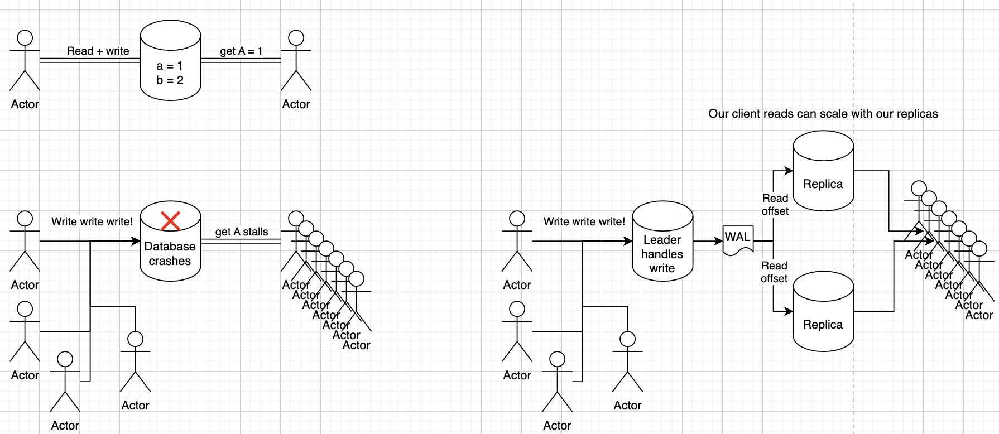
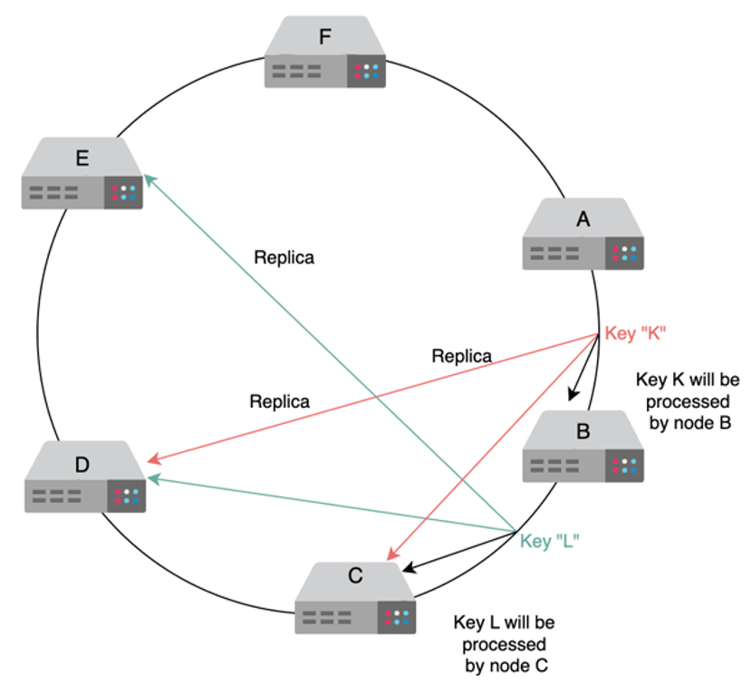
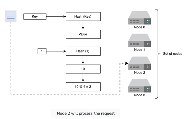
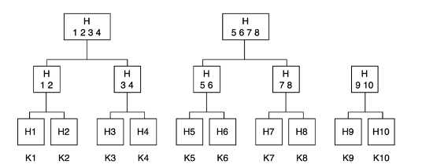
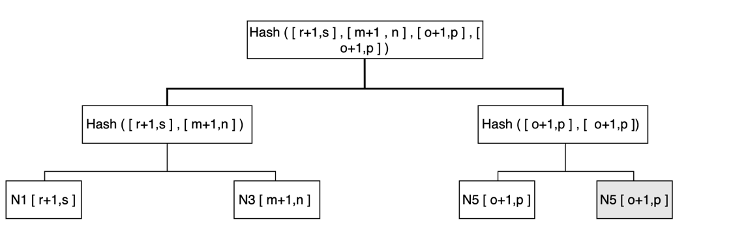
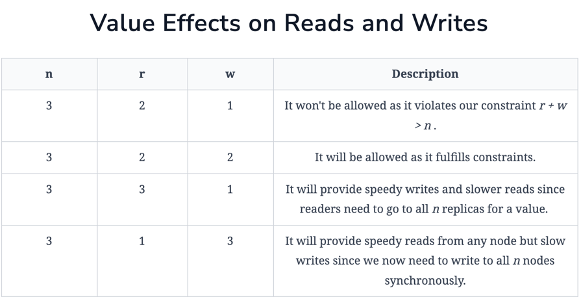

# Table of Contents
- [Key Value Store](#key-value-store)
- [High Level Implementation](#high-level-implementation)
- [Isolation Levels](#isolation-levels)
- [How Things Got Here](#how-things-got-here)
- [Where Things Are](#where-things-are)
  - [Scaling](#scaling)
  - [Durability](#durability)
  - [Sharding](#sharding)
  - [Replication](#replication)
    - [Replication and Isolation Levels](#replication-and-isolation-levels)
- [Peer To Peer With Sharding](#peer-to-peer-with-sharding)
  - [Sync vs Async](#sync-vs-async)
- [System Design](#system-design)
  - [Functional Requirements](#functional-requirements)
  - [Non-Functional Requirements](#non-functional-requirements)
  - [Service Design](#service-design)
    - [Scaling](#scaling-1)
    - [Replication](#replication-1)
- [Does It Meet Requirements?](#does-it-meet-requirements)
  - [Combatting Temporary Failures](#combatting-temporary-failures)
  - [Combatting Permanent Failures](#combatting-permanent-failures)
  - [Quorum Example](#quorum-example)

# Key Value Store
Basically an API over a hash map

There are some other things we can do in terms of indexing, sharding, consistency, and replication that causes differences between different systems

## High Level Implementation
In this scenario we chose to create a distributed, sharded KV store with node ranges based on consistent hashing, and replication done via RAFT
- Each "node" in the system is actually a RAFT cluster with one leader and multiple replicas
- The nodes are considered fault tolerant, replicated, and consistent
- The cluster itself can autoscale by placing new nodes in the ring and shuffling to split, or by deleting nodes and shuffling to merge

Code for this is easiest to just view my crappy [RAFT Repo](https://github.com/lsprangers/raft-course/blob/main/README.md) instead of me trying to recreate it heres

## Isolation Levels
Before going into other areas, the [isolation levels](ISOLATION_LEVELS.md) and read/write levels will come back continually throughout the discussion, especially for distributed systems

We know there is always an [Availability and Consistency Tradeoff](../README.md#availability-consistency-during-network-partition) for Partitioned scalable systems, and Databases are one key area where it continually comes up. If I write a value somewhere, how do I ensure other groups reading that value see the same value...

We've already gone through [Isolation Levels](ISOLATION_LEVELS.md) extensively

## How things got here
Old days:
- Single instance of DB can handle traffic
- Backups for durability
- Single other database for fault tolerance
- Clients interact with same physical data in database...life is easy!

Data grew:
- Especially for social networks
- To increase read throughput they copied data



## Where things are
Most database clusters today are actually clusters of clusters!

Sharding our database into multiple nodes, where each node handles a shard, allows us to split up our data so that it's not sitting on one single machine

Replication of those nodes helps us to scale reads on those nodes, and also to provide fault tolerance


### Scaling
If our database grows too large and is crashing we have 2 options - Horizontal or Vertical Scaling

Vertical scaling equates to "make the compute larger" which reaches limitations very quickly, but for some teams and products this is completely fine and then we can ignore all of the issues that come up with distributed systems!

Horizontal scaling is usually the route taken where we take our database and split it up into subsets

## Durability
Most of the time Durability is covered by [Tree Structures on Disk](./TREE_STRUCTURES_ON_DISK.md) so that we can still retrieve our data in $O(log n)$ from disk. This helps with durability and allowing us to put more of the overall KV Store onto a single node versus scaling out and trying to fit everything into RAM


### Sharding
[Sharding](./SHARDING.md#sharding), which is covered in a sub-document with routing, is useful when we want to have different nodes accept reads and writes for different subsets of our database, and sometimes it's required when our data can't sit on a single machine

```
fake table
----------
1 a b c
2 d e f
3 g h i
```
Sharding can be done horizontally or vertically as well
    - Horizontal sharding is when we split up by rows, so maybe we have `1 a b c` in one node, and `2 d e f` in another
    - Vertical sharding is when we split things up by columns so maybe `a d g` is on one node, and `c f i` in another

### Replication
For each node in a shard (or the single node in a non-sharded database) we can use [Replication](REPLICATION.md) to solve 2 major problems - Fault Tolerance and Scaling 

Fault tolerance is solved by replicating the data onto other nodes, so if the main leader fails then the replica can take over

Scaling can be solved by using those replicas to serve reads

#### Replication and Isolation Levels
Replication is tied heavily into [Isolation Levels](ISOLATION_LEVELS.md) because the way these nodes are able to serve data depends on that isolation level

The below [Replication](REPLICATION.md) implementations are all covered in the supporting document
- Consensus
    - Leader vs Leaderless
- Quourum
- WAL
- Snapshot 

## Peer To Peer With Sharding
- Peer-to-peer approach is the approved method in text, which seems to be some form of quorum with replication of data on other nodes as well
    - Nodes are assigned keys based on the partition in the ring, and then there’s a replication factor n that describes how many other physically separate nodes to replicate data on 
        - We can replicate data on next 3 physically different nodes on the ring, so that if our node fails the next nodes already have the data and don’t need to shuffle
    - Data replication for high durability and availability
    - Sync vs Async
        - Sync means slower writes but higher durability
        - Async means immediate response but lower consistency and possible data loss if node goes down before replicating
        - We can have each one of the partitions have a leader, and multiple replica followers (or some other strategy), where these get updated by the leader and then can become leader if it’s downed
- Basically, we need to decide on a plan based on the requirements of the service, if it’s a high velocity write with high consistency and “always write” needs, then quorum may be the best service
- If it’s low velocity writes, high throughput of reads, and lower consistency then we can do single leader + primary secondary + followers



# System Design
- It is a Distributed Hash Table
    - Values can be BLOB’s, images, server names, or anything
    - Keys are generated by a hash function for some identifier to lookup later

## Functional Requirements
- Functional requirements
    - Interfaces
        - Typical interfaces such as get and put
    - Configurable 
        - Trading off consistency with availability
        - Can require a certain number of follower databases to acknowledge a write
    - Hardware heterogeneity 
        - Each node in cluster can be different without requiring the same setup
        - Mostly means peer-to-peer design

## Non Functional Requirements
- Non-functional requirements
    - Scalable
    - Fault tolerant

## Service Design

### Scaling
- We can use partitioning based on hash of initial key
    - ***WRONG*** - would lead to entire data shuffles across data partitions, and heavy downtime, during autoscaling events (up or down)
- Can use circular partitioning (i.e. modulo based) to ensure equal distribution among nodes
    - ***WRONG*** - We can see, that if we added a new server 5, then all of the modulo calculations would get screwed up and we’d have to shuffle data around
    - 
- We’ll have to use something like pre-defined partitions or ranges, and rebalance somehow
    - This is a functional requirement that we must be able to scale, so we cannot use pre-defined partition sizes
    - If there is a more consistent data model where we know the data will have some sort of setup, we can pre-define the partitions, but otherwise we can do circular routing and re-size the partitions
    - If this is true we’ll need some service in front to send the read and write requests to a specific node based on the key and each nodes partition
- Circular Hashing is our best bet here 
    - This will allow our service to be scalable
    - We cannot use modulo based hashing, because there would be an entire shuffle for all data, and ultimately it’s never really a good idea to do this unless you’re sure of uniform load, and very infrequent scaling
    - We can use circular hashing which allows minimal shuffle of data between new nodes, and allows us to infinitely scale our nodes and ring sizes

### Replication
- All depends on read/write throughput and consistency
- *Single leader + multiple followers* - ***WRONG*** - if we have tame velocity for reading and writing
    - Leader takes all writes, and sends data out to replicas
    - Primary is single point of failure
        - *We cannot always write here,* ***we can always read***
    - Writing out changes to multiple followers can become a bottleneck for each write
    - More consistent, but lower write and read velocity, and leader becomes bottleneck
- *Single leader + primary secondary + multiple followers* - ***WRONG*** - means leader can handle all of the writes and send to single primary secondary
    – Same points as above, single point of failure and can always read but not always write
    - This means some of our replicas may take a bit longer to get the data since it takes more hops
    - Less consistent, but higher read and write velocity
- *Multiple leader + followers*
    - This means multiple nodes can handle writes, but then we need to figure out the plan for conflicting writes
    - Much higher throughput on writes, but less consistent and prone to conflicts
- ***P2P + Quorum***
    - All nodes can handle writes and gossip protocol to each other
    - We set $w + r \gt n$ so that we ensure our reads are consistent
    - Can always write, more consistent, may take longer to get a read back
    - Peer-to-peer approach is the approved method in text, which seems to be some form of quorum with replication of data on other nodes as well
        - Nodes are assigned keys based on the partition in the ring, and then there’s a replication factor n that describes how many other physically separate nodes to replicate data on 
        - We can replicate data on next 3 physically different nodes on the ring, so that if our node fails the next nodes already have the data and don’t need to shuffle
    - Data replication for high durability and availability

#### Sync vs Async
- Sync vs Async
    - Sync means slower writes but higher durability
    - Async means immediate response but lower consistency and possible data loss if node goes down before replicating
    - 
- We can have each one of the partitions have a leader, and multiple replica followers (or some other strategy), where these get updated by the leader and then can become leader if it’s downed
    - Basically, we need to decide on a plan based on the requirements of the service, if it’s a high velocity write with high consistency and “always write” needs, then quorum may be the best service
    - If it’s low velocity writes, high throughput of reads, and lower consistency then we can do single leader + primary secondary + followers

## Does It Meet Requirements?
- Scalable
    - Partitioned data will allow us to scale 
- Fault tolerant
    - Replication will allow us to be fault tolerant

### Combatting temporary failures
- If we have a quorum based approach, and one of the nodes is temporarily down, we can use hinted handoffs and sloppy quorum to combat this
- During a distributed transaction if one of the nodes is temporarily down, we cannot use it in the quorum vote and the availability of the service degrades
    - Sloppy quorum allows us to keep a preference list for all nodes so that the first n healthy nodes from the list can handle operations, and if one node is down we can continue down the list
    - If a node is down that is supposed to handle a request, and coordinator passed quorum vote back somewhere else, then once that initial node is back the receiving node will send that information back, this is a hinted handoff
### Combatting permanent failures
- We need to speed up detection of these inconsistencies
- Merkle Tree’s are a data structure to help us
    - The values of individual keys are hashed and used as the leaves of the tree
    - Each parent is a hash of it’s children
    - They allow us to verify different Merkle Tree Branches to check for inconsistencies, without sending all of the data across the network
    - 
- Each node keeps a Merkle Tree for the range of keys that it hosts on all of it’s virtual nodes
- This allows the nodes to determine if the keys in a given range are correct, since the root of the Merkle tree corresponding to the common key ranges can be exchanged between nodes
- If they’re the same, no reason for us to check anything else
    - If they’re different, start traversing
        - 
        - 
    - So now, if a new node is added behind Node A, and it must receive it’s data, then it can copy it over, compute the Merkle tree, and then compare and acknowledge
    - Due to CAP theorem we must choose, and we choose high availability, this comes from always write requirement, and so even if network between nodes fails we still allow writes
- How can we ensure eventual consistency then?
- $w + r \gt n$ along with versioning
- Versioning allows conflict resolution even during network partitions 
    - Use write timestamps to figure out which one was written last, or maybe a more important writer vs another
- We can force our put API requests to also require some sort of metadata context, and then our get requests also either use or return this data for consumer to reuse if multiple rows returned
### Quorum Example
- Example below for Quorum Read and Writes
    - N = 3
    - A, B, C, D, and E servers placed clockwise in our ring
    - If A handles a write request, it’s also replicated to B and C since they are next physical nodes in ring
    - Consider r & w
        - R is the minimum number of nodes for a successful read operation
        - W is the minimum number of nodes for a successful write operation
            - Then if r = 2, it means our system reads from 2 nodes when we have data stored in 3 nodes
        - We must pick r and w so that at least one node is common between them
        - This ensures if there’s inconsistent data, that we will catch it
        - That’s why r + w > n
        - If n = 3, and w = 2, then the first 2 nodes can be written to synchronously to make this request successful, and the third one, due to n, can be written to async
        - Latency of get operation is due to slowest of the r nodes
        - Latency of write operation is due to slowest of w nodes
    - 