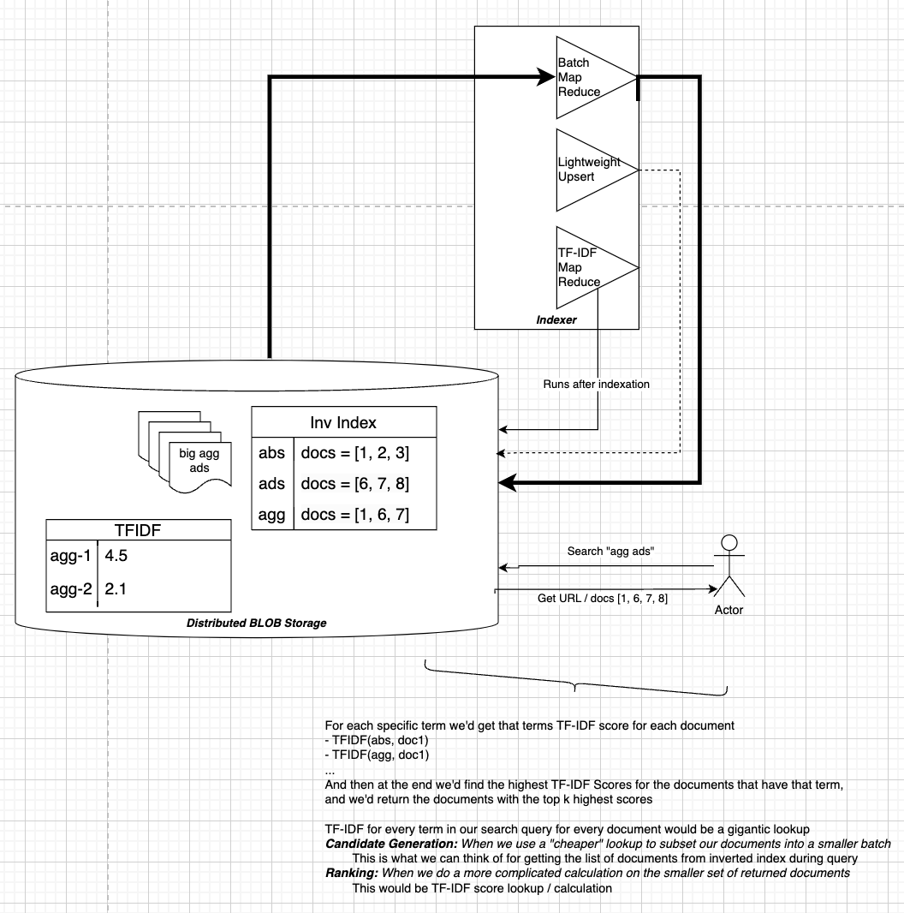

# Table of Contents
- [Ranking](#ranking)
    - [Count Based Heuristics](#count-based-heuristics)
        - [TDIDF / BM25](#tf-idf--bm25)
    - [Probabilistic Models](#probabilistic-models)
        - [Bayesian Proba](#bayesian-proba)
        - [Learn To Rank](#learn-to-rank)
    - [Graph](#graph)
        - [Page Rank](#page-rank)
    - [Embeddings](#embeddings)

TODO: A lot of these are offline, and some are online, and the Ranking section should actually discuss Ranking + Scoring

# Ranking
Ranking queries to items is a fairly large part of a search system, otherwise you're just returning a big list of documents when some might be much more relevant to user

Ranking is typically the second stage of a recommender system, and sometimes it's ***online*** meaning a new ranking calculations per query, ***offline*** where we can calculate results and look them up per query, or somewhere inbetween 

Ranking is typically used for experiments, explainable results, or something different that we want to calculate specifically on each Item that might be more resource intensive than Candidate Generation methods, and other systems will combine everything into one single API call and bypass the different layers

- Ranking methods can take features of queries, documents, and their interactions as input to predict a relevance score for each document
  - Features might include:
    - Query-Document similarity (e.g., cosine similarity, TF-IDF, BM25)
    - Document-specific features (e.g., PageRank, click-through rate)
    - Query-specific features (e.g., query length, query type)
    - Contextual features (e.g., user location, device type)

- Example:
  - Query: "Best laptops under $1000"
  - Document Features:
    - Price: $900
    - Brand popularity: High
    - User reviews: 4.5/5
  - Query-Document Features:
    - BM25 score: 1.2
    - Query terms in title: 2/3

----

## Count Based Heuristics
One of the most common ranking / scoring methodologies is using the uniqueness of a word based on specific counts (heuristics) - the word "and" is not very unique, and if it shows up in a document we won't really care. Another word like "aardvark" is fairly unique and not used that often, so it would be more unique

### TF-IDF
TF-IDF means Term Frequency Inverse Document Frequency, and it's a fairly simple scoring mechanism for computing the uniqueness of a Term (word) across Documents. Most of the calculations are done offline, and for a query we use our lookup table to find Documents.

- **TF (Term Frequency)**: The count of a term in a specific document.
- **IDF (Inverse Document Frequency)**: The logarithm of the total number of documents divided by the number of documents that contain the term.

The TF-IDF score is calculated as:
\[ \text{TF-IDF} = \text{TF} \times \text{IDF} \]
\[ \text{TF-IDF}(\text{Term}, \text{Doc}) = \text{count}(\text{term in Doc}) \times \log\left(\frac{\text{count}(\text{docs})}{\text{count}(\text{docs containing term})}\right) \]

| TF         | IDF            | Meaning        | TFIDF
|------------|----------------|----------------|----------------|
| High       | High           | This word is common among all documents, and this document, so it's just a generally common word | Fairly normal score - around mean value | 
High       | Low           | This word is rare throughout the other documents, but comes up a lot in this document, so it must be reasonably relevant for this document| High score |
| Low  | High | This word is a common word, and it's not even showing up much in this document | Low Score |
| Low | Low | This word isn't very common, but it's also not apart of this document, so it's not very relevant | Low but closer to mean | 

### BM25
- ***Description***: An extension of TF-IDF that considers term frequency saturation and document length normalization.
- ***Formula***: 
$text{BM25}(D, Q) = \sum_{i=1}^{n} IDF(q_i) \cdot \frac{f(q_i, D) \cdot (k_1 + 1)}{f(q_i, D) + k_1 \cdot (1 - b + b \cdot \frac{|D|}{\text{avgdl}})}$ 
  - $ f(q_i, D) $ is the term frequency of $( q_i )$ in document $( D )$
  - $ |D| $ is the length of the document
  - $ \text{avgdl} $ is the average document length
  - $ k_1 $ and $ b $ are parameters

-----

## Probabilistic Models
- Probabilistic Models estimate the likelihood of a query given a document! $P(Query | Document)$ 
  - The document with the highest probability is considered the most relevant.

### Bayesian Proba
- A Bayesian Approach in Statistics is a way of using Bayes' Theorem to iteratively update the probability of a hypothesis as more evidence becomes available. 
  - This is in constrast to Frequentist Statistics which doesn't incorporate prior beliefs or evidence into the analysis. 
  - Likelihood in Bayesian Stastics is $P(Evidence | Hypothesis)$ meaning what's the chance we saw this new evidence based on what we believe?
  - Posterior Probability is $P(Hypothesis | Evidence)$
  - Using these two formulas, we update our Prior Probability, i.e. initial Probability $P(Hypothesis)$ with the Likelihood we saw our Posterior, i.e. new evidence, Probability
    - $ P(H|E) = \frac{P(E|H) \cdot P(H)}{P(E)}$ where $P(E)$ is the total probability of seeing our new Evidence
- A Bayesian Approach to this would be instead of finding the most relevant Document per Query, we flip it around and try to estimate the likelihood of the Query for every Document
- How is this used in the world?
  - Most of the Documents will get some sort of score per Term, typically using TF-IDF or BM25.
    - At this point, we have scores across `(Term, Document)` pairs, and this can be thought of as the Likelihood of a Term given a Document.
    - For a specific Term, the Marginal Likelihood is:
      \[
      P(Term) = \sum_{\text{docs}} P(Term|Document) \cdot P(Document)
      \]
    - Posterior Probability is:
      \[
      P(\text{Document} | \text{Term}) = \frac{P(\text{Term} | \text{Document}) \cdot P(\text{Document})}{P(\text{Term})}
      \]
  - And then you get the Probability of a Document for each Term, and when your Query comes in it's simply a bunch of terms strung together so you'd find the top Documents for each Term in the Query and Rank the result set

### Decision Trees
We cover [Decision Trees](../../other_concepts/DECISION_TREES.md) in depth elsewhere, but they are useful for taking many of our Document, Query-Document, and User features into consideration when we want to predict some general category, but they can't really be used on predicting specific videos

Decision Tree's roles are typically to predict relevance scores (pointwise) or to optimize ranking orders based on features (listwise). We can incorporate them in [Learning To Rank](#learn-to-rank) to optimize ranking orders
- Pointwise:
  - Treats ranking as a regression or classification problem.
  - Each document is scored independently, and the scores are used to rank the documents.
  - Example: Predicting a relevance score for each video in a search result.
- Pairwise:
  - Optimizes the relative ordering of document pairs.
  - The model learns to predict which document in a pair is more relevant.
  - Example: Comparing two videos and predicting which one should rank higher.
- Listwise:
  - Directly optimizes the ranking of a list of documents.
  - The model learns to minimize a loss function that quantifies the quality of the entire ranking.
- Example: Optimizing the ranking of a list of videos for a query.
- Offline Training:
  - Decision trees are typically trained offline using labeled data, where each query-document pair has a relevance label (e.g., 1 for relevant, 0 for irrelevant)
  - Once trained, the model can be used online to rank documents for new queries

### Logistic Regression
TODO: Logistic regression 

### Learn To Rank
- A machine learning ***task*** that seeks to train models that rank documents based on features extracted from the documents and queries. Each new query results in a forward pass / inference call, so this would be an online model
  - A classification task is a model whose task is to classify inputs into certain classification buckets, so a Learn To Rank Task is a model whose task is to rank documents based on features extracted from documents
- A Learning to Rank task is when your input is a set of samples, all with their given features, but the aim is to build a model that outputs a ranking in terms of their relevancy
  - Therefore *the output is a ranking of input samples*
- Learning To Rank Training Samples:
  `[Query ID, Sample ID, [Features of that sample], Relevancy (Target)]`
- (Google) LTR task that tries to rank pages from a Query
  - ***Query ID***: If we scrape the web with 100 web calls, this is 1-100
  - ***Sample ID***: The ID of the object, so this would actually just be the URL
  - ***Features***: Any sort of metadata features, binary features, etc... about the example
    - Number of Query Terms in the Page
    - Total number of "good" links inside the page
    - TF-IDF of Query Terms to Page Terms (Document)
    - Bayesian Probability $P(Query | Page)$
    - etc...
  - ***Relevance ID***: A ranking 1 (Least Relevant) to 4 (Most Relevant)
- (Amazon) LTR task that tries to rank "Also Buy Items" (Item2) after someone puts another item (Item1) in their cart
  - ***Query ID***: Item1
  - ***Sample ID***: The ID of the object, Item2
  - ***Features***: Any sort of metadata features, binary features, etc... about the Item2
    - Collaborative filtered similar users who purchased this item
    - Item2 embedding similarity to Item1
    - 1 or 0: In same product family
    - 1 or 0: Bought in last 3 weeks
    - etc...
  - ***Relevance ID***: A ranking 1 (Least Relevant) to 4 (Most Relevant)
- Features related to the Query are known as ***Context Features***

- LTR Types
  - **Pointwise**: Treats ranking as a regression or classification problem.
    - Directly predict the ranking of inputs (4,3,2,1)
  - **Pairwise**: Optimizes the ordering of document pairs.
    - Takes two samples, A and B, and runs them through the model - if A has higher relevance but it ranked B higher it will result in a larger loss
    - Doesn't quantify the extent of the incorrect rankings
  - **Listwise**: Directly optimizes the ranking of a list of documents.
    - Listwise takes Pairwise a step further and directly quantifies the extent of the incorrect rankings, and then updates the weights accordingly via specified loss

---

## Graph
I can really only think of PageRank off the top of my head, and in PageRank the Features are taken from a graph linkage structure, but it doesn't need to be ran on a graph engine. Most of the time we calculate PageRank scores offline, and then for a specific query we use PageRank as a feature along with other ranking mechanisms. 

Page Rank simply helps us calculate "page importance", but we still need to compare a query to web page terms and themes by doing lookups based on [Document and Query Embedding Similarity](../../nn_and_llm/EMBEDDINGS.md#embeddings)

### Page Rank
An algorithm used by Google Search to rank web pages. It measures the importance of a page based on the number and quality of links to it. PageRank can be used anywhere, not just in Ranking, but makes sense to put it here

It outputs a probability distribution used to represent the likelihood that a person will arrive at any particular page through clicking on random links, similar to probability distribution of the "Wikipedia game" where to try to get to Page B from Page A by visiting referenced links starting at A

PageRank can be solved using iterations and traversing web links using the ***power iteration method***, but it can also be solved analytically if we had an adjacency matrix of all links between pages $M$, where $M[i][j]$ represents the link from page $j$ to page $i$

- **Analytical Formula**:
  - The PageRank vector $PR$ satisfies the equation: $PR = d \cdot M \cdot PR + (1 - d) \cdot v$ where:
    - $d$ is the damping factor (typically ( 0.85 )).
    - $v$ is a personalization vector (often uniform, representing equal probability of jumping to any page).
    - Rearranging: $PR = (I - d \cdot M)^{-1} \cdot (1 - d) \cdot v$
    - Here, $I$ is the identity matrix, and $(I - d \cdot M)^{-1}$ is the inverse of $I - d \cdot M$.
  - This provides an exact solution for PageRank, but computing the inverse of a matrix is computationally expensive for large graphs, making this approach impractical for real-world web-scale graphs.
- **Iterative Formula**:
  - Start with an initial $PR[n]$ vector of size $N$ initialized uniformly $PR[0] = \frac{1}{N}$
  - At each step $k$ calculate the $PR$ vector $ PR[k+1] = d \cdot M \cdot PR[k] + (1 - d) \cdot v $
  - Repeat this until the difference between successive iterations is below a small enough threshold, $\epsilon$, in total so $| PR[k+1] - PR[k] | < \epsilon$
  - Another way to calculate $PR[A]$ without matrix inversion would be to traverse in-nodes
    - $PR(A) = (1 - d) + d \left( \frac{PR(T_1)}{C(T_1)} + \frac{PR(T_2)}{C(T_2)} + \ldots + \frac{PR(T_n)}{C(T_n)} \right)$ 
      - $d$ is the damping factor, 
      - $PR(T_i)$ is the PageRank of page $T_i$ and 
      - $C(T_i)$ is the number of outbound links on page $T_i$

The iterative approach using sum over in-nodes is typically preferred for large graphs because it avoids the computational cost of matrix inversion, and reduces amount that needs to be stored

## DNN For Ranking
TODO: Most use cases today use DNN or GBDT for Ranking