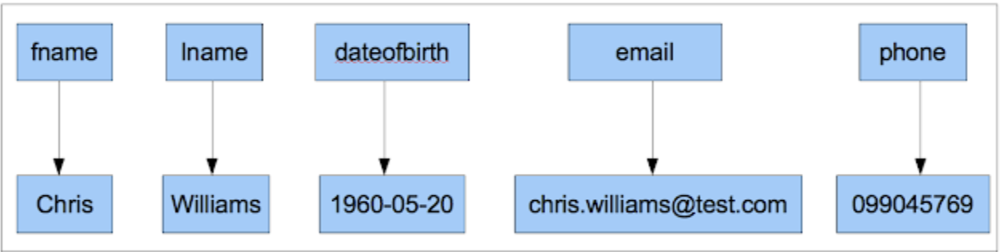
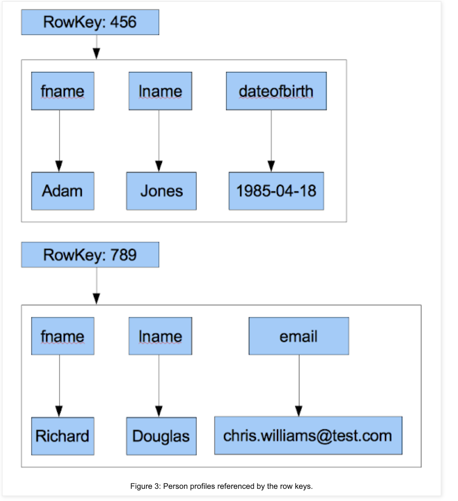
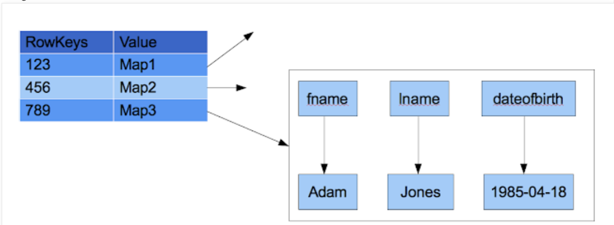
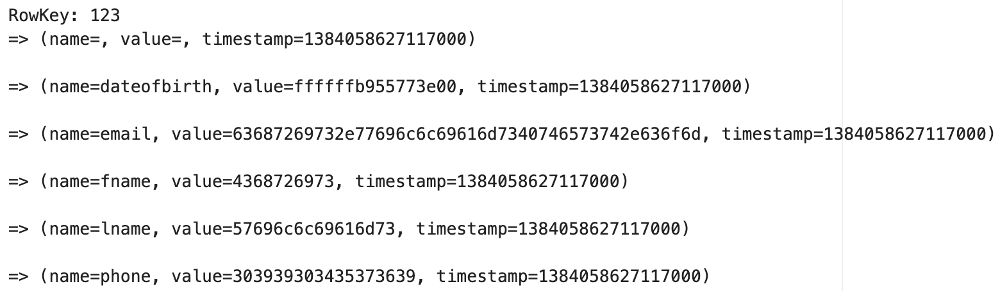
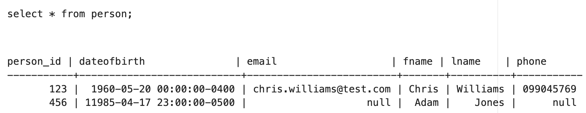
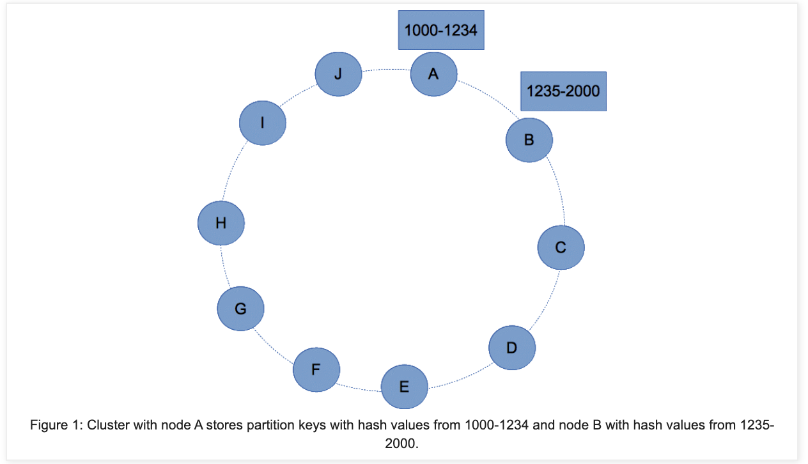
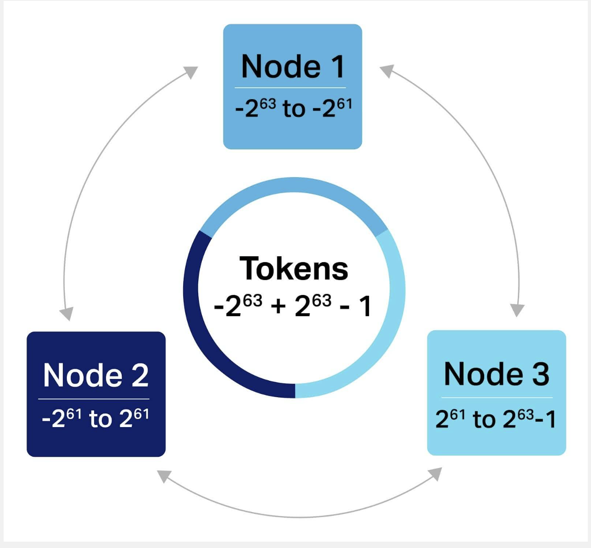
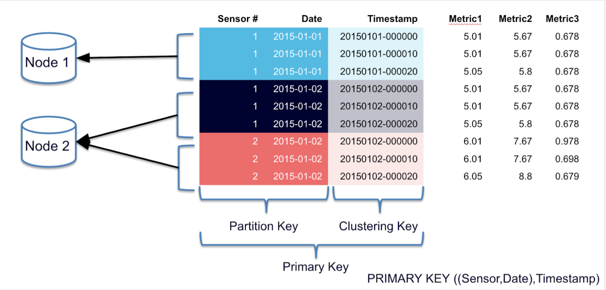
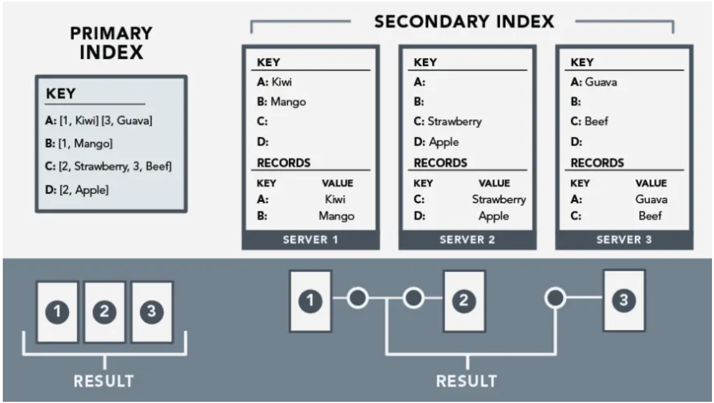
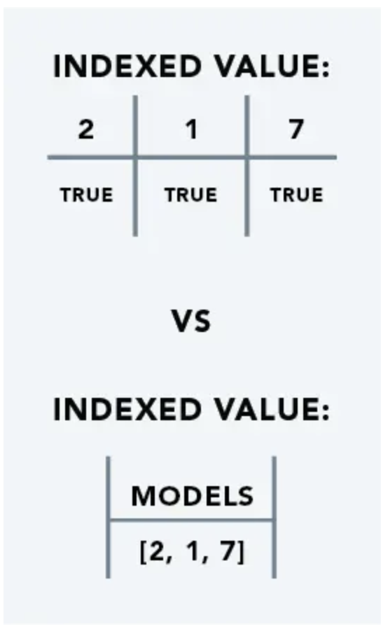

# Table of Contents
TODO

# Cassandra
Cassandra is an Open Source, Apache Licensed, Distributed, NoSQL, "KV" Database 

To be fair, it can be used and abused in many ways, but at the end of the day we're partitioning data across nodes via a `partitionKey`, and accessing our data via that `partitionKey`, so it can be equated to KV, but we could also get multiple keys and some people abuse this in weird ways

## Concepts

Below is a short walkthrough that will help with some downstream design decisions

- ***Maps***: A [Map / Hash Table](../../../dsa/2.%20hashing/README.md)... `key -> value` is a very useful tool, and one people frequently use in development
    - 
- ***RowKey***: Given this "set" (Row) of Attributes that we've stored in this "Map", we'd most likely want to access this entire Row in one go
    - AKA Primary Key
    - We could make a Map of Maps
        - In practice, we mostly store a Map of K:V objects, or a Map pointing to a List
    - This is known as a `Row Key`
    - This allows us to access a Row of Attributes using a single Key
    - 
- Not all Rows have the same Attributes
    - We might have more information for John Smith than we do Jane Doe
    - Because of this, for the actual underlying storage mechanisms we may need to decouple our Rows and not have such rigid schemas
    - We'll need to use a Map of Maps
        - Index of Indexes, where the lowest tier Index / Pointer points to the Row
        - 

- ***KeySpaces***:
    - Conceptually similar to a Database in a Relational Database
    - KeySpaces are namespaces that define how data is replicated around Nodes
    - KeySpaces contain several Tables
        - `1 KS : M Table`
- ***Tables***:
    - Tables have multiple Rows, and are similar to Tables in a Relational Database
    - Each Row is referenced by a ***Primary Key***
    - The number of Columns can vary across each Row
    - Column names and values are of type Binary
        - Therefore names and values can be text, integer, date, etc... not just strictly text like Relational Database
    - A dummy example would be: `create table person ( person_id int primary key, fname text, lname text, dateofbirth timestamp, email text, phone text );`
        - We use `person_id` as the Primary Key or Row Key
        - `insert into person (person_id,fname, lname, dateofbirth, email, phone) values ( 123, 'Chris', 'Williams', '1960-05-20', 'chris.williams@test.com', '099045769');`
            - We insert a Row for `Chris Williams` with `person_id = 123`
    - On inserting a Row, we'd get something similar to
        - Also notice below that `person_id` is not a column specifically, it's just the `RowKey`
        - 
    - We could then insert new Rows with different information / Columns
        - `insert into person ( person_id, fname, lname,dateofbirth) values ( 456, 'Adam', 'Jones', '11985-04-18');`
        - 
- ***Primary Key***: 
    - AKA Row Key
    - Identifies and represents a unique Row 
- ***Compound Primary Key***:
    - Allows us to identify a Row based on the concatenation of multiple Columns
- ***Clustering Key***: 
    - Helps us to order and sort the Rows of our data within a Partition
    - Can be used to create Secondary Indexes
- Primary and Cluster Key Declaration:
    - `K1`: primary key has only one partition key and no cluster key.
    - `(K1, K2)`: column K1 is a partition key and column K2 is a cluster key.
    - `(K1,K2,K3,...)`: column K1 is a partition key and columns K2, K3 and so on make cluster key.
    - `(K1, (K2, K3,...))`: It is same as 3 i.e column K1 is a partition key and columns K2,K3,... make cluster key.
    - `((K1, K2,...), (K3,K4,...))`: columns K1, K2 make partition key and columns K3,K4,... make cluster key. 
- ***Partition Key***: 
    - Decides which Partition / Node the Row is going to be hosted on
    - Can use one or many Attributes as a Partition Key
    - If there are multiple columns in a Partition Key, we need to include those in every query
        - `PRIMARY_KEY((name, email), birthdate)` would route data to Partitions based on `(name, email)` so we would need to include those 2 pieces of information everytime we want to lookup the data
- ***Partitioner***
    - The Partitioner is a program / function that will take the ***Partition Key*** and figure out which Node the Row is assigned to
    - Allows us to PUT the Row to the right Node, and to figure out which Node we need to GET from
        - 
    - We discussed this part in depth in [Partitioning Document of our Distributed KV Store Implementation](../../../design_systems/_typical_reusable_resources/_typical_distributed_kv_store/PARTITION.md)

- ***Node***: 
    - Each Node in Cassandra owns a set of Tokens, and each of these Tokens describes a Partition
    - Basically, each Node owns a set of Partitions
    - 
- 

## Indexes

### Primary Indexes
Primary indexes are built off of Primary Key's, and should be almost instantaneous access (think of $O(1)$ lookup on Hash Table)

If you have a User Table with `user_id, user_email, <other_attributes>`, your Primary Key is going to be `user_id` and should give you almost instantaneous access to email and other attributes

What if you need to find a `user_id` given a `user_email`? Basically the inverse of this query?

This is typically where Secondary Indexes come in, but they have some major pitfalls to be taken into account

Because of this setup we can say that ***Primary Indexes are Global*** - i.e. the Index itself is spread across multiple Nodes, and realistically it happens because of the *Partitioner* routing PUT and GET to the right Nodes and then using the Hash Table lookup to find the right `PrimaryKey -> Row` to update

## Secondary Index
Building a Secondary Index over `user_email` would allow us to complete that inverse query, but it would basically mean we need to store every single `user_email -> [user_id]` mapping...we see how this could go poorly

User emails most likely will be 1:1 distinct with `user_id`, and so if we have 1Million rows, our Secondary Index would also be another 1Million rows

### Storage Structure of Secondary Index
- In the above section on [Primary Indexes](#primary-indexes) we mentioned that *Primary Indexes were Global*, and the counter to that is that *Secondary Indexes are Local*
    - This means that all Secondary Indexes are made up of basically a big Union over all Partitions / Nodes
    - ]
- If we have a bunch of `user_id, user_email, state` Columnn, and let's say 1Million rows:
    - Creating a Secondary Index off of `user_email` basically means we replicate a `user_email -> user_id` mapping for every row on every Partition
    - Creating a Secondary Index off of `state` would mean we replicate a `state -> [user_id]` mapping for every row on every Partition, but it would be a lot "cheaper" since we'd only be storing a few `user_id`'s for each state
        - Granted, in both setups, we still do need to store 1Million `user_id` in each Secondary Index
- Query Profile:
    - Querying based on `user_id` primary index means 1 machine has to do a Disk Seek to 1 offset location to find the actual data
    - Querying based on `user_email` secondary index means ***every*** machine has to do a ***full*** Disk Seek to find the actual data
        - There might be some optimizations on ordering `user_email` and getting a Binary Search done, but if it's unordered then finding any random `user_email` would require a full seek over the entire index
- The ***Pitfall*** here, is that high cardinality data shouldn't be used in Secondary Indexes

### Solutions
- Denormalizing data and creating Primary Indexes off of that data can ensure your data is accessible in an efficient manner
    - In this way we would:
        - Create a new table with the `user_email` as the Primary Key
        - Insert the `user_id` and other attributes into this new table
        - This would allow us to do a quick lookup on `user_email` and get the `user_id`
        - This is a tradeoff between storage and speed, but in the end it allows us to do a quick lookup
- ***Integrity***:
    - In the above solution we now have 2 different areas we would need to update any attribute like `user_city`
        - If the update on `user_id` succeeds, and the update on `user_email` fails, we now have inconsistent data
        - 
    - In doing the Per Reference portion, we essentially add in a new Row to another table with False set for each of `user_id` and `user_email`
        - Each of the transactions that would update those 2 Rows with the new `user_city` attribute would also need to update the Reference Row with `True` after it's completed
        - Therefore, for each denormalized table, on an attribute update, we must include the Reference creation, and update, in each transaction for an Attribute
    - The Pantheon Reference Website mentions to create and destroy this reference
        - "If an update fails midflight, the data must not be lost. This can be achieved by designing for the Cassandra norm, of favoring false positives—that is, a reference is created before the object is created, and a reference is removed after the model has been destroyed."

# Query Abilities

## Point Queries

### Primary Index

### Non-Primary Index (Filtering)

## Range Queries

## Materialized View

# Storage

## MemTable

## SSTable

## Compaction