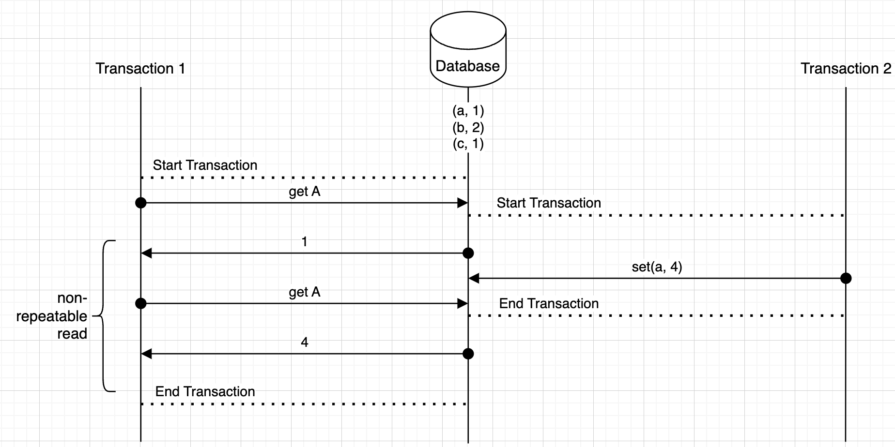
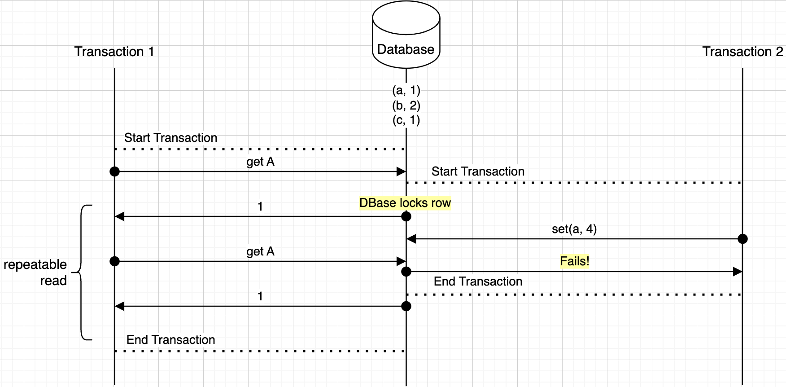

# Isolation Levels
This document describes everything around transactions, isolation levels, and how data is updated across multiple readers and writers 

## Vocabulary
- *Transaction*: In a database clients updating / writing data typically do so in transactions, and they can start and commit transactions. If something happens in the meantime before committing the transaction, it's rolled back
    - *Committed*: That a tranasction has finished and the writes has called for it to be formally applied to the database 
- *Quorum*: When there are multiple nodes in a database, quorum means a majority of them agree on a value
- *Phantom Read*: A transaction reads a set of rows that satisfy a condition, and another transaction inserts / deletes some of the rows satisfying that condition, then if the initial transaction re-reads those rows it see's the new "phantom" updates
    - Basically just means concurrent write affects a read
    - Is typically around ***a set of rows***
- *Non-Repeatable Read*: Occurs when a transaction A reads a single row, and another transaction B modifies / deletes that row, then the first transaction A when re-reading the data sees new updates
- *Dirty Read*: Simply allows reads on data in flight of transactions or uncommitted data

### Phantom Versus Non-Repeatable
So for the Repeatable Read Isolation Level identifed below, how can it enforce repeatable reads (on a row), but fail to stop phantom reads (on sets of rows)?

Non-Repeatble reads can be avoided by once reading a row just locking it so that transactions can't update it until that transaction is completed (it specifies it's reads are done)

This can be solved by locking the single rows!

Phantom reads can still occur because the set of rows in a query can't all be locked, since this would require a full scan of the database for all of these filters!

***Key difference is in single versus multiple rows and locks***

### Isolation Level Spectrum
There's a spectrum below, from strictest to least strict, in performant availability (fast response) vs consistency (write and updates are shown in reads):
- **Linearizable** means the transactions that occur appear ***linear***, meaning sequential, meaning things acts like the "old days". But this means we need consensus and consistency, maybe using something like [RAFT](https://github.com/lsprangers/raft-course/blob/main/README.md) which slows things down (less availability) but guarantees consistency
    - *Causal Consistency* is around consensus and consistency where the nodes affected by writes will see all nodes that need to see them (typically happens with quorum based systems)
- **Serializable** is in the same vein as linearizable, where the transactions on a database appear to occur as sequential updates. Allows for execution to happen concurrently, but the outcome appears to be sequential. ***However, it does not guarantee the order of the transactions***
    - *Snapshot Isolation* is a form/implementation of serializability, and updates things serially on snapshots of data. It allows for more concurrency but also leads to some weird anomalies
- **Repeatable Read** shows that transactions can read the same data multiple times and get the same result of data, but phantom reads may still occur
- **Read Committed** revolves around transactions and all reads are on transactions that have been committed, but there are things like non-repeatable and phantom reads that still occur
    - If a tranasction commits itself during a longer lived read transaction, it will be a non-repeatable read
- **Read Uncommitted** lets transactions read uncommitted data, allowing dirty reads.

### Summary of Isolation Levels
- **Read Uncommitted**: Allows dirty reads.
- **Read Committed**: Prevents dirty reads.
- **Repeatable Read**: Prevents dirty and non-repeatable reads but allows phantom reads.
- **Serializable**: Prevents dirty, non-repeatable, and phantom reads; highest isolation level.
- **Snapshot Isolation**: Prevents dirty, non-repeatable, and phantom reads; allows higher concurrency.
- **Linearizability**: Strong consistency, global order of operations.