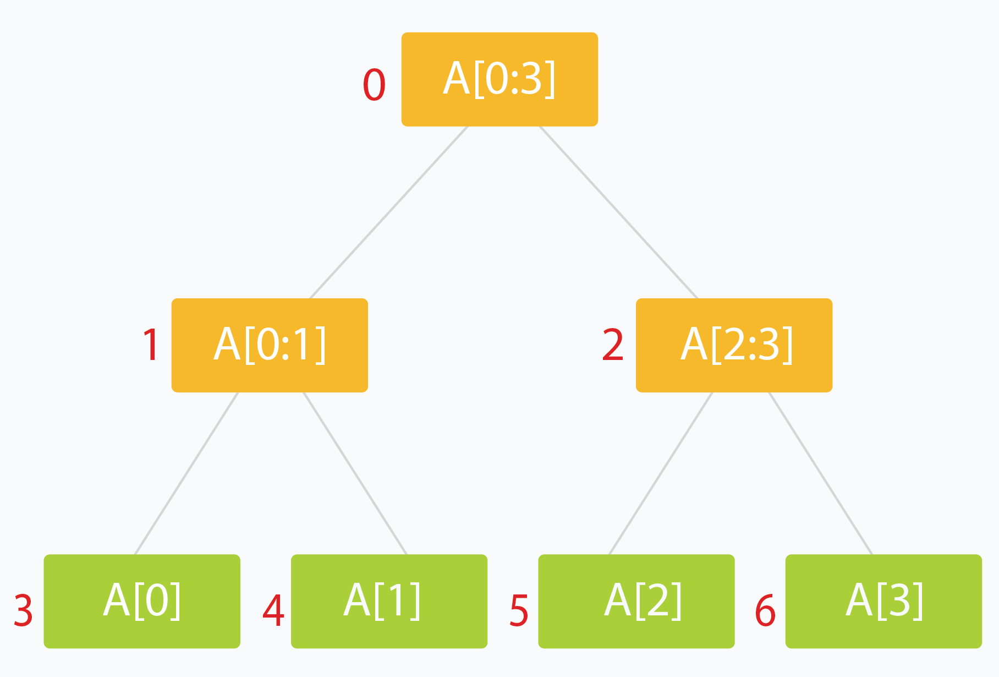
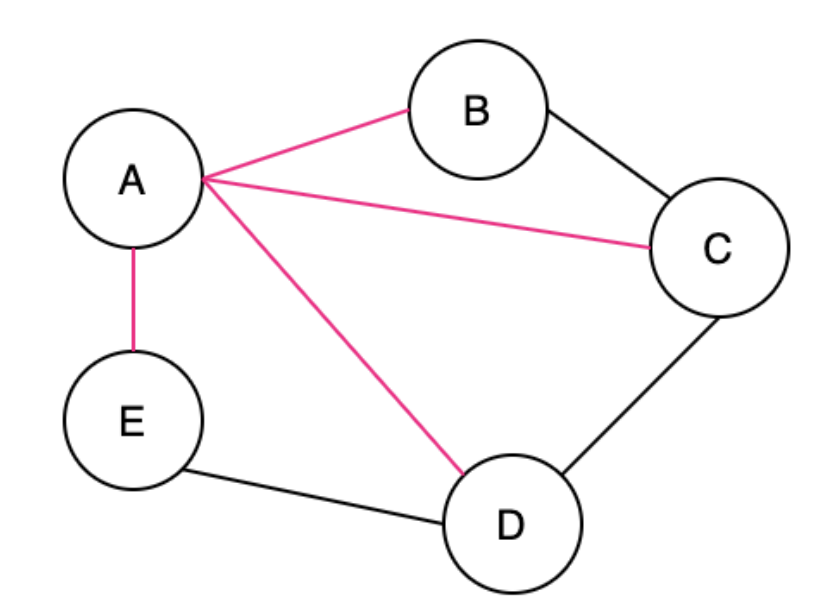
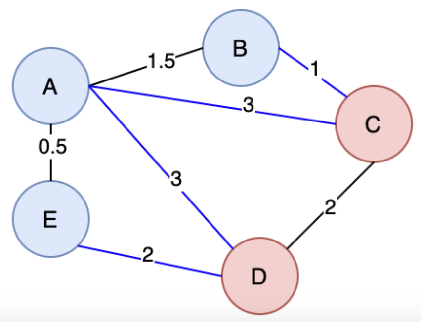
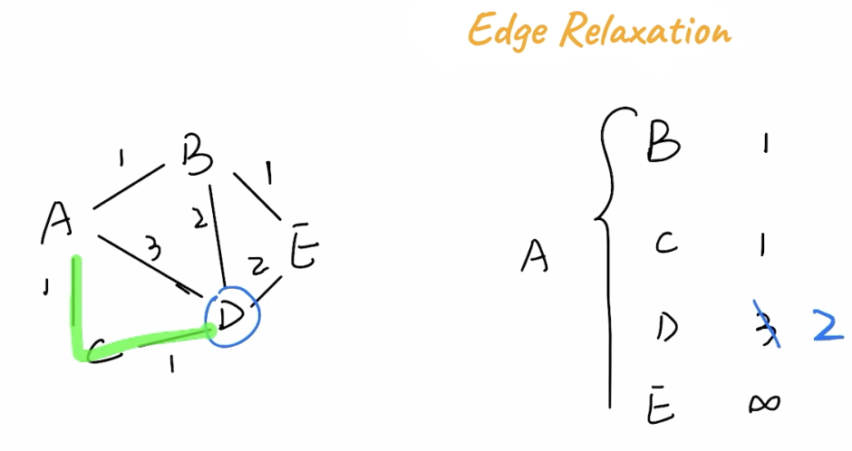

# Trees and Graphs

## Table of Contents
- [Trees](#trees)
  - [Binary Search Tree](#binary-search-tree)
  - [Self-Balancing Binary Search Tree](#self-balancing-binary-search-tree)
    - [AVL Tree](#avl-tree)
    - [Red Black Tree](#red-black-tree)
  - [Segment Tree](#segment-tree)
- [Graphs](#graphs)
  - [DFS & BFS](#dfs--bfs)
  - [UnionFind](#unionfind)
  - [Connected Components](#connected-components)
    - [Map Reduce Connected Components](#map-reduce-connected-components)
  - [Minimum Spanning Tree](#minimum-spanning-tree)
    - [Kruskal](#kruskal)
  - [Shortest Path](#shortest-path)
    - [Dijkstra](#dijkstra)

## Trees
### Binary Search Tree

### Self-Balancing Binary Search Tree
- Self Balancing BST's have the same property as Binary Search Tree's, except they will balance themselves out via different methods
- The reason for this balancing is that Binary Search Tree's worst case lookup time degrades to $O(n)$ if the tree represents a Linked List
  - This usually happens when we insert nodes in order and it becomes all right or left sides
#### AVL Tree
#### Red Black Tree

### Segment Tree
[Article used](https://leetcode.com/articles/a-recursive-approach-to-segment-trees-range-sum-queries-lazy-propagation/)

A segment tree is a Binary Tree where each node represents an interval, and each node would store one or more properties of an interval that'd be queried later on

Most of the time it's segements / indexes of an array, and the total sum, count, or some aggregation over them, which allows us to find a certain aggregation over a range of data in potentially $O(log n)$ time



- Typically the root holds the entire interval of data we're interested in traversing
- Each leaf of the tree represents a range of just one single element
- The internal nodes would represent the merged or unioned result of their children nodes
- Ideally, each child node would represent about 1/2 of it's parent
- Implementation:
  - Single callable function
  - Recurses down until at leaf node, and stores singular value in leaf node
  - After exiting later on in recursive call merge the child values via $O(1)$ array lookup

```
void buildSegTree(vector<int>& arr, int treeIndex, int lo, int hi)
{
    if (lo == hi) {                 // leaf node. store value in node.
        tree[treeIndex] = arr[lo];
        return;
    }

    int mid = lo + (hi - lo) / 2;   // recurse deeper for children.
    buildSegTree(arr, 2 * treeIndex + 1, lo, mid);
    buildSegTree(arr, 2 * treeIndex + 2, mid + 1, hi);

    // merge build results
    tree[treeIndex] = merge(tree[2 * treeIndex + 1], tree[2 * treeIndex + 2]);
}

// call this method as buildSegTree(arr, 0, 0, n-1);
// Here arr[] is input array and n is its size.
```

- The more important part is querying
  - We can't read partial overlaps, it would be too confusing
  - Need to traverse down until you get to a section that's smaller than your desired interval, and worst case add in from other sections as well
    - Can hopefully use some internal / middle nodes, and complete the aggregation using other leaf nodes
- Updating values means finding the leaf node of the actual index, and traversing back up and out to update that leaves parents

## Graphs

### Graph Traversal
- Traversing a graph has generally 2 strategies, either Depth first or Breadth first
- Depth first means exactly as it says, from any single node you traverse as far down / as far away as you can possibly go
- Breadth first on the other hand means from any node you explore each degree, or "level away", equally
  - BFS is typically used in ***shortest path problems*** because as you go out a degree each level, you're guaranteed to hit the shortest path first, wheras DFS would need to search every path and then take `min()`
    - Although for BFS to find the optimal solution, each edge has to have ***equal and positve weights***, and so it wouldn't work for weighted edges - that's typiaclly when we would use [Djikstra's](#djikstra) algorithm

$V$ is the number of Vertices, and $E$ is the number of edges

| Operation        | Time Complexity    | Space Complexity   |
|------------------|--------------------|--------------------|
| Traverse         | $O(V + E)$         | $O(V)$             |

### UnionFind / Disjoint Set union
- Union Find is a data structure that allows us to find a representation of clusters in a disconnected graph
  - It allows us to find connectivity of 2 nodes, i.e. if they're in the same component, in $O(1)$ time
  - Optimizations:
    - ***Path Compression:*** So that root / parent identification will be updated as we traverse down a graph
    - ***Union by Rank:*** So that our tree's don't become unbalanced over time
- For the time complexities below, $\alpha(n)$ is the *Inverse Achermann Function*, which "grows slowly and is effectively constant for all practical inputs"

| Operation        | Average Complexity |
|------------------|--------------------|
| Union (Put)      | $O(\alpha(V))$     |
| Find (Get)       | $O(\alpha(V))$     |
| Delete           | Not Applicable     |
| Traverse / Search| $O(n)$             |

### Connected Components
- Connected Components is a way for us to find all of the clusters in a graph, where connectivity can be *weak*, *strong*, or a few other types like *unilaterally*
  - *Weak* connected components can be thought of as *undirected* connected components, so that edges are just generic edges
  - *Strongly* connected components would require *directed* edges between all ***pairs of vertices*** meaning there has to be a way to get to any node, NodeA, from any other node in the component NodeB
- Algorithms:
  - ***Breadth First Search***:
    - Start a BFS traversal from every unvisited node ( node_i )
    - Traverse all neighbors ( node_{j's} ) of ( node_i ), marking them as visited
    - Continue the traversal until all nodes in the connected component of ( node_i ) are visited
    - Repeat for all unvisited nodes to find all connected components.
  - ***UnionFind*** above will have the `root` vector at the end corresponding to all of the unique connected component ID's

#### *Map Reduce Connected Componenets
Pregel is a way to do generic BFS and Graph Traversals in the MapReduce world, and there are ways to implement Connected Components via BFS using Pregel framework

We discuss Pregel in other areas, but it's useful to note here as some popular large scale data processing engines use this

### Minimum Spanning Tree
A ***Spanning Tree (ST)*** is a connected subgraph where all vertices are connected by the minimum number of edges

In my opinion it seems similar to a Span in a Vector Space which describes all of the orthonormal basis vectors that can be combined to create any vector in that space, but it's really not

The pink edges below show the ST


A ***Minimum Spanning Tree (MST)*** is when there are weights in a graph, we ideally can find the ST with the smallest total weight

An undirected graph can have multiple ST's and MST's

A ***cut*** in Graph Theory is a way to split up the Vertices and Edges in a Graph into 2 distinct sets, essentially cutting it to create 2 disjoint subsets



So the ***cut property***, which will help us run different algorithms, says for any Cut $C$ of the Graph $G$, if the weight of an Edge $E$ in a Cut-Set $C_s$ is strictly less than all other Edges in $C_s$, then $E$ belongs to all MST's of $G$

The [proof above would rely on contradiction](https://stackoverflow.com/questions/3327708/minimum-spanning-tree-what-exactly-is-the-cut-property) and goes something along the lines of "well if we didn't have that edge, $E$ in the MST, then we could add it and create a cycle that crosses the cut at least twice (first and newly added edge), and then if we removed the other Edge $E^`$ greater than it, it would result in a MST less than the original one"

MST algorithms are useful to find solutions to things like "min number of vertices to connect all points" similar to traveling salesman

#### Kruskal
Kruskal's Algorithm is for creating a [Minimum Spanning Tree](#minimum-spanning-tree) from a Weighted Undirected Graph. It uses sorting and [UnionFind](#unionfind--disjoint-set-union) to solve for MST 

- Kruskal's Algorithm will:
  - Sort all edges, taking $O(E \times log(E))$ time using a typical sorting algorithm
  - Starting smallest, for each edge:
    - Check if the vertices of the edge are in the same connected component - which can be done via [UnionFind](#unionfind--disjoint-set-union) and takes $O(\alpha(V))$ lookup and add time
      - This essentially shows us if it would create a cycle / unnecessary edge
    - Once we reach $V - 1$ edges we've constructed our MST

| Time Complexity    | Space Complexity   |
|--------------------|--------------------|
| $O(E \times log(E) + \alpha(V)) = O(E \times log(E))$         | $O(V)$             |

#### Prim
Prim's Algorithm is another algorithm for creating a [Minimum Spanning Tree](#minimum-spanning-tree) from a Weighted Undirected Graph. It uses 2 sets to solve for MST

- Start with `MST = set()` empty set, and `NVisited = set(all_V)` full of every vertex
- Start with an arbitrary vertex
  - For each step find all edges that connect `MST <--> NVisited` and take the minimum edge, and add that Vertex into MST
    - *Remember - The edge that connects two disjoint sub-graphs is a ***cut***
      - Time complexity is all around building min-heap, and then after that we are simply traversing unvisited nodes which is at most $O(V)$ so the min-heap building will dominate time complexity
      - Inserting into min-heap is $O(log V)$, and we do that for all edges $E$
  - So at each step find the minimum edge crossing the cut, add the Vertexes to MST, and remove them from NVisited

Finding all the edges that connect the 2 sets is the majority of complexity here, and typically is solved using

| Time Complexity    | Space Complexity   |
|--------------------|--------------------|
| $O(E \times log(V))$ | $O(V)$             |

Python Code

Pseudocode:
$U$ is the set of visited Vertices, $V - U$ is the set of unvisited Vertices
```
T = ∅;
U = { 1 };
while (U ≠ V)
    let (u, v) be the lowest cost edge such that u ∈ U and v ∈ V - U;
    T = T ∪ {(u, v)}
    U = U ∪ {v}
return(T)
```

### Shortest Path
[Breadth First Search](#graph-traversal) can help us find the shortest path between 2 nodes ***in an unweighted graph***, but it can't help when the graph is weighted because there are so many more options!

#### Edge Relaxation
The ***Edge Relaxation Property*** is the general property describing that although a path might take more hops, the weights on it might be smaller. In the below example `A -> C -> D` has a total weight of 2, while `A -> D` has a weight of 3


#### Djikstra
Djikstra's Algorithm can help solve the shortest path problem for graphs with ***non-negative weights***

Djikstra's algorithm is greedy, and essentially starts from a central point `u` and expands outwards, continually getting the min from the seen vertices to find shortest path to other vertices, it uses a min-heap to continuously select the vertex with the smallest known distance

We hold the state of our source vertex to each other vertex in the graph, and we hold "previous vertex" and length information in this table which will help us traverse recursively if we needed to rebuild the path. We can lookup distance from source to any other vertex in $O(1)$ once it's complete, and then rebuilding path is at worst $O(E)$ because it might be a linked list, and building this data structure and traversing the graph resutls in us visiting each vertex and each node so it would be around $O(V + E)$ time complexity, but for each edge in a vertex we need to find the min vertex which is $O(log V)$, therefore total time complexity is $O(V + E \times log(V))$ and $O(V)$ space (since we need to store visited node info)

| Time Complexity    | Space Complexity   |
|--------------------|--------------------|
| $O((V + E) \times log(V))$ | $O(V + E)$ |

- Use cases:
  - Network delay times from source to all sinks
  - Traveling salesman that needs to cover all houses
  - ...

#### Bellman-Ford
Bellman-Ford can help solve shortest path for all graph types ***including negative weights***

### Topological Sorting / Kahns Algorithm
Topological Sorting can help us traversing graphs when there are dependencies in directed acyclic graph's (DAGs), which is different from the above undirected weighted graphs

A key property is ***acyclic*** meaning there are no cycles in the graph! It wouldn't make sense if our prerequisites were required for our prerequisites!

- Use cases:
  - Course scheduling with pre-requisites
  - Workflow DAGs
  - ...

The main algorithm for this is ***Kahn's Algorithm*** where we will basically iterate over all vertexes that have `indegree = 0`, and do something with them, and then decrement their downstream vertexes. This ultimately creates "levels" where multiple classes or jobs could be ran at the same time, and once they're all done we should be ready for our downstream vertexes (decrement indegree)

Since we are only iterating over edges and vertexes and doing increment / decrement, our space and time complexities are $O(V + E)$

| Time Complexity    | Space Complexity   |
|--------------------|--------------------|
| $O(V + E)$         | $O(V + E)$         |

## Graphs In the Wild

### Storage 

### Traversal / Compute