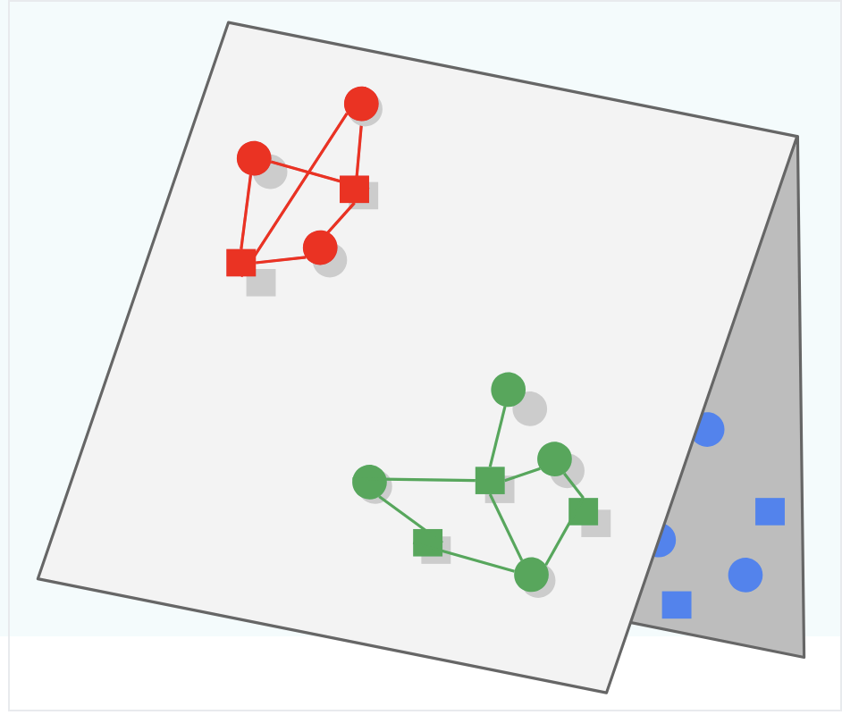

# Table of Contents
- [Output Layers](#output-layers)
  - [Catches](#catches)
    - [Folding](#folding)
  - [Regression](#regression)
    - [Linear](#linear)
  - [Classification](#classification)
    - [Sigmoid](#sigmoid)
    - [Softmax](#softmax)
  - [Other Types](#other-types)
    - [Softmax with Temperature](#softmax-with-temperature)
    - [Logits](#logits)
    - [Tanh](#tanh)
- [Loss Functions](#loss-functions)
  - [Gradient Descent](#gradient-descent)
  - [Negative Sampling](#negative-sampling)
    - [Stochastic Gradient Descent (SGD)](#stochastic-gradient-descent-sgd)
    - [Mini Batch](#mini-batch)
    - [Mini Batch Stochastic Gradient Descent](#mini-batch-stochastic-gradient-descent)
  - [Weighted Alternating Least Squares](#weighted-alternating-least-squares)
  - [Cross Entropy](#cross-entropy)
  - [KL Divergence](#kl-divergence)
    - [When to Use Cross Entropy vs. KL Divergence](#when-to-use-cross-entropy-vs-kl-divergence)

# Output Layers
The final output layers of our models typically go hand-in-hand with the [Loss Functions](#loss-functions) that we use

## Catches 
Some gotchas apart of model training and loss functions

### Folding
If we only focus on the "positive" examples during training, and we don't introduce negatives for the model to "learn" / iterate over, then our model could be prone to Folding

Folding is what occurs when embeddings of different items end up close to each other in the metric space, even though they may be unrelated. When this occurs the embedding representations "look close" to each other, but in reality they should be separated. 

In the picture below the Green and Blue subspaces should be learned to be separated (i.e. create triangle 3d structure) instead of keeping them both on the 2d plane and overlapping, which would lead to Green being served for Blue queries and vice versa

## Regression
Regression output layers are used when the task is to predict continuous values

### Linear
- **Usage**: Regression
- **Description**: The linear output layer outputs a continuous value. It is used for regression tasks where the goal is to predict a continuous variable
- **Formula**: $[ y = w \cdot x + b ]$
- Where:
    - $( y )$ is the predicted output
    - $( w )$ is the weight matrix
    - $( x )$ is the input vector
    - $( b )$ is the bias term
    
## Classification
Classification output layers are used when the task is to predict discrete labels or categories

Why do we use these output formulas? We want them to be "nice" for derivates and not to have vanishing gradients. They're also fairly intuitive for each of the specific tasks they're used for.

### Sigmoid
- **Usage**: Binary classification
- **Description**: The sigmoid function outputs a probability value between 0 and 1 for each class. It is typically used for binary classification tasks
- **Formula**: $\sigma(x) = \frac{1}{1 + e^{-x}}$

### Softmax
- **Usage**: Multi-class classification
- **Description**: The softmax function outputs a probability distribution over multiple classes. It is used for multi-class classification tasks
- **Formula**: $\text{softmax}(x_i) = \frac{e^{x_i}}{\sum_{j} e^{x_j}}$

## Other Types

### Softmax with Temperature
- **Usage**: Multi-class classification with control over the confidence of predictions
- **Description**: The softmax with temperature function introduces a temperature parameter to control the confidence of the predictions. Lower temperatures make the model more confident, while higher temperatures make it less confident
- **Formula**: \(\text{softmax}(x_i, T) = \frac{e^{x_i / T}}{\sum_{j} e^{x_j / T}}\)

### Logits
- **Usage**: Intermediate representation for classification
- **Description**: Logits are the raw, unnormalized scores output by the model before applying a softmax or sigmoid function. They are often used as an intermediate representation in classification tasks

### Tanh
- **Usage**: Regression or binary classification
- **Description**: The tanh function outputs values between -1 and 1. It can be used for regression tasks or binary classification tasks where the output needs to be in this range
- **Formula**: \(\tanh(x) = \frac{e^x - e^{-x}}{e^x + e^{-x}}\)

# Loss Functions
Loss functions are the entire heart of model training and tuning 

## Gradient Descent
Gradient Descent is the main algorithm for updating weights based on our loss functions - it will basically chain together a bunch of partial derivatives which show each parameters effects on the output, and based on the output's loss the weights will be updated in the negative direction

It's simply a way to move parameters towards places that create "good" layers to create the final output layer as close as possible to what we're trying to model

Gradient Descent will run over all training examples

## Negative Sampling
To combat [Folding](#folding) we know we must use negative samples, but instead of using every single negative example we should pick a sample of negatives! In this way we can randomly choose "bad" examples and feed them through as 0's.

### Stochastic Gradient Descent (SGD)
Stochastic Gradient Descent updates the model parameters using a single training example at each iteration. This introduces noise into the optimization process, which can help escape local minima.

### Mini Batch
Mini Batch Gradient Descent updates the model parameters using a small batch of training examples at each iteration. This balances the efficiency of batch gradient descent with the noise reduction of stochastic gradient descent.

### Mini Batch Stochastic Gradient Descent
Mini Batch Stochastic Gradient Descent combines the concepts of mini batch and stochastic gradient descent. It updates the model parameters using a small, randomly selected batch of training examples at each iteration.

## Weighted Alternating Least Squares
Weighted Alternating Least Squares is an optimization algorithm used in matrix factorization techniques, particularly for recommendation systems. It alternates between fixing the user matrix and optimizing the item matrix, and vice versa, while incorporating weights for observed and unobserved interactions.

## Cross Entropy
Cross Entropy is a loss function commonly used for **classification tasks**. It measures the difference between the true probability distribution (ground truth) and the predicted probability distribution (output of the model). It is particularly effective when the output of the model is a probability distribution (e.g., from a softmax layer).

### Formula
\[
H(p, q) = -\sum_{i} p_i \log(q_i)
\]
Where:
- \( p_i \): True probability of class \( i \) (ground truth, typically one-hot encoded).
- \( q_i \): Predicted probability of class \( i \) (output of the model).

### Use Cases
- **Binary Classification**:
  - Used with a sigmoid activation function for tasks with two classes (e.g., spam vs. not spam).
  - Example: Predicting whether an email is spam or not.
- **Multi-Class Classification**:
  - Used with a softmax activation function for tasks with more than two classes (e.g., classifying images into categories).
  - Example: Classifying images into categories like cats, dogs, and birds.

### Why Use Cross Entropy?
- Penalizes incorrect predictions more heavily when the model is confident but wrong.
- Works well when the output is a probability distribution, as it directly compares the predicted probabilities to the true probabilities.

---

## L2 Loss
TODO: L2
---

## KL Divergence
KL Divergence (Kullback-Leibler Divergence) is a measure of how one probability distribution \( q \) (predicted) diverges from a second probability distribution \( p \) (true). It is often used in tasks where the true labels are **probability distributions** rather than one-hot encoded labels.

### Formula
\[
D_{KL}(p \| q) = \sum_{i} p_i \log\left(\frac{p_i}{q_i}\right)
\]
Where:
- \( p_i \): True probability of class \( i \) (ground truth distribution).
- \( q_i \): Predicted probability of class \( i \) (output of the model).

### Use Cases
- **Probabilistic Outputs**:
  - Used when the ground truth is a probability distribution (not one-hot encoded).
  - Example: Language modeling tasks where the ground truth is a smoothed probability distribution over words.
- **Regularization**:
  - Often used as a regularization term in models like Variational Autoencoders (VAEs) to ensure that the learned latent distribution is close to a prior distribution (e.g., Gaussian).

### Why Use KL Divergence?
- Useful for comparing two probability distributions rather than a single label.
- Penalizes predictions that deviate significantly from the true distribution.

---

## When to Use Cross Entropy vs. KL Divergence

| **Scenario**                                   | **Use Cross Entropy**                                                                 | **Use KL Divergence**                                                                 |
|------------------------------------------------|--------------------------------------------------------------------------------------|---------------------------------------------------------------------------------------|
| **Binary Classification**                      | Use Cross Entropy with a sigmoid activation function.                                | Not applicable.                                                                      |
| **Multi-Class Classification**                 | Use Cross Entropy with a softmax activation function.                                | Not applicable.                                                                      |
| **Ground Truth is a Probability Distribution** | Not applicable.                                                                      | Use KL Divergence to compare the predicted and true distributions.                   |
| **Language Modeling**                          | Use Cross Entropy when the ground truth is one-hot encoded.                          | Use KL Divergence when the ground truth is a smoothed or probabilistic distribution.  |
| **Regularization**                             | Not applicable.                                                                      | Use KL Divergence to regularize the predicted distribution (e.g., in VAEs).          |

### Example Scenarios
1. **Image Classification**:
   - Task: Classify images into categories (e.g., cats, dogs, birds).
   - Use **Cross Entropy** with a softmax activation function, as the ground truth is one-hot encoded.

2. **Language Modeling**:
   - Task: Predict the next word in a sentence.
   - Use **Cross Entropy** if the ground truth is one-hot encoded (e.g., the next word).
   - Use **KL Divergence** if the ground truth is a smoothed probability distribution over words.

3. **Variational Autoencoders (VAEs)**:
   - Task: Learn a latent representation of data.
   - Use **KL Divergence** to regularize the latent distribution to match a prior (e.g., Gaussian).

4. **Recommendation Systems**:
   - Task: Predict the probability of a user interacting with an item.
   - Use **Cross Entropy** if the ground truth is binary (e.g., clicked or not clicked).
   - Use **KL Divergence** if the ground truth is a probability distribution over items.

## InfoNCE Loss
InfoNCE loss, or Information Noise-Contrastive Estimation loss is used in ***self-supervised learning*** to train models to learn meaningful representations by distinguishing between positive and negative sample pairs

It does this by giving low loss to similar pairs - i.e. by maximizing the similarity between positive pairs, and minimizing the similarity between negative pairs

### Formal Definition
Given a set $X = \{x_1, x_2, ..., x_N\}$ of $N$ random samples containing one positive sample from $p(x_{t+k} | c_t)$ and $N-1$ negative samples from the 'proposal' distribution $p(x_{t+k})$, we optimize:

\[
\mathcal{L}_{\text{InfoNCE}} = -\mathbb{E} \left[ \log \frac{\exp(\text{sim}(z, z^+)/\tau)}{\exp(\text{sim}(z, z^+)/\tau) + \sum_{j=1}^{N-1} \exp(\text{sim}(z, z_j^-)/\tau)} \right]
\]