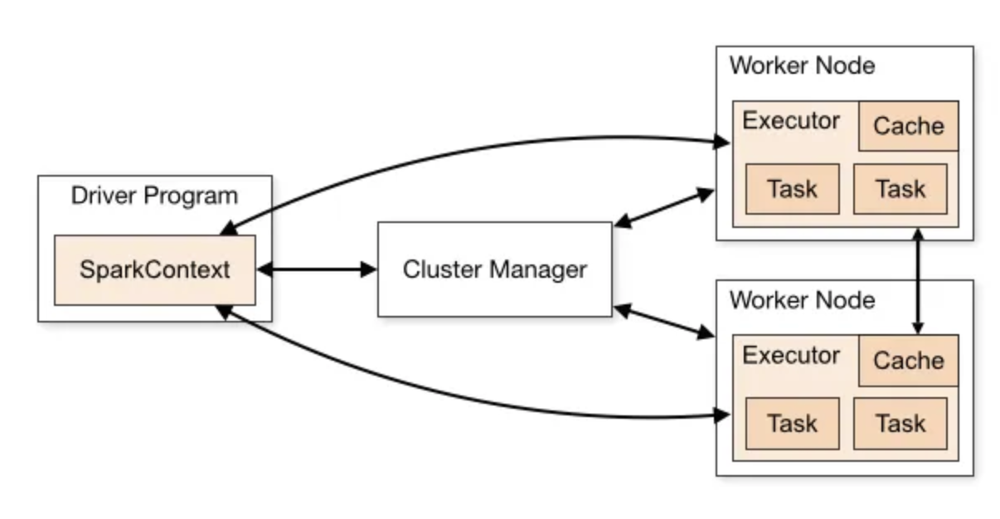
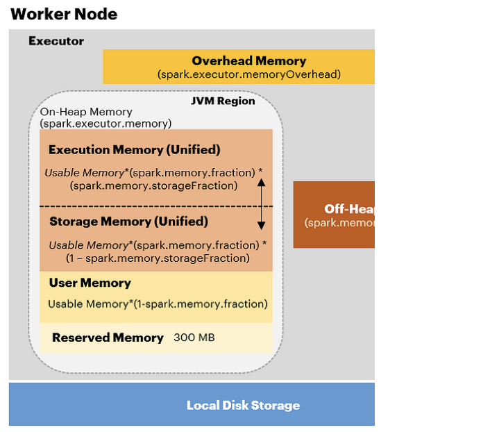
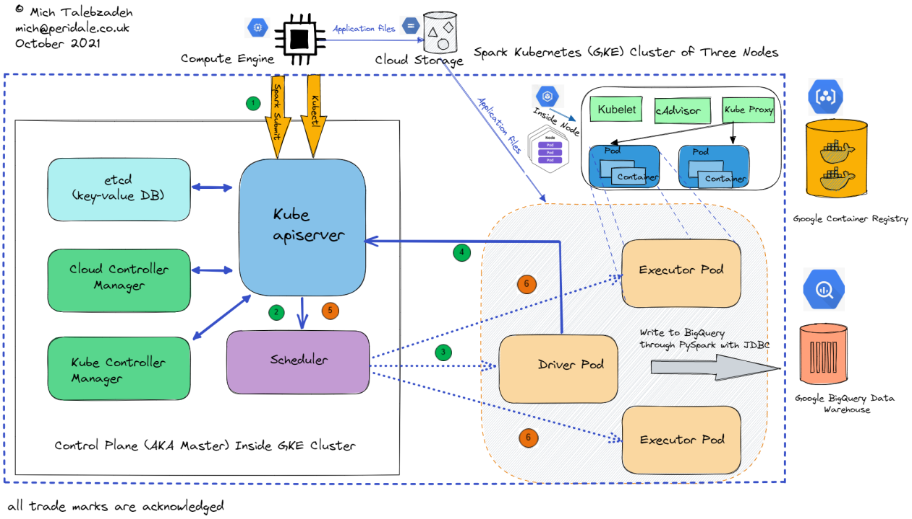
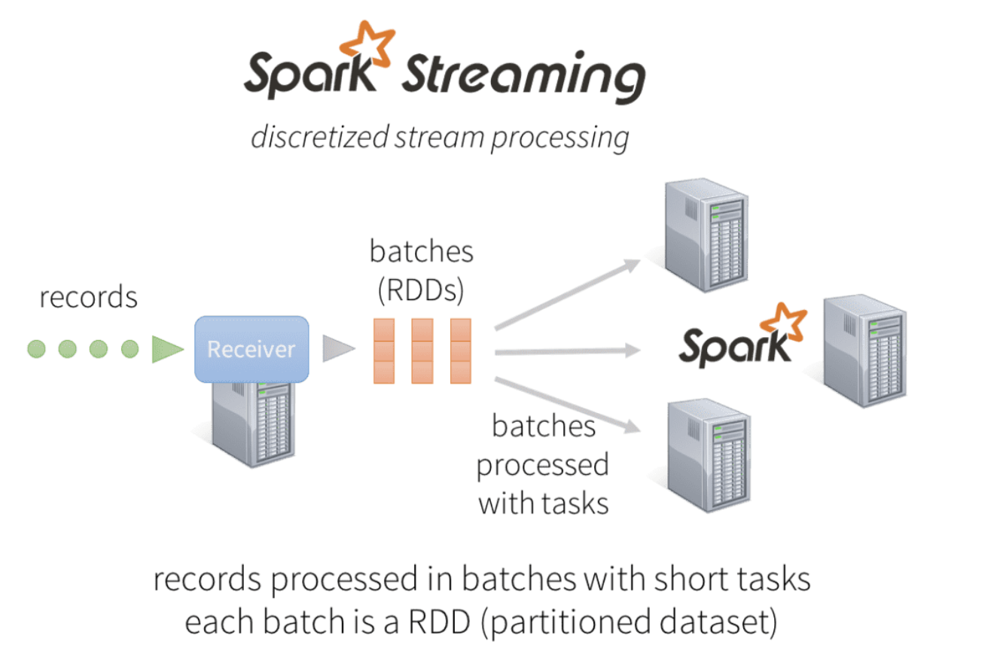
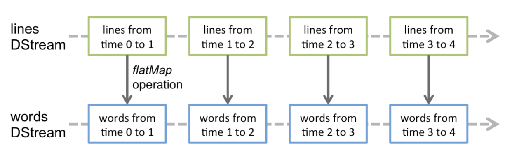
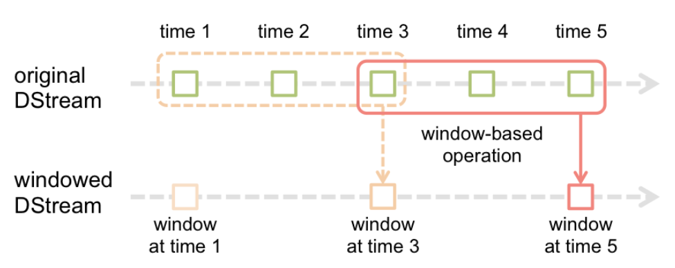

# Spark
Spark's a gigantic part of Data Platforming, ETL, Data Pipelines, and pretty much anything with moving data around

At it's core it's a set of tools and SDKs to configure, start, and run logic over distributed nodes - it helps to split data up into parallel datasets that can be computed on across nodes

It can be used with Batch and Streaming (micro-batch) setups

## Generic Architecture
A Cluster is a set of Compute Nodes 

It all starts with Driver and Executors in a Cluster - a Driver is the cluster manager that helps to schedule and distribute work, and Executors perform the work



This is nice, because it basically allows us to horizontally scale as much as we need for our distributed datasets...and a majority of working with Spark comes down to setting up your data to be as parallel as possible, and for writing proper logic that utilizes programs running on different nodes

### Spark Driver
This program sits on one node, and is responsible for:
- Starting the ***SparkContext***, which is core of the Spark Application and what works with the cluster manager
- Generating UI + Metrics
- Interacting with the Client
    - For any data or calcualtions to reach the client CLI / Browser, the executors must Shuffle data back to the Driver and let it display info to the Client

Drivers access the executors via a ***SparkSession***

### Spark Executors
Spark Executors do the actual work, and are repsonsible for running Tasks in Spark on actual data

Executors are all just JVM processes running

## Terminology
The main structures used in Spark are divided up into 4-ish main groups:
- Data Storage Structures
- Logic and Operations
- Work Steps
- Networking and Nodes

### Data Storage Structures
Dataset = Dataframe AND RDD combined 
Dataframe & RDD are lower-level abstractions for sequential, tabular data

- **RDD**:
    - A Resilient Distributed Dataset (RDD) is defined as an immutable distributed collection of elements of your data, partitioned across nodes in your cluster that can be operated in parallel with a low-level API that offers transformations and actions
        - To parse this out, an RDD is the collection of elements of data (rows), and it is typically split up among the different Nodes in a Cluster to provide parallel processing
        - The Transformations and Actions are apart of the [Logical Operations](#logic-and-operations) we can perform on our data
        - These objets are immutable, and running operations over them produces new RDD's: $f(RDD_1) = RDD_2$
    - A lower-level abstraction for distributed data
    - Logical Operations done via functional programming without higher level SDK's
    - Lacks the optimizations available in DataFrames
        - RDD's aren't typed, they are just `Row[T]` objects
        - RDD's aren't validated
        - Lesser query optimizations over these objects
- **DataFrame**:
    - Similar to RDD where it's a distributed collection of data
    - A higher-level abstraction with schemas, metadata, and optimizations
    - Logical Operations can be completed with higher level SDK's + domain specific API's
    - Superior to RDDs in performance due to query optimizations
    - Both Dataframes and Datasets are built on top of the Catalyst Optimizer for better logical and physical query plans
        - Dataframes have more info in them than RDD’s so Query Optimizer can better perform
        - ***Predicate Pushdown*** also helps - which allows us to evaluate the predicate/commands at storage level, so we don’t have to read in unnecessary data points and evaluate them
- **Dataset**:
    - Combines the benefits of DataFrames and RDDs, and allows for functional programming, high level API's from domain specific languages, and optional schemas
    - Can be Typed or Untyped
        - Can be viewed as `Dataframe = Dataset[Row]`, where a Dataframe is a generic Dataset (in this `[Row]` is an untypd JVM object)
        - Datasets are best when used with ***strongly typed case class schemas***
    - Datasets have the lowest memory footprint, especially when caching
    - Both Dataframes and Datasets are built on top of the Catalyst Optimizer for better logical and physical query plans


### Logic and Operations
The two main types are Transformations and Actions, and at a high level Transformations are built up and optimized in a query plan, while Actions break that chain and cause computations to be ran

- **Transformation**: Intermediate steps (e.g., type conversion) that are lazily evaluated and do not trigger computation immediately.
    - **Narrow Transformations**:
    - Operate on a single partition (e.g., `map`, `filter`)
    - Do not require shuffles
    - We can chain together multiple narrow transformations on the same Node across the same Executors
    - **Wide Transformations**:
    - Require data from multiple partitions (e.g., `groupBy`, `join`)
    - Trigger shuffles and create new Stages
- **Action**: Concrete operations (e.g., `count`, `join`) that triggers computation across Executors and Shuffles across Nodes
    - We can't possibly know the results, so we need to run this in a Stage (set of Tasks) and get results before going any further


### Work Steps
Work Steps here refers to the different ways we group together [Logical Operations](#logic-and-operations) and [Networking and Data Transfers](#networking-and-nodes) - they basically describe how compute and I/O work together across our Cluster to come up with a result

- **Task**:
    - A single operation performed on a single partition of an RDD
    - Executed as a single thread on an executor
    - The number of tasks in a stage equals the number of partitions in the RDD
        - If a dataset has 2 partitions, and we run a `.filter()` Transformation on it, that will trigger 2 Tasks in a single Stage
    - Tasks are directly related to number of Partitions and Executors
        - If there are 200 partitions and 100 Executors, each Executor gets 2 Partitions
        - If each Executor has 2 `executor-cores`, then all 200 Tasks are ran in parallel
        - If each Executor only has 1 core, then 100 are ran in parallel, then another 100
- **Stage**:
    - A sequence of tasks that can run in parallel without requiring shuffles
    - A new Stage begins whenever network communication is needed between the Executors
    - Stages are separated by Shuffles, which involve data movement across partitions or executors
        - $Shuffles = Stages – 1$
    - Stages are directly related to the number of Shuffles in a Job
- **Job**:
    - A sequence of stages triggered by an action
    - Jobs are separated when data needs to move out of Spark executors (e.g., to the driver, disk, or external storage)

### Networking and Nodes
- **Cluster**: A group of JVMs (nodes) connected by a network
  - A node can host multiple JVMs
- **Driver**:
  - A node responsible for managing tasks and distributing work across worker nodes
  - Be cautious with operations like `collect()`, as they bring all data back to the driver
- **Executor**:
    - A JVM process that runs tasks on partitions of data
    - Executors have a fixed number of cores and memory:
        - **executor-memory**: Heap size for caching data and Shuffle structures
        - **executor-cores**: Number of cores assigned to an Executor, an Executor can run this many Tasks in parallel
        - **num-executors**: Determines the total # of Executors on a Worker Node
    - Executors can be dynamically allocated (Spark 1.3+), scaling up or down based on task backlog
    - There can be one to many executors on a Node, and even one or many Executors on a CPU
        - If an Executor has multiple cores assigned to it, it can run multiple Tasks in parallel
        - Each executor has the same fixed number of cores and heap size (remember it’s just a process on a node)
- **Shuffle**:
  - An operation where data is re-partitioned across clusters - which involves serializing a data structure and sending it over the network
  - Typically occurs after wide transformations (e.g., `groupByKey`, `reduceByKey`).
  - Involves network I/O and serialization, making it expensive

### Key Relationships
- **Job**: A sequence of Stages triggered by an action
- **Stage**: A sequence of Tasks that do not require Shuffles
- **Task**: A single operation applied to a partition
- **Partition**: A subset of data processed by a Task
- **Executor**: A JVM process that processes Tasks on Partitions

### Why Are Shuffles Bad?
- Shuffles involve:
  - Network I/O and serialization
  - Sequential execution of stages, reducing parallelism
- Strategies to reduce shuffles:
  - Denormalize datasets
  - Broadcast smaller tables (<10MB) for joins
  - Use bucketed datasets for pre-shuffled joins

## Memory Management

### Spark Memory Overview


TODO: More on heap and on machine in RAM, disk + spill, and efficient caching 

## Optimizations

### Partitioning
- Default `maxPartitionBytes` determines chunk sizes.
- Aim for balanced partition sizes to avoid skew and spill.

### File Formats
- **Parquet**: Supports statistics and data skipping.
- **Delta Lake**: Enhanced Parquet with better stats and faster aggregation.
- Use Z-Ordering for high-cardinality columns to optimize queries.
    - TODO: Z-Ordering is basically just smart partitioning to skip over files and order data...not indexing, but kinda indexing

### Adaptive Query Execution
- Spark re-evaluates query plans after each stage to optimize execution.
- 

## Example Configuration

### Cluster Setup
- **Nodes**: 6 nodes, each with 16 cores and 64GB memory
    - Typically we want to leave 7% memory and 1 vCPU for background processes
- **Executor Configuration**:
  - `num-executors`: 17 means 3 executors per node, 1 reserved for the application manager)
  - `executor-cores`: 5 (15 vCPUs per node ÷ 3 executors per node)
    - $executor-cores = node-vCPU-count / (num-executors + 1 / num-nodes) = 15 / (18/6) = 15 / 3 = 5$
  - `executor-memory`: 19GB (63GB per node ÷ 3 executors, minus 7% overhead)


# 5 S's
The 5 S's of Spark are:
- ***Spill***: When data has to go off volative RAM onto local disk because it's too large
- ***Skew***: When there is significantly more data in certain partitions
- ***Storage***: Around too small of files, too large of files, or ineffecient file setup for good parallelization (one file and 800 executors)
- ***Serialization***: The act of binary encoding and decoding of data is resource and CPU intensive
- ***Shuffle***: Sending data across network - I/O is expensive and involves high throughput infrastructure

## 1. Spill
- **Definition**: Occurs when data exceeds available volatile memory and is written to local disk
- **Causes**:
  - Skewed partitions
  - Insufficient memory allocation
- **Strategies**:
  - Use consistent memory partition sizes
  - Monitor spill listeners to identify issues
  - Optimize partitioning to reduce skew

## 2. Skew
- **Definition**: When certain partitions contain significantly more data than others, leading to uneven workload distribution
- **Causes**:
  - Poor partitioning strategies
  - Uneven data distribution
- **Strategies**:
  - Repartition data to balance workloads
  - Use salting techniques to distribute keys evenly
    - Splitting up the portion for `user1` into `user1_1`, `user1_2`, etc. to spread out the data
    - When this is done we need to tweak our joins and aggregations to account for salted keys
        - `groupByKey` would need to be adjusted to `groupByKey(salted_key)` and we would need to aggregate the results after

## 3. Storage
- **Definition**: Inefficient file setup or file sizes that hinder parallelization
- **Challenges**:
  - Tiny files: Thousands of small files can make processing serial, or drastically inefficient
    - Over partitioning tables (tiny file problem)
        - Having more files with really small amounts of data will cause unoptimized read queries
        - Reducing number of files and increasing file sizes to b/t 128Mb and 1Gb will give economies of scale for reading
    - Scan time is the amount of time to get files and build memory partitions
    - Read time is a subset of scan time…it’s the amount of time to get the files, but not build the memory partitions
        - If scan time and read time are far apart there’s a small file problem
        - Driver needs to go open each file, serially, and check 
  - Large files: Files exceeding memory limits can cause spill
- **Strategies**:
  - Aim for partitions that create file sizes between 128MB and 1GB
  - Use Delta Lake to automatically coalesce small files
  - Optimize partitioning to reduce the number of files

### 3.1 File Formats
- ***Parquet*** has stats
	- If we partition correctly, then we can use data skipping to skip over some files because we know of the partitions
	- If we partition by CityID, and we have a where CityID = 1, we can skip every other file
- Don’t collect stats on long strings
- Use parquet instead of CSV
	- CSV doesn’t collect stats
- ***Delta*** is just a shinier parquet format
	- Collects more stats
	- Faster for aggregation (uses stats better)
	- For read/writes parquet & delta are similar
- LocalTableScan in the query details means that the JSON stats covered the query instead of actually opening the file
	- Kinda similar to OLAP cube where we compute a lot of stuff at write time and write it to JSON 
- ZOrder is for sorting the rows in parquet/delta
	- Can’t do it freestanding
	- Apart of Optimize function
		- Optimize coalesces files together
		- Can add in ZOrder to also sort the rows
	- Good for needle in the haystack
	- Most effective with indexes that feature high-cardinality 
	- ZOrder is a way to optimize/index partitioned files, where we can also optimize by ordered by partitions and metadata statistics
	- Typically scan less files, and get less false positives, when using columns in where clause that we Z-Ordered
- High cardinality <—> Z Order && Low cardinality <—> Partition
	- We want ~2GB of files if we partition for each of them to be used best by cores

### 3.2 Delta Deep Dive
TODO - metadata, storage, column families, row families, skipping, etc...

## 4. Shuffle
- **Definition**: Data movement across the network during wide transformations (e.g., `groupByKey`, `join`)
    - Typically done after wide transformation when data is re-distributed between partitions
- **Challenges**:
    - High network I/O and serialization costs
    - Sequential execution of stages reduces parallelism
- **Strategies**:
    - Denormalize datasets to reduce shuffles
    - Broadcast smaller tables (<10MB) for joins
    - Use bucketed datasets for pre-shuffled joins
    - Monitor `shuffleReadSize` (should be between 128MB and 2GB)

## 5. Serialization
- **Definition**: The process of encoding and decoding data into binary formats, which is resource-intensive
    - This can happen during:
        - Shuffles when we send data over the network
        - Spill when we need to write binary data to disk
        - Storage when we need to write Delta data to disk
- **Strategies**:
  - Use efficient serialization formats like Parquet or Delta Lake
  - Avoid collecting unnecessary stats on long strings
  - Optimize partition sizes to minimize serialization overhead

# Kubernetes Architecture
TODO: Driver is a Pod, and is calls API Server to scale up Executors in Pod, will use cloud provider block storage devices for disk. Spark-submit done via API Controller


# Spark Streaming
Our [Streaming sub-document](STREAM_PROCESSING.md) goes into more detail on the concepts and architectures of streaming, but here we will focus on Spark Streaming

Spark Streaming allows for resilient, durable, and highly available streaming pipelines - common sources and sinks include TCP Sockets /  Network I/O / File Descriptors, [Kafka Brokers](../architecture_components/messaging/Kafka%20Broker/KAFKA.md), [Queue's](../design_systems/_typical_reusable_resources/_typical_distributed_queue/README.md), [PubSub](../architecture_components/messaging/PubSub/PUBSUB.md), and [Blob Storage](../design_systems/_typical_reusable_resources/_typical_blob_storage/README.md)

With Spark Streaming we can treat these incoming messages as [RDDs or Datasets](#data-storage-structures) and run our typical functional programming or other high-level API's over it

The hardest questions to solve are running long-standing aggregations such as distinct counts, Top K, or tumbling window aggregations (# users in last 5 minutes)

Spark Streaming allows us to re-use all of the goodness baked into Spark for things like Dataset API's, ML Models, Fault Tolerance and Durability, Open Source Ecosystems, and Managed Solutions


## Differences from Batch

The main difference between Spark Streaming and Spark Batch is how we continuously get RDD data in our source

Micro-batches sometimes get brought up when considering performance, but given that most Streaming services have some sort of computation window micro-batches are fairly aligned to this. There's a chance that micro-batches cause some slight delay versus sending each record independently, but the benefits of re-using Dataset and RDD API's and syncing with the Batch Engine outweigh the costs.

The Kubernetes architecture is similar to [Batch on Kubernetes](#kubernetes-architecture), except the Executors and Driver would stay up for the duration of the Streaming job, or possible indefinitely instead of shutting down afterwards like Batch


### Data Operations
- ***Discretized Stream (DStream)*** is the basic abstraction provided by Spark Streaming. It represents a continuous stream of data, either the input data stream received from source, or the processed data stream generated by transforming the input stream
  - A DStream is a *continuous series of RDDs*
  - Each RDD in a DStream represents a batch of data, typically generated at regular intervals (e.g., every 5 seconds)
  - DStreams are created at input, or by applying transformations to the input data stream, such as filtering, mapping, or reducing
- Most of this is hidden away by Spark Streaming Engine, and the developer works with high level API's to create transforms
- Each Source Input Stream is usually accepted by a ***Receiver*** which will batch together records based on the defined interval
  - Each Receiver gets a Thread
- Operations on DStreams include most of the typical functional programming functions:
  - Map operates on every row of the RDD in a DStream
  - FlatMap
  - Transform (similar to lambda expression)
  - forEachRDD will operate at the RDD level, and is called for each RDD in a DStream, use this for operations that run once over an entire RDD
  - forEachPartition operates on the partition of each RDD, which is useful for interacting with external systems since files are setup at partition level
    - Better than forEachRDD, and better than forEachRecord (Map)
  - ...
- For ***testing*** people tend to create queue's of RDD's, and release them over time to simulate streams


#### File Streams
[File Stream DStreams](https://spark.apache.org/docs/latest/streaming-programming-guide.html#file-streams) are useful when we want to monitor a stream of file changes under a directory, and this can also be linked to directory like structures compatible with HDFS such as S3

Any new file ***updated or created*** under the specified directory will get picked up, but the more files in a directory the harder it is to process and check for updates

### Window Operations
Window Operations allow for transformations that run over a sliding window of data

In the example below, there are 3 units in the window (***window length***), and it slides by 2 units (***sliding interval***)


- **Window Length**: The total size of the window (e.g., 3 units)
- **Sliding Interval**: The interval at which the window slides (e.g., every 2 units)

- **Windowed Operations**: These are transformations that operate on the data within the defined window. Examples include:
  - `count()`: Count the number of elements in the window
  - `reduce()`: Apply a reduction function to the elements in the window
  - `aggregate()`: Perform more complex aggregations

### DStream Joins
- There are 2 main types of DStream joins:
  - DStream <> DStream: If we have 2 streams, `(K, X)` and `(K, Y)`, we can join them together to get `(K, (X, Y))`
    - This is done by using the `join()` function on the DStreams
    - This is useful for combining related data from different sources
  - DStream <> Dataset: Similar to DStream <> DStream, except it will join a static Dataset for each DStream, and then return a new DStream

### Outputs
Outputs should go to a specific location like Files, Databases, Message Broker, or Network I/O

Our output function will run for each RDD DStream, and we should be careful to create resources only once (like connections), and sending them to each worker to be re-used, and not doing this for every single DStream
```
dstream.foreachRDD { rdd =>
  rdd.foreachPartition { partitionOfRecords =>
    // ConnectionPool is a static, lazily initialized pool of connections
    val connection = ConnectionPool.getConnection()
    partitionOfRecords.foreach(record => connection.send(record))
    ConnectionPool.returnConnection(connection)  // return to the pool for future reuse
  }
}
```

## Streaming Durability, and Fault Tolerance
Spark Streaming has many workers, each running on different computes potentially on different machine types - there are many things that could go wrong, and so Spark needs to be Fault Tolerant and Durable

- ***Metadata Checkpointing*** helps our Driver and Application to be Fault Tolerant by writing state and processes to disk
- ***Data Checkpointing*** helps our *stateful, cross-windowed, business logic* so that if something fails mid-batch we can start from the beginning and not outright fail
  - Stateful means over multiple RDD's / us having to keep state of the world of RDD's. ***Stateful operations happen over multiple RDD's in a DStream*** when one operation depends on operations of previous batches
  - If we need `count(distinct)` over all RDDs in a DStream, and an operations fails midstream, we need it to be able to pick back up because the historic RDDs that we already processed would be lost
  - Checkpointing is costly, writing all of these RDD's to disk takes time and is prone to throughput issues especially if we are writing to cloud storage like S3 every second (interval)
  - Can mark certain variables as `volatile` which means they won't be kept track of on disk statefully

## Streaming Application Deployment
- Required:
  - **Cluster + Cluster Manager**, which is apart of any Spark Cluster, and typically is a the Kubernetes Cluster Manager itself
  - **Application JAR**: The compiled JAR file containing the Spark Streaming application code
    - The Application JAR should have an entry point for the Spark Streaming application
  - **Configuration**: The configuration settings for the Spark Streaming application, including memory settings, executor settings, and other parameters
  - **Input Source**: The source of the streaming data, such as Kafka, TCP sockets, or file streams
  - **Output Sink**: The destination for the processed data, such as a database, file system, or message broker
- Optional:
  - **Checkpoint Directory**: A directory for storing metadata and data checkpoints
  - **Monitoring Tools**: Tools for monitoring the performance and health of the Spark Streaming application
  - **Logging Configuration**: Configuration for logging application events and errors