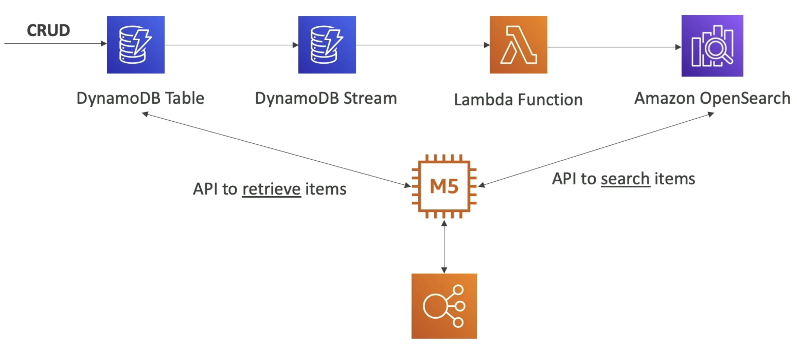
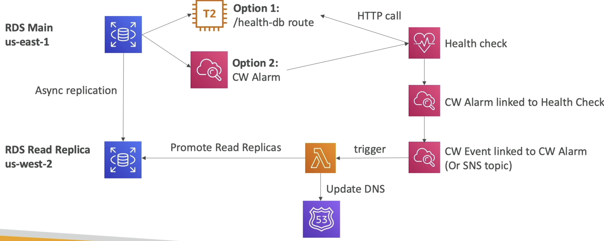
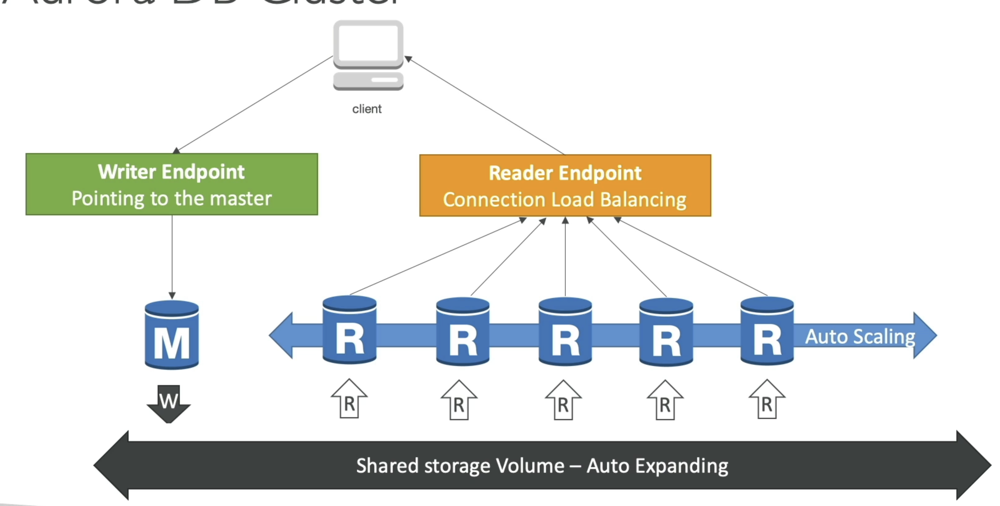

# Databases
This whole fuckin section is going to be on serverless Dynamo I bet

# DynamoDB
- NoSQL DB, fully managed, massive scale (1M req / sec)
- Similar architecture to Apache Cassandra
- No disk space, max object size is 400KB
    - Anything larger store in S3 and store reference in DynamoDB
- Capacity and provisioning
    - ***Write Capacity Unit (WCU)***: Governs write throughput
        - 1 WCU = 1 write per second for an item up to 1KB in size
        - Item larger than 1KB consumer more than 1 WCU, and it's always rounded up
        - Dynamo Streams does not consume WCU's
    - ***Read Capacity Unit (RCU)***: Governs read throughput
        - 1 RCU = 1 *strongly consistent read*, or 2 *eventually consistent reads* per second
        - For items up to 4KB in size
        - DynamoDB Streams also does not consume RCU
    - Only direct reads and writes from DynamoDB consume W/R CU's
    - Autoscaling
    - On Demand
- Supports CRUD ops
- Read:
    - Eventually consistent
    - Strongly consistent
- Supports ACID transactions across multiple tables
- Backups available with Point In Time (PIT) recovery
- Table classes:
    - Infrequent
    - Standards

## DyanmoDB Basics
Most of these basicas are covered in the [NoSQL Walkthrough](../../architecture_components/databases%20&%20storage/NoSQL/NOSQL.md)
- Made of tables
- Each table has a Primary key
    - Primary Key is either Partition Key, Partition and Sort Keys, or Combo Key
    - Must be decided during creation time
    - Responsible for hash calculation and partitioning
    - Options:
        - Partition Key only (hash)
            - Partition key must be unique per item
            - Must be "diverse" so that data partitions are uniform, no hot partitions
        - Partition Key + Sort Key
            - Combo of 2 must be unique
            - Data grouped logically by partition key
            - Sort Key AKA Range Key
            - Timestamp usually good for sort key
- Each table can have an infinite number of items (infinite number of rows)
- Each item has attributes
    - Can change and evolve over time
    - Can be NULL
    - This is how we get to "schemaless" and not a rigid SQL schema
- Max item size is 400KB
- Data Types:
    - Scalar: String, Num, Boolean, etc
    - Document: List, Map
    - Set: String Set, Number Set, etc,...
- Indexes:
    - Object = Partition Key + Optional Sort Key + Attributes
    - `Local Secondary Index`:
        - Keep the same Primary Key
        - Select an alternative Sort Key
        - Must be defined at table creation time
        - Can use index inside of partition, it's local so doesn't go across partitions
    - `Global Secondary Index`:
        - Can change Primary Key and Optional Sort Key
        - Completely new index
        - Can be defined after
        - Spans all partitions, would be basically new memory across entire cluster

## Features
- `TTL` can automatically expire row after a specified epoch date
- `DynamoDB Streams`
    - React to changes to DynamoDB tables in real time
    - Basically CDC Stream
    - Can be read by Lambda, and probably other services
        - Forward to OpenSearch, Kineses
- `GlobalTables` (cross region replication)
    - Active active replication, many regions
        - Can CRUD on any of the replicas, and it will get replicated to all other DynamoDB clusters on other regions
    - Must enable DynamoDB Streams
        - i.e. it's CDC based replication
    - Useful for low latency DRecovery purposes
- Kinesis Data Streams for DyanmoDB
    - Called it up there
    - Can use Kinesis streaming from CDC based Streams on Dyanmo
        - Sounds like it's a managed equivalent to Debezium CDC + Kafka
    - Use Kinesis Data Streams to capture item-level changes in DynamoDB
        - Can use Kinesis Firehose to read the data and store it wherever
        - Can use Kinesis Data Analytics for real time filter, agg, transform transformations and write that back to DStreams, to Firehose, or other services
        - Sounds like Firehose and Data Analytics are managed services off of Flink or Samza, but they abstract it into diff services
    - Custom and longer data retention period (24 hr in DB Streams), but long term storage in other services
- DynamoDB Accelerator: DAX
    - Cache for DynamoDB
    - No app rewrite at all, app still GET or PUT, and caching handled by DAX
    - Solves hot key problem
    - 5 min TTL
    - Multi AZ (3 nodes min for prod)
    - Encryption at rest
    - DAX vs ElastiCache
        - Use DAX when a client directly wants to access DynamoDB and doesn't want to interact wiht other caches / services
        - DAX good for both individual object caches and query / scan caching

## Solution Architecture - Indexing
- S3 does not have the best search functionality, and there's lots of info that S3 has problems going through
- A common scenario is that on S3 events, we trigger a lambda and that lambda will update a DynamoDB table that acts as an index on multiple different attributes
- This allows us to:
    - Search by date
    - Get metrics and aggregations like total storage used by a customer
    - List all objects with certain attributes
    - Find all objects within some date range

# OpenSearch (ElasticSearch)
- Renamed from ElasticSearch to OpenSearch
    - Fork of ES b/c of licensing issues
- OpenSearch Dashboards === Kibana Dashboards for ElasticSearch
- Managed vs Serverless
    - Managed allows us to choose more granular controls over infra
- Use cases:
    - Log analytics
    - Real time app monitoring
    - Full text search
    - Clickstream analytics
    - Indexing
- Suite:
    - OpenSearch: 
        - Search and indexing capabilities
    - OS Dashboards:
        - Monitoring and metrics of OS data
    - Logstash:
        - Log ingestion mechanism
        - Alternative to CW Logs where we can decide retention and granularity
- OpenSearch + Dynamo or CW 
    - Common pattern is CRUD ops into DynamoDB
    - DynamoDB Streams for CDC
        - Lambda or Kinesis for computing over streams
    - Send CDC data to OpenSearch
    - Allows for search API's over data sitting in DynamoDB
        - Full text search, similarity, traversal, etc...
    - Then use response from OS to GET data from DynamoDB
    - Can do the same thing but have CloudWatch and send logs to OSearch
        - Lambda for real time
        - Kinesis for near real time (it does batching)
            - Allows for more robust search over logs
    - 

# RDS
- Relational Database Service
- Engines:
    - MarioDB, Postgres, MySQL, IDM DB2, Oracle, MS SQL Server
- Managed Service so provisioning, backups, patching, monitoring, etc all covered
- Deployed in a VPC, usually private
    - Lambda that wants access needs to be deployed in private VPC since lambda and other serverless services are deployed on AWS
- Storage by EBS, and can increase volume size automaitcally via auto-scaling
- Backups allow PIT recovery, and they expire
- Snapshots are manual, and can help DR plans and send full databases across regions
- RDS events send events similar to S3 to SNS
    - Not CDC, events like operations, outages, etc...
- Multi AZ + Read Replicas
    - Multi AZ
        - Standby instance in case of outage
        - R/W only on leader DB
        - ***Synchronous replication***
    - Read Replicas
        - Helps increase throughput
        - Eventual consistency via ***asynchronous replication***
        - Reads can go anywhere, writes only to leader
        - Route53 helps us to route traffic to distribute over RR's without needing PGBouncer or other tools
            - Can use Route53 health checks to ensure our RR's are still available, and R53 can alter route sets if a health check fails
- Security
    - KMS encryptuion at REST for underlying EBS volumes / snapshots
    - Transparent Data Encryption (TDE) for Oracle and MS SQL Server
    - SSL encryption to RDS is possible for all DB in-flight
    - Security groups help for firewall and whitelisting
    - IAM authentication to MySQL, Postgres, and MariaDB
        - Authorization still happens within RDS
        - Need to tie users to abilties inside of DBase
        - Authentication happens via IAM and RDS API calls
            - Auth token lifetime of 15 minutes
            - Only used for connecting
            - RDS Service provieds auth token
    - Can copy un-encrypted RDS to encrypted one
        - Can go back and forth via Snapshots
    - CloudTrail can't track queries
- RDS for Oracle gotchas:
    - RDS backups for backups & restores to RDS for Oracle
        - Oracle RMAN recovery manager is for backups, the restores RMAN provides cannot be used to restore to RDS, it only provides restores to non-RDS databases
    - Real Application Clusters (RAC) 
        - RDS Oracle does not support RAC
        - To get RAC you need to install Oracle on EC2 instance where we have full control
    - RDS for Oracle supports Transparent Data Encryption to encrypt data before it's written to storage
    - DMS works on Oracle RDS
        - On-prem Oracle DB <--> DMS --> RDS Oracle
        - Allows us to replicate DB's, common pattern is replicating an on-prem DB to cloud one
- RDS for MySQL gotchas:
    - Can use `mysqldump` to migrate RDS DB to non RDS
        - External MySQL DB can run on prem or EC2 or wherever
    - RDS Proxy for AWS Lambda
        - `TooManyConnections` exception sometimes when we use Lambda functions with RDS since they open and maintain connections
        - RDS Proxy can take care of cleaning up idle connections, managing connection pools, etc.
        - Supports IAM Auth
        - RDS Proxy is a service outside of RDS itself - it can be deployed in other subnets if needed

## Solution Architecture - Cross Region Failover
- Can use RDS events and CW health checks together to get notified of downed RDS clusters
- These CW Events or RDS events or anything else can trigger lambdas that update DNS and promote read replicas to leader
- Can't use DNS health checks only because we need to promote RR to leader, and that can't be done without custom logic stored in lambda
- 

# Aurora
- Engines: Postgres compatible and MySQL compatible
- Storage automatically frows by 10GB increments to 128TB max
    - 6 copies of data across multi AZ by default
- Up to 15 RR's
- Cross region RR entire database is copied
- Load / offload data directly to / from S3
- Backup, Snapshot, and Restore exactly same as RDS

## HA and Scaling
- Peer to peer replication + durability is fully discussed in [KV Store Deep Dive Peer to Peer](../../design_systems/_typical_reusable_resources/_typical_distributed_kv_store/README.md#peer-to-peer-with-sharding)
- 6 copies of data across 3 AZ's
    - 4 out of 6 needed for writes
    - 3 out of 6 for reads
    - `w = 3, r = 4, n = 6, w + r > n`
    - Self healing with peer-to-peer replication
    - Storage striped across 100's of volumes
    - Single leader for writes, 15 RR followers
        - Auto failover of leader in < 30 seconds SLA
        - All RR's able to serve reads
- Aurora Cluster: Read and Write
    - Read and Write endpoints for client app
    - Shared volume auto expanding storage underneath
    - 
- Aurora Endpoints
    - Endpoint = cluster address + port
    - Write Endpoints
        - Connects to primary and is used for all write ops
    - Reader Endpoints
        - Does load balancing for read only cnxnx
        - Only for read queries
    - Custom Endpoints 
        - Represents a set on DB instances that you choose in Aurora cluster
        - Use when you want to connect to specific subset of DB's with different capacities / configs
            - Basically when different DB's in cluster have different DB parameter groups, we can use custom endpoint to only reach those RR's
    - Instance Endpoints
        - Connects to specific DB instance in Aurora Cluster
        - Use for diagnosis or fine tuning of one specific instance

## Logs
- Can monitor the following log files:
    - Error
    - Slow query
    - General
    - Audit
- Downloaded or published to CW Logs
- Troubleshooting:
    - Can use performance insights tool
        - Waits, SQL Statements, Hosts, and Users
        - Helps to see if specific actors / queries are hogging resources
    - CW Metrics:
        - CPU
        - Memory
        - Swap usage
        - Enhanced monitoring metrics at host / process level
    - Go through logs

## Aurora Serverless
- From client perspective you just access 1 single proxy fleet endpoint
- It scales nodes and volumes for you 
- Access Aurora Serverless with simple API endpoint
    - No JDBC connections needed
    - Proxy fleet endpoint manages connections
    - Secure HTTPS endpoints to run SQL Statements
    - Users need access to Data API and Secrets Manager
- RDS Proxy
    - Allows us to create our own proxy for read only replicas if we desire
- Global Aurora
    - 1 primary region
    - 5 secondary regions for read only
    - Replication lag is < 1 second SLA
    - Good for Disaster Recovery and decreasing latency next to users
    - Write forwarding
        - Secondary DB clusters can forward writes made to them to primary DB cluster
        - Allows all nodes to accept write queries, but only primary does the actual computations 
            - Reduces # of endpoints to manage, and all apps can just send reads and writes to the endpoint they know

### RDS To Aurora
- Can take snaoshot into S3 and restore to Aurora DB Instance
- Create Aurora RReplica on RDS DB Instance
    - Gets replicated via synchronous replication
    - Once it's replicated, just promote it 