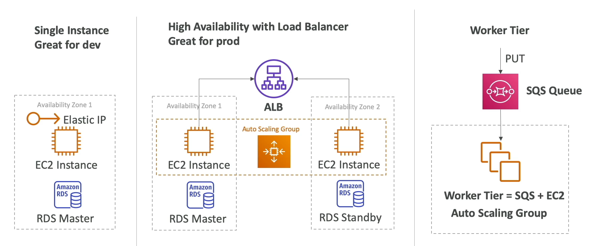

# Deployment and Instance Management
This section is all around how to deploy and manage code, applications, and machines

# Elastic Beanstalk
- Elastic Beanstalk is a developer centric view of deploying an application on AWS
- Helpful for porting on-prem to cloud with minimal changes
    - If you can dockerize your container, you can deploy on Beanstalk
    - Beanstalk meant to "replatform" apps
    - Supports many platforms: Go, **Java w/ Tomcat**, Python, Node.js, anything Dockerized really, etc...
- It's basically just a wrapper around a number of other services, and it's all displayed in one view
- Beanstalk is free, but you pay for underlying infra
- Management:
    - Instance config, OS, and general deployment compute hadled by beanstalk
    - App code is responsibility of developer
    - Three architecture mdoels:
        - Single instance deployment is good for dev
        - LB + ASG good for prod / pre-prod web apps
        - ASG good for non web-apps (workers, backend services, etc)
        - 
- Web Server vs Worker:
    - Any decoupling ==== SQS!!!
    - App performs long running tasks to complete, then offloadnig them to dedicated workers is typically used
        - 
        - Decoupled beanstalk can help us manage web app and worker environment
    - Blue / Green Deployment
        - Can use a new environment (green) and validate independently
        - Use Route53 weighted routing to redirect small amounts of tradffic to Green, and shift over time
        - Beanstalk "Swap URLS" DNS Swap feature

# Code Deploy
- Helps us to Deploy code!
- Deploy new versions of code to EC2, Docker containers on ECS, etc...
- Ansible, Terraform, Chef, Puppet, etc... are useful, but can use AWS CodeDeploy out of the box with EC2, ECS, ASG, and Lambda
    - Does in-place update of fleet of EC2 instances
    - Can use hook to verify the deployment after each deployment phase
- CodeDeploy fulls manages take down, in place updaets, and having V2 rolled out on EC2's
- EC2 Update types:
    - In-place updates:
        - Updates current EC2 instances
        - Instances newly created by ASG will automatically get automated deployment
    - Blue/Green deployment
        - New ASG is created for V2, and new launch templates are used 
        - CHoose how long we keep old instances
        - Start routing traffic to V2
        - Requires ELB
        - CodeDeploy will slowly remove old instances and keep new ones
- CodeDeploy to Lambda
    - Traffic shifting feature
    - Pre and Post traffic hooks to validate deployments
        - These are just more lambda functions to run before and after deploying new code
    - Easy and automated rollback using CWatch Alarms
        - CodeDeploy can rollback if CWatch alarms go over threshold
    - SAM framework natively uses CodeDeploy
- CodeDepoy to ECS
    - Support B/G deployment on ECS and Fargate
    - Setup is done on ECS Service definition, not on CodeDeploy UI
    - New task set is created and traffic gets rerouted to new task set
        - If everything is good for X minutes the old task set is terminated
        - Supports Canary deployment `10Percent5Minutes`
        - CodeDeploy just ensures that ECS Task definitions get shifted over time, and then ensures stability

# CloudFormation
- Brings IaC into AWS
- Helps to port across accounts and regions
- Backbone of:
    - Beanstalk
    - Service Catalog 
    - SAM (Serverless App Model)
- Retain data on deletes
    - DeletionPolicy 
        - Can use on any resource to control what happens when a template is deleted
        - **Retain**
            - Specifies a resource to preserve upon deletion
        - **Snapshot**
            - EBS, RDS, ElastiCache, Redshift, DBCluster, etc
        - **Delete**
            - Same as above, but for S3 you need to delete everything inside of it first
- **CustomResources**
    - Can define a custom resource to address any challenges from native CF
    - Backed by lambda function to CRUD resources
    - Empty S3, Get AMI, etc!
- **StackSets**
    - CRUD stacks across multiple accounts and regions
    - Basically a module
    - Admin to create stack sets
    - Updating a stack set means updating all instances from there, throughout all accounts and regions
    - Enable ***AutomaticDeployment*** feature to auto deploy to accounts in AWS Orgs or OU's
- Drift
    - What happens if someone manually alters the resources?
    - **CF Drift** compares all resources to state file
    - Can be done on entire stacks, or an individual stack
- **Secrets Manager**
    - Can set and use secretsin CF natively
    - Can help us ensure that whenever a secret rotates, the value sitting in other resources such as RDS ***will automatically update***
- Can handle imports into individual, or entire stacks
    - Need to create a template that describes the entire stack including currently tracked resources, and newly desired imported resources

# AWS Service Catalog
- For users new to AWS who have too many options
- Allows users to access a self-service portal with authorized access
- Bascially allows users to see pre-authorized resources defined by admins, and then helps them to deploy apps using those resources
- Admins use CloudFormation templates to create stacks which are approved stacks!
    - Allows IAM perms to access the stacks
- Users can then launch the products with variable naming abilities
- Stacks assigned to portfolios (teams)
- Teams are presented a serlf-service portal to launch products
- All deployed products are centrally managed
- Helps w/ governance, compliance, and security
- Integrates with 3rd party portals like ServiceNow

# Serverless Application Model (SAM)
- Framework for developing and delpoying serverless apps
- All configs are done via YAML code
    - Lambda, DynamoDB, API GW, Step Functions, etc
- SAM can use CodeDeploy to deploy lambda functions
- Uses CFormation on backend to deploy
- CICD Arch
    - CodePipeline for DevOps CICD
        - CodeCommit for git style version control
        - CodeBuild for build, test, package
    - CloudFormation + SAM for sending to CodeDeploy
        - CodeDeploy helps to shift traffic on lambdas
- Just need to remember SAM uses CodeDEploy on backend for lambdas

# AWS CDK
- Cloud Development Kit
- Define clodu infra using familiar language (Python, JS, Java, etc..)
- When you don't want to use CF directly with YAML
    - After writing CDK it will compile into CFormation YAML
- Allows for for loops, file access, and other things that YAML can't handle

# AWS SSM
- Helps to manage cloud and on-prem VM's
- Need to install SSM agent, or use AMI with it pre-installed
    - Installed by default on AWS Linux AMI + some Ubuntu AMI
    - Works for Windows and Linux
- If an instance can't be controlled with Systems Manager, it's probably an issue with the agent
- What can SSM do?
    - ***Allows us to run commands over One:Many instances***
    - Allows for scripting and updating of hundreds of instances across cloud and on-prem
    - Integrated with IAM and CloudTrail
    - No need for SSH!
    - Rate Control (how fast to run over instances) + Error control (what to do on failure)
    - SSM agent ensures all of this can be done on the machine from calling party
- Common use cases:
    - Send command before an ASG instance is terminated
        - Can allow some lifecycle hook to run before an EC2 instance is terminated / deleted
        - When EC2 goes into `Terminating:Wait` state, it will notify EventBridge which can call SSM Automation on the EC2 instance itself to run some final commands before shutting down
            - `SendCommand` is sending a command to the EC2 instance
        - At this point our Lifecycle Hook can shut the instance down
- Patch Managers
    - Helps
    - Define a ***Patch Baseline*** to use (or multiple if needed)
    - Define ***Patch Groups***:
        - Can define based on:
            - Tags
            - Name
            - Region
            - etc
    - Define ***Maintenance Window*** for schedule duration, registered groups, and registered tasks
    - Run `AWS-RunPatchBaseline` Run Command which runs on Windows and Linux
        - Rate Control: How many instances to run at a time - concurrency and parallelism
        - Error Control: What to do on errors
    - Monitor ***Patch Compliance*** using SSM Inventory
- Session Manager
    - Allows for secure shell to EC2 and on-prem without opening port 22 and using SSH keys
    - Can just use UI based shell where Systems Manager is taking care of connecting and authentication
    - All commands logged and can be sent to S3 or CloudWatch 
    - Can use CloudTrail to see `StartSession` events
- OpsCenter
    - Resolve Operational Issues (OpsItems) related to AWS resources
        - Issues, Items, and Alerts
    - Aggregates information to resolve issues on each OpsItem such as:
        - AWS Config changes and relationships
        - CloudTrail Log
        - CloudWatch Metrics
        - CloudFormation Stack info
    - Across all these groups we can use Automation Runbooks via SSM Runbook Automations to resolve the incidents
    - EventBridge and CloudWatch Alarms can create OpsItem events
    
# AWS Cloud Map
- Fully managed resource discovery service
- Helps with service discovery / DNS routing + redeployment
- Moving from V1 to V2 of a backend service from a frontend service
- Creates a map of your backend services / resources that app depends on
- You register your application components, their locations, attributes, and health to AWS CloudMap
- Acts as a ZooKeeper-esque service discovery mechanism and helper
- Integrations with Health Checking to stop sending traffic to unhealthy endpoints