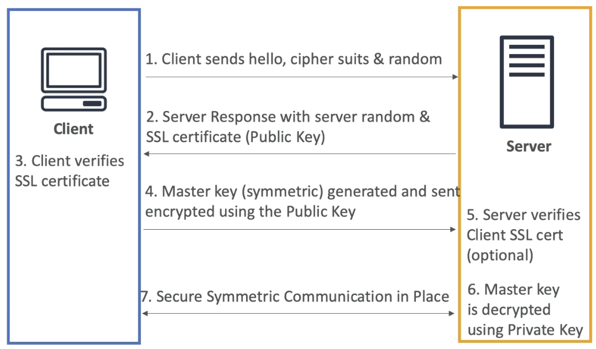
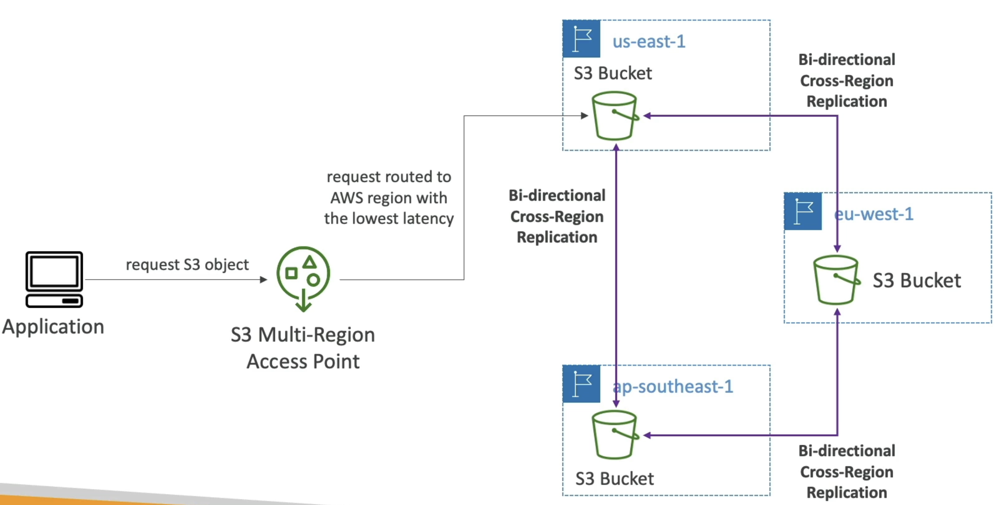

# Security

# CloudTrail
Allow us to log SDK, CLI, or Console calls / actions from IAM Users or IAM Roles

## Event Types
- ***Management***: Operations performed on resources in AWS accounts
    - Logged by default
    - Anything that alters resources in the account
        - Attaching IAM policy, setting up logging, setting up data routing rules, etc...
    - ***Read Events*** don't modify resources
    - ***Write Events*** *may* modify resources
        - Much more important, more destructure
- ***Data***: Data events like S3 object level activity - Put, Delete, Get, etc...
    - Not logged by default
    - Can separate Read and Write Events like above too
    - S3, Lambda API Invoke, etc...
- ***Insights***: Helps us to find anomalies in our account
    - Paid for resource
    - Things like:
        - Inaccurate resource provisioning
        - Burst of IAM policies
    - Only categorizes / analyzes Write Events
    - These events also appear in Cloudtrail - usually a best practice to route these event types to Event Bridge or SNS to notify via email or something more than just logging

## Common Architectures
- ***S3 + Athena***: We can send them to AWS S3 or Cloudwatch Logs for further processing
    - Logs stored for 90 days in CloudTrail
    - Log to S3 for long term retention
        - Some use Athena to query over S3
- ***EventBridge***: Since all API's go through CloudTrail, we can filter and route specific ones to EventBridge
    - CloudTrail filter send to EventBridge
    - Event Bridge to
        - Lambda for processing
        - SNS for sending email
        - Another account for further processing
    - Common checks for SNS
        - User assuming role
        - User changing security group ingress rule
        - etc...

### Delivery to S3
- Can write CloudTrail directly to S3 using native integrations without anything in the middle
    - SSE-S3 or SS3-KMS for in route encryption
    - From there lifecycle policy can move these into glacier tier
- New files in S3 can then trigger S3 Events which send `Drop File` or `File Trigger` notification that can be picked up by Lambda / SNS / SQS
    - Cloud Trail ***could go straight to SNS / SQS / Lambda***, but it wouldn't be long term durable sitting in S3
    - Why S3?
        - Enable versioning
        - Enable MFA deletion
        - Enable S3 Lifecycle policy for archiving
        - S3 objcet lock to stop deletion
        - SSE KMS encryption
        - SHA-256 Hashing for integrity validation!
        - Blah blah blah, that's why we can use S3 and not straight to Lambda / SQS
- Can have a "Central Security Account" that has these central S3's, and then each LOB Member account can send CloudTrail logs there
    - Useful for central cyber / tech groups, and then 
        - Need cross-account S3 bucket policy
    - Can create cross-account IAM role in central account so Member accounts can assume this role to read

### Cloudwatch Logs to Notification System
- We can stream CloudTrail directly to Cloudwatch Logs
- From here we can use Metric Filters, which has structured window filtering languages to create new filters
    - If a metric threshold is passed, we can setoff a Cloudwatch Alarm and send the message to SNS
    - This essentially allows us to create a Notification and Alerting system on AWS
- From SNS we could also pipe alarms to Opsgenie, Pagerduty, etc...

### Organizational Trail
- Management account can create a CloudTrail Trail over all Member accounts!
- Any CloudTrail logs pipe back to Management account
    - Then these can go to S3 in Management account, and the write directories are prefixed by the Member Account ID

### Reactivity / SLA
- Cloudwatch, in worst case, takes 15 minutes to deliver an event
- EventBridge can be triggered for any API call
- Cloudwatch logs get events streamed to it from CloudTrail, and metric filter is a streaming tumbling window
- Events are delivered to S3 every 5 minutes, but with this we get durability, integrity, and many other features for ensuring data protection

# KMS
AWS Key Management Service (KMS) is a way to use keys, certificates, and ***encryption in general*** across services and resources

- Policies:
    - All keys in KMS are governed by ***Key Policies*** which define who can use the key (authentication) and for what purposes (authorization)
- Symmetric: Use same key to encrypt and unencrypt data
    - Can't download key
    - Must call KMS API to use, you can't get the key unencrypted
- Asymmetric: Public (encrypt) and private (decrypt)
    - Can download public key, and usually you'd do so to send out to other users who can't access AWS
        - Internal users who can call KMS would just call the API to encrypt data with a specific key!
    - Usually used by users / apps outside of AWS that can't call AWS KMS API to encrypt data, so they'd download public key and encrypt data to send back to AWS account and then we can decrypt
- Types:
    - ***Customer Managed Keys***: Keys you directly create and use via KMS API
        - Can do rotation, key policy, and CloudTrail auditing
    - ***AWS Managed Keys***: Used by AWS services like S3, EBS, Redshift, etc whenever we say we want things encrypted at rest or in transit
        - Managed by AWS fully
        - Keys rotated once a year
        - Key Policy is viewable, and audit trail in CloudTrail
    - ***AWS Owned Keys***: Created and managed by AWS
        - Used by some AWS services for encryption
        - Used in multiple AWS accounts, but not specifically our AWS accounts
            - Used by AWS internally
            - Maybe for serverless?
        - What?
- Key Source
    - AWS KMS hosted, where KMS takes care of everything
    - ***Exteral***: Where we create keys and use sources outside of KMS, and we import it into KMS
    - ***CloudHSM***: Run CloudHSM and cryptographic operations directly on clusters in your own VPC. When someone calls KMS, it uses your high availability clusters (across regions / AZ's) to do cryptographic calculations
- KMS is multi-region, but it just copies the keys over physically
    - AKA KMS Multi-Region Keys
    - One primary, multiple followers
        - Each key can be managed independently
    - Allows us to encrypt + decrypt over different regions

# SSM Parameter Store
- Secure storage for configurations and secrets
    - Security via IAM
    - Encryption via KMS
    - Notifications with EventBridge + SNS
    - IaC with CloudFormation
- Store parameters with a hierarchy
    - Most parameters are private to us
    - AWS has some parameters they store publicly for everyone, like latest IAM versions
    - Advanced parameters:
        - Can assign TTL expiration to parameters
        - `ExpirationNotification` and other notifications can go via EventBridge
        - Can assign multiple policies at a time

# Secrets Manager
- Store secrets! Like passwords, API Keys, etc...
- Can force rotation of secrets every X days
    - Automatic generation of secrets on rotation, it uses a lambda function with cron job to run new insert / update
    - Native support with almost everything - RDS, ECS, Fargate, EKS, etc...
        - ECS task can pull secrets at boot time, create environment variables, and then use it to access RDS securely

## Sharing 
- Sharing secrets across accounts:
    - Would encrypt the secret with a KMS Key
    - Create a resource policy on the KMS Key that specifies the secondary account can Decrypt, and you can even specify `kms:viaService` which means the secondary account can only use the KMS key if it's using it to decrypt in a secrets manager call
    - Then give the secret in secrets manager a resource policy to let the secondary account `secretsManager:GetSecretValue`

## Secrets Store vs SSM Parameter Store
- Secrets manager is more expensive
    - Automatic rotation
        - This means every 30 days Secrets Manager spins up a lambda, changes password on RDS, and updates value in Secrets Manager
    - KMS encryption is mandatory
    - Lambda provided for AWS Services like RDS and Redshift  
- SSM Parameter Store is cheaper
    - Simpler API
    - No secret rotation, but can use lambda triggered by EventBridge
        - Every 30 days EventBridge would need to wake up, change RDS password, and update value in SSM Param Store and ensure encryption and IAM done
    - KMS optional
    - Can pull Secrets Manager secret using SSM Parameter Store API
- Secrets Manager is basically just SSM Parameter store with extra integrations and best practices established

# RDS Security
- RDS has multiple layers of security, encryption, and auth
- KMS encryption at rest for underlying EBS volumes / snapshots
    - Basically means for the actual block storage for a live RDS, or for snapshot data, we can encrypt it at rest via KMS
- Transparent Data Encryption (TDE) for Oracle and SQL Server
    - Apparently important to remember that TDE can only be done for managed database providers (Oracle, Microsoft)
- IAM Authentication for MySQL, MariaDB, and Postgres (basically the ope source ones). Therefore, we can do user authentication for the open source databases
- SSL encryption to RDS is possible for all databases
- All ***Authorization*** still happens in RDS no matter what - Authentication has many avenues, but Authorization is all apart of Database users and groups
- Can copy unencrypted RDS snapshot to an encrypted one
- CloudTrail cannot be used to track RDS queries
    - You'll need a different observability solution for database query logging

# SSL/TLS and MITM
- Secure Socket Layer (SSL) is used to encrypt connections
    - Client to Server
    - One or Two Way
- Transport Layer Security (TLS) is a newer version of SSL
- Basically all certs are TLS, but a lot of people refer to it as SSL
- Public SSL/TSL certs are provider by Certificate Authorities (CA)
    - SSL certs have an expiration date (you set) 
- Types:
    - ***Asymmetric*** Encryption is expensive (lots of CPU time to compute it)
    - ***Symmetric*** Encryption is cheaper, and only uses one key
        - Symmetric encryption uses the same key to encrypt and decrypt
    - So:
        - Asymmetric handshake is used to exchange a per-client Symmetric random key, and then Client and Server use Symmetric key to talk in the future
        - This means that the asymmetric handshake is used strictly to create a shared session key, which can be used as a symmetric key to encrypt and decrypt information from the client to the server and vice versa
- The ***master key (or session key)*** in the SSL/TLS flow is a symmetric encryption key that is shared between the client and the server after the handshake process. It is used to encrypt and decrypt all subsequent communication between the client and server during the session.



## SSL/TLS Flow

- Everything from 1-3 is public plaintext, and everything afterwards, from 4+, is encrypted

1. **Client Hello**:
    - The client sends a "hello" message to the server, including:
        - Supported cipher suites (encryption algorithms)
        - A randomly generated value (**client random**)

2. **Server Hello**:
    - The server responds with:
        - Its own randomly generated value (**server random**)
        - Its SSL/TLS certificate, which contains the server's **public key**

3. **Certificate Verification**:
    - The client verifies the server's SSL/TLS certificate using a trusted Certificate Authority (CA) or other means
    - If the certificate is valid, the handshake continues

4. **Master Key Generation**:
    - The client generates a **pre-master key** (or directly a master key, depending on the protocol version)
    - The pre-master key is encrypted using the server's **public key** (from the SSL certificate) it sent in 2.2
    - The encrypted pre-master key is sent to the server 
        - No one snooping could decrypt what this pre-master key is at this point, only the server can

5. **Master Key Decryption**:
    - The server uses its **private key** to decrypt the pre-master key
    - Both the client and server then derive the **master key** from the pre-master key, the client random, and the server random
        - Server and Client Random could hypothetically be known by a MITM, but the pre-master key would be unreadable

6. **Session Encryption**:
    - The master key is used to derive symmetric encryption keys for encrypting and decrypting all subsequent communication
    - Both the client and server switch to symmetric encryption for the rest of the session

7. **Optional Client Authentication**:
    - If mutual authentication is required, the server may request the client's SSL/TLS certificate for verification

8. **Secure Communication**:
    - The client and server use the symmetric encryption keys (derived from the master key) to securely exchange data

---

### **Key Points About the Master Key**
- The master key is **never transmitted in plaintext**.
- It is derived from the **pre-master key**, **client random**, and **server random**.
- It ensures that all communication after the handshake is encrypted and secure.

---

### **Updated SSL Flow Diagram**
```plaintext
Client Hello (Client Random)  --->  Server Hello (Server Random + SSL Certificate)
       <---  Server Certificate Verification
Client generates Pre-Master Key
Client encrypts Pre-Master Key with Server Public Key
       --->  Encrypted Pre-Master Key sent to Server
Server decrypts Pre-Master Key with Private Key
Both derive Master Key (from Pre-Master Key + Randoms)
Secure communication begins using Symmetric Encryption
```

## SSL on Load Balancers
- SSL Server Name Indication (SSL SNI) solves the problem of hosting multiple SSL Certificates for multiple websites on one computer
    - One single VM can host websites 1-5, and each can have it's own SSL Certificate registered with the CA
    - Without SNI, servers wouldn't know which certificate to present during SSL handshake
- Then, when a client goes to connect to one of the 5 websites, it can specify that hostname and the web server will use the corresponding SSL Certificate in the asymmetric handshake
- This is how both ALB, NLB, and Cloudfront are able to do SSL certification and offloading for multiple backend services
    - ***SSL Offloading*** is the idea that ALB, NLB, or CloudFront can do SSL handshake, encryption, and decryption, and that logic can be removed from the application itself
    - Each LB / Cloudfront will host a certificate for each of the backend services, and will use that for SSL verification and encryption / decryption
    - The SSL Certificates are usually tied to target groups, where the target groups are related to hostname URL's
    - This ***does not work for Classic Load Balancers***, and for those we'd need to host a load balancer per domain, and have the singular SSL certificate on each load balancer

### Preventing MITM Attacks
- Don't use HTTP, use HTTPS
    - This will ensure traffic is encrypted, and any "server" you're talking to has been validated with a CA
    - Since data is encrypted with HTTPS, attacker can't read or modify data
- Use a DNS with DNSSEC compliance
    - Domain Name System Security Extensions (DNSSEC) adds more layers of security to DNS by ensuring the responses are authentic
    - There's a second attack vector, even with HTTPS, where a DNS entry is forged / fake and we still use SSL to try to reach `goodwebsite.com` and DNS ends up routing us to the incorrect bad one and it's still valid with the CA
        - This is known as ***DNS Spoofing***
    - Can bypass this by using a DNS Resolver thats DNSSEC compliant, and Amazon Route 53 is DNSSEC compliant, and even has KMS out of the box encryption for DNS queries

### SSL on Load Balancer Architecture
- Using ALB:
    - Setup ALB with SSL Cert(s) and for any incoming HTTPS request the ALB can do SSL handshake and then ALB sends HTTP data to auto-scaled target group of ECS tasks
- Maybe we want to use SSL directly onto an EC2 instance
    - TCP to NLB, and route requests to EC2 instance level
    - HTTPS from NLB to EC2
        - Can setup user scripts on EC2 so that at boot time it retrieves SSL Certs from SSM Parameter Store, where Certs are protected by IAM permissions
    - This is risky
        - Storing certs on EC2's, those EC2s exposed to internet, IAM roels for getting plaintext SSL certs, etc...
    - We can have the exact same architecture, except we replace SSM Parameter store with CloudHSM, and we use CloudHSM to do SSL offloading
        - SSL PK never leavs HSM device
        - CPU on EC2 doesn't get used to do decryption
        - Must setup a Cryptographic User (CU) on the CloudHSM device

# AWS Certificate Manager ACM
- AWS ACM can host your publicly created certifiacte, and it can help provision and renew public SSL certificates for you free of cost
- ACM loads SSL Certificates on the following integrations:
    - Load Balancers (including ones from ElasticBeanstalk)
    - CloudFront Distributions
    - APIs on API GW
- Uploading your own public certifiactes
    - Must verify public DNS
    - Must be issued by a trusted public CA
- Creating private certificates
    - For internal applications
    - You must create your own private CA
    - Your applications must trust your private CA
- Certificate Renewal
    - Automatically done if provisioned by ACM
    - Any manually upload cert must be renewed manually
- ACM is ***regional***
    - Therefore each region needs its own SSL Cert, and you can't copy SSL Certs across regions

# CloudHSM
- KMS gives us software
- HSM is when AWS provisions the hardware only
    - Hardware Security Module (HSM)
    - User manages the encryption keys entirely
    - HSM device is tamper resistant
    - Symmetric and Asymmetric encryption
    - Common pattern and good option for using SSE-C encryption on S3
- IAM permissions on HSM Cluster for CRUD operations
    - *Everything else for authorization is on the CloudHSM cluster*
    - It's similar to open source RDS securirty - IAM does authentication, cluster for authorization
- CloudHSM Cluster should be deployed for highly available, durable deployment across multiple AZ's
- Comparison
    - HSM is single tenant, KMS is multi-tenant
    - Both compliant
    - Both do symmetric and asymmetric 
        - HSM does Hashing and KMS doesn't
    - KMS does key replication across regions, HMS can do VPC peering across regional VPCs for cross region clusters / access
    - HSM is what allows TDE in Oracle and SQL Server

# S3
- `SSE-S3` encrypts S3 objects using keys managed entirely by AWS
- `SSE-KMS` encrypts S3 objects using keys stored in KMS, whether they're managed by us
    - Why is this useful?
        - KMS has CloudTrail logs
        - If for some reason the S3 bucket was made public, then GET requests would fail unless the user had KMS authorization as well
        - `s3:putObject` also would require `KMS` authorizations as well for the role the user assumes
- `SSE-C` encrypts S3 objects with our own keys, and encryption is done server-side
- Client side is when we encrypt and decrypt data client side
- Any data in Glacier is AES-256 encrypted with keys under AWS control

## Encryption in Transit
- AWS S3 exposes:
    - HTTP endpoint which is not encrypted data
    - HTTPS endpoint which has encryption in flight
        - HTTPS is mandatory for `SSE-C`
        - To enforce, use a Bucket Policy to force `aws:secureTransport`

## S3 Events
- S3 access logs:
    - Detailed records for requests into a bucket
    - May take an hour to deliver
    - May be incomplete - best effort
- S3 Events Notifications
    - Receives notifications for specific S3 events
    - Typically delivered in seconds, but could take minutes for intense tasks that include versioning or checksums
    - Destinations for this can be SNS, SQS, Lambda, etc...
- Trusted Advidor
    - Check bucket permissions for public exposure
- AWS Event Bridge
    - Need to enable CloudTrail object logging onto S3 first
    - Target can then be Lambda, SQS, SNS, etc...

## S3 Security
- User based:
    - IAM policies
    - IAM defines which API calls should be allowed for a specific user from an IAM console
- Resource based:
    - Bucket policies are bucket wide rules
        - Use for:
            - Grant public access to bucket
            - Force objects to be encrypted at upload
            - Grant access to another Cross-Account
        - Optional conditions:
            - `SourceIp` or `VpcSourceIp` can give IP or CIDR, or VPC ID of where a request can come from and be authorized
                - SourceIP doesn't work with private IP's
                - PrivateIP's don't change over starts and stops, but Public IP's most likely will
            - `SourceVPC` or `SourceVPCEndpoint`
            - `CloudFront Origin Identity` can explain which CloudFront CDN's can access
            - MFA
    - Object Access Control List (Object ACL) is fine grained control over objects
    - Bucket Access Control List (Bucket ACL) is bucket wide access lists
- Pre signed URLs
    - Sign URL with IAM credentials
        - TTL is usually 1 hour
        - Users inherit permissions of whoever signed it
- VPC Endpoint Gateway for S3
    - When a VPC has an Interet Gateway, and we use the public internet to access a public S3 endpoint
        - For this you'd put a bucket policy on for `AWS:SourceIp` and you'd use the IGW IP
    - Instead of a public subet, we can use VPC Endpoint Gateway
        - This allows our subnet to stay private
        - All traffic remains on AWS network, and stays private
        - Then we can directly go to S3 Endpoint
        - Can have bucket policies on `AWS:SourceVPCE` for VPC Endpoint, or `AWS:SourceVPC` for all resources under that VPC
- S3 Object Locks
    - S3 Object Lock is Write Once Read Many (WORM)
    - Can do same thing for Glacier Vault Lock (i.e. have WORM) and then we lock the policy for future edits
- S3 Access Points
    - If we have tons of directories and objects in one S3 bucket, we can create crazy policies, or we can use Access Poiints
    - Access Points grant Read/Write access to different directories across buckets
        - Pushes policy from S3, to another resource, i.e. Access Points
        - These Access Points are granted to different User Groups
        - Each Access Point has it's own DNS name
    - VPC Origin
        - Can be private, so that no traffic goes over internet
            - Need to create VPC Endpoint from requesting VPC to the Access Point
            - Need to create Endpoint Policy, Access Point Policy, and S3 bucket Policy for this to work
    - Multi Region Access Points
        - Dyanmically routes requests to nearest S3 bucket to the region the user is in
        - *Syncs / duplicates data between regions for you*
        - If closest region fails, requests failover to next closest region or our passive choice


- S3 Object Lambda
    - Allows us to change an S3 Object before it's retrieved by a calling application
        - Might be used to mask/redact some data as an object is called
        - Only runs once the object is retrieved
    - Arch:
        - You create an Access Point on top of S3
        - Lambda that can read frmo Access Point
        - S3 Object Lambda Access Point on top of the Lambda
        - Calling applications call that Lambda Access Point
        - ***Can also do this on top of databases too***
    - These basiaclly allow you to redact and alter data on the fly during read from S3 or Database
        - Redact, Mask, Create Watermark, Transform XML, etc...

# Other Random Services
## DDOS Attacks
    - Distributed Denial of Service (DDOS) are Network Based Attacks attacks on EC2 instances and web servers can take down web servers
        - When a service is unavailable b/c of a flood of requests 
        - SYN Flood (Layer 4): Too many TCP connection requests
        - UDP Reflection (Layer 4): Get other servers to send big UDP requests
        - DNS flood attack: Overwhelm DNS so legitimate users can't get IP / DNS Records
        - Slow Loris: Many HTTP conections are opened and maintained
    - Application Attacks:
        - All depend on app configs, caches, etc...
### AWS Shield
- Shield is for DDoS! WAF is for other firewall and Xss stuff
- Standard Shield protects against DDoS attacks for web apps at no additional costs
    - Covers SYN/UDP Floods, Reflections, and other L3/L4 attacks
- Advanced is premium 24/7 DDoS protection
    - Protects EC2, ELB, Cloudfront, Route53 and others
    - Also acts as insurance for incurred costs from DDoS attacks on services that run up auto-scaling costs
    - And there's 24/7 AWS Support
- CloudFront and Route53: Protect CDN Cloudfront and Route53 DNS
    - Separating static resources and placing them on Cloudfront / S3 is always a good practice
- AWS WAF: Web Application Firewall can filter specific requests based on rules
## AWS Web App Firewall (WAF)
    - Protects web apps from common web exploits on Layer 7
    - Deploy on:
        - ALB
        - API GW
        - CloudFront (globally edge)
        - AppSync (GraphQL API's)
    - ***WAF IS NOT FOR DDOS***
    - Define Web Access Control Lists (WebACL)
        - Rules can include IP addresses, HTTP Headers, HTTP body, URI's, etc...
        - Help protect from XSS, SQL Injection, and other common L7 app exploits
        - Size constraints
        - Geo Matching
        - Rate based rules and rate limiting
    - Rule Actions:
        - Count, Allow, Block, CAPTCHA, Challenge
            - Could Count before Blocking
    - Managed Rules:
        - Baseline rule groups protect from common threats / patterns
        - Use case specific give protection for specific applications like SQL, Windows, etc...
        - IP Reputation rule groups give us the AWS reputable IP's (spam or scammers)
        - Bot control managed group can help to reject bots
    - WAF Logging
        - CloudWatch Logs
            - Small SLA's
        - S3 Bucket
            - Every 5 minutes
        - Kinesis Firehose
            - Only limited by Kinesis SLA's
    - Architecture with CloudFront
        - Can setup WebACL's in front of CloudFront
        - On CloudFront we can create a custom HTTP Header
            -`X-Origin-Verify:xxxxxx` where `xxxx` is a secret string
        - ALB behind CloudFront in front of EC2 Web Apps
        - WAF Firewall on our ALB for headers to filter down to only those headers from CLoudFront with the secret string
            - Stops anyone from directly accessing the ALB URL
        - Lambda function from Secrets Manager can replcae the secret on CloudFront and the ALB header filter every X days
## AWS Firewall Manager
    - Manage all Firewall rules in all accounts in AWS Organization
    - Set a security policy which is a common set of security rules
        - WAF Rules
        - AWS Shield Advanced
        - Security groups for EC2, ALB, etc...
        - AWS Network Firewall on VPC Level
        - AWS Route53 Resolver DNS Firewall
        - Policies created at regional level
        - Rules are automatically applied to new resources as they're created
    - We'd define all of our rules in WAF, Shield, etc... and then we can use AWS Firewall Manager with AWS WAF to automtate these rules over all new resources
- Example: Blocking an IP address
    - First line of defense is Network ACL on our VPC Subnet
    - Security group on EC2 could also deny it
    - EC2 instance could run firewall software
    - Could have an N/ALB in a public subnet, and EC2 in a private subnet
        - EC2 SG can restrict it's security group to only that N/ALB
        - Then we can manage security at N/ALB level
            - Can use Network ACL here still at public subet level
        - ALB's, and ALB only, can do IP address filtering via WAF before sending to EC2
    - We could also have CloudFront before Network ACL
        - Can have AWS WAF at CloudFront level, and it won't matter if we have a Network ACL or not since WAF takes care of it
        - Could do IP restriction, GeoFiltering restriction, etc...
## Amazon Inspector allows us to run automated security assessments
    - EC2
        - Using AWS Systems Manager (AWS SSM) agent, we can analyze network and OS level vulnerabilities
        - Only for *running* EC2 instances
    - ECR Container Images
        - Assessment of container images as they're pushed
    - Lambda Functions
        - Identifies software vulnerabiltieis in function code and package dependencies
    - Can report and integrate into AWS Security Hub
    - Can also send finding to EventBridge
    - Checks against database of vulnerabilities (CVE)
        - Each time it's updated, Inspector will rerun and check OS and netowrk vulnerabilities
## AWS Config
    - Helps for auditing and compliance of resources, and how they change over time
    - Config doesn't prevent actions from happening, but it records configurations and changes over time
    - Can help us showcase audits and to send alerts (SNS) notifications for any changes
        - SSH access in security groups
        - S3 public access
        - ALB configuration changes over time
        - ...
    - It creates a dashboard to have red or green on resources over time
        - CloudTrail can show us who made the changes
    - Can create ouw own config rules
        - Need to use a lambda function to create the custom config rules
        - Rules can be evaluated / triggered
            - Triggered off config change via EventBridge
            - Evaluated at regular cron time intervals as well
        - Can triggooer an Event to EventBridge if the rule isn't compliant
            - Destination can be SNS
        - Rules can have automations via SSM Automations
            - If a resource isn't compliant, we can trigger auto-remediation
## AWS Managed Logs
    - Logs that can be produced by AWS Services
    - Load Balancer Access Logs can go 
        - To S3
        - Access and IP logs for Load Balancers
    - CloudTrail Logs can go 
        - To S3 and CloudWatch Logs
        - Logs for API calls made within the account
    - VPC Flow Logs 
        - To S3, Cloudwatch, and Kinesis
        - IP traffic in and out of network interfaces on VPC
    - Route53 
        - To CloudWatch Logs
        - Queries that Route53 receives
    - S3 Logs 
        - To S3
        - Server accesss provides detailed records foor requests made to the bucket
    - CloudFront Access 
        - To S3
        - Info about every user request that CloudFront receives
    - AWS Config 
        - To S3
## Amazon Guard Duty
    - ML for intelligent threat discovery
    - Goes through all logs from above to find anomalies 
        - VPC, CloudTrail, and DNS are required
        - S3, Lambda, EKS, EBS, etc... are optional 
    - If there's a finding, it goes to EventBridge
        - Can go to Lambda or SNS
    - An AWS Organization member account can be a Delegated Administrator for all other member accounts under an organization
        - The Org Mgmt account needs to delegate the specific member account
## IAM Conditions
    - AWS allows conditional logic in IAM policies
    - `aws:SourceIP` would mean we can condition that an IP address is or is not in / apart of a certain CIDR range
        - Can have `Effect: Deny` for `Action:*` on `Resource: *` based on Conditions
    - `aws:RequestedRegion` allows us to allow or deny access to services in other specified regions
    - `ec2:ResourceTag` could allow us to start instances only if they have a specific tag
    - `aws:MultiFactorAuthPresent` allows us to require MFA to do specific actions
    - Can do this on IAM Roles, Resource Policies like S3
    - Resource policies
        - `aws:PrincipalOrgID` can help us to ensure S3 actions aren't able ot be done unless the Principal Org ID is from our Org account, bascially allows any member account to perform the actions
- Connecting to EC2 via SSH
    - When we allow SSH on an EC2, what happens is that when a User tries to connect it will hit a EC2 Instance Connect API
        - This API will 
            - Upload a private key to the EC2
            - Respond to user with a public key
            - Allow us to connect for 60 seconds before disabling
        - Security group rules deny or allow access to EC2 Instance Connect API
## AWS Security Hub
    - Yet Another Dashboard for security and compliance
    - Allows us to do this over multiple accounts
    - Then aggregates info from basically every single other service we listed above
    - Issues and Findings to EventBridge
    - *AWS Detective* can help us figure out RCA / cause of these findings