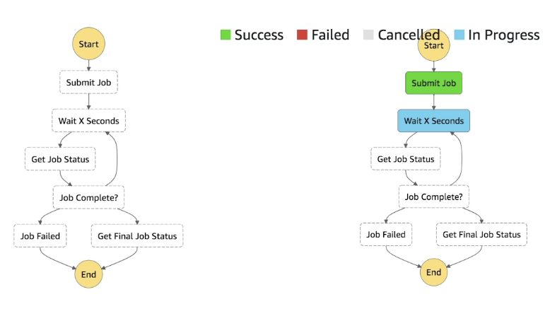
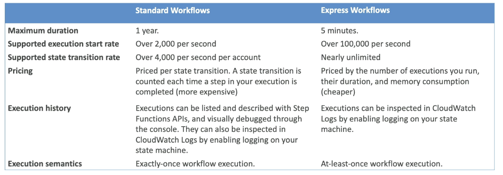
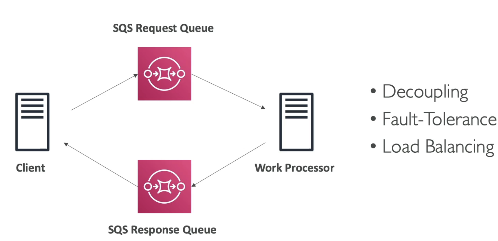
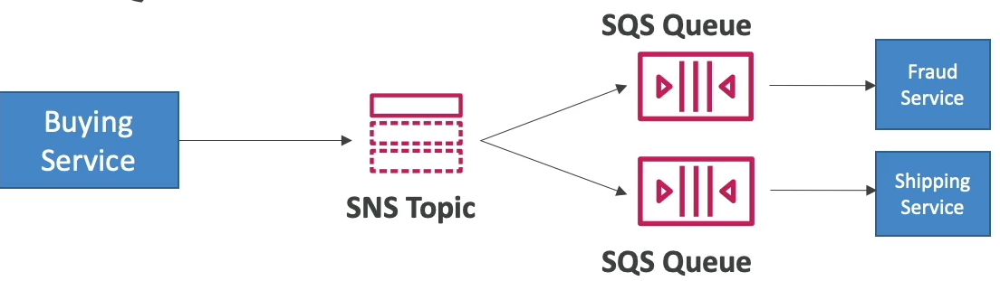
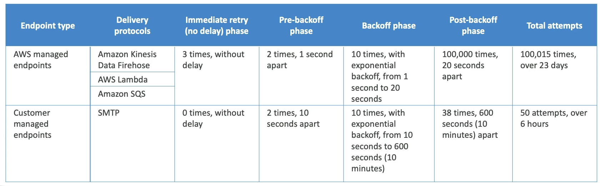

# Service Communications
How different services can communicate with each other

# AWS Step Functions
To be honest idk why these are included in here

- Build serverless visual workflows to orchestrate your Lambda functions
- Represent flow as JSON state machine
- Features:
    - Sequence, parallel
    - Conditions
    - Timeout, error handling, etc
    - Basically airflow for lambdas, and it runs them for you
    - 
- Max execution time of 1 year
- Possible to implement human approval feature
- If you chain lambda functions using Step Functions, the latency is not visualized so you must take that into account yourself
- Has both sync and async
    - Sync returns to caller after everything finishes
    - Async immediately returns that workflow has started 

## Service Integrations
- Lambda functions
- Run AWS Batch Job
- Run ECS Task and wait for completion
- Insert an item to DynamoDB
- Publish message to SQS, SNS
- Launch EMR, GLUE, or SageMaker jobs
- Launch another Step Function workflow
- 200+ other AWS Services from State Machine
- ***AWS STEP FUNCTIONS DOES NOT inregrate with AWS Mechanical Turk***
    - Use SWF instead

## Invocation
- Management console
- AWS SDK
- AWS CLI
- Lambda
- API GW
- Event Bridge
- CodePipeline (CICD)
- Step Functions can invoke Step Functions

## Tasks
- Lambda Tasks
- Activity Tasks
    - Bit more broad, and you setup an HTTP activity worker
        - HTTP, EC2 instances, mobile, etc
    - Will poll step function service, and get the tasks to run
- Service Tasks
    - Connect to AWS Service in [Service Integrations](#service-integrations)
- Wait Task
    - Wait for some duration or until a specific timestamp

## Standard vs Express
- Standard is more basic executions
    - 1 year duration
    - 2k / second invocation
- Express is much smaller burst durations, with more transitions and smaller turnaround times
    - Must complete in 5 min
    - Can start 100k / second
- 

## Error Handling
- Can enable error handling retries, and add alerting to SF State Machine
- Setup Event Bridge to alert via email if State Machine execution fails
    - SMachine to EventBridge to SNS

# SQS
- Simple Queue Service!
- Serverless managed queue, integrated with IAM
- Extreme scale and no provisioning
- ***Main Purpose is to decouple services to scale them independently***
- Doesn't handle big messages
    - Max size if 256KB
    - Upload files or anything larger to S3 and send keys via SQS
- Messages can be read from anything with HTTP
    - Commonly for EC2, ECS, Lambda, etc
- SQS can be used as a write buffer for DynamoDB
    - Can send high volume of messages into SQS, and API instance reader can bring them in batches, validate, and write into Dynamo
- ***SQS FIFO***
    - Receive messages in the order they were sent
    - 300 messages / second without batching (because of ordering)
    - 3k messages / second with batching
- ***Dead Letter Queue's (DLQ)***
    - You must specify `DeleteMessage` to SQS after you've finished processing a message
        - Once you read a message it becomes invisible to other consumers, but will rejoin queue if you don't delete it
    - Consumer fails to process a message within Visibility Timeout
        - Therefore message goes back into queue
    - Can set a threshold of how many times a message can go back into queue
    - Can set `MaximumReceives` threshold which would place message, for later processing, into DLQ
    - Used for debugging
    - DLQ of FIFO is FIFO, of Standard is Standard
    - Retention policy for DLQ we can set
    - ***Redrive to Source***
        - After manual inspection of messages the Redrive to Source Feature would allow us to update our Consumer and roll it out live, i.e. update ECS definition and redeploy it, and then once it is fixed and able to handle the message we can Redrive the DLQ to Source queue and the consumer would process it as a normal message
        - Basically allows us to push DLQ back to Source after we've debugged it
    - ***Idempotency***
        - Timeouts and failures mean there's always a chance a message is double processed
        - Idempotency at the consumer level ensures that there are fail-safe's against a consumer processing a message already marked as processed by another consumer
        - Example:
            - Inserting into DynamoDB is not idempotent
            - Upsert is idempotent (except for update timestamp)
            - Flow:
                - Consumer1 ECS Task pulls from SQS
                - Is in the middle of processing but doesn't delete message
                - Consumer1 hits some weird 3rd party network lag and is "stuck"
                - Reaches timeout
                - Message placed back into SQS
                - Message picked up by Consumer2
                - Consumer 1 unstuck, and finalized processing
                - Consumer2 also finishes processing
                - Insert into Dynamo would mean 2 rows
                - Upsert would be 1
                    - C1 inserts at 00:00
                    - C2 updates at 00:01
- ***Lambda with SQS***
    - Event source mapping
        - Configuration of the SQS queue to pull from?
        - Will long-poll SQS 
        - Specify batch size (1-10)
    - Recommendation is set queue visibility timeout to 6x the timeout of lambda
    - To use DLQ
        - Setup on SQS queue, not on lambda
            - DLQ lambda is only for async invocations
        - Lambda destination for failures means lambda pushes to another queue on failure, but doesn't help on retries

## Solution Architecture Async
- Client uploads to SQS Request queue
- Work processor pulls from Request queue
- Work processor writes to Response queue
- Client reads from Response queue
- 

# Amazon MQ
- SQS and SNS are cloud native services with proprietary protocols from AWS
- Traditional applications running on-premise may use open protocols like AMQP or MQTT
- *AmazonMQ is a managed message broker service* for
    - RabbitMQ
    - ActiveMQ
- Doesn't scale as "infinitely" as SQS
- Runs on servers
    - Need to run Multi-AZ with failover for HA
- Has queue and topic features in same broker
    - Queue similar to SQS
    - Topic feature similar to SNS
- Compatibilities:
    - IBM MQ, TIBCO EMS, RabbitMQ, Apache ActiveMQ

### Remember!
- Queue (e.g., SQS, RabbitMQ Queue)
    - Pattern: Point-to-point messaging.
    - How it works:
        - Each message is delivered to one consumer.
        - Consumers pull messages from the queue.
        - Once a message is processed and deleted, it’s gone from the queue.
    - Use case:
        - Task distribution, work queues, decoupling producers and consumers.
        - Topic (e.g., SNS, RabbitMQ Topic/Exchange)
- Pattern: Publish/Subscribe (pub/sub).
    - How it works:
        - Each message is delivered to all subscribers.
        - Subscribers can be queues, HTTP endpoints, Lambda functions, etc.
        - In some systems, subscribers pull (e.g., Kafka), but in AWS SNS, SNS pushes messages to subscribers.
    - Use case:
        - Broadcasting events, fan-out, notification systems.

# SNS
- What if we want many receivers for 1 message?
    - Many queue's where producer puts to all of them
- SNS is a Pub/Sub solution that allows
    - Producer (Publisher) writes to topic
    - Many Consumers (Subscribers) can read frmo that topic
    - **Note: Some brokers like Kafka are pull based in their topics, SNS is push based and will send messages to each Subscriber
- Each Subscriber will get all of the messages of every Topic is subscribes to
    - Up to 12.5M Subscribers per Topic
    - 100k Topics limit
- Subscribers:
    - SQS
    - Lambda
    - Kinesis Data Firehose
    - Emails
    - SMS + Mobile
    - HTTP Endpoints (in general)
- Publishers:
    - CloudWatch
    - Lambda
    - DynamoDB
    - DMS
    - RDS Events
    - S3 Events
    - CW Alarms
    - ASG Events
    - etc... many event types that can get sent which can be used to notify developers
- Flow:
    - Publish Topic
    - Consumers subscrive via SDK
    - Publishers publish via SDK
    - Direct Publish:
        - For Mobile App SDKs
        - Create platform application
        - Create platform endpoint
        - Publish to platform endpoint
        - Works with Google GCM, Apple APNS, Amazon ADM, etc
            - These would all be Subscribers, and then Mobile apps can receive notifications
- Security
    - Encryption
        - In-flight encryption via HTTPS API
        - At-rest encryption using KMS Keys
        - Client-side encryption if client wants to en/de-crypt themselves
            - I.E if pub and sub both do encrypt / decrypt
    - IAM policies regulate access to SNS API
    - SNS Access Policies (similar to S3 bucket resource policies)
        - Allow us to do cross-account access to SNS topics
        - Useful for allowing other services (S3, etc) to write to SNS topic
        - S3 / SNS / Resource policies allow us to specify another acct or something similar who can do resources, without having to specifically allow them to assume an IAM role

# SNS + SQS Fan Out
- Want a message sent to multiple SQS queue's
- Can have producer write to each one, or
    - Can have producer write to 1 SNS topic
    - Each SQS producer is a subscriber to that SNS topic
- Allows multiple services to read from another service with delayed processing
    - Use Cases:
        - This works well for S3 Events, because for the same combination of Event Type (ObjectCreate) and prefix (images/) we can only have 1 single S3 Event Rule
        - SNS to S3 via Kinesis Data Firehose
            - This one seems like overkill...
    - ***Example:***
        - Shipping Service is fast and means an update to our shipping database for a new order
        - Fraud Service is slow, depends on 3rd party risk provider API calls
        - Buying Service needs to relay a new purchase to both services
        - If we only use SNS and make the 2 services subscribers, the Fraud service may become overwhelmed even though our Shipping Service is fine
        - We can use a queue for each of them, but we don't want to force the Buying service to need to update it's application code every time there's another downstream service / worker
        - Therefore, we can use 
- What this gives us:
    - Push once for producer
    - Fan out to multiple subscribers
    - Subscribers can work at their own pace
    - Data persistence, delayed processing, and retries for each worker
    - Add more SQS Subscribers over time
    - SNS policy can force to only write to SQS queue's for security
    - Cross-Region delivery
        - SNS can write to SQS Queue's in other regions
- SNS can have FIFO topics
    - Ordering via `MessageGroupID`
    - Deduplication via `DeduplicationID` or `ContentBasedDeduplication`
    - Can have SQS Standard or FIFO as subscribers
    - Same limited throughput as SQS FIFO though
    - Helpful for our buying service example above
- SNS Message Filtering
    - JSON policy used to filter messages sent to SNS topics subscriptions
    - If a subscription doesn't have a filter policy, it receives every message

# SNS Message Delivery Retries
- What happens when a message is delivered to SNS subscriber and there's a server side error
    - A delivery policy is applied and retries / backoffs are used
    - Immediate, Pre-Backoff, Post-Backoff
    - Can retry over 23 days, so there's a lot of time to debug
- 
- Only HTTP(S) supports custom policies
    - Don't want SNS to DOS attack your backend though
- SNS Dead Letter Queue
    - Messages that haven't been delivered will get discarded unless we specify a DLQ
    - DLQ are SQS queue's or FIFO queue's
    - DLQ are attached to a ***subscription, not a topic***

# Questions:
- Question: You are looking to process tens of thousands of orders per second and you would like to make sure the orders are going to be processed in the order they were placed for each customer. What technology do you recommend using?
    - Answer: Originally thought SQS FIFO because of this section, but 10k orders per second is too much for SQS FIFO
        - Even at max it is "3k messages / second with batching", so this doesn't work
        - Also at this scale it is probably something with streaming
    - Answer was Kinesis Data Streams where we can order by `customer_id` by partitioning the input by `customer_id`
        - Kinesis Data Streams:
            - ***IS NOT*** a processing engine, you do not write Flink style code on it
            - ***IS*** similar to Kafka where data is streamed in and durably held for consumers to pull on topics based on offsets
        - Kinesis Data Analytics is closer to Flink, and is proper stream processing
            - “I want to run complex logic on my streaming data”
        - Kinesis Data Firehose is a Delivery / ETL pipeline for *basic transformations and sinks*
            - “Pipe this data into S3/Redshift with minor tweaks”