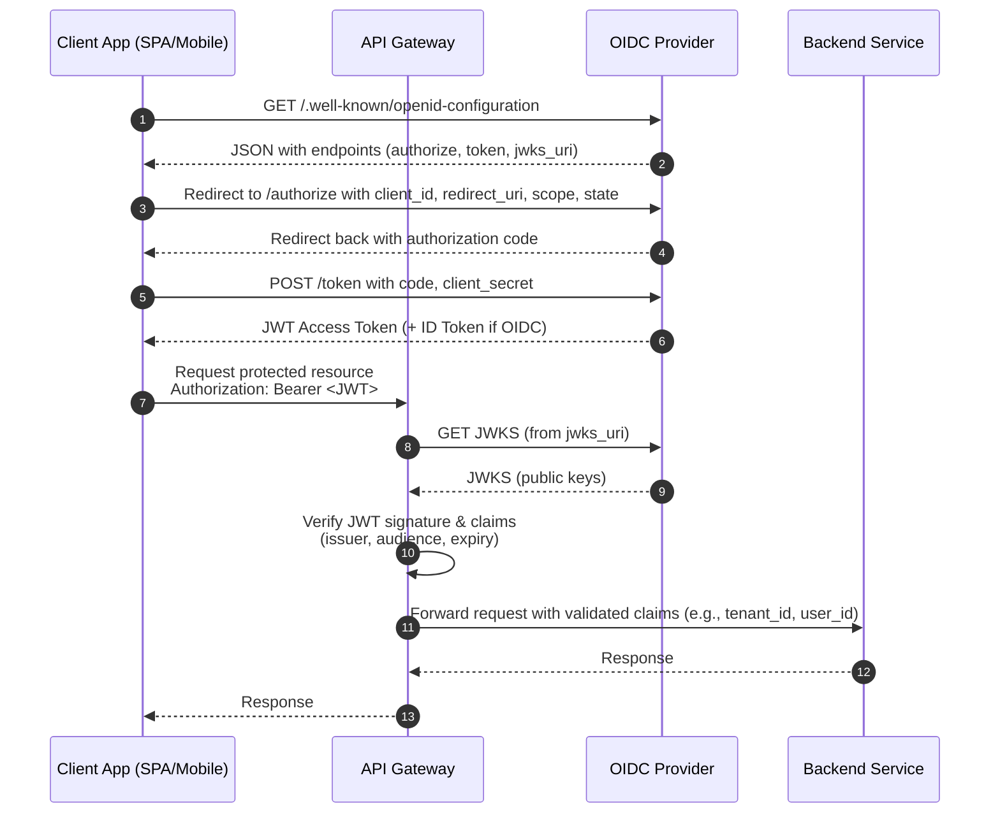

## Historic Local Auth
To get users to authenticate to your services, usually you'd just store a DB with usernames and passwords

Most of the time this just becomes downright annoying, and at the end of the day most people don't want to create Yet Another Username Password (YAUP)

We can move away from this model towards one where user authentication is done via dedicated, federated services...aka logging into one app with user/pass auth of another app

This other apps / provider is called an ***Identity Provider (IdP)***

Typical IdP providers include Google, Facebook, Twitter, and Apple

## OIDC
OIDC, or OpenID Connect, is a way to ensure standard protocols and architecture around IdP provisioning

Most ID Tokens are JWT's

- ***Identity Provider (IdP) Issuer***
    - Trusted service that handles user auth itself
    - Issues tokens like JSON Web Tokens (JWT) a.k.a ID Tokens, Access Tokens, etc...
- ***User***
    - User or app that's trying to authenticate
    - They login / authenticate to the IdP
- ***Desired Server***
    - Backend server hosting the protected resources (API, Database, Data Warehouse)
    - Verifies the token issued by the IdP to grant or deny access
        - Typically done via `JWKS` lookups
        - IdP might send a random token...doesn't mean that user is even for you
        - Often by validating the ID Token or Access Token signature and claims
- ***JWT*** 
    - A single string with 3 base64url-encoded parts which are separated by dots
    - Compact, URL-safe, self-contained tokens
    - `header.payload.signature`
        - *Header*
            - Which signing algorithm was used
            - Token type (usually just `JWT`)
            - KeyID `kid` to indicate which public key to use
        - *Payload AKA Claims*
            -The actual identity and metadata values
        - *Signature*
            - A cryptographic signature of the header+payload made with the **issuer's private key**

### OpenID Flow
Below we discuss different parts of OpenID Flow

---

#### Public/Private Key Usage
There still need to be public and private keys used under typical Alice-Bob trust scenarios

- ***IdP Issuer***
    - They will have a private key
    - It signs an incoming `header+payload` JWT using this private key
- ***Client / Resource Server***
    - The verifier fetches the IdP's public key from a well known JWKS Endpoint - typically `./well-known/jwks.json`
    - It uses this specific public key to verify:
        - The token's signature matches the `header+payload`
        - This ensures we know the token really came from the IdP and hasn't been tampered with

#### Verification Process
- How do backend services offload auth?
    - When a new request comes in, you will re-route requests to another service, an IdP, who will tell you yes/no they are who they are
    - Some even do authorization on yes/no they have right to do this action
- How does a backend service verify a signed JWT?
    - Split JWT into header, payload, signature.
    - Decode header and get kid to know which public key to fetch from IdP.
    - Fetch JWKS and select the correct public key.
    - Recalculate the signature over header.payload using the public key and see if it matches the JWT’s signature.
    - If signature matches $\rarr$ safe to trust that payload was issued by IdP.

#### Claims
Claims are just `k:v` pairs in the payload that provide information on the authentication, authorization, and scope of token
```
{
  "iss": "https://accounts.google.com", // Issuer
  "sub": "110169484474386276334",        // Subject (user ID at issuer)
  "aud": "your-client-id.apps.googleusercontent.com", // Audience (who this token is for)
  "exp": 1716239022,                     // Expiration time (Unix timestamp)
  "iat": 1716235422,                     // Issued at
  "name": "Jane Doe",                    // Profile info
  "email": "janedoe@example.com",
  "email_verified": true,
  "roles": ["admin"]                     // Custom claim
}
```
These are not encrypted at all, and anyone could hypothetically read them, but they are protected by the signature. If any of them change, the signature we calculate with public key would no longer match the one from private key

#### AWS Example
In the below example we'd have an API GW that acts as a proxy and helps us to automate some authorization tasks

Vocabulary:
- JWKS Lookup: This is how the API GW verifies the JWT without needing an OIDC private key - it can use the public keys from `jwks_uri`
- Claims:




