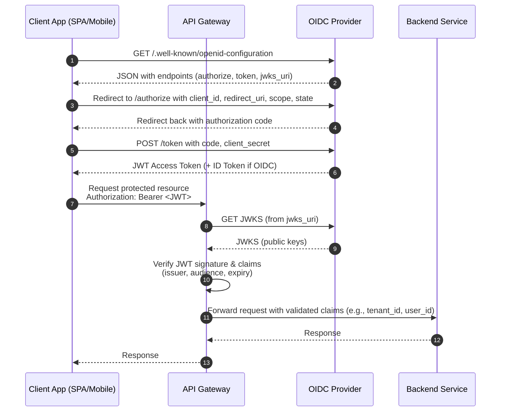

## Cookies
HTTP cookies, aka web cookies, aka cookies are small text files that store small pieces of information. They're created by websites when you visit them, and they're stored inside of browser application on local laptop

Cookies are limited to 4kb in size, which means they can't store a ton of data, but still a fair amount for tracking purposes. They typically contain:
- **name**: A website or a 3rd party server identifies a cookie using it's name
    - Can be thought of as a "key"
- **value**: A random alphanumeric character, wihch stores data like a unique ID to identify the user and other information
- **attribute**: A set of characteristics such as expiration date, domain, path, and flags


There are a few types of cookies in general:
- **First Party Cookies**
    - Installed by website user is currently on
    - Normally used to determine whether a user is logged in
- **Third Party Cookies**
    - Installed by other websites or 3rd party servers that aren't being viewed by the user
    - 3rd party cookies are used to track users' browsing patterns and interests to show ads
    - This is how, after you search for a belt on Amazon, you start to see ads for belts on Facebook
    - They're also used to save general information about you when you create accounts such as name, address, DOB, email, etc

These 2 types of party cookies can be split into 2 main groups
- **Session Cookies**
    - Created for a single session and vanish once you close the browser
    - Created by the website and the user can't disable them from the browser
    - Used to save session information while users browse a website, they help with things like carts, form fill outs, etc
- **Permanent Cookies**
    - Don't expire even after we close the browser or shut down computer
    - They have a specific expiration date set by the website and remain valid until then
    - This is what helps us not have to continuously login to websites
        - It's what is stored when you mention to a website to "trust this computer"
    - These can be abused if someone got ahold of them

### Cookie Flow
Cookies are generally handled by the browser process on your local laptop, and all of their information is stored locally on your computer and transferred to web servers by your browser

- Cookies are small pieces of K:V data stored by your browser. Usually in a local file, or even a process embedded database managed by the browser
- When you visit a website the browser automatically sends the relevant cookies (known by domain / path) along with each HTTP request to that site
    - Cookies are always associated with a specific domain
- Websites use cookies for everything listed above like session management, tracking, advertising, etc
    - If a 3rd party company wants to track you across websites they'll have each website add cookie information about you in that website, and so for each social media site you visit the same Unique UserID would be sent there from your browser process since the social media site requests them

Gigantic websites, specifically ones targeted to tracking and ads like Facebook and Twitter, won't send thousands of cookies for everything they track for you. Instead:
- They'll store a small number of cookies per user, each containing a unique identifier or session token
- That identifier is used sever-side to lookup all relevant user data, preferences, and 3rd party association 
- Sites then share this with the 3rd party advertisers who may have their own tracking systems
- Furthermore, other websites who want to host facebook identifiers (Like Us On Facebook), those sites will actually store cookies from Facebook and send your browsing information to FB. If you like that button, it sends your session and cookie information over to FB which will then know you liked that website and that you were scrolling it

Take a random website blog for example that embeds a Facebook cookie locally - how does it actually integrate into Facebook?
- A blog embeds a facebook widget such as a like button or comment box
    - This is usually loaded from `facebook.com` as an iFrame or script
- When your browser loads that iFrame / script on the blog, it makes requests directly to `facebook.com`
- Your browser automatically includes any `facebook.com` cookies you already have locally!
    - Permanent ones you have from signing in that are stored locally on computer 
    - Even session ones if you have one open in another tab
- The blog itself never sees your facebook cookies or your unique identifier facebook has of you
- Facebook can then identify you, utilizing the permanent / session cookies you have from Facebook, and render the widget personalized to you (including ads, analytics, internet tracking, etc)

## Sessions
Sessions are temporary, time bounded, interactive engagements between client and server / application. Most of the time the starts and ends can be defined by log in / out, but cookies and other tokens allow these sessions to be shorter and longer, while sometimes appearing as almost indefinite

Think about `facebook.com` again, you almost never have to log back in on your personal computer, but a session probably isn't the entire weeks, months, etc you spend engaging with it since you've logged in. It's usually based on current tabs, current engagement on this feed scroll, etc - that's just for `facebook.com`, and then these sessions are defined by every website / application for engagement. Sessions also help control things like shopping carts, but `amazon.com` shopping cart is much longer lived versus a random `etsy.com` one

Session based authentication maintains user state in stateless HTTP calls by storing session data server side - the cookies, tokens, etc are maintained both on server and client laptop, and web servers allow sessions to persist multiple HTTP calls be using these cookies and tokens based on what they know server side. There are a number of challenges with this including distributed system conflicts, performance impacts, cookie fraud, and multi-client inconsistencies (phone vs laptop) that all make user management challenging server side

HTTP is stateless, so each request is considered independent requests without any explicit information from any other request made. If the application is static, then it's easy and there's really no problems at all other than pretty HTML and CSS. You just inform the server what page you want, and it returns it - once the application becomes dynamic you probably need to send additional information regarding who is accessing the page
- The server sends you an initial HTML page, plus JavaScript (like React code)
- Your browser runs that JavaScript. The code sets up event listeners (like onScroll, onClick, etc.)
- When you interact (scroll, click, etc.), the JavaScript in your browser makes requests (AJAX/fetch/WebSocket) to Facebook’s servers for new data
- The server responds with data (usually JSON), not full HTML pages
- The JavaScript in your browser updates the page dynamically using the new data

So every time our browser loads new content, or a new page, or just refreshes and we send a stateless HTTP request, we wouldn't want our shopping cart on Amazon to go blank, or our session on FB to timeout, and so cookies / tokens allow these websites to track users across HTTP requests and sessions

The way your browser process constantly authenticates itself to `facebook.com` is via cookies and/or session tokens such as [JSON Web Tokens (JWT)](#json-web-tokens-jwt) or other [OAuth](#oauth) / [OIDC](#openid-connect-oidc) tokens that are created when we initially authenticated ourselves to `facebook.com` via login

### Session Based Authentication
Sending authentication in each HTTP request (username / password) would be frustrating, inefficient, and unsecure - after authenticating once, ideally there's a way to do continuous authentication with short lived tokens to ensure we're still communicating b/t same client and server

It seems awfully similar to [SSL / TLS Flow](/docs/architecture_components/security/ENCRYPTION.md#ssltls-flow) where you initially use asymmetric encryption to authenticate between client and server, create a symmetric key pair in that setup, and then use the symmetric key pair to encrypt data continuously. There's no reason to actually have keys between client and webservers / applications, so instead it's a similar method that utilizes secrets and tokens inside of cookies and HTTP headers instead, where the HTTP content is then secured using SSL / TLS so that the secrets can't be snooped

The general flow:
- [SSL / TLS Flow](/docs/architecture_components/security/ENCRYPTION.md#ssltls-flow) to encrypt all further communication via symmetric keys, and to ensure we've authenticated the server we're communicating with
- User (browser) sends HTTP request to server containing login credentials of user, and the content it'll be requesting
- Web server authenticates the user itself (not just key from SSL / TLS) is a user of it's application
- Server creates a session locally, and stores all the information about the user and session in memory or a database
    - Gathers tracking info, `userID`, etc along with user history
    - Returns a `sessionId` to user
- The `sessionId` is stored by the user in browser cookies, whether as a temporary or long lived permanent cookie
    - For each subsequent request the browser includes this cookie inside of it's HTTP headers
    - `x-session-id`
- The web server continuously checks this `sessionId`, and uses the local information it stored about that in it's database to dynamically generate the HTML content 
    - This would include shopping carts, login sessions, etc
- If the `sessionId` is valid, then the web server recognizes the user and returns the requested information


#### Distributed System Limitations
Typical problems in distributed systems arise especially around session management, user authentication, and database consistencies 
- Session details are saved on a backend server, and in a distributed system nothing is guaranteed about which server is handling a specific request
- Utilizing ALB's and "sticky sessions" you can ensure that any backend webserver is fulfilling client requests, but that may lead to non-uniform loads across servers
    - One may host all of the "crazy users" who are doing many more lookups
- Otherwise, if it's round robin then server 1 which handled the authentication and cookies may not be the same one that handles subsequent requests an hour later if that server had gone down. Maybe server 2 is handling requests now and doesn't have that information locally
- You can solve this with shared backend databases, in-replica consistent databases (meaning each one handles writes by it's primary and shares to other DB's), sticky sessions via load balancing, or other methods, and those are discussed in depth elsewhere
    - Centralized session stores centralize this user information management for all webservers to utilize, lots of read and write on it
        - Sharded databases per session allow for faster lookups
    - Stateless sessions like [JSON Web Tokens (JWT)](#json-web-tokens-jwt) will encode all of this information within each request so that it doesn't have to be stored on backend databases
    - Session replication (in-sync databases) whether in memory or on in-sync backend databases behind each web server
    - Hybrid approaches of solutions above
    - Client side session storage where session state like cart information is stored on client
        - Becomes inconsistent if something on webserver application has changed and it can't be pushed to client

## Tokens
Encrypted tokens that are stored client-side allow for enhanced security and scalability, ultiamtely alleviating multiple issues, including [distributed systems issues](#distributed-system-limitations), all the while keeping security to the same standard

In session based authentication there's a need to store user information on the web server itself, and that led to a lot of scalability and consistency issues that needed to be overcome - cookies aren't able to store this user information as they have size limits and that would be insecure
- Cookies are sent with every HTTP request, including the ones for images, scripts, etc
    - If they aren't properly scoped they can be exposed to [XSS](/docs/architecture_components/security/ATTACKS.md#xss) which means if `facebook.com` had some malicious script in it, that script can access our `facebook.com` cookies when it's not supposed to
        - Via some comment box script or something
    - Most cross-origin policies, or same-origin policies depending on naming, ensure that a malicious script on `badwebsite.com` can't access our `facebook.com` cookies which is handled by browser level security standards (make sure you have a good browser)
- Tampering by a client side (laptop) process or manually, and there'd be no great way other than constant comparison to check if they're tampered with
- Cookies have a strict size limit, so there'd be many cookies added as more and more information had to be stored

The alternative to all of the cookie talk above is tokens! A token will store user information in an encrypted format and this token can be stored client side 

### Token Flow
This still requires the general back and forth with [SSL / TLS](/docs/architecture_components/security/ENCRYPTION.md#ssltls-flow) to ensure an encrypted communication channel, and afterwards this is to send tokens securely back and forth ensuring wer'e still engaging with an authenticated user

- Client sends a request to server with username and password
- Application validates credentials and generates a secure, signed token for client
    - Signing process varies by protocol
    - Server signing a key with it's private key allows any client with a public key to validate it was signed by the corresponding website
        - This is different from encryption. Signing isn't equal to encryption
    - A signed JWT can be verified by ***any service*** with the public key, ensuring the token was issues by a trusted authority and hasn't been tampered with
- Token is returned to client and client can store locally
- Client can then use this token when accessing something new on the server
    - Just send token as an HTTP header
- Server decodes and verifies the attached token, if valid they know the request isn't invalid
- Token destroyed on logout

Tokens allow for scalable, secure, and RBAC grain authentication mechanisms that cookies aren't able to handle. They're short lived and encrypted ensuring security, and they allow RBAC based controls for things like allowing a 3rd party application access to our gmail account - the token we generate allows the 3rd party to only access gmail

There are 2 main token types:
- ***Access Tokens*** are used to grant access to a protected resource
    - When a client first authenticates they get both access and refresh tokens, but access token expires after a very short period
- ***Refresh Tokens*** are used to obtain a new access token when the current access token becomes invalid or expires, or to obtain further access tokens with a more narrow scope. It doesn't need to re-do credentials again
    - Refresh token lasts much longer and allows us to regenerate access tokens, but if someone got ahold of ours it still must be paired with other client ID's and secrets which wouldn't be available to attackers

### JSON Web Tokens (JWT)
JSON Web Tokens (JWT's) are a standard that define a safe, compact, and self-contained way of transmitting information between a client and a server in form of a JSON object

JWT's can be signed (JWS), encrypted (JWE), or both (JWSE) - if it's neither it's then an insecure JWT

- **Signing a JWT (JWS)** ensures it's integrity is maintained, meaning other parties can see the data in the JWT, but they won't be able to alter it
- **Encrypting a JWT (JWE)** ensures it's secrecy is maintained between the two parties

What's the benefit of JWS? If you have authenticated a user in an encrypted session, and you return to them a token that cannot be altered, then you're essentially ensuring that anyone that uses that token has authorization to access the resources it is assigned to. This is a little scary, as if someone obtained this token and it was for a bank account or something, the bank webserver would accept it as a valid HTTP request (if no other checks were in place). Specifically, for authorization it allows us to continuously authorize to a webserver, and even allows us to create short lived fine grained tokens for other 3rd party services to authenticate to a webserver

JWT is structured as 3 strings separated by a `.` which include the header, the payload, and the signature
```
aaaaaaaaaa.bbbbbbbbbb.cccccccccc
```
- The **header** is the first part, `aa..`, of the JWT. It's commonly known as the JSON Object Signing and Encryption (JOSE) header
    - Describes what algorithm is used to sign or encrypt the data inside of the JWT
    - Attributes are:
        - `alg`: The algorithm used to sign / encrypt JWT
        - `typ`: The content that is being signed or encrypted
    - The attributes will be encoded via `base64()` encoding, and this will rsult in the `aa...` portion
        - Anyone can decode this portion of the string, it's not encrypted
```json
header = {
    "alg": "HS256",
    "typ": "JWT"
}

base64encode(header) --> "eyJhbGci0i...."
```
- The **payload** contains the main information that the server uses to identify the user and permissions - typically consists of 
    - Registered Claims are reserved names that provide a starting point for a set of useful, interoperable claims
        - `iss`: Identifies the principal that issued the JWT
        - `sub` Identifies the principal that is the subject of the JWT
        - `aud`: Identifies the recipients that the JWT is intended for
        - `exp`: Identifies the expiration time at or after which the JWT MUST NOT be accepted for processing
        - `nbf`: Identifies the time before which the JWT MUST NOT be accepted for processing
        - `iat`: Identifies the time at which the JWT was issued
        - `jti`: JWT ID is a unique identifier for JWT, this MUST be assigned in a manner that ensures there's a negligible probability that the same value is assigned to another data object. It can be used to prevent JWT from being replayed, which helps as a one-time token
            - Essentially allows checking if a one-time token has already been used or not
    - Public Claims are JWT claims that can be defined at will by those using JWT's 
        - To prevent collisions, any new claim name should be defined in the IANA registry, JWT registry, or as a URI that contains a collision resistant namespace
    - Private Claims are agreed upon between producers and consumers, and aren't required to be registered in public namespaces or registries
        - Subject to collision, should be used with caution, require coupling, etc
```
payload = {
    "sub": "12345678",
    "name": "John  Doe",
    "iat": 1516239022
}

base64encode(payload) --> ey1398SngiENG5235...
```
- The **signature** is created by combining the header and payload parts of the JWT and hashing them utilizing a server secret key
    - This ensures that noone else could have signed the key themselves
    - Since this is hashed with a private key, there's no possible way for anyone to decode it to JSON

#### JWT Validation
Validating a JWT is typically done server side only, since the webserver wants to ensure the JWT hasn't been interfered with in any way
- **Symmetric Signatures** occur when a JWT is signed using a secret key.This type of signature is done when there's only one single backend web server that signs and validates tokens (it doesn't need to share certificates). The same secret key is used to generate and validate the token
    - Token signed using **HMAC (Hashing for Message Authentication Code)**
    - HMAC is obtained by running a cryptographic has (MD5, HSA, SHA256) over the data that's to be authenticated (header + payload), and a shared secret key
    - `MD5(header+payload, secret_key)`
- **Asymmetric Signatures** are suitable in distributed scenario's where you don't want to share a key amongst servers as there's a potential for that key to be leaked, or possible inconsistency if the key is rotated
    - Asymmetric signing uses a private-public key pair, where each webserver has it's own backend private key
    - Any backend server can utilize it's private key for signing and sharing signed JWS back to the client
    - The client can then ***send JWT to any application anywhere***, and that application (one of the other backend servers, or another 3rd party application), can validate it using the public key
        - The public key can be found for that application via DNS querying over the public key infrastructure
    - Signature is done via RSA asymmetric encryption
        - Server parses the token into header, payload, and signature
        - Verifier identifies public key utilizing `keyId`
        - Verifier takes the raw header and payload, and rehashes them utilizing the hash function provided in header
        - Verifier uses RSA public key modulo and exponent to decrypt the signature
            - $v = \text{signature}^e \space \% \space {n}$
    - Finally, with padding and other decoding mechnisms, the verifier can ensure the token sent to them is in fact from the issuer and hasn't been tampered with

The actual validation process involves examining the returning signature and comparing it to claims inside of the payload, and the user information inside of the header. All a server has to do is create it's own version of the signature using the header and payload from the JWS it's received, and compare it to the signature in the JWS itself

If the generated signatures matches the signature in the JWS, then it's considered to be valid
- Symmetric comparisons are straightforward, the server just runs the same signing algorithm against the header + payload, and checks they match
- For asymmetric, things are a bit more complicated:
    - First the backend server needs to find the public key
        The issuer of the JWS (that used it's private key) publishes it's private key to well-known endpoints, usually in the [JWKS (JSON Web Key Set) format](#jwt-security)
        - The verifying server fetches the JWKS, finds the correct public key utilizing the `keyId` from the JWT header
    - RSA signing - how does a server with a public key signing a header + payload generate the same result as one using the private key?
        - Private key is used to do `signature = RSA(header+payload, private_key)`
        - The signature can be verified utilizing the public key, signature base, and signature value

After that, the rest of the validation process involves comparing time and validity of other token properties - ensuring it's not been used before, it's still in the valid lifecycle in terms of time, and that it's scoped to resources that the webserver owns

#### JWT Security
JWT's have same security situation as cookies for the most part, and so storing them as cookies is typically the preferred solution
- XSS can still occur if someone injects a malicious script into a site, then they're able to see cookies and tokens even with the `Same-Origin` restrictions, as it seems to be coming from the origin websites scripts
- Cookies themselves are prone to CSRF attacks, but they can be mitigated by a number of things discussed in [CSRF Attacks](/docs/architecture_components/security/ATTACKS.md#csrf-attacks)
    - Therefore, cookies are typically a good place to store JWT in client side 

Rotating keys is also an important part of JWT security, and public / private key rotation is an important aspect of this - in rotating keys we don't want to continuously update JWT tokens for every client, and so the general thought is to create a `keyId` in the header portion of JWT to ensure that if we create a new key, we can still use an old key to validate the tokens until they're rotated
```json
header = {
    "alg": "HS256",
    "typ": "JWT",
    "kid": "5trg.5gs.h...."
}

base64encode(header) --> "eyJhbGci0i...."
```

The same thing goes for asymmetric keys, if you update the private key, the corresponding public key must be changed, and the JSON Web Key specification offers a way to represent cryptographic keys in JSON format to ensure there's a way to lookup a the public key
- You can directly embed the public key itself, but they're quite large
    - Usually, you can convert the public key to JSON - the JSON object that represents a public key is known as a **JWK**
    - JWK can be included in header as `jwk` parameter
- Embed a URL that contains the key
    - Can be included in header as `jku` parameter

### OAuth

### OpenID Connect (OIDC)
OIDC, or OpenID Connect, is a way to ensure standard protocols and architecture around IdP provisioning

Most ID Tokens are JWT's

- ***Identity Provider (IdP) Issuer***
    - Trusted service that handles user auth itself
    - Issues tokens like JSON Web Tokens (JWT) a.k.a ID Tokens, Access Tokens, etc...
- ***User***
    - User or app that's trying to authenticate
    - They login / authenticate to the IdP
- ***Desired Server***
    - Backend server hosting the protected resources (API, Database, Data Warehouse)
    - Verifies the token issued by the IdP to grant or deny access
        - Typically done via `JWKS` lookups
        - IdP might send a random token...doesn't mean that user is even for you
        - Often by validating the ID Token or Access Token signature and claims
- ***JWT*** 
    - A single string with 3 base64url-encoded parts which are separated by dots
    - Compact, URL-safe, self-contained tokens
    - `header.payload.signature`
        - *Header*
            - Which signing algorithm was used
            - Token type (usually just `JWT`)
            - KeyID `kid` to indicate which public key to use
        - *Payload AKA Claims*
            -The actual identity and metadata values
        - *Signature*
            - A cryptographic signature of the header+payload made with the **issuer's private key**

### OpenID Flow
Below you discuss different parts of OpenID Flow

---

#### Public/Private Key Usage
There still need to be public and private keys used under typical Alice-Bob trust scenarios

- ***IdP Issuer***
    - They will have a private key
    - It signs an incoming `header+payload` JWT using this private key
- ***Client / Resource Server***
    - The verifier fetches the IdP's public key from a well known JWKS Endpoint - typically `./well-known/jwks.json`
    - It uses this specific public key to verify:
        - The token's signature matches the `header+payload`
        - This ensures you know the token really came from the IdP and hasn't been tampered with

#### Verification Process
- How do backend services offload auth?
    - When a new request comes in, you will re-route requests to another service, an IdP, who will tell you yes/no they are who they are
    - Some even do authorization on yes/no they have right to do this action
- How does a backend service verify a signed JWT?
    - Split JWT into header, payload, signature.
    - Decode header and get kid to know which public key to fetch from IdP.
    - Fetch JWKS and select the correct public key.
    - Recalculate the signature over header.payload using the public key and see if it matches the JWT’s signature.
    - If signature matches $\rarr$ safe to trust that payload was issued by IdP.

#### Claims
Claims are just `k:v` pairs in the payload that provide information on the authentication, authorization, and scope of token
```
{
  "iss": "https://accounts.google.com", // Issuer
  "sub": "110169484474386276334",        // Subject (user ID at issuer)
  "aud": "your-client-id.apps.googleusercontent.com", // Audience (who this token is for)
  "exp": 1716239022,                     // Expiration time (Unix timestamp)
  "iat": 1716235422,                     // Issued at
  "name": "Jane Doe",                    // Profile info
  "email": "janedoe@example.com",
  "email_verified": true,
  "roles": ["admin"]                     // Custom claim
}
```
These are not encrypted at all, and anyone could hypothetically read them, but they are protected by the signature. If any of them change, the signature you calculate with public key would no longer match the one from private key

#### AWS Example
In the below example we'd have an API GW that acts as a proxy and helps us to automate some authorization tasks

Vocabulary:
- JWKS Lookup: This is how the API GW verifies the JWT without needing an OIDC private key - it can use the public keys from `jwks_uri`
- Claims:




