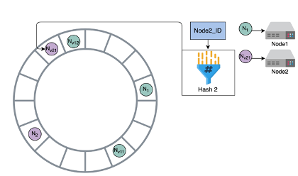
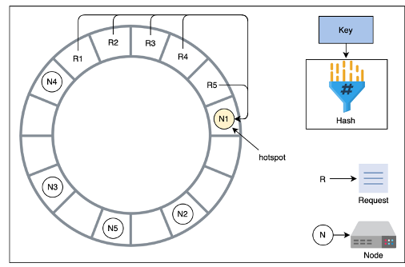

# Consistent Hashing
Consistent Hashing is the idea of utilizing a hash ring to distribute requests among nodes and replicas - the main problem it fixes is that in modulo based hashing `hash(key) % n_servers`, if `n_servers` changes we have to re-distribute almost all data. ***Consistent Hashing*** assigns each server or item in a distributed hash table a place on an abstract circle, called a ring, irrespective of the number of servers on the circle

Why is this good?
- Allows servers and objects to scale without compromising overall performance
- When an area of the ring becomes overused / Hot Spot you have to rebalance the partitions on the ring

Is this solvable in other ways?
- Yes, **fixed partitioning** where we choose a number of partitions larger than we could ever expect our number of servers to be means that when new servers join that can take parts of fixed partitions from other servers. We just need to keep a mapping of which servers are responsible as primaries for which partiitons
    - The largest disadvantage here is some partitions can be much larger or smaller than others
    - **Dynamic Partitions** - When the size of a partition reaches some threshold, it’s split equally into 2 partitions, which are then sent to different nodes on the cluster
- There’s a lot of overhead and network I/O involved in this
- Keeping track of everything as data is constantly moves will strain our ability to handle reads / writes
        - **Proportional Partitions** – Is when you set the number of partitions to be proportional to the number of nodes, and each node has a fixed number of partitions

This is great, and we can view this as an [in-memory in memory item](/docs/leetcode_coderpad/coderpad_implementations/consistent_hashing_service.md) from coderpad interviews. However, this doesn't solve production based systems where we have millions of requests being sent to load balancers, VM's spinning up with bootstrapped OS's, and all of a sudden these VM's are supposed to host a portion of a database and serve requests
- How is this coordinated?
    - How do we ensure data consistency?
- What happens if things get screwed up in the middle? How do we recover from disasters during migrations
- How do we route requests to nodes?

This is mostly the first part of a system design that's just hand waved over "we'll use consistent hashing" - I never enjoy that as the replication mechanism is extremely important and the entire system depends on routing more times than not

# Implementation Details
This is mostly just a distributed systems coordination problem, but during scaling events we need to lock portions of databases and sync rows between nodes
- On an upscale, we need to lock some rows of different databases and egress those rows to a new database while routing new requests to the new server
- On a downscale, we need to route an entire database to other databases and insert the rows into them, all while setting up future routing to those databases

Zookeeper coordination / locking, pgSQL logical and physical replication (or any database replication), and hash router updates are the main items that need to be focused on to make this stuff actually flow

## Locks + Coordination Service
We can just use yet another table in some postgres database to implement the locks required for databases - in the below SQL we can create a lock via a row transaction which means we're currently migrating some portion of that database

```sql
CREATE TABLE migration_locks (
    id SERIAL PRIMARY KEY,
    lock_name VARCHAR(255) UNIQUE NOT NULL,
    locked_by VARCHAR(255) NOT NULL,
    locked_at TIMESTAMP DEFAULT CURRENT_TIMESTAMP,
    expires_at TIMESTAMP NOT NULL
);

-- Index for fast lock lookups
CREATE INDEX idx_migration_locks_name ON migration_locks(lock_name);
CREATE INDEX idx_migration_locks_expires ON migration_locks(expires_at);
```

This table just allows us to use database transactions to engage with locks, and we can create a TTL via timestamps and time to live attributes during acquisition (this also exhausts all old locks)

```sql
-- Acquire migration lock with timeout
CREATE OR REPLACE FUNCTION acquire_migration_lock(
    p_lock_name VARCHAR(255),
    p_locked_by VARCHAR(255),
    p_ttl_seconds INTEGER DEFAULT 3600
) RETURNS BOOLEAN AS $$
DECLARE
    v_acquired BOOLEAN := FALSE;
BEGIN
    -- Clean up expired locks first
    DELETE FROM migration_locks
    WHERE expires_at < CURRENT_TIMESTAMP;

    -- Try to insert new lock
    BEGIN
        INSERT INTO migration_locks (lock_name, locked_by, expires_at)
        VALUES (
            p_lock_name,
            p_locked_by,
            CURRENT_TIMESTAMP + (p_ttl_seconds || ' seconds')::INTERVAL
        );
        v_acquired := TRUE;
    -- Can't acquire new lock, something else using it
    EXCEPTION WHEN unique_violation THEN
        v_acquired := FALSE;
    END;

    RETURN v_acquired;
END;
$$ LANGUAGE plpgsql;
```

After this is done, you have a way to acquire a lock ***on a specific database***, and so the application / coordination service can acquire locks on both databases during a scaling event, and deploy some pgSQL replication mechanism. This deployed pgSQL mechanism needs to also be a transaction - if it fails it needs to rollback immediately. We can store an [outbox transaction](/docs/architecture_components/messaging/index.md#transactional-outbox) on the coordination services own database so that it can mark a migration as started, and mark it as finished once done. If there's ever a point where the coordination service fails during a migration, there's a record of it being started in the outbox. Once the migration finishes / we find it has finished on a reboot, we can then remove the lock on the databases, update the routers, and mark the migration as completed in our own database. Inbetween there there's multiple areas this can fail, and these can all be state transitions of the coordination service

In Python you could do something like the below to acquire the lock of a database for 6 minutes
```python
  async def acquireLock() -> Promise[bool]:
    resp = await this.pool.query(
      "SELECT acquire_migration_lock($1, $2, $3)",
      ["schema_migration", this.instanceId, 3600]
    )
    return resp.rows[0].acquire_migration_lock;
```

Releasing the lock is deleting the row in PG, can keep track of Database versions with another metadata table which allows us to skip migrations that may already be completed - this is great

What happens when the migration is going to take 10's of minutes to complete over hundreds of thousands of rows?

### Chunked Migration
The chunked migration flow would basically just be running chunks of migrations above - if there are 100,000 rows, you run the above for batches of 10k rows at a time. Each time you release and re-acquire the lock in case something else is trying to utilize the database for writes

Chunked migration will help us in terms of splitting up large transfers into more independent and parallel items, but we still want to be sure the whole thing goes or doesn't go, so there would have to be a transaction of transactions that rolls back each of them in case one of them fails

This is a useful tool for migrations, but ultimately the idea of hashing and partitioning is to ensure we never reach the point that one single database has 10's of GB of data that needs to get offloaded at any second, and there are further data consistency and availability techniques to keep a source database up while transferring certain rows over to a new database

### Logical Migration
If we have database A at time t and we want to replicate 5% of that over to database B while allowing A to accept new writes, and to have those eventually streamed over to B, the first thought should be replica creation + logical replication

The idea is to create a stand-in snapshot of A at time t, and then keep an append only WAL offset for B that will then go back and contiuously update itself with new updates done to A. At some point the two will be in sync, and we route all new requests to B, and then can officially consider the migration completed. There's no specific reason to go delete the rows in A during the same transaction - they can be deleted by a future downstream process as long as all new requests are routed to B

##### Consistent Hashing Example
- Consistent Hashing, again
    - you have a circular buffer / ring from 0 to n-1 where n is the number of available hash values
    - For each of the nodes in our cluster, from 0 to m, where m is the number of available nodes in our cluster
    - you calculate a hash for each nodeID and map it onto our ring
- In this way, multiple nodes can be assigned to a slot in a ring
        - Whenever a new node is added into the ring, the immediate next node is affected, and it has to share it’s data with the new node since it was split
        - Then, whenever a request comes in, you move in a clockwise direction to find the node that should handle the request
- If node1 handles request1, and then splits to node1 and node2, and request1 then maps to node2, then node2 will handle it in the future
- This is why only node1 and node2 need to share data with each other, and over time node1’s load will be reduced
        - As nodes join or leave, only a minimal amount of data needs to be shuffled, and a minimum amount of nodes are affected
        - There can still be hotspots in this setup, and there are multiple methods, described above, for handling repartitioning of data when hotspots arise




- In the figure, all 5 requests are handles by N1
        - Hotspot help
- Something you didn’t mention before is using virtual servers
- you can use multiple hash functions on each node, and then distribute out the nodes to different parts of the ring
    - Essentially allows us to reuse nodes around the ring so that requests will be handled in a more uniform manner
    - Gives us “more slots filled up” by different virtual servers
    - Nodes with larger hardware capacity can take on more virtual slots

