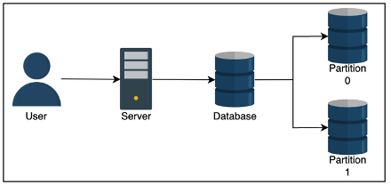

# Partitioning

- Why do you do it? Because it can help us reduce read latency
    - If you take a database and split it directly in half based on userId
    - A write to the database takes the same time
    - A read to the database also takes about the same time
        - But there are double the resources (since the other half of userId’s don’t affect the reads of these userIds) to serve that read
- Relational databases have attractive properties like ACID transactions, indexes, and other things, but sometimes a single node just cannot handle the read velocity and the throughput suffers
    - you can then do database partitioning AKA sharding to use multiple nodes, where each node hosts a section of the relational data 

- Need to ensure you don’t have hotspots which are shards with an abnormally used partition of data
    - Like having one shard of NY based customers, and another for Idaho
- Types
    - Things to note:
        - Range queries – some types are unable to perform range queries due to hashing
        - Time Complexities – Some operations may take more time on a distributed database vs normal one due to architecture

## Sharding
### Vertical (Column) Sharding
- you split the data up vertically so that different columns are in different databases and can be joined through keys
- Like denormalizing, and keeping an identifier in each shard
### Horizontal (Row) Sharding
- Where you split data up horizontally by rows
- Strategies
### Sharding Strategies
#### Key range 
- Where you split data up into ranges by primaryKey, and each shard takes a specific range
    - Each partition is assigned a contiguous range of keys
    - Primary key’s are unique across shards
    - Range queries 
        - On primaryKey are easy
        - On non-primary key’s require full scan of all shards
    - Therefore, you should think about OLAP processing
#### Hash Key
- Hash Key is where you split data up by passing a set of attributes into a hash function, and each shard gets a contiguous range of the hash output
    - Hash(key) % n_clusters = partitionId
    - Like a HashTable
    - you cannot perform range queries on this data
        - Throughout all of this, both types are prone to Hot Keys / Hot Spots where there’s a larger set of data on a specific partition
- Range based if there is more data in a range
- Hash based if there’s more data for the data points mapped to a partition

#### Consistent Hashing
Moved discussion to an entirely [separate consistent hashing document](/docs/architecture_components/typical_reusable_resources/typical_distributed_kv_store/CONSISTENT_HASHING.md)

## Partitioning and Secondary Indexes
- If all of this data is partitioned and sharded, how do you create secondary indexes to speed up our reads?
- Secondary Indexes are used in relational databases to decrease lookup time to $O(1)$ or $O(log n)$, by sorting and organizing a lookup table for the indexed column
- ***Hash Index*** means you will double the storage needed, but you essentially hash the value of each entry in the column and store this, so that our lookup is O(1) since you just hash the lookup value and find it’s corresponding row number which is just a fixed size memory offset you can jump to
    - Cannot do range based queries
- ***B-Tree Index*** creates a Binary Search Tree based index on the data, so that a point search is O(log n), and range based searches are also O(log n) since you find the start, and iterate over our data points until you find the end
    - There's more info in the [Disk Based Databases and Storage Document - Specifically the BTree one](/docs/architecture_components/databases%20&%20storage/Disk%20Based/BTREE/index.md)
    - Challenges in KV Stores
        - *Primary Key Lookups:*
            - KV stores are optimized for primary key lookups, which are typically $O(1)$ when using hash-based partitioning.
            B-Trees are not necessary for primary key lookups because hashing is faster for exact matches.
        - *Range Queries:*
            - If range queries are required (e.g., "find all keys between key1 and key10"), hash-based partitioning cannot support this efficiently.
            B-Trees are better suited for range queries because they maintain sorted order.
        - *Distributed Nature:*
            - In distributed KV stores, data is often partitioned across multiple nodes using consistent hashing or other sharding strategies
        - Maintaining a global B-Tree index across partitions is complex and can introduce significant overhead
    - When to Use B-Tree Indexes in KV Stores
        - *Local Secondary Indexes:*
            - Each partition in a distributed KV store can maintain its own local B-Tree index for secondary attributes
            - Example:
                - A KV store partitioned by userId could use a B-Tree index on timestamp to efficiently query all records for a user within a specific time range
        - *Global Secondary Indexes:*
            - A global B-Tree index can be created for secondary attributes across all partitions
            - This requires maintaining a lookup table that maps secondary attributes to partitions
            - Example:
                - A KV store could use a global B-Tree index on orderDate to query orders across all users within a specific date range
        - *Range-Based Partitioning:*
            - If the KV store uses range-based partitioning instead of hashing, B-Trees can be used to index the primary key within each partition
            - This allows efficient range queries within a partition
    - Advantages of B-Tree Indexes in KV Stores
        - *Efficient Range Queries:*
            - B-Trees are ideal for range queries, which are not supported by hash-based partitioning
                - Why? Because data is already sorted, and you basically need to traverse around the initial key $k$ times to find the other keys
                - Point Lookups: $O(\log n)$
                - Range Queries: $O(\log n + k)$, where $k$ is the number of matching keys.
        - *Point Lookups:*
            - While not as fast as hash-based lookups, B-Trees still provide efficient point lookups $O(\log n)$
    - Disadvantages of B-Tree Indexes in KV Stores
        - Storage Overhead:
            - B-Tree indexes require additional storage to maintain the tree structure
            - This can double or triple storage requirements, especially for global secondary indexes
        - Write Overhead:
            - Every write operation must update the B-Tree index, which can slow down write performance
    - Complexity in Distributed Systems:
        - Maintaining consistency and synchronization of B-Tree indexes across partitions in a distributed KV store is challenging
- ***Local Secondary Index***
    - Each partition receives it’s own local index
    - Once you reach that partition, maybe by finding out which partition the request’s data will reside in, you can then use the index
- ***Global Secondary Index***
    - you can also create a global index for secondary attributes
    - It’s like creating a lookup table of partitions for each secondary term
    - Will double or triple storage, and each write has to update this lookup table as well

## Request Routing
- When a read comes in, how do you know which partition to go to
- you must find the actual IP address of the node hosting the data
- This is also known as service discovery
    - Client requests any node, if it doesn’t contain data then have node send request to node with data
    - Have a routing service that determines which node to connect to 
    - Clients use partition key, and they have access to partitioning function, so they can directly determine which node to use
- How do you update our clients when our nodes change / rebalance?
    - Zookeeper like management services are typically used in this case
- It will keep track of all mapping in the network, and so all nodes must connect and constantly talk to the Zookeeper nodes
- Whenever there’s a partition change, rebalancing, or change in nodes, the changes are related to Zookeeper which can update the routing tier
