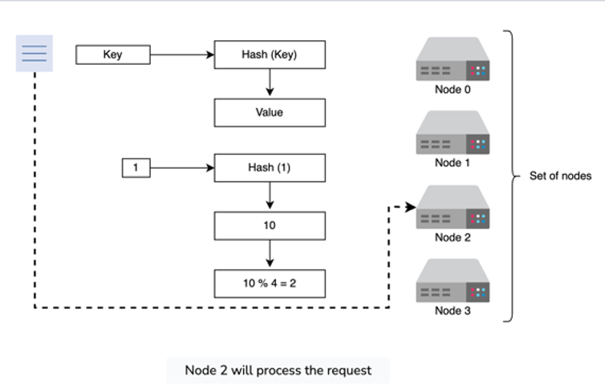
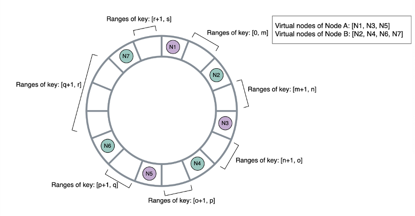

## Sharding
Sharing is a key point in most distributed systems as it covers shards, partitions, hashing / routing, and scaling

Ensuring all of this works properly is a core focus in a lot of these systems

For the most part we have a few options for routing requests to certain shards, and usually it's based on identifying a server based on a hashed key:
- ***Modulo based hashing*** is just bucketing our requests based in a circular fashion - if you have 10 buckets then both 1 and 11 go to server 1
    - Modulo based hashing will ensure there's an equal distribution among nodes, but it's not ideal because if you need to add or remove any number of servers then ***all data needs to be shuffled*** - if you have 10 servers and you add another, data in 1 moves to 2, some data in 2 moves to 3, etc...This will lead to heavy downtime
    - 
        - You can see, that if you added a new server 5, then all of the modulo calculations would get screwed up and we’d have to shuffle data around
- [***Consistent Hashing***](/docs/architecture_components/typical_reusable_resources/typical_distributed_kv_store/CONSISTENT_HASHING.md) has a circle, or ring, from $0 - N$...let's say $[0, N]$, then you split that ring up into equal sections based on the number of Servers, call them $M$
    - If you add in or remove a new node, you only have to shuffle data in servers next to the new node
    - Another benefit of this is that you can replicate data onto other nodes on other parts of the ring! So you can replicate Server 1 data onto Server 5 and Server 5 onto Server 9, and around and around
    - 

## Explicit Shard Management
Hashing, specifically circular hashing which is almost always chosen over modulo hashing, has some limitations on it's flexibility and abilities to handle complex issues like GDPR compliance. In these scenario's the seeminly random placement of data is ineffective, and we need a solution that's less declarative and more imperative 

The major alternative is to simply split data into shards that are allocated onto servers, and have each of these servers (primaries) work through their own replicas (other nodes) - while it may not be as "fancy" as consistent hashing, it allows for more fine grained rule sets. The ***allocation of data onto shards is explicitly stated*** with the capability of incorporating various constraints such as:
- Locality (GDPR)
- Replication factor
- Hardware specs
- etc...

In this way, we have an explicitly imperative way of stating what our shards are, how they'e replicated, and how they scale. The [shard manager service](https://engineering.fb.com/2020/08/24/production-engineering/scaling-services-with-shard-manager/) at facebook is something built specifically for these use cases, and is a good implementation of sharding outside of consistent hashing, where a [consistent hashing implementation is discussed elsewhere](/docs/architecture_components/typical_reusable_resources/typical_distributed_kv_store/CONSISTENT_HASHING.md#implementation-details) for use cases like distributed hashing which can benefit from this highly scalable setup. The shard manager covers most of the basic needs of sharded databases:
- Replication
- Failover and replica rebuild
- Coordinated downtime for maintenance (rolling blue / green downtime)
- Load balancing and routing which is discussed below

"Additionally, the possibly uneven and ever-changing shard load requires load balancing, meaning the set of shards each server hosts must be dynamically adjusted to achieve uniform resource utilization and improve overall resource efficiency and service reliability. Finally, the fluctuation of client traffic requires shard-scaling, where the system dynamically adjusts replication factor on a per-shard basis to ensure its average per-replica load stays optimal."

The above statement basically means that load balancing / routing, resource utilization, shard placement, replication factors, and scaling events are all handled by the shard management service which will simply handle all of these coordinated migrations between shards based on utilization metrics

[Coordinated replication, data movement, and scaling events implementation](/docs/architecture_components/typical_reusable_resources/typical_distributed_kv_store/CONSISTENT_HASHING.md#implementation-details) is covered in the consistent hashing portion as it's similar to here. It requires locks, logical database replication, router updates during replication, router updates after replication, outbox transactions for mid-replication failovers, etc. The facebook shard manager is closest to [Apache Helix](https://helix.apache.org/) with extra features on top to ensure specific protocols like Paxos / [RAFT](/docs/projects/raft/index.md) are handled appropriately since they have different requirements than eventually consistent systems

Shard manager application types - each of these represent a shard cluster:
- **Primary Only**: Each shard has a single replica called a primary replica, there's a common paradigm that these application types have a separate, durable, external system like a database or a data warehouse. Each shard represents a worker that fetches designated data, processes them, optionally serves client requests, and writes back the results. For these the shard manager guarantees *at-most-one* primary guarantees, which means there's really only one worker at a time, similar to a [locked zookeeper coordination](/docs/architecture_components/orchestration%20&%20coordination/index.md#zookeeper)
- **Secondary Only**: These are basically needed for redundant fault tolerant applications. They allow hot shards to have more replicas to spread out load, and most of the time the applications are read only without any strong consistency requirements. The typical flow is `read data from external -> process -> cache results locally -> serve queries`
    - ML Inference systems are a common example of this
- **Primary Secondary**: Each shard has multiple replicas of different types:
    - Primaries which accept writes and hold locks / state
    - Replicas which are synced to primary and help on read throughput
        - Strongly consistent applications like RAFT / Paxos handle the replication and state handling, so the shard manager doesn't have to do this. However, if a primary dies a replica can be proposed by Paxos and sent to shard manager
    - These are often storage systems with specific data consistency and durability guarantees