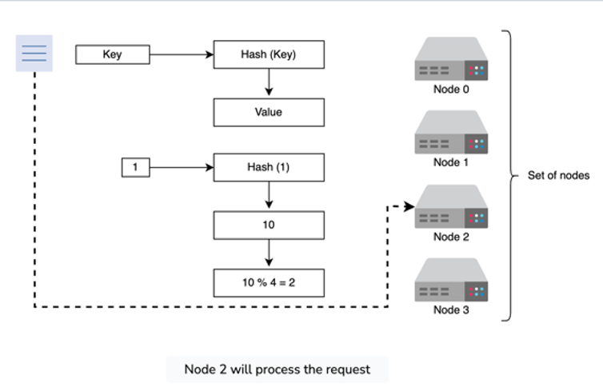
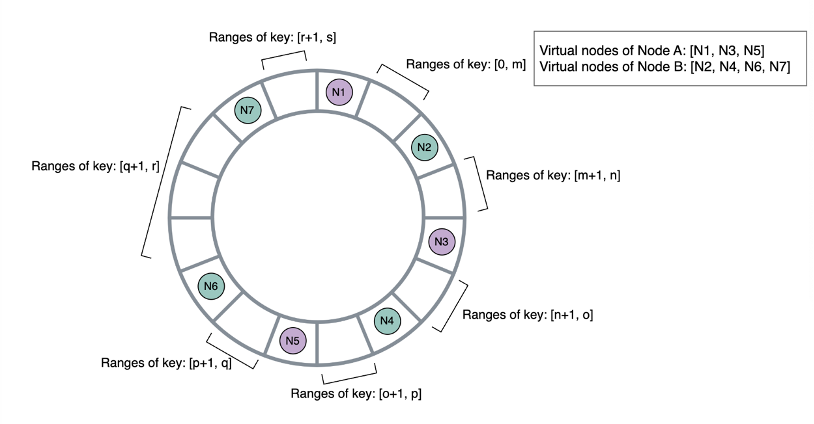

## Sharding
Sharing is a key point in most distributed systems as it covers shards, partitions, hashing / routing, and scaling

Ensuring all of this works properly is a core focus in a lot of these systems

### Routing
Figuring out how to actually Shard and Route data is the key part - how do you figure out which server to route new requests to?

#### Modulo Based
Modulo based hashing is just bucketing our requests based in a circular fashion - if you have 10 buckets then both 1 and 11 go to server 1

Modulo based hashing will ensure there's an equal distribution among nodes, but it's not ideal because if you need to add or remove any number of servers then ***all data needs to be shuffled*** - if you have 10 servers and you add another, data in 1 moves to 2, some data in 2 moves to 3, etc...This will lead to heavy downtime

you can see, that if you added a new server 5, then all of the modulo calculations would get screwed up and we’d have to shuffle data around

#### Circular / Consistent Hashing
In Circular Hashing you have a circle, or ring, from 0 - N...let's say $[0, N]$, then you split that ring up into equal sections based on the number of Servers, call them $M$

If you have $N = 100$ and $M = 10$, then we'd have 10 sections of size 10, if $M = 33$ you have $100 / 33 ~ 3$ 33 sections of size 3

Why is this better? If you add in or remove a new node, you only have to shuffle data in servers next to the new node

Another benefit of this is that you can replicate data onto other nodes on other parts of the ring! So you can replicate Server 1 data onto Server 5 and Server 5 onto Server 9, and around and around

This ultimately ***reduces the total amount of data you need to shuffle with scaling***

