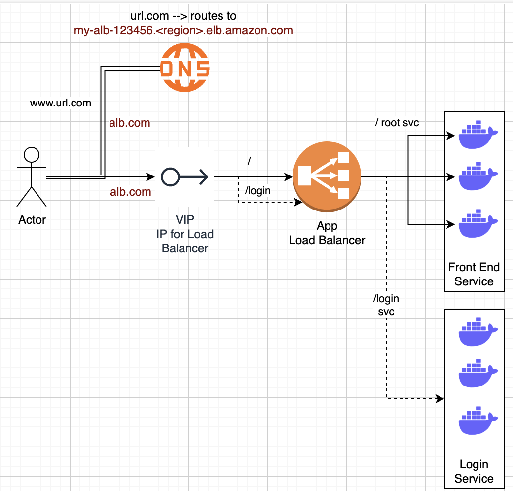

## Distributed Frontend
Across many product facing applications, there are some repeated patterns that have been seen concerning DNS, load balancing, and serving web applications - they concern all 3 major layers of application, data, and infrastructure, and as discussed below there's no perfect solution. Sessions, routing, caching, scaling, and product needs all dictate these decisions, and they start to combine (even when you try to keep them separate).

There are 3 main components in typical frontends:
- DNS lookups: How to find the IP's / servers that host our website
    - What if these servers go down? How do DNS servers get updated? How do clients know where to go?
- Load balancing: If millions of clients go to our servers, how can you scale it out so that multiple backend servers are serving them
    - How do you handle state?
    - Load balancers simply help our other components horizontally scale, by providing a singular place for client requests to go, and then routing them outwards to one of potentially many servers
- Routing: The actual physical act of our load balancer choosing a backend server to send the request to
    - Round robin, uniform, hash (same server for every user request), etc are all strategies



If everything was truly stateless, it would be incredibly easy to scale applications, but you will eventually have to deal with:
- [Distributed databases](/docs/architecture_components/typical_reusable_resources/typical_distributed_kv_store/index.md), which will require their own routing + load balancing
- [Distributed caches](/docs/architecture_components/typical_reusable_resources/typical_distributed_cache/index.md), where you will want to host frequently accessed content in RAM 
    - The key part here are ***sessions*** - if a user logs in and is routed to an app server on IP `127.0.0.1`, and the next request is routed to `127.0.0.2`, then the local cache / session storage will not have that information
    - In this scenarion you desire ***sticky sessions*** where all user requests for a session are routed to the same backend application server
- Routing
    - Round robin is easiest, just fling each new requests to the next server, to ensure backend servers are uniformly utilized
        - This is where you lose session abilities
    - Hashing alleviates this issue, where you send each clients request to the same backend server
        - This could create "hot servers" that are overloaded by a particular subset of users by chance
    - Least used will send the next new request to the least utilized server
        - you could then store the clients backend server in a Distributed K:V store
        - Allows us to uniformly use our backend servers, while also ensuring state / sessions are kept on those servers for clients
            - Then you get into cache / K:V invalidation when the user has finished their session
            - you also introduce new components into our architecture, which will all have their own trade-offs
    - There's a host of other routing choices as well, and the right one depends on the use case of the service(s)!

## Architecture 
The core architecture of typical frontend is comprised of:
- DNS
- Load balancers
    - VIP's - which are essentially static IP's ***you can*** hardcode / depend on for DNS / query logic
        - These are not required, and nowadays most product groups rely on AWS Elastic IP's on load balancers for this, and if not there are ways to register load balancer IP's with DNS servers
        - The architecture for distributed, highly available, load balancers that register their IP's with DNS servers is out of scope here, and is discussed in a sub-document
- Web servers
    - Potentially cache's, K:V stores, or other useful components
- [CDN's](/docs/architecture_components/typical_reusable_resources/typical_cdn/index.md) can potentially be used as edge-cache's to completely avoid going to web server for static content, but this can be considered a separate component


- R1​ indicates request 1 coming through one of the ECMP routers (tier-1 LBs).
- ECMP routers forward R1R1​​ to any of the three available tier-2 LBs using a round-robin algorithm. Tier-2 LBs take a hash of the source IP address (IPsIPs​) and forward the packet to the next tier of LBs.
- Tier-3, upon receiving the packet, offloads TLS and reads the HTTP(S) data. By observing the requested URL, it forwards the request to the server handling requests for `document`.

### DNS
DNS (Domain Name Systems) help us to resolve `myexample.app.com` into some IP address `10.0.0.1`

Our computers can't do anything with `myexample.app.com`, so you get into good old-fashioned querying of databases!

DNS systems are essentially gigantic K:V stores with some sort of hierarchy to them to help whittle down where requests need to go, and actually the design of DNS systems requires thoughtful, secure, encrypted, communication channels over distributed, hierarchical, K:V stores and they are a non-trivial component to create on your own

Thank god there are tons of services that help to do it for you, where you simply pay for records on these databases hosted by trusted authorities!

### Load Balancers
As stated above, load balancers help us to take all of our requests from clients and efficiently route them to a cluster of backend web servers to handle these requests

In the context of "frontend" they can be thought of as used to route client requests to some specific / unspecific backend web server to return HTML + static content, but they can be used in multiple scenario's actually:
- North/South is in reference to client $\rarr$ backend server
    - Client A requests `myexample.app.com`
- East/West is in reference to backend server $\rarr$ backend server
    - To handle Client A's request, our web server must query:
        - User service
        - Login service
        - Cart service
    - These services must all engage with each other 
- Layer 4 (L4) is load balancing using transport protocols like TCP / UDP
    - Help to ensure that the same TCP / YDP communication is forwarded to same back-end server
- Layer 7 (L7) load balancers are based on data of app layer protocols like HTTP headers, URLs, cookies, and other app specfic data (even userId)
    - Can also handle TLS offloading, rate limiting, HTTP routing, header rewriting, and many other features

#### Tiers


- Tier 0 and 1
    - If DNS can be considered, then Equal Cost Multi Path (ECMP) routers are the tier-1 LB's 
    - Most of these operate using some sort of round-robin algorithm for distributing traffic equally
    - Tier-1 LB's will balance the load across different paaths to higher tiers of LB's
- Tier 2
    - Typically L4 LB's which ensure that **for any connection, all incoming packjets are forwarded to the same Tier-3 LB**
    - To achieve this, consistent hashing and other state based algorithms may be used
    - Without tier-2 LB's there can be erroneous forwarding decisions in case of failures or scaling of LB's
- Tier 3
    - Typically L7 LB's that provide app layer routing to actual web app endpoints
    - These will also provide health checks / monitoring of backend servers at the HTTP level
        - Some extra features typically include TCP-congestion control protocols, Path Maximum Transmission Unit (MTU), TLS offloading, etc
    - Ultimately, this layer helps to **enable scalability by evenly distributing requests among the set of healthy back-end servers and provides high availability by monitoring the health of servers directly**

#### Static vs Dynamic
- Static algorithms don't consider the changing state of endpoint servers
    - Task assignment is carried out based on existing knowledge about servers configuration
    - These are never very complex algorithms, and they're implemented in a single router or commodity machine that accepts all incoming requests
- Dynamic algorithms do consider the current or recent state of servers
    - Dynamic algorithms maintain state by communicating with the server(s) themselves
    - State maintenance makes design much more complicated, but ultimately enables more complex and robust load balancing patterns

#### Stateful vs Stateless
State may be maintained to hold session infromation about different clients that interact with the hosting server

If session information is not keot in a separate lower layer (database, cache, etc...), then load balancers are used to keep the session information

- Stateful load balancing involves maintaining state of the sessions established between clients and hosting servers
    - Stateful LB's incorporate state info into their algorithms to perform load balancing
    - Allows for "sticky" sessions
    - Holds a mapping of incoming clients to hosting servers
    - LB's share state with each other to make forwarding decisions
- Stateless load balancing maintains no state, and is therefore faster and more lightweight
    - Uses [Consistent Hashing](/docs/architecture_components/typical_reusable_resources/typical_distributed_kv_store/SHARDING.md#circular--consistent-hashing) to make forwarding decisionss
    - As new servers join or exit ring, stateless LB's may not be enough to route a request to the correct app server, so a small amount of local state may be required with Consistent Hashing

#### Global vs Local
- Global Server Load Balancing (GSLB) involves distribution of traffic across regions / data centers
    - A client in USA being routed to `us-east`, `us-central`, or `us-west` is an example
    - This focuses on routing a request to the nearest data center that can handle requests
        - It also ensures efficiency + high availability - in the case a data center goes down, we'd prefer our GSLB routes request to the next nearest data center
        - Each LLB layer within a dtta center will maintain a control plane connection with GSLB to ensure LLB's are still healthy and data center is available
    - DNS provides some level of GSLB as it can respond to DNS queries with multiple IP Addresses
        - However, DNS is not consistent and different users get a different ordered list of IP's returned from DNS query
        - Therefore, different users visit different servers to entertain their requests - **therefore, DNS is a load balancer in itself!**
            - DNS can act as a round-robin load balancer
- Local / Private Load Balancing (LLB) involves load balancing achieved within a data center / region
    - This focuses on improving efficiency + availability of our servers / sergices
    - LLB's typicall use a VIP (static IP) so all client requests can easily be routed to the same LLB for sticky sessions

## AWS EKS + LB Example

For reference - some of the main points below will use:
- ***Targets / Target Groups***: Are different components that will act as receivers of load balancer traffic based on rules
    - Targets can be anything such as EC2's, services, VPC endpoints, internet gatway endpoints, database instances, etc.
- ***Network Load Balancer***: Works on Layer 4 (IP address, port) routing 
    - Can assign NLB an Elastic IP (unchanging IP address) via the Network Interface of the NLB
        - If you see fit you can have some Route53 DNS resolution for `url.com` to that ElasticIP
    - Then for any service that spins up in AWS you'd need to make those services a target from NLB
        - ServiceA has IP 1.1.1
            - If a client goes to NLB:80 --forward_to $\rarr$ 1.1.1:80
        - ServiceB has IP 1.1.2
            - If a client goes to NLB:90 --forward_to $\rarr$ 1.1.2:80

- ***Application Load Balancer***: 
    - Works on Layer 7:
        - (url.com/param1) with URL parameters
        - Headers
        - HTTP Parameters
    - ***Also helps us route to dynamically scaling ECS / EKS instances***
    - Route53 DNS record can map to ALB DNS name
        - `url.com` can route to `my-alb-123456.<region>.elb.amazon.com`
    - Similar to above, except you register services and instances instead of IP addresses
        - If a client goes to `url.com/register` --forward_to $\rarr$ ECS registration service with 1:Many instances running
        - Still need to register port information that ECS containers would be listening to, along with ensuring security group routing rules
- ***AWS Load Balancer Controller***
    - This is a K8's controller that:
        - Provisions and manages Elastic Load Balancers (ALB/NLB) in AWS
        - Handles K8's ingress resource as an ALB + K8's Service (Type Load Balancer - meaning the literal K8's component of Service) utilizing an NLB
            - This means each Service in front of a Pod is an NLB, and the ingress resource from internet into Cluster is an ALB 

### Exposing a Pod
How do Pod's (typically EC2 VM's) get exposed to other services / the internet?

Generally, you will have a backend subnet for your application servers, and then a public subnet that you place load balancers / internet services on

When a new request comes into the public subnet, only the load balancers are there, and based on rules they, and only they, can forward traffic into backend subnets

This helps to reduce security risks, separate network concerns, and allows us to create larger / smaller subnets of our VPC based on our needs

#### Inside of a Pod
- Each pod in EKS has it's own unique IP address, selected from the cluster's VPC 
- Containers in the same Pod share that Pod IP, but listen on different ports
    - Allows us to run multiple containers on a single Pod host (EC2), and have each of them logically separated by `Socket = IP:Port`
        - `app-container` $\rarr$ port `8080`
        - `sidecar-container` $\rarr$ port `9090`

#### Kubernetes Service
- Pods are ephemeral, so you don't actually expose them
    - They can spin up, down, side to side, live, die, etc and are not reliable
    - You simply do not want to hardcode any of their info into any specific application
- To expose them, you use a ***Service***
    - **ClusterIP**: exposes pods internally inside the cluster
        - Inside of the K8's cluster, the ClusterIP would be the way to reach this Pod internally 
        - If our cluster is in range `[10.0.0.0 - 10.0.0.24]`, then our Pod (EC2), can have any one of the 24 IP's inbetween, and the ClusterIP may be a weird different IP but it's one of the 24
    - **NodePort**: maps to a high port (`30000+`) on every node
        - Not internet friendly
        - No one wants to query `10.0.0.8:30000`, then have the pod die, and have to check `10.0.0.1:29999`
        - This port is so high because these ports are generally unused by typical services
            - HTTP is port 80
            - Email is port ?
            - SFTP is port 22
            - etc...
            - So of all potential 64,000 ports, you can probably use the higher up ones
    - you can then reach a specific container via `ClusterIP:NodePort`
    - **LoadBalancer**: Inside of a K8's cluster there are specific components called Load Balancers which help to route traffic to Pods / Nodes
        - On AWS EKS it provisions an ELB (ALB or NLB) in AWS, maps traffic to pods via kube-proxy/IPTables or VPC CNI
        - When a Pod goes down, a new one is spun up and registered with a Load Balancer as a target to reach
            - This registration is done outside of application / infra code, and is handled by K8's control plane
            - It ensures our backend servers are at the desired capacity based on certain metrics and rules
            - Ensures as new pods spin up, or old ones die, they become or disassocaite as targets for our Load Balancer

### Ingress + AWS Load Balancer Controller
An ***Ingress*** is another K8's component that helps to receive traffic from outside of the cluster, and it's generally what you use to interact with the internet

From [AWS docs](https://docs.aws.amazon.com/eks/latest/userguide/aws-load-balancer-controller.html) - "The controller provisions AWS load balancers that point to cluster Service or Ingress resources. In other words, the controller create a single IP address or DNS name that points to multiple pods in your cluster". This is shown below, and equates to us being able to use this LB Controller to route to Ingress (ALB) or Service (NLB) and AWS can help us manage these routing + target groups easily. The Controller itself watches for K8's Ingress / Service resources, and in response creates appropriate AWS ELB resources, and you can configure those to be different responses if desired.


Ingresses can act as a centralized ingress controller, routing requests to multiple backend services, or you can have an ingress per service, but that's harder to manage

In this example, we're going to showcase a single ingress controller, which will spin up an ALB on AWS, and *helps to translate ingress rules into ALB listeners and target groups*

Above you discuss what target groups are, and how Layer 4 / 7 use different request layers / information to route requests to different targets - targets can be anything such as EC2's, services, VPC endpoints, internet gatway endpoints, database instances, etc.

### Request Flow
1. **Browser** requests `https://myexample.app.com`.
2. **Route 53 DNS** resolves `myexample.app.com` $\rarr$ public IP of ingress ALB
    - This is more complicated than it seems, and luckily AWS can make it almost this simple
    - VPC must have a subnet with an internet gateway (i.e. a public subnet)
    - [ALB's cannot have Elastic IP's, and in this case most architectures will stick an NLB in front of an ALB to achieve an Elastic IP](/docs/aws_sap/COMPUTE_AND_LOAD_BALANCING.md#alb)
        - This is discussed more in AWS section
        - The section [ALB Registering to Route53](/docs/aws_sap/COMPUTE_AND_LOAD_BALANCING.md#albs-registering-to-route53) describes how an ALB IP gets mapped to a custom domain name
        - If you use AWS LB Controller with K8's Ingress, you can automate this process b/c controllers will watch for new Ingress / K8's Service resources and automatically create / update Route53 records to point to correct ALB DNS name
    - If the actual VM (underlying instance) hosting the ALB goes down and a new one spins up, the DNS name for the ALB (e.g., my-alb-123456.region.elb.amazonaws.com) does NOT change. AWS automatically manages the underlying infrastructure for high availability and will update the IP addresses behind the scenes, but the DNS name remains the same
        - This ensures your clients and Route 53 records continue to work without any changes needed on your end    
    - ALB's allow for sticky sessions, which you mentioned above may be required        
3. **ALB listener** on port `443` terminates TLS
    - All requests between backend servers (east/west) can be simple HTTP once we've established the client is truly the client (TLS)
4. **ALB target group** forwards to EKS worker nodes $\rarr$ `kube-proxy` routes to Service endpoints (pod IPs)
    - The ALB's target will be our EKS cluster
    - K8's is designed so any node can pick up the incoming request and forward to appropriate service
        - Ultimately done with service registry component
    - The service registry helps to get the incoming client request to the correct service endpoint, which will be a K8's Service sitting in front of our Pod(s)
        - This gets our request to the physical Pod (EC2) `ClusterIP:NodePort`
        - Once here, our API code can finally handle the request
5. **Service** (`type: LoadBalancer` or `ClusterIP` if behind Ingress) forwards to pod IPs
6. **Pod** receives traffic on `:8080` (container port)

### What IPs and Ports Matter

- **Pod IPs**: Ephemeral, don’t hardcode or expose - K8s Service abstracts them
- **Container Port**: Defined in pod spec (e.g. `8080`)
- **Service port**: Stable port inside the cluster (e.g. `80` $\rarr$ maps to container `8080`)
- **NodePort**: Assigned automatically if you use `NodePort` type
- **LoadBalancer (ALB/NLB)**: Exposes a public IP + DNS name to the internet

So, you maintain **service port mappings** and let Kubernetes/AWS manage pod IPs and external LB IPs. If this is all setup correctly, you just write the correct scaling metrics and AWS / K8's will help deliver a highly available service.

The harder part is writing application code correctly based on infra layer - *if you want sticky sessions both our infra and app layers need to be setup correctly, and it's not something you can easily declare and just have work out of the box*

---

### CI/CD: Example YAML

```yaml
# deployment.yaml
apiVersion: apps/v1
kind: Deployment
metadata:
  name: myapp
  labels:
    app: myapp
spec:
  replicas: 3
  selector:
    matchLabels:
      app: myapp
  template:
    metadata:
      labels:
        app: myapp
    spec:
      containers:
        - name: myapp-container
          image: myrepo/myapp:latest
          ports:
            - containerPort: 8080

---
# service.yaml
apiVersion: v1
kind: Service
metadata:
  name: myapp-service
  labels:
    app: myapp
spec:
  type: ClusterIP
  selector:
    app: myapp
  ports:
    - port: 80          # service port
      targetPort: 8080  # maps to containerPort

---
# ingress.yaml
apiVersion: networking.k8s.io/v1
kind: Ingress
metadata:
  name: myapp-ingress
  annotations:
    kubernetes.io/ingress.class: alb
    alb.ingress.kubernetes.io/scheme: internet-facing
    alb.ingress.kubernetes.io/target-type: ip
spec:
  rules:
    - host: myapp.example.com
      http:
        paths:
          - path: /
            pathType: Prefix
            backend:
              service:
                name: myapp-service
                port:
                  number: 80
```

## Conclusion
This frontend got a little carried away, and got into deploying horizontally scaled web applications using AWS EKS + Load Balancers, but realistically this is a sort of typical front end you see for many product facing applications

At each of the 3 main layers - application, data, and infrastructure - the choices all depend on each other and there's no perfect recipe for putting them all together to work well out of the box

Thought needs to go into sessions, caching, statefulness, routing, and many other components, and those choices affect decisions in all 3 layers!