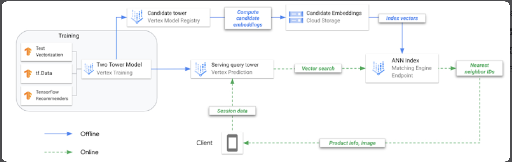

## Candidate Generation
The reason candidate generation is so useful, is because it typically allows us to reduce our search space from the entire corpus, typically petabytes in size, to a searchable susbscape of typically hundreds or thousands of items

It's also done relatively quickly, ideally in a way where we can index / lookup a matrix or user history in a relatively fast fashion, on services that have been updated in the background by our web servers. Basically, we are hoping that as users use our service their item and user history have been being updated and sent to our search systems in real-time, and when we need this information our architecture is setup to be real-time responsive

In Candidate Generation, ***Queries are Users and we compare them to Items***

### User-Item Matrices
Our [Embeddings](/docs/transformer_and_llm/EMBEDDINGS.md) concept paper discusses this in detail, but for all of our systems we generally have 2 key components - queries (users) and items

Over time users engage with items (which might be other users!), and this is a scorable numeric metric - they either rank them (movies), watch them (Youtube video watch time), read them (Newspaper post read through length), or engage with them (check another users page)

These ***co-occurrence*** matrices showcase how our users (queries) interact / are related to our Items

For all intents and purposes, the matrix defined of our users and how they engage with items is perfectly fine to use as our embeddings. In the below example, let's say it's users video watch time, user 1 engages with item 1 for 90 minutes
$$
M = \begin{pmatrix}
    90 & 4 & \cdots & 20 \\
    18 & 66 & \cdots & 25 \\
    \vdots & \vdots & \ddots & \vdots \\
    110 & 46 & \cdots & 38
\end{pmatrix}
$$
Or maybe we can make it percentage of video watched through (it would be some [numeric feature standardization](/docs/transformer_and_llm/EMBEDDINGS.md#numeric-features)) which would bring each number into the standardized range of $[0, 1]$
$$
M = \begin{pmatrix}
    .9 & .2 & \cdots & .1 \\
    .35 & .5 & \cdots & .25 \\
    \vdots & \vdots & \ddots & \vdots \\
    .05 & .99 & \cdots & .75
\end{pmatrix}
$$

With this setup we have now projected our Users and Items into an Embedding Space $E \in \real^v$ where $v$ defines the total number of videos in our corpus. Since $v$ is probably humongous, we need to somehow filter this down

The usual idea is to split this into two separate matrices $U \in \mathbb{R}^{v'},\ I \in \mathbb{R}^{v'}$ where $v' \leq v$ to ultimately reduce the total size of our search space while preserving information - this is [Matrix Factorization](#matrix-factorization) which we will see later!

### Similarity
If we want to find similar users, we have a search function $S: E \times E \rightarrow \real$ where $S(q, x)$ has a query $q$ and compares it to each other embedding $x$ in our embedding space to find similar vectors $x$, which may be Users or Items. This allows us some flexibility in "find similar users / items to user Q" and then we can use [ScaNN (Scalable Nearest Neighbors)](https://github.com/google-research/google-research/tree/master/scann) to find the Top K nearest vectors

Our [Vector Similarity Scoring](/docs/transformer_and_llm/EMBEDDINGS.md#vector-similarities) can be anything from Cosine to Dot products, but for this example if we normalize all of the vectors down to $[0, 1]$ we should be able to use either. 

In any other example, a popular video tends to coincide with larger norms, and so our recommendation would probably favor those videos with the Dot product

## Filtering and Factorization
Filtering leverages the idea that users who have agreed in the past will agree in the future, based on user similarity or item similarity

In either way we can use embedding matrices for Queries (Users) $U$ or Items $I$, or a combination of them. Similarity between items is calculated using metrics such as cosine similarity, Pearson correlation, or Jaccard index

To find recommendations, you compare the query (User embedding) to all Item embeddings using similarity metrics (e.g., dot product, cosine similarity), which will ultimately give you the top Items for a User

This example from Google shows how if we have $m$ Playlists who have $n$ songs we can use this co-occurrence matrix, factorize it, and then find similar Playlists. Factorizing these into $k$ dimensions allows us to find the ***Top-K Latent Features*** of each playlist, and ultimately to compare it to other playlists using geometric vector distance. 

This is similar to factorizing a `User x Item` matrix, and then doing a dot product with $n$ items to find what ones would be useful to User. It's a bit odd because we're saying we can compare Track Embeddings to Playlist Embeddings, but ultimately we're calculating the interaction score / goodness score of adding a new Track to a Playlist


### Item Content Filtering 
- Recommends items to a user based on the similarity between items
- If each of our items has some generic features that describe it, similar to our User-Item matrices we can just host all of these features in a matrix and consider it our ***Item Embeddings***
- If we have a binary set of features, then the Dot product over them is basically a count of the number of similar features!
    - If we have a range of numeric values then our Embedding similarity metrics will help us calculate the score between items based on similar dimensions

| Pros | Cons |
|------|------|
| Don't need user information for items| |
| Can compute quickly, and in a distributed manner| Matrix has a large memory footprint |

### User-Item Collaborative Filtering 
Collaborative Filtering allows us to use Users and Items *at the same time!*. It recommends items to user A based on the preferences / history of similar user B

#### Idea Behind Collaborative Filtering
- Desire is to predict user preferences based on previous history
- Set of users $U$
- Set of items $I$ that are to be recommended to $U$
- Learn a function, $f(U_i)$ based on the user’s past interaction data $i$ which predicts the likeliness of item $I$ to $U$
    - Essentially we pull all user interactions, and we start to find users who have interacted in the same way with past items
        - Compare $f(U_j)$ to $f(U_k)$, and then if they are similar for some historic items, we can assume that $U_k$ and $U_j$ might have the same preferences
        - If that's the case and $U_k$ enjoyed an item that $U_i$ hasn't seen yet, we should offer it to user $U_i$
    - How is this done?
        - We need to be able to find *K Nearest Neighbors* i.e. (K nearest Users!) of a user which could be based on:
            - User-Item relations:
                - Item rankings
                - Item usages
                - Item purchases
                - etc...
            - User relations:
                - User location
                - User demographic
                - etc...
        - Once we have some sort of way to categorize these users, we can start to rank nearest neighbors

| Pros | Cons |
|------|------|
| Able to introduce users to new items| Cold start problem for new items|
| Clean interface / interaction| Sparse datasets that take up a lot of memory |
| Can randomly seed user with user demographics| Popular items get a disproportionate amount of attention|

##### Collaborative Filtering Input
Typically has a User-Item Matrix where Users are rows and Items are columns
***The below matrix is our embeddings, and as far as this page is concerned, that's it!***

$$
M = \begin{pmatrix}
    r_{11} & r_{12} & \cdots & r_{1n} \\
    r_{21} & r_{22} & \cdots & r_{2n} \\
    \vdots & \vdots & \ddots & \vdots \\
    r_{m1} & r_{m2} & \cdots & r_{mn}
\end{pmatrix}
$$

- Where:
    - $ M $ is the user-item matrix
    - $ r_{ij} $ represents the interaction between user $ i $ and item $ j $
    - $ m $ is the number of users
    - $ n $ is the number of items
---

TLDR;
- **Raw Data:**
    - You start with user-item interaction data (e.g., user watched video, user rated movie, user clicked product).
- **User-Item Matrix** ($M$):
    - *Rows* = Users
    - *Columns* = Items
    - *Entries* = Interaction value (e.g., rating, watch time, click, etc.)
    - *Example*: $M_{ui}$ is the interaction between user $u$ and item $i$

##### End Goal
After "doing something" with our input here, we'd like to be able to ***predict which items a user will like / interact with next***

Our end goal is to "fill in" the User-Item interactions that currently do not exist, i.e. we want to assign values to all $M_{ui}$ that do not exist

#### Collaborative Filtering Algorithm
The actual algorithm would just involve taking that matrix and doing Cosine, Jaccard, or basic dot product similarity between the rows to get similar users, and then retrieving the Top K entries in $i$ that were not in $j$ to find all of the new recommendations for $j$

In the table below we see that ***User 1*** is our Query, or the User we'd like to create recommendations for, and our current scope is $K=1$ top 2 recommendations

The 2 most similar are Users 2, and 5, (which we could find with a Vector Similarity metric), and that User 1 has not interacted with Item B, which both other similar users have ranked as Good=1, so we can recommend Item B to User 1

| User   | Item A | Item B | Item C | Item D | Item E | Item F |
|--------|--------|--------|--------|--------|--------|--------|
| ***User 1** (Query) | **1**    | **NA**    | **1**    | **0**    | **0**    | **0**    |
| **User 2**       | **NA**    | **1**    | **1**    | **0**    | **0**    | **0**    |
| User 3           | 0      | 1      | NA      | 1      | NA      | NA     |
| User 4           | NA      | 0      | 1      | 1      | 0      | 1      |
| **User 5**       | **1**    | **1**    | **1**    | **NA**    | **0**    | **0**    |

___

Some pseudocode for the actual algorithm to filter a specific user $U_i$, and find their $K$ nearest neighbors:
```
max_heap = heap()
for other_user in users:
    max_heap.push(
        struct(
            calculate_similarity(user_i, other_user),
            user_i,
            other_user
        )
    )

resp = []
for _ in range(k):
    resp.append(max_heap.pop())
return(resp)
```

```
function find_similar_users(user_item_matrix, target_user, K):
    # Step 1: Calculate similarity between target_user and all other users
    similarities = []
    for user in user_item_matrix:
        if user != target_user:
            similarity = calculate_similarity(user_item_matrix[target_user], user_item_matrix[user])
            similarities.append((user, similarity))
    
    # Step 2: Sort users by similarity in descending order
    similarities.sort(key=lambda x: x[1], reverse=True)
    
    # Step 3: Select the top K users with the highest similarity
    similar_users = [user for user, similarity in similarities[:K]]
    
    return similar_users

function calculate_similarity(user_vector1, user_vector2):
    dot_product = sum(a * b for a, b in zip(user_vector1, user_vector2))
    magnitude1 = sqrt(sum(a * a for a in user_vector1))
    magnitude2 = sqrt(sum(b * b for b in user_vector2))
    if magnitude1 == 0 or magnitude2 == 0:
        return 0
    return dot_product / (magnitude1 * magnitude2)
```

### Matrix Factorization
Matrix factorization is a technique used in recommender systems to decompose a large matrix into smaller matrices. This technique is particularly useful for collaborative filtering, where the goal is to predict user preferences for items based on past interactions.

For the above discussion on [Collaborative Filtering](#user-item-collaborative-filtering), we noticed one of the Cons was that this was a gigantic matrix and it's difficult to actually run the collaborative filtering algorithm to find similar users...we need a way to get past this

This was brought up before in the [User-Item Matrices](#user-item-matrices) section above how ideally we can reduce our gigantic matrix into $U \in \mathbb{R}^{v'},\ I \in \mathbb{R}^{v'}$ where $v' \leq v$. This would allow us to compare 2 rows in a much more efficient manner by using dot product of 2 vectors (row and col)

***At the end of the day all we want are EMBEDDINGS that allow us to compute User-Item overlap before we go to Ranking!!!***
___


#### Explanation
1. **Decomposition**:
    - Using the Matrix $M_{ui}$ from our discussion above where the $U$ rows represent Users and the $I$ columns represent Items
    - [Google Docs on Matrix Factorization](https://developers.google.com/machine-learning/recommendation/collaborative/matrix) show how it decomposes the original matrix into two lower-dimensional matrices:
        - **User Matrix (U)**: $U_{uv'}$ Represents latent features of users.
        - **Item Matrix (V)**: $V_{iv'}$ Represents latent features of items.
        - Both of these matrices are based on the dimensions of $M_{ui}$ that get turned into $U_{uv'}$ and $V_{iv'}$
    - The embeddings learned from decomposing $M$ gives us two new matrices, where the dot product $U_{uv'} \cdot I_{iv'}^T$ gives us ***an approximation*** of $M$
        - To break this down, it means we can have 2 smaller matrices that we can pick and choose row / column pairs from to get the original matrix, which helps us to speed up queries and reduce memory footprint
    - The product of these two matrices approximates the original matrix.

2. **Latent Features**:
   - Latent features, particularly of size $v'$ capture underlying patterns in the data, such as user preferences and item characteristics.
   - These features are not directly observable but are inferred from the interaction data.

3. **Optimization**:
   - The decomposition is typically achieved through optimization techniques that minimize the difference between the original matrix and the product of the two lower-dimensional matrices.
   - Common optimization methods include Singular Value Decomposition (SVD) and Alternating Least Squares (ALS).

#### Formula
Given a user-item interaction matrix $ M $, matrix factorization aims to find matrices $ U $ and $ V $ such that:
$$
M \approx U \cdot V^T
$$
Where:
- $ M $ is the original user-item interaction matrix.
- $ U $ is the user matrix with dimensions $ m \times v' $ (where $ m $ is the number of users and $ v' $ is the number of latent features).
- $ V $ is the item matrix with dimensions $ n \times v' $ (where $ n $ is the number of items and $ v' $ is the number of latent features).

##### First thoughts
We need an objective function: $\min_{U \in \mathbb M^{u \times v'},\ I \in \mathbb R^{i \times v'}} \sum_{(i, j) \in \text{obs}} (A_{ij} - \langle U_{i}, V_{j} \rangle)^2.$


- The first thought we should have is minimizing the differences between $M - (U \cdot V)$ which intuitively means "ensure that $U \cdot V$ is as close to $M$ as possible"
    - There are some general issues with this:
        - We can only sum / observe values that are 1...meaning all of our unobserved values are lost
            - This will lead to a model that can't really "learn" and just see's "good" results since it will be minimal loss
        - We could treat the unobserved values as 0 to combat this, but that leads to a gigantic sparse matrix
- So we know we need to hold the unobserved observations and learn against them, but we know that's a gigantic matrix that we need to somehow solve for

Below we will get into different objective functions, but a good visualization from Google Docs
- Observed only means we only focus on user-item interactions that have occurred
- Weighted will allow us to utilize unseen user-item interactions, weighted to a certain degree $w_0$
- SVD at the end is how we actually compute "differences" for our objective functions


##### Singular Value Decomposition (SVD)
Singular Value Decomposition, as shown above, is a way to solve for the 2 types of objective functions we setup - regardless of if we use Weighted or Only Observed

It is mentioned that this is rarely used because the input matrices are so sparse, and that it ultimately isn't worth it most of the time. A more reliable and stable method is Weighted Matrix Factorization

#### Weighted Matrix Factorization
- *Weighted Matrix Factorization (WMF)* breaks things up between observed and unobserved observations
    - This is helpful because the unobserved observations can be in the range of millions - for all the videos on YouTube, any user probably watches ~100 but there are millions of unobserved ones
    - Therefore, WMF allows us to introduce a new hyperparameter, $w_0$, that helps us to weight those unobserved observations and to reduce the computational complexity of it
    - This is useful because it helps us to decompose the objective function into 2 specific sums that are easy to compute over sparse matrices - ultimately the calculation of this matrix is how we create our underlying $U$ and $V$ matrices from $M$

In the below equation there's a regularization portion not discussed in the Google Docs - it's a useful tool during training time
$$
\min_{U, V} \left( \sum_{(i,j) \in \text{observed}} w_{ij} (m_{ij} - u_i \cdot v_j^T)^2 + w_0 \sum_{(i,j) \in \text{unobserved}} (u_i \cdot v_j^T)^2 \right) + \lambda \left( \sum_{i=1}^{m} |u_i|^2 + \sum_{j=1}^{n} |v_j|^2 \right)
$$

Where:
- $ \sum_{(i,j) \in \text{observed}}$ represents the sum over all observed interactions.
- $ \sum_{(i,j) \in \text{unobserved}} $ represents the sum over all unobserved interactions.
- $ w_{ij} $ is the weight for observed interactions.
    - Typically this is a function of the frequency of query $ij$ - it allows us to reduce the overall effects of frequently visited videos
- $ w_0 $ is the hyperparameter for unobserved interactions.
- $ \lambda $ is the regularization parameter.
    - Regularization is useful here to help us prevent overfitting by penalizing large values in the user and item matrices
    - Another way this is done is by weighting $w_{i,j}$ carefully, and disregarding the regularization parameter entirely

Solving for this equation:
- We can use [Stochastic Gradient Descent (SGD)](/docs/training_and_learning/LOSS_FUNCTIONS.md#stochastic-gradient-descent) or [Weighted Alternating Least Squares (WALS)](/docs/training_and_learning/LOSS_FUNCTIONS.md#weighted-alternating-least-squares)
    - SGD is more generic, but is battle tested and true
    - WALS is more specific and helpful for this specific objective
    - WALS is most likely the ideal function since both matrices we solve for are quadratic
        - Each stage can be solved as a linear system, which allows us to distribute the computation across nodes and ultimately converge on finalized matrices $U$ and $V$

| Pros | Cons |
|------|------|
| No domain knowledge needed | Cold start problem for new items|
| Battle tested and useful | Not able to add in other side features |
| Good starting point for most rec systems for CG | |

- *For cold start problem, 
    - For items with absolutely no embeddings: Most use cases will just average the embeddings of items in a similar "category" as defined by domain knowledge, and then use that as a starting point to iterate and update
    - For a new item or new user with limited interactions, one single iteration of WALS should give us a useful embedding by holding the other category fixed and finding the closest other item given any interactions

### Updating Filtering and Factorization Models
Incrementally updating these models would be beneficial for new User-Item interactions $m_{ij}$ that we haven't seen before, it would be ideal if we can update our latent matrices $U_i$ and $I_j$ without having to rerun the entire re-training method

Most of the time in practice we would simply re-train the model every night after we've seen new interactions because retraining isn't that costly

That being said, there are methods to incrementally update these models:
    - Fold In
    - Incremental Learning

## DNN For Candidate Generation
- DNN will allow us to solve the Cons listed above for filtering
    - Using side features
    - Cold start
    - "Freshness" and bypassing "popular only" items via Dot product
- Pretty much everything is the same for creating / fetching the user-item embeddings, but we can also add in other features such as generic user embeddings, user metadata and categorical features, and other account information that might be relevant
- [A Softmax Layer](/docs/training_and_learning/LOSS_FUNCTIONS.md#softmax) will allow us to do multi-class classification, where we basically predict the probability of usage over an entire corpus / corpus subset of videos
    - The softmax layer would need to be trained over the entire corpus since any of the videos have a potential to be included in this (sub)set
    - Since our output is a probability distribution that's comparable to truth (all 0's and a 1) we can use [cross-entropy loss function](/docs/training_and_learning/LOSS_FUNCTIONS.md#cross-entropy)
- We could also add in other hidden layers and non-linear (ReLU) layers, or anything else, to capture non-linear relationships
- We could also change the entire hidden layers to remove the matrix factorization phase, and use the hidden layers as a way to map user features into a projected embedding layer

DNN allows us to reduce latency during serving time by decoupling Query Embedding and Item Embedding creation, but we are still using DNN instead of Matrix lookup so overall it might be slower. We can pre-compute Candidates (Items), and then store them in a Vector Type Database for quick lookup

Here's an example of architecture from Google's Blog


### Two Towers
Two Towers will also generate embeddings for users and items, similar to Matrix Factorization, except in this scenario there's one tower for Queries (Users), and one tower for Items. If we ran Two Towers for the same Factorization problem above about Playlist and Tracks it'd look like this


The Two Towers will allow us to create Dynamic, and maybe even [attended to](/docs/transformer_and_llm/EMBEDDINGS.md#attention) embeddings, which is different from static embeddings created via Filtering & Matrix Factorization. At the end to get a recommendation it's a similar option where we compute similarity of Query to all Items (maybe using [ScaNN (Scalable Nearest Neighbors)](https://github.com/google-research/google-research/tree/master/scann)) and find Top K

This will allow us to bypass the cold start problem, and the static embedding problem, but increases our latency as we need to use another DNN call in our Ranking service

### Multi Tasks Learning
The tasks of this model are important, if we strictly focus on "probability of engaging" we might end up recommending click-bait videos, or if we do "time spent watching" it might recommend videos that try to get the user to keep watching long into the videos

Ultimately we want to use simple tasks to find relevant content for the users, and we could use multi-task learning to do so

TODO: Describe multi-task learning outputs and model weight updates using `./other_concepts/MULTITASK_LEARNING.md`
    