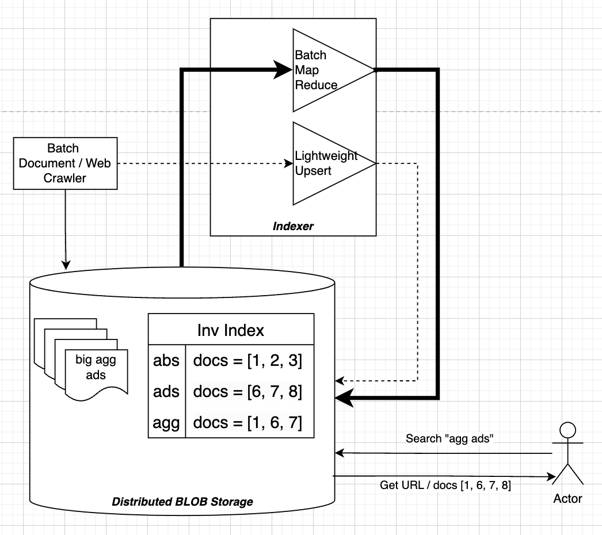

## Inverted Index
This is by far the most used search data structure, and it's great for capturing ***lexographic*** similarities such as unique words in a document, common words in documents, and things like that

Allows us to compare a users string query to a large corpus of documents

***This is not frequently used in things like User-Item recommendations, it's more-so used in free text similarity scoring***



Inverted Indexes are great because there's no training, you can generate large pools using n-grams, and it can be distributed for fast lookup

They are typically high precision and ***low recall though, and often miss candidate pairs due to missing context or inexact matches***

### Discussion
This architecture does allow for batch and online (fast) processing of documents, but there are pieces missing

- ***Slow:*** The serving is done from a lookup on Blob Storage which sits on disk
- ***Frail:*** Certain words in documents or in query might be misspelled
- ***Misses Context:*** "River Bank" and "Bank Deposit" would both return the same documents referring to "Bank"

The inverted index is going to be a truly core data structure for search moving forward, but there are ways to improve the actual serving and comparisons which has led to many other discoveries

## Hashing
There's another route that involves n-gram, MinHash, and Locality Sensitive Hashing (LSH) that is in the same "vein" as inverted indexes, but it's just a bit smarter

It's robust in the face of small differences between text vectors because of n-grams. It's dimensionality reducing by way of MinHashing, and it allows us to do Approximate Nearest Neighbors (ANN) quickly

### N-Grams / Shingles
n-grams / shingles are basically just sliding windows that produce chunks based on the original text

Example:
- Sentence: "A quick brown fox"
- Window size: 3
- Grams / Shingles:
    - `["a q", " qu", "qui", ..., "fox"]

N-Grams are useful becuase we can still find similarity in vectors like "the big brown dog" and "the brown dog" because a majority of the grams will still overlap in a jaccard similarity score 


*Note: Remember Jaccard = `Intersection(A, B) / Union(A, B)` so the only part that would be in Union but not Intersection here would be "big"

```python
def shingle(text: str, n: int):
    shingle_set = []
    for i in range(len(text) - n+1):
        shingle_set.append(text[i:i+n])
    return set(shingle_set)
```

The output of shingling is a set of unique n-grams 

The ***Vocabulary*** is the union of all n-grams of all input documents $V$

Finally, to produce sparse vectors from our n-gram approach we would take a vector of size $V$, and for each set output from shingling we'd one-hot encode all of the entries based on their index in the vocabulary


### MinHash
MinHash is a technique for estimating the similarity between two sets, and it's also a form of dimensionality reduction

We take sets of one-hot encoded n-grams, and eventually will reduce them into *signatures* which ***uphold distance*** in their new "embedding" or reduced dimension space $S: S \lt V$

$Minhash(x) \in \real^{S}$

The hash function is simple:
- Create a new sequence vector from `[1, len(vocab)]` 
    - So if we have 200 words it's `[1, 200]` (200 inclusive)
- Randomize those numbers
- Place them next to the one-hot encoded vector
- Go from index 1 upwards until we find a 1 in the OHE vector
    - This means, find index 1 in the random Minhash vector
        - Let's say the index of 1 in the MinHash vector is 4
    - Check if corresponding entry in OHE is 1
        - `ohe[4] == 1`
    - If not, continue to 2
    - Continue until the OHE entry is 1
- Take whatever random index is there, and use that as the hash output

```python
minh_idx = 1
while ohe[minh.index(minh_idx)] != 1:
    minh_idx += 1

return(minh_idx)
```

Therefore, if we want a size 20 output, we do that same process 20 times


If we had 20 of these random vectors, 2 would be the first output but in the future it may be `[2, 65, 20, 17]` etc...

That's the final output!

### Locality Sensitive Hashing (LSH)
The final way to make this usable for fast similarity lookups is by using LSH

If we just compared outputs of MinHash by themselves, it wouldn't be that useful

Instead, we ***band***, or n-gram, out the MinHash output signatures themselves, and then if any of the banded n-gram outputs match we consider the 2 vectors a candidate-pair

The banded vectors actually get hashed by a specific function and end up as an integer, and the idea is to use a hash function `LSH(x)` that has high collissions - the lower the band size the more likely we are to find overlaps, but also the less precise things will be

A band size the full size of MinHash would mean both vectors are perfectly equal, band size of 1 means a single n-gram MinHash overlap


### Intuition
So what is the output of all this?

To have the same LSH bucket means you've had the same selection of some number of n-grams

If the bucket size is 3 in LSH, that means you've had to have a signature that's equivalent, and the signature is a uniformly random choosing of n-grams

One example would be tokenizing an address based on spaces, instead of fixed window size, so that we have all components of address chunked out - this means our buckets could match on house number, street name, street type, apartment number, or anything else