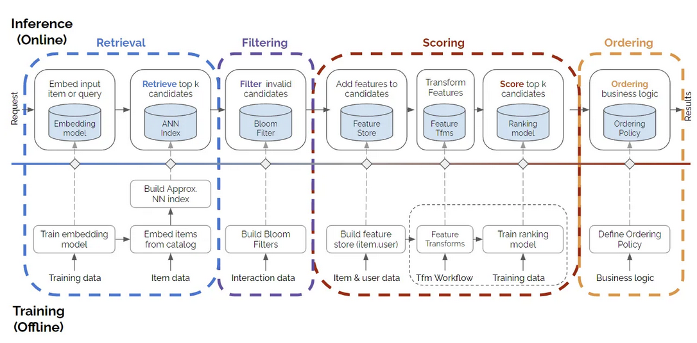
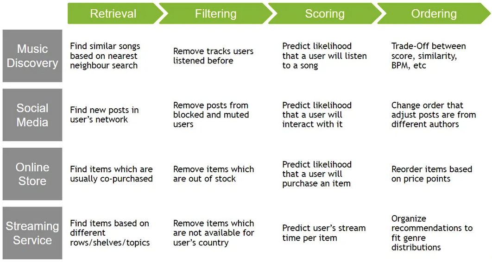

## Ecommerce Diagram
Below we can see a generic E-Commerce website setup that includes a recommendation system

This flow only includes the default user recommendations, and in other flows we'd have to include "current search item" or "returned order item" or something similar

The dotted lines represent our [Filtering Steps](#filtering) which is the part of our rec service that should be fairly "online and up to date", whereas our [Candidate Generation](#candidate-generation) and [Ranking](#ranking) are trained / updated over time, but not always "up to date"

The diagram below is for the ***Log-On*** scenario for a user, and doesn't include any query terms or search context. This "involved" diagram is one of the simpler cases!

- ***Notes***
    - We specify CDN + User Sessions and Cookies because at a high level they show how we are going to run some sort of personalization
        - We will process user + item history and eventually create interaction data in our data warehouse, and that's only possible if we have general click data
    - Parallel / Concurrent calls
        - Our calls to `/GET Homepage` to our API GW and `/GET Recs ? userId=...` should happen in parallel, and each database should be able to handle async concurrent requests so that all of this info can get aggregated and returned to users browser
    - Our Rec System
        - [Candidate Generation](#candidate-generation) is a very important step that should be altered for whatever we are looking to do...some tasks might need collaborative filtering, some content, some plain old lists
        - [Filtering](#filtering) is ***stateful*** meaning it makes multiple database calls to other services - it is where we can inject experiments, place in ever-changing business rules, and really update it to anything we want
          - Keeping a place to "remove any videos that are viral in Asia" is easier to do in a Filtering phase with configs versus placing that logic in a model somehow
        - [Ranking](#ranking) is using a DNN, and we should train it for ***multi-task*** learning to ensure it maximizes engagement, conversion, usefullness, and other tasks. We don't cover that paradigm below, most of the DNN discussion is around "probability of engagement" or "predicted watch time" which are both prone to clickbait, but are an intuitive start
        - Most of the time these issues would be handled in our Filtering phase with yet another model tied to it for predicting click-bait!
    - Event Streaming + Warehousing is used across the board for CDC from the databases to ensure we can run analytics and retrain models for future recommendation systems
      - ***This system relies heavily on a Data Platform*** which is more than just a Data Warehouse which allows us to retrain models, run queries, and implement online and offline queries and transformations
    - [Top K Heavy Hitters](/docs/design_systems/top_k/index.md) is covered in another system design, but here we could use our warehouse to implement it. We'd want to observe real-time trends, seasonal patterns, and viral content
    - This is all handled via an [API Gateway](/docs/architecture_components/typical_reusable_resources/typical_frontend/index.md), or typical frontend, which, along with proper load balancing and caching, can help ensure all of our requests are secure, correctly routed, and even minimal aggregation for returning to users browser
        - It can also help with experimentation routing! 

## Search Systems
Search Systems (also Recommendation systems since we recommend something back) are used for finding relevant content based on a query

- "What day is it today"
- "Michael Jordan Dunk"
- etc...

All of these things are queries and we'd expect different content to be returned

For a further look at [Embeddings](/docs/transformer_and_llm/EMBEDDINGS.md#embeddings) check out the sub-document

Youtube will typically return Videos, Google will return almost any content type, App Store would return applications, and Facebook might return posts / users (friends)

An Example from Nvidia

### Terminology
- An ***item*** is generally the thing we'd want to recommend
- A ***user*** uses items and can be recommended items
    - Users have a history of item usage
- A ***query*** comes in at some time, usually from a user, and we would recommend items for that query
    - A query can be considered the general context / information a system uses to make recommendations
- An ***[embedding](/docs/transformer_and_llm/EMBEDDINGS.md#embeddings)*** is a way to create numeric representations of items, users, and queries which help us in the steps below
- Recommendation Scenarios:
    - *Log-On:* When a user logs on and the system will recommend items to them
    - *Search:* When a user queries for a specific item and we return items based on that query
    - For each of the types above we will need to *project* the query context into some sort of *embedding space* and ultimately return some sort of Top K item results to the user
- General architecture:
    - ***Candidate Generation:*** is where we efficiently distill the entire corpus of items down to a manageable size - this typically has high precision where anything we return is good, but we might have missed some good items in the process
    - ***Retrieval and Scoring:*** is where we take the distilled space and run large scale heavy computations against the query / user context to decide on the best videos. This step typically has high recall where we will ensure we get every possible candidate the user might find interesting
    - ***Re-Ranking:*** Takes into account user history, current trends, and other policies we might want to have included in our system that change more quickly. Typical policies include pirated content, child restrictions, user personalization, and clickbait removes, among many other policies. We woudln't want to include all of this in our generic candidate generation or ranking steps since it'd ultimately cause heavy retraining and recomputing of our Embedding Space

## History
Over time recommendation / search systems have gone through a lot of changes 
- At first we used inverted indexes for text based lookups of documents which would allow things like webpage lookup on google
  - You can setup next letter prediction based on the [Trie Implementation](/code/trie.py), and most of your iPhone's next word / letter prediction are based on Trie's and Word Embeddings
- Most of this stayed with token-based matching using more advanced methods like n-grams, maybe using distance metrics like Levenshtein, or even some minimal ranking with TF-IDF based methods
    - The takeaway here was that we were always comparing text-to-text
    - These systems had ***high precision, but low recall***...if a word matches char for chat, it matches! But finding the matches that didn't 100% overlap became an issue
- Over time:
    - Scale occurred:
        - Recommendation systems started to span multiple content types, from videos to other users to generic multimedia, and the systems had to keep up
        - Companies started to have humongous web scale for items like Amazon, Google, and Facebook
        - These evolutions led to new search systems that had multiple stages across various content types ***which led systems to converge on Candidate Generation and Scoring over projected embeddings***
    - Embeddings occurred:
        - We started to look to scores that could be calculated between `<query, candidate>` pairs to give us high precision and higher recall

Search has started to move away from returning items to returning summaries and question answering live through "GenAI", but in reality this is mostly still based on Transformer models and NLP tasks where we surround it with new context / query information

Here's a list of Examples from the Wild from NVIDIA

### Inverted Indexes
[Inverted Indexes](INVERTED_INDEX.md) have been around for a long time, and they built the original search systems we think of. When you hear of "Google indexed my page" or "Google crawled my page" it is referring to a system similar to this

There's many still used today, but for the most part systems require utilizing context, user features / demographics, and many other inputs to help design Search and Recommendation Systems

### Embeddings
[Embeddings](/docs/transformer_and_llm/EMBEDDINGS.md#embeddings) are a way to create dense, numeric representations, that can have geometric operations like subtraction, addition, and "closeness", performed on them

- [Word Embeddings](/docs/transformer_and_llm/EMBEDDINGS.md#bert-word-embeddings) are how we turn words into vectors, and was the start of most embedding models...everything changed when we started to use [attention](/docs/transformer_and_llm/EMBEDDINGS.md#attention)
- [Sentence Embeddings](/docs/transformer_and_llm/EMBEDDINGS.md#bert-sentence-embeddings) are basically just aggregations of word embeddings, but things get a bit tricky and we start using multiple hidden layers
- [Document Embeddings](/docs/transformer_and_llm/EMBEDDINGS.md#bert-sentence-embeddings) are basically just concatenated or aggregated sentence embeddings
- [User Embeddings](/docs/transformer_and_llm/EMBEDDINGS.md#user-embeddings) are typically created using User-Item interactions, along with other features like demographics, click through data, or history
- We can create embeddings for almost anything, but at the end of the day the embeddings need to make sense for what we want to do, which is typically find "similar" things, or find geometric interpretations of "things" like Paris is to France as Berlin is to Germany

## Scalable, Real Serving Systems
We'll walk through how serving systems would be architected in the current world

### Candidate Generation
The [Candidate Generation](./CANDIDATE_GENERATION.md) sub-document covers all main areas of candidate generation phase, but in most cases we'll basically be creating the user-item matrices as a batch at some specific time, and then updating it at some cadence as users interact with our service

If we choose to simply use filtering methods then all of the updates and batch creation can be done offline, and if we truly want our recommendations to be as up-to-date as possible we'd have to rerun the WALS update of user-item engagement each time a user uses our service

If we choose DNN, the DNN needs to be ran each time for a specific user to get the output Candidate Generation which leads us into ML Engineering Inference API's

#### Embedding Space Updates
How do we update our embedding space as users use our services?

We would need to capture the user click information as it's happening, and stream that data into a user database or an analytical data warehouse 

#### User-Item Matrix Updates
Once the data is in some sort of processing engine, we'd need to update the specific pointed row-column $r_{ij}$ corresponding to user $i$ on item $j$. This might be incrementing some usage statistic, upadting metrics on the fly, or something else. This can be apart of *Feature Engineering* pipelines that run on streaming data

The toughest part will be recomputing the user-item embeddings using WALS or SGD, as we'd have to clone the matrix somewhere else or pause updates on it as we created our new latent matrices $U$ and $V$ during [Matrix Factorization](./CANDIDATE_GENERATION.md#matrix-factorization) 

Then as the user returns, we'd have updated embeddings to serve them with

#### DNN Updates
The DNN needs to be ran each time for a specific user to get the output Candidate Generation, and updating the model parameters each time wouldn't be smart so DNN gets retrained as our training data drifts from our User-Item data

The data drift detection can be a separate background feature pipeline in our processing engine, and once there's a significant enough change we can schedule a new model to be trained for inference

### Filtering
Since our Candidate Generation models must run in milliseconds over gigantic corpus, we shouldn't embed any sort of "business logic" inside of them - things like product being out of stock, product not being child friendly, or product being too far away. These things should be based on user-features, but shouldn't fluff up our Candidate Generation model

In the past a ***Bloom Filter***, which is now common place in many scenarios, was used to disregard items that the user has already interacted with!

Bloom Filters are a way to quickly check if something is part of a set. Bloom filters are extremely fast probabilistic data structures - they are bit arrays that are set to all 0's and then we add items to it over time. When we add a new item we apply some hash functions to it, and the resulting index is updated to 1. 

Therefore, when searching for a new item we apply the same hash functions to it, and if we find a 0 the item is definitely NOT in the list (high recall - no false negatives), but if there's a 1 the item is likely in the set (hash collisions could bring about false positives)

Once the filtering is done, we can send things through to Scoring

### Scoring
Given a user coming online, or a query being submitted, how do we actually obtain a set of items to present? This is the main focus of Retrieval and Scoring, sometimes called Ranking, and there are even some Re-Ranking steps involved...

For a [Matrix Factorization](/docs/transformer_and_llm/EMBEDDINGS.md#matrix-factorization) technique, we'd have the static embedding matrices sitting in an API or on disk somewhere for us to look up at query time. We can simply look things up from the User Embedding Matrix to get our query embedding $q_u$

For a DNN model we need to run an inference forward-pass to compute the query embedding at query time by using the weights that were trained from [DNN Updates](#dnn-updates) $q_u = \phi(u)$

The algorithms described in [Ranking and Scoring](./RANKING.md) can also be used here - it's really a horse a piece and what features you put into each and the objective function they're trained to "solve"

- Typical Scoring features / policies:
    - Geographic closeness for things like Restaurants and Bars
    - User account features for personalization
    - Popular or trending items for the day

This is typically done using heavier models, and / or new features & policies, to create a finalized list to present to the user

Heavier models would include things like DNN predicted user watch time of each video (item) from the final Candidate Generation list. In this case we could have a DNN for Candidate Generation over our entire corpus, and then another DNN with more hidden layers and features to predict watch time for each video, but some systems just combine these into one for latency requirements

Why do we split Candidate Generation from Ranking?
- Some systems don't!
- Some systems use multiple Candidate Generation models
- Some Ranking models use heavier sets of features or heavier models that can't run over the entire corpus

#### KNN
Once we have our query embedding $q_u$ we need need to search for the Top K Nearest Neighbors (KNN) items $V_j$ in the Item Matrix that are closest to $q_u$ - this is typically done with the [Ranking and Scoring](./RANKING.md) algorithms described elsewhere, which help us compute a score $s(q_u \cdot v_j)$ for our query across the Item Embedding Space 

Pseudocode:
  - Get the user’s embedding vector $u$ from $U$ (for the target user)
  - Compute similarity scores between $u$ and every item vector $v_j$ in $V$
    - Most commonly, use dot product: $s_j = u \cdot v_j$
    - You can also use cosine similarity or Euclidean distance
  - Sort all items by their similarity scores (descending for dot product/cosine, ascending for distance)
  - Select the Top K items with the highest scores

This is a fairly large and complex thing to do online for each query, but there are ways to alleviate this!
  - If the query embedding is known statically, the system can perform exhaustive scoring offline, precomputing and storing a list of the top candidates for each query. This is a common practice for related-item recommendation.
  - Use approximate nearest neighbors. Google provides an open-source tool on GitHub called [ScaNN (Scalable Nearest Neighbors)](https://github.com/google-research/google-research/tree/master/scann). This tool performs efficient vector similarity search at scale
      - ScaNN using space pruning and quantization, among many other things, to scale up their Inner Product Search capabilities, which basically means they make running Dot Product search very fast, and they also mention support of other distance metrics like Euclidean 
    
Most of the time computing Top K is very inefficient - approximate Top K algorithms like Branch-and-Bound, Locality Sensitive Hashing, and FAISS clustering are used instead

##### Branch And Bound
- **Description**:
  - A search algorithm used to efficiently find the **Top K nearest neighbors** by pruning irrelevant regions of the search space.
  - It systematically explores the search space while maintaining bounds on the best possible solution.
- **How It Works**:
  - Calculates a **lower bound** for each candidate region and compares it to the current best solution.
  - Regions that cannot contain better solutions are pruned, reducing the number of comparisons.
- **Use Case**:
  - Effective for **exact nearest neighbor search** in structured datasets where pruning can significantly reduce computation.
- **Limitations**:
  - Computationally expensive for high-dimensional data unless combined with other techniques like space partitioning.

##### Locality Sensitive Hashing (LSH)
- **Description**:
  - A technique for **approximate nearest neighbor search** that hashes similar items into the same bucket with high probability.
  - Reduces the dimensionality of the data while preserving similarity.
- **How It Works**:
  - Uses hash functions designed to maximize the probability that similar items (based on a distance metric like cosine similarity or Euclidean distance) map to the same hash bucket.
  - Instead of comparing all items, only items in the same bucket are considered for nearest neighbor search.
- **Use Case**:
  - Ideal for **high-dimensional data** and large-scale systems where exact search is computationally infeasible.
  - Commonly used in recommendation systems, plagiarism detection, and image similarity search.
- **Limitations**:
  - May miss some neighbors due to the approximate nature of the algorithm.

##### FAISS (Facebook AI Similarity Search)
- **Description**:
  - An open-source library developed by Facebook for **efficient similarity search** and **clustering of dense vectors**.
  - Optimized for both exact and approximate nearest neighbor search.
- **How It Works**:
  - Supports multiple indexing methods, including:
    - **Flat Index**: Exhaustive search for exact results.
    - **IVF (Inverted File Index)**: Partitions the dataset into clusters for faster approximate search.
    - **HNSW (Hierarchical Navigable Small World)**: Graph-based search for high recall and low latency.
  - Uses GPU acceleration for large-scale datasets.
- **Use Case**:
  - Widely used in **recommendation systems**, **image retrieval**, and **embedding-based search**.
  - Scales well to billions of vectors with low latency.
- **Limitations**:
  - Requires tuning of indexing parameters for optimal performance.

### Reranking / Ordering
This final part of the model is to mostly filter out items that may have made it through and aren't useful...these reranking models are much more dynamic and trained on "current issues" like pirated sports streams or child restriction content which could change much faster than our generic ranking systems need to

Typical examples include:
- Clickbait videos
- Overtrending videos
- Videos that may not be part of a specific experiment
- Child restrictions
- Piracy restrictions
- etc....

It's just another way to pick down at the final list to make sure it's useful

### Conclusion
Discussing Candidate Generation, Ranking, Retrieval, Scoring, and Reranking might be confusing and repetitive, but in reality all of these components can and do make up recommender systems. In most scenarios the algorithms discussed are used in possibly all steps, and some systems have multiple models of each type (for example multiple Candidate Generation and Reranking models) which all support creating and whittling away at a finalized recommendation list

This is all important because we want to engage users with relevant content without "being evil" - showing trending videos, clickbait videos, or pirated sports streams is hard to combat without all of this context, and at some points we don't want to include all of that logic in our ranking and scoring. The decision on which model to place where and for what reason is what makes up our recommendation sytem's choices

## Youtube DNN System
[Paper Link](https://static.googleusercontent.com/media/research.google.com/en//pubs/archive/45530.pdf)

So what could Youtube use in it's recommender system?

### Candidate Generation
- Candidate Generation is around finding a manageable set of videos to compare to an incoming user Query in a very short timeframe 
    - Youtube paper mentions "taking recent user history into context and outputting a small sample of videos (100's) from our total corpus"
- It will have high precision meaning anything it generates is most likely relevant to the user
    - It "provides broad personalization via collaborative filtering"
- The actual DNN is a non-linear generalization of matrix factorization techniques
    - This basically means they used to use matrix factorization techniques, and the DNN means to mimic that, but DNN's are more flexible (non-linear)
    - They mention the CGeneration task is extreme classification

### Ranking
- Ranking will take the output of Candidate Generation, which is high precision, and will create a fine-level representation for the user 
- Ranking will have high recall to ensure out of the videos Candidate Generation finds, Ranking doesn't leave anything behind
    - It ranks these videos with a rich set of Query (User) - Document (Video) Features

#### Learn To Rank
This would be a good first thought - we could basically have user context as input along with some previous history, and then we could rank potential videos that get passed through from Candidate Generation