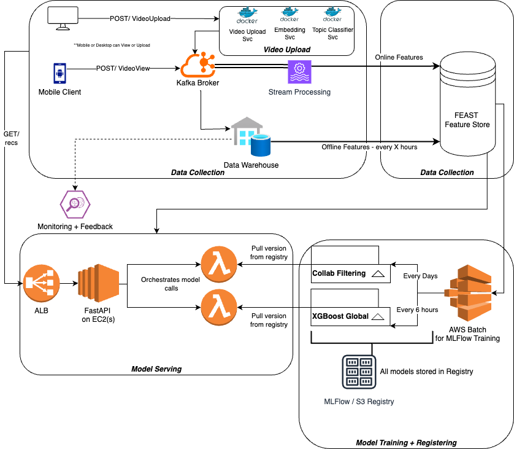
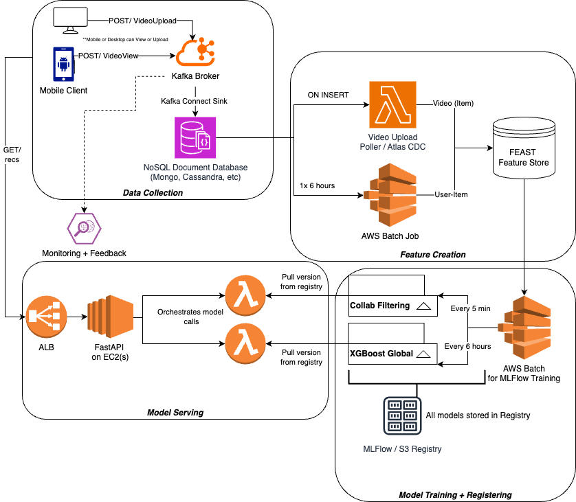

## Video Recommendations
Video recommendations are used all over, in places like Youtube, Netflix, TikTok, and Facebook

These systems all have different requirements - TikTok would be much more frequent versus something like Netflix, and Netflix has a huge dependency that the recommended content is useful

Video recommendations will have 3 major components:
- Data collection (includes transformation)
- Modeling
- Inference / Serving

- In this page you are going to walk through a video from [TRYEXCEPT](https://www.youtube.com/watch?v=EzwfhKqrLQ0), go through the choices made in this video, and then change some things and go deeper into some other topics

### Functional Requirements
- System must generate personalized video recs for each user
- Must capture all user interactions
- Must track all recommendations over time
- Cold start (recommend recently uploaded videos)
- Monitoring and observability for monitoring recommendation performance


### Non-Functional Requirements
- Must generate recommendations within 100ms for all active users
- Must support hundreds of millions of active users
- Must scale to billions of videos in content catalog
- 99.99% availability for recommender service
- Data encrypted at rest
- (There are multiple other ones that come in later down the line during architecture)
    - New video serving must have all features created within a hour of upload to recommend to users (i.e. new videos must be in recommender pipeline within an hour)
    - User-Item interactions must have all features created within the day

## Architecture
The final architecture at the end:


### Data Collection

Assumptions:
    - There is a mobile / desktop client
    - Users have unique identifiers
    - Videos have unique identifiers
    - Video metadata is relatively static over time (schema change over time isn't strictly required for now)
    - Feedback mechanism on client is already created

The data collection piece can just be viewed as apart of the video serving service - basically, whenever a user watches a video on any of these platforms, you assume the client already has like / dislike, comments, and other feedback mechanisms there already

When a user interacts with their mobile client on this video, that data is streamed back into our backend

#### Data Sink
This data should be streamed into a [Kafka Broker](/docs/architecture_components/messaging/Kafka%20Broker/index.md) which can scale to millions of messages per second [if properly architected and optimized](/docs/architecture_components/messaging/Kafka%20Broker/index.md#optimization)

This section will be further split up into 2 services:
- Mobile Viewing: Where a user would watch and engage with a video
- Video Upload: Where a user would upload a new video

##### Video Viewing
A proposed schema for this lightweight message would be 
```
{
    user: [ID or Name],
    video: [ID or Name],
    like: [1, 0, -1],
    comment: [string or NULL],
    watchTime: int, (possibly bigInt if videos have no limit?)
    watchTimePercentage: float
}
```
This message can be sent into it's own `VideoView` Kafka Topic, which would need to be architected and scaled according to our user pool

This will allow us to derive multiple features downstream such as:
- RepeatWatch
- AvgWatchTime
- FirstWatch
- ReturningUser
- etc...

##### Video Upload
This service you can simply subscribe to a [Webhook](/docs/architecture_components/communication%20protocols/index.md#webhook) and have the URL be a Kafka POST so that whenever a new video is uploaded the message is sent into another Kafka Topic `VideoUpload` Kafka Topic

#### Final Sink
In the [original video posted by TRYEXCEPT](https://www.youtube.com/watch?v=EzwfhKqrLQ0) there's a final sink into MongoDB here, I disagree with this approach, but you will follow this train of thought here and discuss it later on

Why can you skip this part? Because we're ultimately looking to have some of our feature be "near real time", and MongoDB in here is just an unnecessary extra step - there's potential discussion around having the raw data stored here and features elsewhere. The main reason I can see this being apart of the architecture is that *you want our raw data stored and our features stored elsewhere*

***you could also completely skip this Final Sink portion based on our Data Transformation stage*** - if you want our features to be truly real time we'd need to utilize [Stream Processing Engines](/docs/other_concepts/STREAM_PROCESSING.md) such as Flink, AWS Kinesis Data Analytics, Spark Streaming, or another tool

Let's assume you want our raw data stored in NoSQL, and that our features must be hourly (consider this a ***new non-functional requirement***)

At the end of this you should have this data being ingested into a [NoSQL Database](/docs/architecture_components/databases%20&%20storage/NoSQL/index.md) partitioned by either user, video, or user/video combination, to set us up for all downstream feature engineering, metrics creation, and multiple user queries

you recommend NoSQL instead of SQL because it's mostly the defacto "can scale to millions of updates per second" scale conversation, and you aren't as strict no our [transactions and isolation levels](/docs/architecture_components/typical_reusable_resources/typical_distributed_kv_store/ISOLATION_LEVELS.md) and so you would prefer a large scale database to ingest the JSON Kafka Messages

you can use a ***Kafka Connect Sink*** which will have a small service sit on our Kafka broker and write messages from Kafka into MongoDB

### Data Transformations
This is the first "tricky" part of the systems design

For something like Netflix with more "static" content, you could simply have a scheduled job run once a day to update our features and prep our data for ML training

For something like Youtube, depending on the functional requirements, you may need new videos and user-video data to be prepped as features as close to real-time as possible

Let's take our new non-functional requirements, and setup new video features to be [event driven](/docs/event_driven_architecture/index.md), and our user-item features to be daily scheduled [Spark Jobs](/docs/other_concepts/SPARK.md)

#### Features
The features you can create are almost unlimited

- Users:
    - *Temporal statistics* like number of videos over last day, week, month
    - *Engagement profile* such as likes / comments per view, demographics of videos, etc...
    - *Topic affinities* which help to figure out which "topics" the user is drawn to currently
        - Requires the videos to be clustered with proper topics / clusters!
    - Author reputation
- Video (Items):
    - Video / content embeddings
        - Frame embeddings
        - Video clustering / topic identifiaction
- User-Item:
    - Click through rate
    - Watch time
    - etc...

you can then take these features and plug them into a Feature Store. The recommended one on the video is [FEAST](https://feast.dev/) which ia an open source, on + off line, which sits on top of existing databases

***FEAST is an abstraction and orchestration layer*** - it's actually not even a database, it just helps to facilitate the movement of data into feature stores that can be online or offline. It helps us to embed "best practices" in our feature stores + feature creation

### Models
you can use MLFlow for model training and tracking, and running this all on AWS Batch is a fairly established pattern

#### Candidate Generation
For this you will use [Collaborative Filtering](/docs/design_systems/search_system/CANDIDATE_GENERATION.md#user-item-collaborative-filtering) to predict user-item preferences such as user-video interactions with the help of [Matrix Factorization](/docs/design_systems/search_system/CANDIDATE_GENERATION.md#matrix-factorization) to make this all "fast"

From our Collaborative Filtering excerpt - "Collaborative Filtering allows us to use Users and Items *at the same time!*. It recommends items to user A based on the preferences / history of similar user B"

It is a fast, robust, and scalable method of Candidate Generation that's been used all over the place, and allows us to quickly find personalized recommendations for a user based on their previous history, and histories of similar users

This model will definitely allow us to recommend 200 videos at a time

The output of this model will be a list of 200 videos along with user metadata to pass into the Ranking modeloop

##### Retraining
Retraining a collaborative filtering model can be done incrementally, but to be honest I haven't found much online of the exact specifics of updating

The video showcases "Every 5 minutes", but I don't think that's correct - most setups I've seen retrain the model once a night or on some sort of schedule

#### Ranking
Gradient Boosted Decision Tree using XGBoost will allow us to provide a ranked grading for each of the 200 videos in millisecond timeframes

It will take as input the candidates (videos) and user metadata 

These models should be global - meaning that every user you have should be able to have their metadata and profiles fed through the model and output the rankings for specific videos you also input

### Review
So at the end of all of this our architecture would look like this



## Changes
This would be a proposal of possible changes to this architecture 

Further assumptions:
- There's a video upload microservice to take in new videos, chop them up into different resolutions, and store them long term somewhere

### Data Collection + Warehousing
For data collection I think Kafka is still ideal for things like:
- Video views
- Click data
- Logs / generic `POST/` messages
- Other high throughput, stream-ish, data from Clients

you also introduced a few other services next to this hypothetical Video Upload service - most video uploaders need to chunk out data into different resolutions and store data long term, once this is done there can be calls to something like [Celery Workers](/docs/architecture_components/messaging/Queue/index.md#celery) to scale out on / offline ML models for embeddings, topic classification, segmentation, etc...

#### Data Model
Sinking this data into a Data Warehouse is a common pattern, and a great design I've used before is to have:
- Raw as an append only layer
- Bronze doing upserts + deletes to be 1:1 with application database

In this system, our Data Warehouse is foundational for our ***Offline Feature Store***

### Feature Creation - Lambda Architecture
For Feature creation proposing the [Lambda Architecture](https://www.databricks.com/glossary/lambda-architecture) is a great design that multiple large tech companies have adopted:
- [Ubers Michaelangelo](https://eng.uber.com/michelangelo/)
- [AirBnB Zipline](https://medium.com/airbnb-engineering/zipline-airbnbs-feature-platform-7e1d2c9b575d)
- [Doordash](https://careersatdoordash.com/blog/introducing-fabricator-a-declarative-feature-engineering-framework/)

All of these systems have both offline and online components, each with their own characteristics and systems design

In this change you introduced:
- Data Warehouse
- [Stream Processing Engine](/docs/other_concepts/STREAM_PROCESSING.md)

you removed:
- Lambda for VideoUpload
- AWS Batch for offline features (Data Warehouse and AWS Batch are comparable)

Our proposal could be more costly at first, but a highly available stream processing engine will scale much more, have higher throughput, allow for Rolling Window Aggregations for features, and many other components that you can't get with bare-bone lambdas

### Model Serving
After that, the rest of the architecture is fine for model training

***For Inference*** - ideally you do not use EC2's and you reuse some K8's Cluster (since you have Video Uploader service on Docker) so that you have highly available inference servers

***Model Considerations*** - Another arrow you added is from the Feature Store into the Model Serving bucket - most of the time we'll need to grab features, in this case video and user metadata, to make our predictions with the XGBoost model
- Collaborative Filtering model can run off of snapshots of the Feature store and you bumped up refresh to Daily
    - [Refreshing Collaborative Filtering Matrix Factorization model is typically done daily](/docs/design_systems/search_system/CANDIDATE_GENERATION.md#updating-filtering-and-factorization-models)
- Once this runs for Candidate Generation, you will get 200 videos to Rank, you need the features of those 200 videos from the FEAST Feature Store

### My Final Architecture
