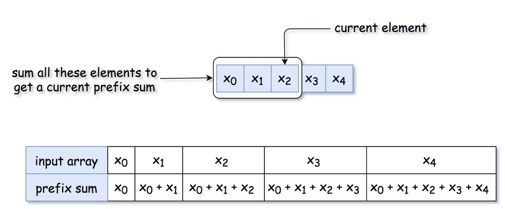
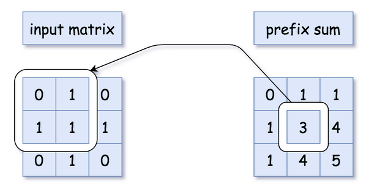

## Arrays and Strings
*Most of the time Strings are created as arrays, so useful to lump them together. Creating new strings from scratch is typically an O(n) operation, so we use lists to store things and create one at the end

## Time Complexities
***This is for storing arrays as contiguous set of items in memory, and not as a Linked List***
|Operation        | Array     | String  |
|------------|------------|------------|
|Append to End          | *$O(1)$   | $O(n)$  |
|Pop From End           | $O(1)$    | $O(n)$  |
|Insert in Middle       | $O(n)$    | $O(n)$  |
|Delete in Middle       | $O(n)$    | $O(n)$  |
|Modify Element         | $O(1)$    | $O(n)$  |
|Random Access          | $O(1)$    | $O(1)$  |
|Check if Element Exists| $O(n)$    | $O(n)$  |

- The insert / delete in the middle is O(n) because we typically have to shift all elements in the array to a new storage location either +1 or -1, which means we would loop over all the elements and shift
    - Insert or pop from end means we just remove that last storage location, and wouldn't be affected by size of the array

## Common Algorithms

### Two Pointers
- Typically useful when we have two pointers, left and right, and we either increment or decrement them based on some criteria
    - Allows us to do things like Palindrome or Two Sum (sorted array) in $O(n)$ time and $O(1)$ space
    - Left and Right can be:
        - front and back
        - front and front
        - Arr1 and Arr2
            - Meaning left points at Arr1 front or back, and right points at Arr2 front or back
    - The commonality is that we can perform calculations in $O(n)$ time and $O(1)$ space


```
function fn(arr):
    left = 0
    right = arr.length - 1

    while left < right:
        Do some logic here depending on the problem
        Do some more logic here to decide on one of the following:
            1. left++
            2. right--
            3. Both left++ and right--
```
```
def check_if_palindrome(s):
    left = 0
    right = len(s) - 1

    while left < right:
        if s[left] != s[right]:
            return False
        left += 1
        right -= 1
    
    return True
```

- Two Pointers doesn't need to be implemented in front and back, left and right can both start at the front
- Merge Sort in $O(n+m)$ where both arrays are sorted
- Or problems like subsequences and subarrays, we'd move left along big array until it matches the start of subsequence array, and then move right as those indeces match
```
function fn(arr1, arr2):
    i = j = 0
    while i < arr1.length AND j < arr2.length:
        Do some logic here depending on the problem
        Do some more logic here to decide on one of the following:
            1. i++
            2. j++
            3. Both i++ and j++

    // Step 4: make sure both iterables are exhausted
    // Note that only one of these loops would run
    while i < arr1.length:
        Do some logic here depending on the problem
        i++

    while j < arr2.length:
        Do some logic here depending on the problem
        j++
```
```
def mergeSortedArrays(arr1, arr2):
    # ans is the answer
    ans = []
    i = j = 0
    while i < len(arr1) and j < len(arr2):
        if arr1[i] < arr2[j]:
            ans.append(arr1[i])
            i += 1
        else:
            ans.append(arr2[j])
            j += 1
    
    while i < len(arr1):
        ans.append(arr1[i])
        i += 1
    
    while j < len(arr2):
        ans.append(arr2[j])
        j += 1
    
    return ans
```
```
def isSubsequence(self, s: str, t: str) -> bool:
    i = j = 0
    while i < len(s) and j < len(t):
        if s[i] == t[j]:
            i += 1
        j += 1

    return i == len(s)
```

### Sliding Window / Subarray
- A Subarray is a contiguous section of the array
- Subarray problems are usually solved with a variation of [Two Pointers](#two-pointers), where the left is front and right = left, and then we move along the axis checking if the definition for the subarray is true or not
- If we simply checked each subarray using brute force double loop we'd have
    - n arrays of size 1
    - n - 1 arrays of size 2
    - n - 2 arrays of size 3
    - ...
    - 2 arrays of size n - 1
    - 1 array of size n
    - Therefore, we'd have $\sum_{i=1}^{n} i = \frac{n(n+1)}{2}$ total arrays, which is $O(n^2)$
        - A sliding window approach keeps things to at most $O(2n)$
        - The reason this is $O(n)$ and not $O(n^2)$ is because of ***amortized analysis*** which means that the nested while loop and the outer while loop can run at most N times altogether, if the inside loop runs N times on the first outer loop, then it would run 1 times for every further loop, and would never run N times for N iterations
        - Everything averages out to $O(n)$ when you consider all runtimes
- Typical problems include the following constraints, that are typically checked in the function `checkArr(left, right)`
    - Length of largest subarray
        - Length of largest subarray $\leq$ k
        - Longest subarray with at least 1 character X
        - ...
    - Number of valid subarrays
    - First valid subarray
    - Last valid subarray
    - The below function uses `curr += nums[right]` and `curr -= nums[left]` which is random access so it's $O(1)$
    - That being said, there are some sliding window problems that need more advanced data structures in the middle for checks
        - [Sliding Window Maximum](/docs/leetcode/python/slidingWindowMaximum.md) problem is a good example, where we need an entire monotonic deque in the middle with while loops and `checks()` to update during the window, but ultimately the sliding window is the same
```python
function fn(nums, k):
    left = 0
    curr = 0
    answer = 0
    for right in range(len(nums)):
        curr += nums[right]
        while (curr > k):
            curr -= nums[left]
            left++

        answer = max(answer, right - left + 1)

    return answer
```
```python
function fn(arr):
    left = 0
    for right in range(len(arr)):
        Do some logic to "add" element at arr[right] to window

        while WINDOW_IS_INVALID:
            Do some logic to "remove" element at arr[left] from window
            left++

        Do some logic to update the answer
```
- This can be useful in examples where we're allowed to do an action once, like flip a bit from 0 to 1, but we still want to find the largest subarray

```python
def find_length(s):
    # curr is the current number of zeros in the window
    left = curr = ans = 0 
    for right in range(len(s)):
        if s[right] == "0":
            curr += 1
        while curr > 1:
            if s[left] == "0":
                curr -= 1
            left += 1
        ans = max(ans, right - left + 1)
    
    return ans
```

#### Number of Subarrays
Off the bat, the number of subarrays in an array of length $N$ is $\sum_{i=1}^{i=n}{i} = (N * (N+1)) / 2$ 

- The first element can start $N$ subarrays
    - 1 subarray from $a_0$ to $a_{n-1}$
    - 1 subarray from $a_1$ to $a_{n-1}$
    - ...
    - 1 subarray from $a_{n-1}$ to $a_{n-1}$
    - $n$ total subarrays
- The second element can start $N - 1$ subarrays
    - 1 subarray from $a_0$ to $a_{n-2}$
    - 1 subarray from $a_1$ to $a_{n-2}$
    - ...
    - 1 subarray from $a_{n-2}$ to $a_{n-2}$
    - $n-1$ total subarrays
- One subarray containing $a_0$
- Therefore, total number of subarrays is $n + (n-1) + ... + 1$

--- 
- During a sliding window, the number of subarrays between indexes right and left is `right - left + 1`
    - Between left and right there are a number of possible subarrays
    - `[left, right]`
    - `[left + 1, right]`
    - ...
    - `[right - 1, right]`
    - From here we see there are `right - left + 1` arrays that ***end at right***
```
def numSubarrayProductLessThanK(self, nums: List[int], k: int) -> int:
    # Handle edge cases where k is 0 or 1 (no subarrays possible)
    if k <= 1:
        return 0

    total_count = 0
    product = 1

    # Use two pointers to maintain a sliding window
    left = 0
    for right, num in enumerate(nums):
        product *= num  # Expand the window by including the element at the right pointer

        # Shrink the window from the left while the product is greater than or equal to k
        while product >= k:
            product //= nums[left]  # Remove the element at the left pointer from the product
            left += 1

        # Update the total count by adding the number of valid subarrays with the current window size
        total_count += right - left + 1  # right - left + 1 represents the current window size

    return total_count
``` 

#### Fixed Window Size K
- In this situation we just build out K, and then add in `Arr[i]` and remove `Arr[i - k]`
```
function fn(arr, k):
    curr = some data to track the window

    // build the first window
    for (int i = 0; i < k; i++)
        Do something with curr or other variables to build first window

    ans = answer variable, probably equal to curr here depending on the problem
    for (int i = k; i < arr.length; i++)
        Add arr[i] to window
        Remove arr[i - k] from window
        Update ans

    return ans
```

### Prefix Sum
- A prefix sum array allows us to get the ***sum of subarrays*** throughout a problem
- Typically this is done by building an array that holds the cumulative sum up to a certain point, and then doing `pfxSum[right] - pfxSum[left - 1]` or `pfxSum[right] - pfxSum[left] + nums[left]` which would get us the sum between [left, right] inclusive
- It costs $O(n)$ to build, and then access is random so it's $O(1)$ to find sum of subarray gives it's 2 indexes
- The Prefix Sum also comes up in [Tree Traversal](/docs/dsa/8.%20trees%20&%20graphs/index.md#prefix-sum) because we can use it during a tree traversal technique to find things like 
    - *Total number of paths that sum to X*
    - *Total number of paths less than or equal to X*
    - etc
    - The same "problems" that Prefix Sum solves for Arrays it can solve for in Trees as well

### Example

One dimensional Prefix Sum is easy, it's just a cumulative sum!



2D Prefix sums are harder because you need to keep track of adjacent cells, however this is useful in Arrays, [Dynamic Programming](/docs/dsa/10.%20dynamic%20programming/index.md), and some [Graph](/docs/dsa/8.%20trees%20&%20graphs/index.md#graphs) problems 


There are even [tree path prefix](/docs/dsa/8.%20trees%20&%20graphs/index.md#prefix-sum) sums!


#### Subarray Sum = k
Mostly goes off the fact that given a Prefix Sum / Cumulative Sum, at any point 
$cSum[index_j] - cSum[index_i] = \sum_{k=i + 1}^{j} x_k$  (inclusive of $j$, exclusive of $i$) which just means we can find some target $t$ by using a hashmap

$cSum[j] - cSum[i] = x_{i+1} + x_{i+2} + ... + x_j$

```
# nums =    [1, 2, 4, -2], t = 4
# pfxSum =  [1, 3, 7, 5]
# for any num, j, we'd look for i such that difference of j - i
# j - i = t i.e. j = t + i
# if i = 1, we'd be looking for 4 + 1 = 5
# if i = 3 we'd be looking for 4 + 3 = 7
# [1, 2, 3] t = 3
# [1, 3, 6]
# {1: [0], 3: [1], 6: [2]}
# 1 look for 4, 3 look for 3, 6 look for -3
resp = 0

pfxSum = [nums[0]]
pfxMap = defaultdict(int)
for num in nums[1:]:
    cumulSum = num + pfxSum[-1]
    pfxSum.append(cumulSum)
    resp += pfxMap[cumulSum - t]
    pfxMap[cumulSum] += 1
    
            

return(resp)
```

#### Kadane
Kadane's algorithm is used to find the maximum sum of a contiguous subarray

If it's all positive then we'd just take the entire array, if there are negatives we'd maybe include them

```python
nums = [1, 3, 4, 1, 2, 5]
max_so_far = -float("inf")
current_max = nums[0]
for num in nums[1:]:
    current_max = max(num, current_max + num)
    max_so_far = max(max_so_far, current_max)

return(max_so_far)
```