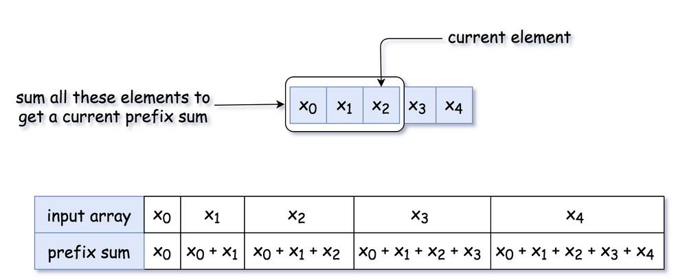
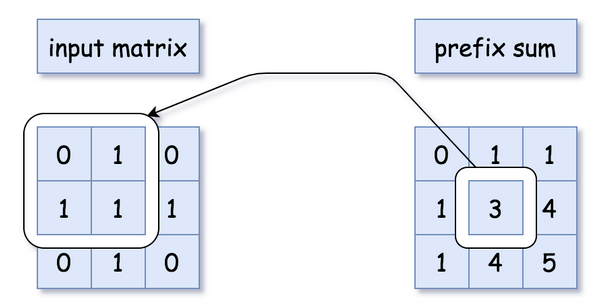

## Arrays and Strings
*Most of the time Strings are created as arrays, so useful to lump them together. Creating new strings from scratch is typically an O(n) operation, so you use lists to store things and create one at the end

## Time Complexities
***This is for storing arrays as contiguous set of items in memory, and not as a Linked List***
|Operation        | Array     | String  |
|------------|------------|------------|
|Append to End          | *$O(1)$   | $O(n)$  |
|Pop From End           | $O(1)$    | $O(n)$  |
|Insert in Middle       | $O(n)$    | $O(n)$  |
|Delete in Middle       | $O(n)$    | $O(n)$  |
|Modify Element         | $O(1)$    | $O(n)$  |
|Random Access          | $O(1)$    | $O(1)$  |
|Check if Element Exists| $O(n)$    | $O(n)$  |

- The insert / delete in the middle is O(n) because you typically have to shift all elements in the array to a new storage location either +1 or -1, which means you would loop over all the elements and shift
    - Insert or pop from end means you just remove that last storage location, and wouldn't be affected by size of the array

## Common Algorithms
TLDR;
- Stacks are very useful for reversing strings!
- Subarrays where you have to find something of a certain size, or a certain sum, etc > some target, use sliding windows
    - "If a problem has explicit constraints like `sum greater than or less than k`, or `limits on what is contained, such as max of k unique elements`, and it also asks for `min/max length`, `# of subarrays`, or `max or min sum`, consider **sliding windows**"
    - The size of a subarray between `i` and `j` (inclusive) is `j - i + 1`. This is also the number of subarrays that end at `j`, starting from `i` or later
    - Sliding windows can use `left, right`, or they can just do `for right in range(k, len(s))`
- Prefix sum gives sum of subarrays
    - If we want the sum of the subarray from `i` to `j` (inclusive), then the answer is `prefix[j] - prefix[i - 1]`

[Reverse Prefix Word](/docs/leetcode_coderpad/leetcode/python/reversePrefixWord.md)

### Two Pointers
- Typically useful when you have two pointers, left and right, and you either increment or decrement them based on some criteria
    - Allows us to do things like Palindrome or Two Sum (sorted array) in $O(n)$ time and $O(1)$ space
    - Left and Right can be:
        - front and back
        - front and front
        - Arr1 and Arr2
            - Meaning left points at Arr1 front or back, and right points at Arr2 front or back
    - The commonality is that you can perform calculations in $O(n)$ time and $O(1)$ space


```
function fn(arr):
    left = 0
    right = arr.length - 1

    while left < right:
        Do some logic here depending on the problem
        Do some more logic here to decide on one of the following:
            1. left++
            2. right--
            3. Both left++ and right--
```
```
def check_if_palindrome(s):
    left = 0
    right = len(s) - 1

    while left < right:
        if s[left] != s[right]:
            return False
        left += 1
        right -= 1
    
    return True
```

- Two Pointers doesn't need to be implemented in front and back, left and right can both start at the front
- Merge Sort in $O(n+m)$ where both arrays are sorted
- Or problems like subsequences and subarrays, we'd move left along big array until it matches the start of subsequence array, and then move right as those indeces match
```
function fn(arr1, arr2):
    i = j = 0
    while i < arr1.length AND j < arr2.length:
        Do some logic here depending on the problem
        Do some more logic here to decide on one of the following:
            1. i++
            2. j++
            3. Both i++ and j++

    // Step 4: make sure both iterables are exhausted
    // Note that only one of these loops would run
    while i < arr1.length:
        Do some logic here depending on the problem
        i++

    while j < arr2.length:
        Do some logic here depending on the problem
        j++
```
```
def mergeSortedArrays(arr1, arr2):
    # ans is the answer
    ans = []
    i = j = 0
    while i < len(arr1) and j < len(arr2):
        if arr1[i] < arr2[j]:
            ans.append(arr1[i])
            i += 1
        else:
            ans.append(arr2[j])
            j += 1
    
    while i < len(arr1):
        ans.append(arr1[i])
        i += 1
    
    while j < len(arr2):
        ans.append(arr2[j])
        j += 1
    
    return ans
```
```
def isSubsequence(self, s: str, t: str) -> bool:
    i = j = 0
    while i < len(s) and j < len(t):
        if s[i] == t[j]:
            i += 1
        j += 1

    return i == len(s)
```

### Sliding Window / Subarray
- A Subarray is a contiguous section of the array
- Subarray problems are usually solved with a variation of [Two Pointers](#two-pointers), where the left is front and right = left, and then you move along the axis checking if the definition for the subarray is true or not
- If you simply checked each subarray using brute force double loop we'd have
    - n arrays of size 1
    - n - 1 arrays of size 2
    - n - 2 arrays of size 3
    - ...
    - 2 arrays of size n - 1
    - 1 array of size n
    - Therefore, we'd have $\sum_{i=1}^{n} i = \frac{n(n+1)}{2}$ total arrays, which is $O(n^2)$
        - A sliding window approach keeps things to at most $O(2n)$
        - The reason this is $O(n)$ and not $O(n^2)$ is because of ***amortized analysis*** which means that the nested while loop and the outer while loop can run at most N times altogether, if the inside loop runs N times on the first outer loop, then it would run 1 times for every further loop, and would never run N times for N iterations
        - Everything averages out to $O(n)$ when you consider all runtimes
- Typical problems include the following constraints, that are typically checked in the function `checkArr(left, right)`
    - Length of largest subarray
        - Length of largest subarray $\leq$ k
        - Longest subarray with at least 1 character X
        - ...
    - Number of valid subarrays
    - First valid subarray
    - Last valid subarray
    - The below function uses `curr += nums[right]` and `curr -= nums[left]` which is random access so it's $O(1)$
    - That being said, there are some sliding window problems that need more advanced data structures in the middle for checks
        - [Sliding Window Maximum](/docs/leetcode_coderpad/leetcode/python/maxSlidingWindow.md) problem is a good example, where you need an entire monotonic deque in the middle with while loops and `checks()` to update during the window, but ultimately the sliding window is the same
```python
function fn(nums, k):
    left = 0
    curr = 0
    answer = 0
    for right in range(len(nums)):
        curr += nums[right]
        while (curr > k):
            curr -= nums[left]
            left++

        answer = max(answer, right - left + 1)

    return answer
```
```python
function fn(arr):
    left = 0
    for right in range(len(arr)):
        Do some logic to "add" element at arr[right] to window

        while WINDOW_IS_INVALID:
            Do some logic to "remove" element at arr[left] from window
            left++

        Do some logic to update the answer
```
- This can be useful in examples where we're allowed to do an action once, like flip a bit from 0 to 1, but you still want to find the largest subarray

```python
def find_length(s):
    # curr is the current number of zeros in the window
    left = curr = ans = 0 
    for right in range(len(s)):
        if s[right] == "0":
            curr += 1
        while curr > 1:
            if s[left] == "0":
                curr -= 1
            left += 1
        ans = max(ans, right - left + 1)
    
    return ans
```

#### Number of Subarrays
Off the bat, the number of subarrays in an array of length $N$ is $\sum_{i=1}^{i=n}{i} = (N * (N+1)) / 2$ 

- The first element can start $N$ subarrays
    - 1 subarray from $a_0$ to $a_{n-1}$
    - 1 subarray from $a_1$ to $a_{n-1}$
    - ...
    - 1 subarray from $a_{n-1}$ to $a_{n-1}$
    - $n$ total subarrays
- The second element can start $N - 1$ subarrays
    - 1 subarray from $a_0$ to $a_{n-2}$
    - 1 subarray from $a_1$ to $a_{n-2}$
    - ...
    - 1 subarray from $a_{n-2}$ to $a_{n-2}$
    - $n-1$ total subarrays
- One subarray containing $a_0$
- Therefore, total number of subarrays is $n + (n-1) + ... + 1$

--- 
- During a sliding window, the number of subarrays between indexes right and left is `right - left + 1`
    - Between left and right there are a number of possible subarrays
    - `[left, right]`
    - `[left + 1, right]`
    - ...
    - `[right - 1, right]`
    - From here you see there are `right - left + 1` arrays that ***end at right***

```
def numSubarrayProductLessThanK(self, nums: List[int], k: int) -> int:
    # Handle edge cases where k is 0 or 1 (no subarrays possible)
    if k <= 1:
        return 0

    total_count = 0
    product = 1

    # Use two pointers to maintain a sliding window
    left = 0
    for right, num in enumerate(nums):
        product *= num  # Expand the window by including the element at the right pointer

        # Shrink the window from the left while the product is greater than or equal to k
        while product >= k:
            product //= nums[left]  # Remove the element at the left pointer from the product
            left += 1

        # Update the total count by adding the number of valid subarrays with the current window size
        total_count += right - left + 1  # right - left + 1 represents the current window size

    return total_count
``` 

#### Fixed Window Size K
- In this situation you just build out K, and then add in `Arr[i]` and remove `Arr[i - k]`
```
function fn(arr, k):
    curr = some data to track the window

    // build the first window
    for (int i = 0; i < k; i++)
        Do something with curr or other variables to build first window

    ans = answer variable, probably equal to curr here depending on the problem
    for (int i = k; i < arr.length; i++)
        Add arr[i] to window
        Remove arr[i - k] from window
        Update ans

    return ans
```

### Prefix Sum
A prefix sum array allows us to get the ***sum of subarrays*** throughout a problem. Many array problems are actually about turning a subarray condition into a relationship between two prefixes - the core identity is:
- Let `prefix[i]` be the sum of elements from `0..i`
- Then the sum of a subarray `l..r` if `prefix[r + 1] - prefix[l]`, or `prefix[r] - prefix[l - 1]` but that confuses me
    - `prefix[r + 1] - prefix[l]` avoids the whole "`left = 0` is special"
- The length of a subarray `nums[l..r]` is `(r + 1) - l`, or `r - l + 1` in the other convention

Below, there are multiple hash maps used - `freq`, `first`, `count`, etc.. These will always store information about an earlier prefix `l`. Since most of them are initialized with `{0:..}`, they are using the `right + 1` convention where we'd start storing prefixes with `pfxSum = [0]`. Therefore, at any current position we would be at in `for idx, num in enumerate(nums):`, we can still utilize `prefix - freq[l]` to figure out sum or length between `prefix`, or `idx` and the count of index stored in the hashmaps...it's fucky, but it works out fine

```python
arr =    [1, 3, -2, 5]
pfx = [0, 1, 4,  2, 7]
```
To find the sum of subarrays from `1 --> 3` you can do `pfx[4] - pfx[1] = 6`, which is the same as `arr[1] + arr[2] + arr[3]`

"What earlier prefix would I need so that the difference between these two points gives me what I want". Usually if there are differences, total counts of items, or conditions, using a prefix sum is thew ay to go. Prefix Sum also comes up in [Tree Traversal](/docs/dsa/8.%20trees%20&%20graphs/index.md#prefix-sum) because you can use it during a tree traversal technique to find things like 
    - *Total number of paths that sum to X*
    - *Total number of paths less than or equal to X*
    - etc
    - The same "problems" that Prefix Sum solves for Arrays it can solve for in Trees as well


One dimensional Prefix Sum is easy, it's just a cumulative sum!


To get the total from `x1` to `x3` we need `prefix[x3] - prefix[x0]`

2D Prefix sums are harder because you need to keep track of adjacent cells, however this is useful in Arrays, [Dynamic Programming](/docs/dsa/10.%20dynamic%20programming/index.md), and some [Graph](/docs/dsa/8.%20trees%20&%20graphs/index.md#graphs) problems 


There are even [tree path prefix](/docs/dsa/8.%20trees%20&%20graphs/index.md#prefix-sum) sums!


#### Subarray Sum = K
Counting the number of subarrays with `sum = k`, determining the longest subarray with `sum = k`, etc all revolve around the same setup with different tracking of `resp`

Utilizing `{0: 1}` is critical to represent the empty prefix - before any processing is done, there is at least one single prefix sum that is 0 which is `[]`. After that, is there's a `prefix = k` exactly equal to `k` somewhere out there, it means the length is equal to starting at the initial empty prefix list


```python
def subarraySum(nums, k):
    n_subarrays = 0

    # freq {0: 1} is critical, because if a specific
    #   prefix value is equal to k, then it's the length
    #   of the entire array
    freq = {0: 1}

    prefix = 0
    for idx, num in enumerate(nums):
        prefix += num
        n_subarrays += freq.get(prefix - k, 0)
        freq[prefix] = freq.get(prefix, 0) + 1
    
    return(n_subarrays)
"""
[1, 3, 0,  6, -2,  2]
[1, 4, 4, 10,  8, 12]
k = 4
freq = {
  0: 1,
  1: 1,
  4: 2,
  8: 1,
  10: 1
  12: 1
}

resp is 3
"""
```


#### Longest Subarray Sum = k
To get the longest one, you'd just have to store the first index of a prefix found instead of total count of them. To find the shortest you need to store the last found prefix instead

The new way to start `first = {0: -1}` is the same idea as `{0: 1}` - the empty prefix. However in this scenario, if we have a prefix sum list like below:
```
arr = [1, 3, -2, 0, 4, 3, -2, -3]
pfx = [1, 4,  2, 2, 6, 9,  7   4]
```
If we are looking for the longest subarray with `k=4`, the length of it is going to be the entire subarray of length 8. If we use `for idx, num in enumerate(nums)`, the actual index at the end of the array will be `7`, and so utilizing `first = {0: -1}` accounts for the fact that the length is `+1` the index of a 0-indexed array. The entire TLDR is that the length of the subarray if it's an exact `prefix = k` match is the current 0-indexed index plus 1

For anything not equal to the entire subarray, like from index `2 -> 4` or `3 -> 4`, the length is going to be equal to `idx - first[prefix - k]`. In this example it would be `4 - 2 = 2` which is the size of the subarray `[0, 4]`

The length is similar - we still need to utilize `r + 1` and `l`, so we can achieve length = `r + 1 - l`, which is much cleaner to think about versus other indexing options.


```python
def longestSubarray(nums, k):
    longest = 0
    first = {0: -1}

    prefix = 0
    for idx, num in enumerate(nums):
        prefix += num
        need = prefix - k
        if need in first:
            longest = max(
                longest,
                idx - first[need]
            )
        
        if prefix not in first:
            first[prefix] = idx

    return(longest)
```

#### Modulo / Remainder Variants
These are around counting subarrays whose sum is divisible by `k`, or whose sum has a remainder `r`, or something else similar. The main identity here is that:
If `(prefix[r + 1] - prefix[l]) % k == 0`, $/rarr$ `prefix[r + 1] % k == prefix[l] % k`, and so if we simply store the remainders throughout the `freq` hash map, it's fine for us to come up with the same result. We're not looking for `freq[prefix - k]`, we're looking for `freq[remainder]`

```python
def subarraysDivByK(nums, k):
    count = 0
    prefix = 0
    freq = {0: 1}

    for x in nums:
        prefix += x
        rem = prefix % k
        count += freq.get(rem, 0)
        freq[rem] = freq.get(rem, 0) + 1

    return count
```

#### Weird Variants
There are some other weird patterns / variants that are just prefix sum in disguise:

##### Count Subarrays With Equal Number Of 0 And 1
You can just transform all 0 to -1, and keep 1 as 1, and then the problem becomes "count subarrays with sum 0"

##### Count Subarrays With Exactly K Odd Numbers 
Same thing as above - transform even to -1, and odd to 1, and then count subarrays with sum of 0


#### Kadane
Kadane's algorithm is used to find the maximum sum of a contiguous subarray

If it's all positive then we'd just take the entire array, if there are negatives we'd maybe include them. Any subarray whose sum is positive is worth keeping, and in particular any subarray whose sum is larger than just taking the current value is worth keeping

If we're at `[-1, 20, -18, 1]`, the first 3 numbers are worth keeping because they contribute +1, but `[-1, 20, -18, 1, -2]` is useless - it's sum is 0. This logic can be completely encapsulated in `currentMax = max(num, currentMax + num)`

The only time `currentMax + num < num` is if `currentMax < 0`

```python
nums = [1, 3, 4, -8, 1, -2, 2, 5]
maxSoFar = nums[0]
currentMax = nums[0]
for num in nums[1:]:
    currentMax = max(num, currentMax + num)
    maxSoFar = max(maxSoFar, currentMax)

return(max_so_far)
```