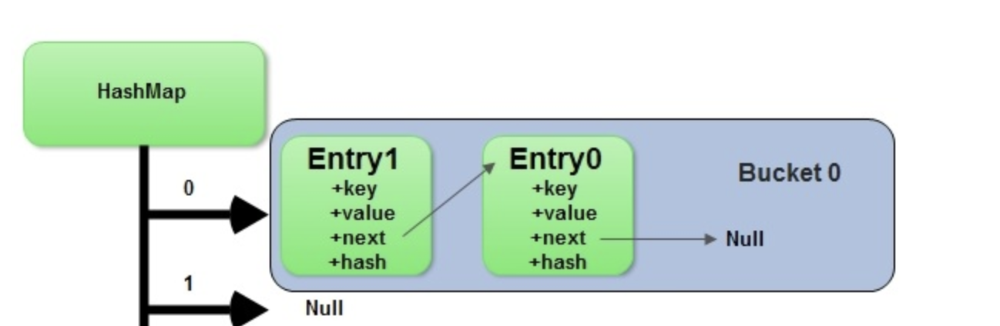

## Hashing
A ***Hash Function $H(x)$*** of something is a function that turns an object from a search space $S$ into an integer within a fixed range $[0, X]$.

### Demonstration / Thoughts
- Hashing most often comes in a ***map*** object, which allows you to interact with keys and values
- Hashing will take an input and deterministically convert it to an integer that's less than a specified size
    - Inputs are ***keys***, and they must be immutable (that's why you can't hash a list in Python)
    - How can all of this be $O(1)$?
        - you will essentially store everything underneath in a contiguous array, where the data type of an entry in the array is the same data type as a key
            - To find the random access point (key location), you just use whatever the hash outputs
            - So if you have an array, $a$, of size $n$, and you have $n$ keys, and a has functions $H(x)$ that perfectly assigns 1:1 a key to a bucket without collisions, then you can insert a `(key1, value1)` pair `a[H(key1)] = value1`
            - To check if a key exists you just check `a[H(key1)] != null`
        - Arrays store homogeneous keys
        - These keys have values which are actually pointers to memory location of "real" value
            - Most values are homogeneous, but in Python, for example, they could be different sizes
        - Since keys are homogeneous, and our hash represents a unique integer, you could just do $keysize \times hash = offset$
            - Meaning if our hash returns 4, and our data size is 8 bytes, then our offset would be $8 \times 4 = 32$ and that 32 would be the memory offset
        - $startingLocation + (keyDataTypeSize \times hashIndex)$ allows us to directly find the offset location of the data in constant time, regardless of how large the array is
    - ***This is basically saying, since array's random access time is $O(1)$ our hashing lookup is $O(1)$***
        - Since our hash is basically just acting as the random access point to our array
- The space complexity becomes an issue, because if our hash space is 0-255 then you need to allocate $256 \times keyDataTypeSize$ total memory to our map object

| Operation        | Average Complexity | Worst Case Complexity
|------------------|--------------------|----------------------|
| Put              | $O(1)$             | $O(n)$               |
| Get              | $O(1)$             | $O(n)$               |
| Delete           | $O(1)$             | $O(n)$               |
| Traverse (Search for Value)| $O(n)$   | $O(n)$               |

- ***Buckets***
    - The above is mostly true, but it's mostly illustrative, because most of the time a Hash Function $H(x)$ will not correspond 1:1 with array size $n$, and most of the time you wouldn't want our underlying data structure to be of size $n$...it's usually a lot of wasted space
    - Therefore, most implementations will have an input Domain $D\in\ [0, n]$ (i.e. our keys can be 0-n), but our corresponding map data structure will be undermined by an array of size $m: m <= n$
        - Most of the time $m < n$
        - This means at least 2 of our keys will be in the same bucket, let's say a and d map to the bucket 2
            - When this happens, if you looked up `map.get(a)` or `map.get(d)`, it would go to the bucket 2, and have to traverse it using `bucket[2][0] == 'd'`, and if not then `bucket[2][1] == 'd'`...
            - It's typically implemented as a linked list, where you traverse `if curr == key: return else curr = curr.next`
                - This means, in the absolute worst case when you have 1 single bucket, then our Put, Get, Delete's all degrade to $O(n)$

### Examples

#### Counting and Sliding Windows
<!-- [3Sum](/docs/leetcode/python) -->
These are scenarios where you slide through an array and check some sub-array logic, and during the sliding you will add values to a hashmap somewhere

A good example is [Subarray Sum](/docs/dsa/1.%20arrays%20&%20strings/index.md#subarray-sum--k)

## Sets
Sets are similar to Hash Tables, where they map keys to integers, but sets don't actually map keys to anything

They simply represent if something is already in the set or not, `my_set.add(1)` will hash `1` and place it into the set, so if two items hash to the same value they'll be viewed as similar in the set

## Bloom Filter
Bloom Filters are sets / hashes, and they represent items that are currently in the set. If two values `a` and `b` hash to the same value, we'll say they are both in the set

A bloom filter is used to check if an item is already in the set, if it returns true ***it may be wrong***, but if it returns false you know for sure the item is not in the set