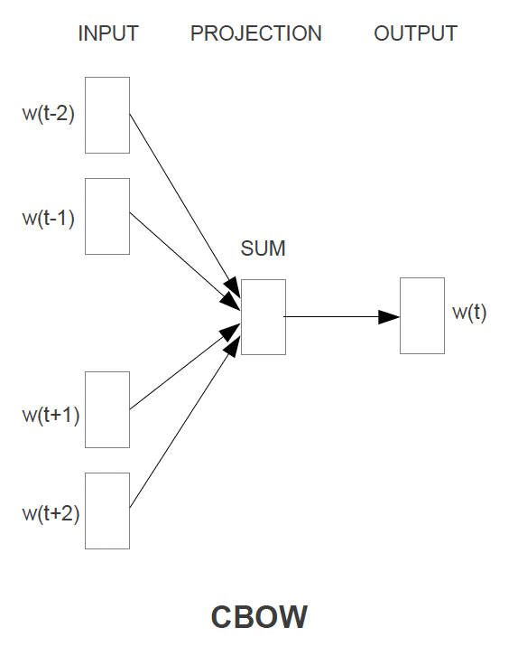
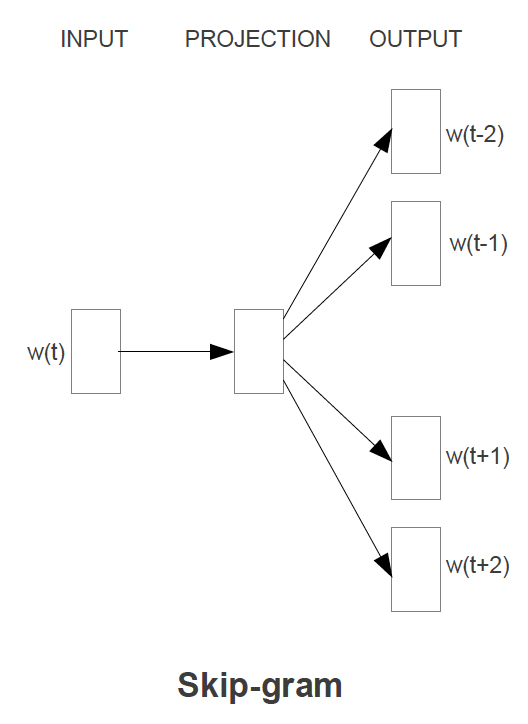
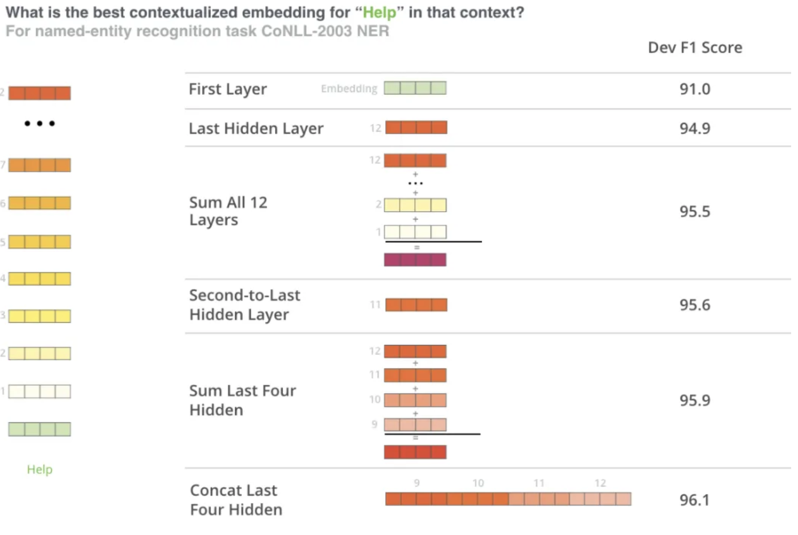
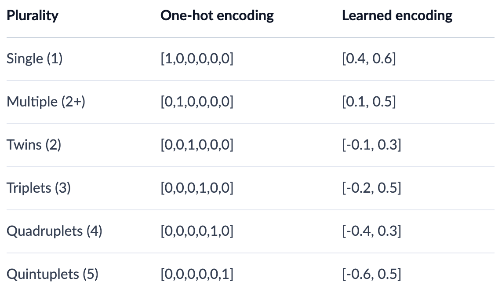

## Embeddings
Embeddings are dense vector representations of objects - typically we use them for Documents, Queries, Users, Context, or Items...but they can really be used to represent ***anything***

### History
- In the past there have been many ways of creating embeddings
- ***Encoders*** 
    - ***One Hot Encoding***: When we would replace categorical variables with vectors of sparse 0's and a single 1 representing the category
    - ***Binary Encoders***: Converts categorical variables into binary code - similar to One Hot Encoding, except we basically pick an ID that incrementally increases for new categories
- ***[Collaborative Filtering](#user-item-collaborative-filtering)*** is discussed later on
- Word2Vec
- Doc2Vec
- Node2Vec!
- etc...

### Categorical Features
- ***One-Hot Encoding*** represents orthonormal basis of vectors, and typically is useful for categorical variables but becomes infeasible if we try to use it for text features
- ***Label Encoding*** is similar to One-Hot Encoding, except we use an incremental ID for each of the categories

### Numeric Features
- This depends on the distribution of the data
    - ***Standardization***: Transforms the data to having a mean of zero, and a standard deviation of one 
        - This allows us to bring data in different distributions onto the same common scale
        - $[ z = \frac{x - \mu}{\sigma} ]$
    - ***Normalization***: Brings the data to a specific range between $[0, 1]$
        - This is helpful when you want to ensure all features contribute equally to the model
    - When to use what?
        - Standardization:
            - Use when the features have different units or scales.
            - Useful for algorithms that assume the data is normally distributed (e.g., linear regression, logistic regression, SVM).
            - Helps in dealing with outliers.  
        - Normalization:
            - Use when you want to scale the data to a specific range (e.g., [0, 1]).
            - Useful for algorithms that do not assume any specific distribution of the data (e.g., k-nearest neighbors, neural networks).
            - Ensures that all features contribute equally to the model.
- There are plenty of other ways to treat numeric data as features, but these are two easy and common ways

## Text Embeddings
Text Embeddings are one of the harder things to figure out, but there are some standards nowadays

- Training Word2Vec and BERT both involved semi self-supervised training where they take online corpus as input and basically use contextual words $w_{i-k,i+k}$ to try and create an embedding for a current word $w_i$
- [Word2Vec](#word2vec) was one of the original ideas for text embeddings - it essentially acts as an autoencoder to create ***static embeddings*** for each word in a dictionary
- [BERT](./BERT.md#bert) on the other hand, through [attention](./ATTENTION.md#attention), can create ***contextual*** embeddings for words, sentences, and entire documents
- [GPT](#gpt-3) is an autoregressive transformer model in the same transformer "family" as [BERT](./BERT.md#bert), but it is ***unidirectional*** where BERT is ***bidirectional*** (which is constantly repeated in the paper)
    - GPT is good for text-to-text tasks like question answering, but like BERT we can pull from the middle hidden layers during it's self-attention steps to find word embeddings

### Word2Vec
As we said above Word2Vec is essentially a static lookup of words to embeddings, and so ***Word2Vec is an embedding model***

- Parameters:
    - $N$ is context window size (input size)
    - $V$ is the number of words in our dictionary
    - $D$ is the embedding size (projection layer)
    - $i$ is the current target word

#### Training and Output
- Word2Vec will use context words to help model a current word $w_i$ - this modeling is done without context (meaning position of other words is irrelevant) and we use words in the past and future
    - When everything is finished, the weights of the shallow network are the actual embeddings themselves!
    - There are 2 types of training tasks:
        - ***Continuous Bag of Words*** where we use the context words $w_{i-N//2,i+N//2}$ as input and try to predict the current word $w_i$
            - Basically we divide context window in half in front and behind current word
        - ***Skip Gram*** is where we use the current word $w_i$ as input to predict each one of the context words $w_{i-N//2,i+N//2}$
    - This allows us to have a static embedding representation of words
- Take the final projection layer of size $V \times D$ and ***this is your word embedding matrix***

#### Model Architecture
- Architecture:
    - Overall the Time Complexity will be around the order of $N \times D + D \times V$ which gets reduced to $N \times D + D \times log_2(V)$ with hierarchical softmax
        - First layer of $N \times D$ comes from taking $N$ local One-Hot Encoded Vectors, all of size $V$ and performing some calculations to get them to $N$ instances of size $D$ which is the size of our embedding
- Optimizations to training 
    - ***Negative Sampling*** where we pull a small number of negative examples along with the correct contextual examples
    - ***Sub Sampling*** is similar to Negative Sampling TODO
    - ***Hierarchical Softmax*** TODO
        - Hierarchical Softmax allows us to only use $log_2(V)$ memory and somehow time complexity in the last layer? Idrk - TODO
    - ***Huffman Tree*** is actually a further optimization of ***Hierarchical Softmax***
        - $log_2(Unigram Perplexity(V))$ which means it's even better than HSoftmax?

##### Continuous Bag of Words Architecture
- The CBOW architecture will use some surrounding context of words to predict the current word
- The context words get projected into hidden layer, and then they are basically all averaged
    - ***This means there is no context involved, and that the surrounding words are simply averaged***
- For the $N$ context words, past and future words are used
    - In the paper $N == 8$ with 4 before (historic), and 4 after (future)
- ***Training Objective:*** Predict the middle word from the $N$ surrounding context words
- ***Time Complexity:*** Would be $TC = N \times D + D \times log_2(V)$
    - General rule of thumb: Pluses separate layers, multiplication shows layer dimensions / work
- The output layer is a `log-linear classifier`
    - TODO: Explain log-linear classification
- 

##### Continuous Skip Gram Architecture
- The Skip Gram architecture will use the current word to predict some surrounding context of words
- The current word is sent through a `log-linear classifier` into a continuous projection layer, and then they projection layer is used to predict the best potential context words
    - ***This still! means there is no context involved, and that the surrounding words are simply predicted without specifying placement***
- ***Training Objective:*** Predict some $C : C \leq N$ surrounding context words from the current word, and then pick, randomly, $C$ words from the $N$ context words
    - Since more distant words *are most likely more unrelated* to the current word, we reduce computational complexity by sampling from those words less frequently
    - There's no other way to give less weight to other "far away" words other than sampling them less and updating weights less often based on them
- ***Time Complexity:*** Would be $TC = C \times D + C \times D \times log_2(V) === C \times (D + D \times log_2(V))$ 
    - For each of the $C$ words we need to take our input word $w_i$, do $D$ multiplcations to get it into projection layer, and then go from our projection layer into our sized $V$ vocabulary to try and predict $w_c$
- 

#### Evaluation of Model
- In the past the main way to do this was to just show tables of words with their corresponding Top-K most similar other words, and intuitively check
- In the Word2Vec Paper they checked over relationships such as *"What is the word that is similar to small in the same sense as bigger is to big"*
    - Ideally this would produce *smaller*
- This can be done with algebraic operations! `vector(big) - vector(bigger) + vector(small)` would give us that sort of output, and then we just find the closest vector via Cosine Distance
- There are other relationships to test such as *France is to Paris as Germany is to Berlin*

TODO: Is below correct? Semantic vs Syntactic...Semantic is "underlying meaning of words" and syntactic is "placement of word"?
- ***Skip Gram performed better on semantic objectives***, which isn't surprising seeing as it's entirely focused on structuring a word to best represent what other words would be around it, so `America` and `United States` should be similar
- ***Bag of Words performed better on syntactic objectives*** showing how the CBOW model is better at syntax modeling where we could alter the sentence *The quick brown fox jumped over the lazy river* to *Over the lazy river the quick brown fox had jumped*

### BERT
[BERT](./BERT.md#bert) architecture, training, and fine tuning is descirbed in another page, but given all of that is read through we discuss below how to get useful embeddings out of BERT!

Since BERT is an ***Encoder Only Model***, it basically takes an input, runs it through multiple Encoders, and would send it through an output layer at the end - this output layer tyipcally isn't useful by itself for Word Embeddings, so we would need to go back through the hidden state values and aggregate these in some way to produce Word, Sentence, or Document embeddings

#### BERT Word Embeddings
- [Another reference link](https://mccormickml.com/2019/05/14/BERT-word-embeddings-tutorial/#history)
- Most use cases of word embeddings can come straight out of a pre-trained core BERT model
- We could send a single word through and it would most likely just be a representation of the WordPiece Embedding layer at the start
- If we send multiple words through (a sentence) then we could try and reconstruct each individual words new embedding that was altered from the self-attention layers
    - `bank` in the sentence `the large and sandy river bank` will be attended to, and ultimately different, from `the countries central bank` because it's surrounding context words are different!
    - Typically you would send through the sentence and then pull back each $T_i$, or some mixture of $H_{a, b}$ hidden states, for each $w_i$ and that would represent your finalized word embedding that was attended to / altered from contextual self-attention!
- 

#### BERT Embeddings Pseudo Code
- We'd need to load in the WordPiece Tokenizer
- Tokenize our sentence input into Word Pieces
    - Will have some words get split into tokens like `embeddings -> [em, ###bed, ###ding, ###s]`
- Load the pre-trained BERT model
    - Set the model to `eval()` mode since we do not want to go through updating the base models weights for inference time
- Get the token ID's for each of these tokens from the pre-trained BERT state file
- Create a segement embedding (can just be repeated 0's and 1's of same size as token embeddings) which represent what sentence these tokens are apart of
    - In this scenario to embed one sentence we will most likely just have all 0's in our segment embedding
- Pass the token and segment tensors through the BERT model
- It will output all of it's hidden layers - these include multiple dimensions:
    - The layer number (13 layers)
        - Input WordPiece embedding + 12 hidden layers
    - The batch number (1 sentence)
        - Used to batch together multiple sentences for inference, for now it's just 1
    - The word / token number (22 tokens in our sentence)
    - The hidden unit / feature number (768 features)
- Most people permute this output to get it in the order of `[# tokens, # layers, # features]`
    - From this we have 13 separate vectors of size 768 for each token $w_i$
- Once this is done we can just directly `SUM`, `CONCAT`, `AVG`, etc...some mixture of hidden layers together to get our final word embedding
- TODO: Why do the hidden states represent the word embeddings? These don't get updated for our words right? If we model an entire corpus why would sending `0, 1000, 4500` through as a list of token ID's give us any sort of information? If I send through `0, 1001, 4500` are things that different even though I might be discussing a completely different word?
- TODO: What do the hidden layers of a BERT model represent? They're optimized parameters for language modeling...how does that relate to word embeddings?

Why does this work?
- The embeddings start out in the first layer with 0 contextual representation in them - `river bank` and `central bank` are the same `bank` embedding
- As the embeddings move deeper and deeper into the network they pick up more contextual information
- As you approach the final layer you start to pick up information about the pre-trained BERTs tasks, MLM and NSP respectively
- BERT is setup well to encode information, but at the end of the day BERT is meant to predict missing words or next sentences

#### BERT Sentence Embeddings
- Taking the above example, the typical way to get sentence embeddings is to `SUM` or `AVG` the second to last hidden state for each token in the sentence to achieve a sentence embedding

## User Embeddings
TODO: Outside of collab filtering, how do we get user embeddings?
TLDR; How do we get meaningful representations of users?

## Embeddings vs Autoencoder vs Variational Autoencoder

This question has come up in my own thoughts, and others have asked me - they all get to a relatively similar output of representing things into a compressed numeric format, but they all have different training objectives, use cases, and architectures - Autoencoders were created to reduce dimensionality, and Embeddings were created to represent, possibly dense items, into dense numeric representations

### Embeddings
#### Description
- Embeddings are dense vector representations of objects (e.g., words, users, items) that capture their semantic or contextual meaning in a continuous vector space
- They are typically learned during the training of a neural network and can be static (pre-trained) or dynamic (contextual)

#### Use Cases
- **Static Embeddings**:
  - Pre-trained embeddings like Word2Vec or GloVe are used for tasks where the context does not change (e.g., word similarity tasks)
  - Example: Representing the word "bank" as a fixed vector regardless of its context
- **Dynamic Embeddings**:
  - Contextual embeddings like BERT or GPT are used for tasks where the meaning of the object depends on its context
  - Example: Representing "bank" differently in "river bank" vs. "central bank."

### When to Use
- Use embeddings when you need a lightweight, efficient representation of objects for tasks like:
  - Search and retrieval (e.g., cosine similarity between query and document embeddings)
  - Recommendation systems (e.g., user-item embeddings)
  - Pre-trained embeddings for transfer learning

### Autoencoder
#### Description
- An Autoencoder is a type of neural network designed for dimensionality reduction. It learns to encode input data into a compressed representation (embedding) in the hidden layer and then reconstructs the original input from this representation
    - It's typically used to represent sparse data into a more compact format
- The encoder compresses the input, and the decoder reconstructs it
- So what's the difference between an Autoencoder and Word2Vec? 
    - Word2Vec doesn't get train input word to be reconstructed on the other side (outright) like an Autoencoder, instead it tries to predict surrounding words...therefore the end results are ultimately the same, but the training tasks are different

#### Use Cases
- **Dimensionality Reduction**:
  - Reducing high-dimensional data into a lower-dimensional embedding while preserving important features
  - Example: Compressing image data for visualization or clustering
- **Static Embeddings**:
  - The hidden layer of the Autoencoder can be used as a static embedding for the input data
  - Example: Representing user profiles or item features in a recommendation system

#### When to Use
- Use Autoencoders when:
  - You need ***static embeddings*** for structured data (e.g., tabular data, images)
  - The input and output are the same, and you want to reduce dimensionality
  - You do not need to generate new data points but only want a dense representation of existing data

### Variational Autoencoder (VAE)
#### Description
- A Variational Autoencoder is an extension of the Autoencoder that introduces a probabilistic approach. Instead of encoding the input into a single deterministic vector, it encodes it into a distribution (mean and variance)
- The decoder samples from this distribution to reconstruct the input, allowing the generation of new data points

#### Use Cases
- **Generative Models**:
  - VAEs are used to generate new data points similar to the training data
  - Example: Generating new images, text, or user profiles
- **Dynamic Embeddings**:
  - The latent space of the VAE can be used to create embeddings that capture uncertainty or variability in the data
  - Example: Representing user preferences with variability for personalized recommendations

#### When to Use
- Use VAEs when:
  - You need to generate new data points (e.g., synthetic data generation, data augmentation)
  - You want embeddings that capture uncertainty or variability in the data
  - The task involves probabilistic modeling (e.g., anomaly detection, generative tasks)

### Comparison and When to Choose

| **Technique**         | **Static Embeddings** | **Dynamic Embeddings** | **Generative Tasks** | **Dimensionality Reduction** |
|------------------------|-----------------------|-------------------------|-----------------------|------------------------------|
| **Embeddings**         | Yes                  | Yes                    | No                    | No                           |
| **Autoencoder**        | Yes                  | No                     | No                    | Yes                          |
| **Variational Autoencoder (VAE)** | No                  | Yes                    | Yes                   | Yes                          |
| **Word2Vec**           | Yes                  | No                     | No                    | No                           |

#### Key Considerations
1. **Static vs. Dynamic Embeddings**:
   - Use Autoencoders or Word2Vec for static representations
   - Use BERT or some sort of Transformer model with Attention for dynamic embeddings

2. **Dimensionality Reduction**:
   - Use Autoencoders or VAEs when you need to reduce the dimensionality of high-dimensional data

3. **Generative Tasks**:
   - Use VAEs when you need to generate new data points or capture variability in the data

4. **Lightweight Models**:
   - Use Word2Vec for lightweight, static word embeddings

## Vector Similarities + Lookup
Vector similarities are useful for comparing our final embeddings to others in search space

None of the below are actually useful in real life, as computing these for Top K is very inefficient - approximate Top K algorithms like Branch-and-Bound, Locality Sensitive Hashing, and FAISS clustering are used instead

[We discuss all of that here](/docs/design_systems/search_system/index.md#knn)

### Quantization
Quantization
- Definition: Quantization is a technique used to reduce the size of vector representations (e.g., embeddings) while preserving their ability to compare similarity effectively
- How It Works:
  - It reduces the precision of the numerical values in the vector (e.g., from 32-bit floating-point to 8-bit integers)
  - This compression reduces memory usage and speeds up computations, especially for large-scale systems.
- Key Idea: 
  - The goal is to maintain the relative distances or similarities between vectors in the embedding space, even after reducing their size
- Use Cases:
  - Approximate Nearest Neighbor Search: Quantized vectors are often used in libraries like FAISS to perform fast similarity searches
  - Edge Devices: Quantization is used to deploy machine learning models on devices with limited memory and computational power (e.g., mobile phones, IoT devices)
- Limitations:
  - Quantization introduces some loss of precision, which can slightly affect the accuracy of similarity comparisons
### Sketching
TODO:

### Feature Multiplexing
TODO:

### Cosine
Cosine similarity will ultimately find the angle between 2 vectors
$\text{cosine similarity}(A, B) = \frac{A \cdot B}{|A| |B|}$

- Where
    - $( A \cdot B )$ is the dot product of vectors $( A )$ and $( B )$.
    - $( |A| )$ and $( |B| )$ are the magnitudes (or Euclidean norms) of vectors $( A )$ and $( B )$
        - Therefore, magnitude has no effect on our measurement, and we only check angle between vectors
- Cosine similarity ranges from $[-1, 1]$ where:
    - 1 indicates they're overlapping and pointing in the exact same direction
    - 0 indicates they're fully orthonormal (right angle) with 0 overlap over any dimensions
    - -1 indicates they're pointing in exactly opposite directions

### Dot
The Dot product is similar to the Cosine product, except it doens't ignore the magnitude

$dot(a, b) = \sum_{i=1}^v a_ib_i = {|A| |B|}cosine(a,b)$ 

Which basically means we just compare each item over each dimension. If $a, b$ are normalized then Dot is equivalent to Cosine

### Euclidean
This is the typical distance in euclidean space

$euclidean(a, b) = [\sum_{i=1}^v (a_i \times b_i)^2]^{1/2}$ 

Here magnitude matters, and a smaller distance between vector end-points means a smaller overall distance metric

## Topological Interpretations
Most of this comes from [Yuan Meng Embeddings Post](https://www.yuan-meng.com/posts/ebr/)

There we see discussions of how embeddings, topologically, can be considered a injective one-to-one mapping that preserves properties of both metric spaces

We can also see that from a ML lense, embeddings represent dense numeric features in n-dimensional space
- Images can go to `3 colors x 256 pixels` dimension using photo represenation on disk (this is just how photos are stored)
- Text can go from sentences to `256 dimension` vectors in Word2Vec or BERT
- Text can go from address sentences to `[lat, long]` 2 dimensions - we cover this in [Address Embeddings](/docs/other_concepts/ADDRESS_EMBEDDING_GEOCODING.md)

The main point of all of this is that Embeddings equate to &rarr; topological properties are preserved - that's what allows the famous `King - man + woman = Queen` and `France is to Paris as Germany is to Berlin`

***A random list of numbers is a numeric representation, but they are not Embeddings***

One-hot encoding, kindof, preserves topolological properties, but all of the vectors end up being orthogonal to each other so we can't say category1 + category2 = 0.5category3...they're orthogonal! Typically we need to map these from OHE metric space to a lower dimensional metric space to get those properties out of it

