## High Level Solutions Architecture
What usually happens in AWS?

- ***DNS***: User needs to find services, so it uses Route53 DNS Layer
- ***Web Layer***:
    - ***Static***: User might go to CDN Cloudfront for static content
    - ***Dyanmic***: User might need to go to xLB for dynamic content
        - Dynamic content is served by compute, EC2, ECS, Fargate, Lambda, etc...
            - xLB can also source from CDN Cloudfront
        - This dynamic data typically needs data, that data comes from:
            - ***Database Layer*** for stateful content in tabular, document, or graph format
            - ***Caching / Session Layer*** for quick response of Database Layer
            - ***Static Data*** data might sit in EBS, EFS, or Instance Store (EC2)
            - ***Static Assets*** might sit in S3
        - These services might need to talk to each other in a ***Service Mesh*** which is communicated via SQS, SNS, Kinesis, MQ, or Step Functions
- All of these things have ***Authentication and Authorization*** via IAM 

## Compute

### EC2 Instance Types
- R: Appliactions that need lots of (R)AM - In Memory Caches
- C: Applications that need lots of (C)PU - Databases / Batch Compute
- M: Applications that are balanced with (M)edium / Balanced resources - General Web Apps
- I: Applications that need good local (I)/O - Databases
- G: Applications that need a (G)PU - ML + Video
- T2/T3: Burstable Instances (to capacity)
- T2/T3 Unlimited: Unlimited Burst

#### EC2 Placement Groups
Can use ***Placement Groups*** so that certain configs are covered

- Group Strategies:
    - ***Cluster***: Clusters instances into low latency group in single AZ
        - Same rack, same AZ
        - 10GBpS bandwidth between instances
            - Means if rack fails, all nodes fail
        - Used for HPC, Big Data Hadoop, etc...
    - ***Spread***: Spread instances across underlying hardware (used for critical applications)
        - Different hardware across AZ's
        - Use multi-AZ, no simultaneous failure
        - EC2 on different physical failure
        - But limited to 7 instances per AZ per group
        - Used to maximize high availability critical apps
    - ***Partition***: Spreads instances across many different partitions (partitions rely on different sets of racks) within an AZ
        - Keep multiple partitions in same AZ, and then instances in a partition are still in different racks
        - Partition failures can affect multiple EC2's, but not all of them
        - EC2 instances get access to partition information as metadata
- Moving instances
    - Stop the instance
    - Use CLI command `modify-instance-placement`
    - Restart instance

#### EC2 Instance Launch Types
- ***On Demand Instances***: Short workloads, predictable pricing, reliable, typical
- ***Spot Instances***: Short workloads that are much cheaper than On-Deamand
    - However, you can lose instances if the pool of them is low and an On-Demand request comes in
    - Useful for resilient applications, like Spark or Distributed app, that can handle if an instance goes down
- ***Reserved***: Minimum 1 year instance you fully reserve to be yours
    - Useful for long workloads
    - ***Convertible Instances*** allow you to change the instance type over time
    - Payment plans of full upfront, partial upfront, or none upfront give highest to lowest discounts
- ***Dedicated Instances***: Means no other customer can share hardware
    - May share underlying server itself with others
- ***Dedicated Hosts***: Means only your instance(s) are ever on the actual server
    - Useful when you need access to core level, kernel level, or full socket level applications
        - Typically for software licenses that operate at network I/O socket and file level
    - Can also define *host affinity* so that instance reboots all sit on the same underlying host (server)

##### Graviton
AWS Graviton Processosrs deliver the best price performance, and they are only on linux based instances

#### EC2 Metrics
- CPU: Utilization + Credit Usage
- Network: In and Out
- Status Check: Instance and Systems status
    - Can have CloudWatch monitor our EC2 instances, and if there's an alarm for `StatusChecFailed_System`, we can use ***EC2 Instance Recovery***
    - EC2 Instance Recovery allows us to keep same Private, Public, and Elastic IP addresses, along with metadata and placement group
- Disk: Read/Write for Ops/Bytes
- RAM: ***RAM IS NOT INCLUDED IN AWS EC2 METRICS*** and must be sent from EC2 into CloudWatch metrics by the user

### HPC
High Performance COmputing is being pushed by AWS because the costs of doing it yourself are so large, and really groups want to use a ginormous number of clusters at once, and then run something, and then be done

- Data Mgmt and Transfer:
    - ***AWS Direct Connect***: We can move GBpS of data to the cloud over a private secure network
    - ***Snowball***: Moves PB of data to the cloud
    - ***AWS DataSync***: Move large amount of data between on-prem and S3, EFS, EBS, or FSx for Windows
- Compute and Networking:
    - EC2! We use CPU or GPU instances, with Spot or Spot Fleets for cheap, giant clusters
    - We use EC2 placement group of type `Cluster` to keep all of these instances on the same rack with 10 GBpS of networking out of the box
    - Networking:
        - ***ENI***: Elastic Network Interfaces are the typical networking interface on EC2
        - EC2 Enhanced Networking (SR-IOV):
            - Higher bandwidth, higher packets per second (PPS), and lower latency
            - ***ENA***: Allows us up to 100 GBps
            - Intel 82599 is legacy...10 GBpS
        - ***EFA***: The Elastic Fabric Adapter is an even more specific type of elastic network adapter
            - Improved ENA for HPC
            - Only works for Linux
            - Great for tightly coupled, inter-node workloads
            - Uses ***Message Passing Interface (MPI)*** Standards typical for HPC workloads
                - Also helps us to write SIMD calcs on GPU
            - Bypasses the underlying Linux OS to provide low latency transport across nodes
- Storage:
    - Instance attached storage
        - EBS: Scale up to 256k IOPS
        - Instance Store: Scales to millions of IOPS since it's linked to EC2
    - Network Storage:
        - S3: Large blob...not a filesystem
        - EFS: Scale IOPS based on total size
        - AWS FSx for Lustre
            - HPC optimized for millions of IOPS
            - SOmehow backed by S3
- Automation and Orchestration
    - ***AWS Batch*** supports multi-node parallel jobs, which enables you to run single jobs that span multiple EC2 instances
        - Easily schedule jobs and launch EC2 accordingly
    - ***AWS ParallelCluster*** 
        - Open source cluster manager tool to deploy HPC workloads on AWS
        - Config with text files
        - Automate creation of VPC, subnet, cluster type, and instances
        - Useful for researchers who don't wanna IaC

### Auto Scaling

#### Auto Scaling Groups
An Auto Scaling Group is a grouping of EC2 instances, where we track the total number of EC2 in the cluster based on some metrics

- ***Target Tracking Scaling***: Simplest to setup, where we say something like "we want CPU usage to stay at 40%"
- ***Simple / Step Scaling***: 
    - When CloudWatch alarm is triggered, we can add units of compute or storage
- ***Scheduled Actions***: Anticipate a scaling event and scale up / down for it
- ***Predictive Scaling***: Will use ML / pattern recognition to find when to scale, and plan ahead of the fact

- Spot Fleet Support: Meaning we can mix Spot and On-Demand instances in the ASG
        - `MaxSpotPrice` allows us to choose what price we will be open to using Spot Instances
        - Again, don't use these for critical jobs or DB's...use them in apps that are fault tolerant
        - Spot Fleets allow us to have Spot Instances + optional On-Demand
            - Can define multiple launch pools of Instance types, region, OS, etc..
            - Spot Fleet can then choose from multiple launch pools
                - Spot Fleets try to meet demand up to some price constraints
            - ***Strategies*** - Splot Fleet has multiple strategies for creating instances from a launch pool
                - ***lowestPrice*** pulls new instances frmo pool with lowest price
                - ***diversified*** distributes evenly across pools
                - ***capacityOptimized*** finds the pool with optimal capacity for number of instances required
                - ***priceCapacityOptimized*** uses pool with highest capacity available, and from there finds the pool with the lowest price
- Lifecycle Hooks
    - Perform actions before an instance is in service, or before it's terminated
    - Log cleanup, extraction, or other health checks on start
- Must update Launch Template if we want AMI to be updated
    - Instance Refresh: When we update our launch template and want to re-create all EC2 instances
        - Set new launch template, and remove old ones or let them naturally die and get recreatd
        - Instance Refresh can remove old instances for us, and we can set a target minimum threshold and it will keep that percentage alive during refresh
            - ***Instance Refresh is basically a rolling upgrade***
- ASG Scaling Processes / States:
    - We can start or suspend these processes at any time
        - You start them via CLI
    - Launch: Add New EC2 instance to the group, increasing the capacity
    - Terminate: Remove an EC2 instance from the group, decreasing the capacity
    - HealthCheck: Checks the health of all instances
        - EC2 Status Check
        - ELB Health Check (HTTP based)
        - ASG will launch a new instance after terminating an unhealthy one
            - Can lead to dead loop where ASG is deleting all instances even though they're healthy
            - Good health checks are `ping-pong` to a typical `/health-check` URL path
            - Using something like a database request or somethig heavy inside of the health check can cause dead loops (DB could be down, not the instance, or the DB is too slow to respond)
    - ReplaceUnhealthy: Terminate unhealthy instances and recreate them
    - AZRebalance: Balances the number of EC2 instances across AZ's based on threshold set
    - AlarmNotification: Accepts notifiations from CloudWatch
    - AddToLoadBalancer: Adds instance to the load balancer / target group
        - This is how we can add new IP's to LoadBalancer target group
    - InstanceRefresh: Perform an instance refresh like we explained above
- Typical Metrics that are used to alarm / autoscale
    - `CPUUtilization` is Avg CPU Utilization across instances
    - `RequestCountPerTarget` is number of requests that go into an EC2 instance
    - `Avg Network I/O` is useful for IO Bound applications like video streaming
    - Custom: We can also create any custom metric and autoscale on thresholds

##### Example
Say we haev a simple architecture where a client connects to an ALB, and that ALB routes traffic to an ASG that is comprised of EC2 instances based on a specific launch template

What are the options we have for updating the applications inside of the ASG, the launch templates, or any of the instances themselves? Getting a new JAR file into the EC2, changing the OS version, new config file, etc...

- Updating Launch Template specifically
    - We could *double our ASG capacity* after updating the Launch Template
    - We could *have V1 Launch Tempalte, and V2*, but then the ALB will route traffic to either one and it will be inconsistent for clients
    - We could also *create a V2 AutoScaling group*, and update our ALB to split traffic between the 2...still inconsistent
    - We could *double the number of ALB's*...this is the worst, and so we'd need to use Route53 Weighted Records to route clients to the 2 ALB's
    - Instead we could set our up threshold to 15%, and do an InstanceRefresh process with our new Launch Tempalte which will take care of the changes, while ensuring 15% of our EC2 desired are up and running
        - After this 100% of our EC2's will have a new launch template, and we will have never had a downed service

##### Docker
Docker is used to package up containers, and runs the containers across differnet OS's...lots of other places we talk about Docker

### Docker Container Mgmt
 
#### Amazon Elastic Container Service (ECS)
- Typical use cases
    - Running microservices
        - Run multiple containers on a single machine
        - Easy service discovery features to enhance communication
        - Direct integration with ALB or NLB + target groups
            - ***Dynamic Port Mapping*** allows us to run multiple instances of same application on the same EC2 instance, and then the ALB finds the right port on EC2 instances to forward traffic to
            - Helps to increase resiliency in case containers go down
            - 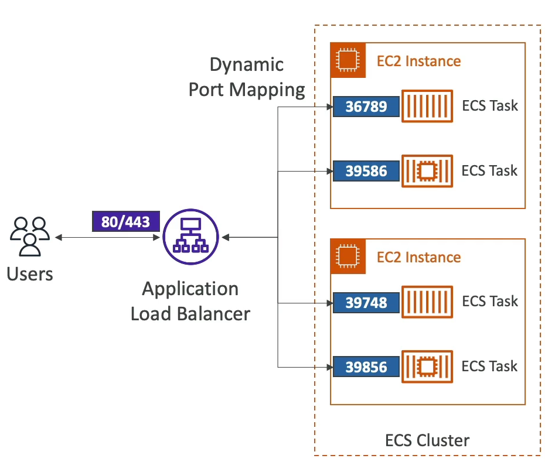
        - Easy autoscaling
    - Run batch processing / scheduled tasks
        - Schedule ECS tasks to run on different launch tempalte instances 
    - Migrate apps to cloud
        - Dockerize legacy apps
        - Move docker containers to run on ECS
- Concepts
    - ***ECS Cluster***: Logical grouping of EC2 Instances to run ECS Containers
    - ***ECS Service***: Defines how many tasks should run, and how they should be ran / orchestrated
    - ***Task Definitions***: Metadata in JSON format that tells ECS how to run a Docker container
        - Image name, CPU, RAM allocation, etc..
    - ***ECS Task***: An instance of a task definition...it's a running Docker Container / Docker Container(s)
        - Task definiton can mention multiple containers to be ran at once
    - ***ECS IAM Role***:
        - ***EC2 Instance Profile***: Is used by the EC2 instance that the docker container is ran on to make API calls to ECS or other services
            - EC2 needs to be able to pull ECR images, communicate with ECS control plane, cluster, and report status to cloudwatch
            - This role basically specifies what the EC2 instance itself can do outside of the ECS IAM Role
        - ***ECS Task IAM Role***: Allows each task to have a specific role so it can make API call to specific services
        - These two differentiate how the VM itself can make API calls, and how the running container can make calls
        - 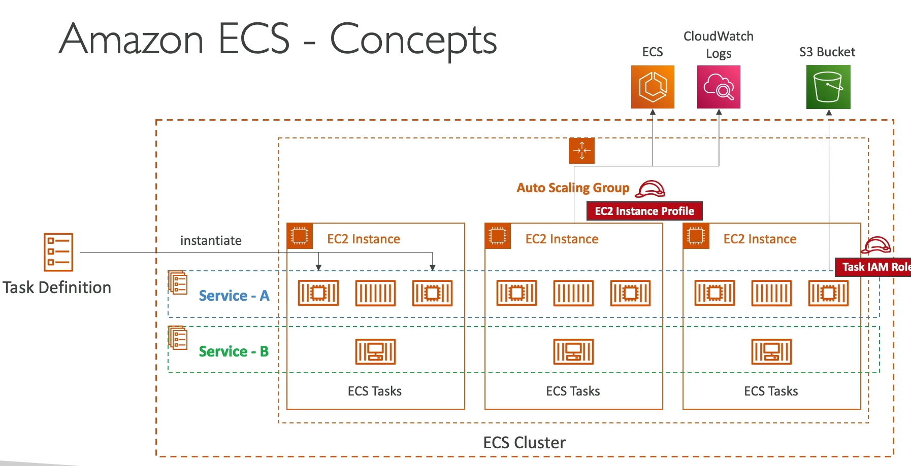
    - ***AWS Fargate*** is a serverless way to provision ECS containers
        - Just create task definitions, and then they get created for you
        - Need a VPC Endpoint to get from our VPC to AWS Backbone VPC 
    - Security and Networking
        - Inject secrets and configs as env variables into Docker Containers via SSM parameter store
        - Networking
            - ***none***: Means there is no network connectivity, port mappings, etc...
            - ***bridge***: uses docker virtual container-based network
                - Uses `docker0` virtual network bridge
                - Each container gets its own IP address within bridge network
                - Containers communicate via private IP's, or container name via Docker DNS
                - Logical separation from container network and host server network
                - NAT Port mapping and address translation is touchy
                    - Port mapping required on all containers
            - ***host***: bypasses the docker network and uses the underlying host network interface of compute
                - Uses host network stack
                - Same as trying to ping off of the CLI
                - No port mapping
                - Containers bind to host port
            - ***awsvpc***:
                - Every task launcehd on the instance gets its own ENI and private IP
                - Simplified networking, enhanced security, and integration with security groups and VPC flow logs
                - Allows us to do networking via AWS services
    - Autoscaling
        - Automatically increase/decrase desired number of tasks based on AWS App Autoscaling
            - TargetTracking
            - StepScaling
            - ScheduledScaling
        - ECS Task scaling IS NOT the same as EC2 instance scaling
    - Spot Instances
        - Work for ECS 
        - Use Launch Template for ECS Tasks
        - Same pros and cons as general spot instances
    - AWS ECR
        - Store docker images on AWS
        - Cross region and cross account replication so we don't have to rebuild
        - Private or Public repository
        - IAM Role is needed to pull
        - Resource policy on what can pull from it
        - Image scanning
            - Security, versioning, image tags, etc..
            - Manual scan or scan on push
            - Base scanning for common vulnerability
            - Enhanced scanning via Amazon Inspector
            - Vulnerabilities can get sent to EventBridge
####  AWS EKS
- Launch managed kubernetes cluster on AWS
- K8's is an open source system for auto deployment, scaling, and management of containerized apps
- Alternative to ECS, but a bit more involves
- EC2 and Fargate integrations
- K8's is cloud agnostic
- 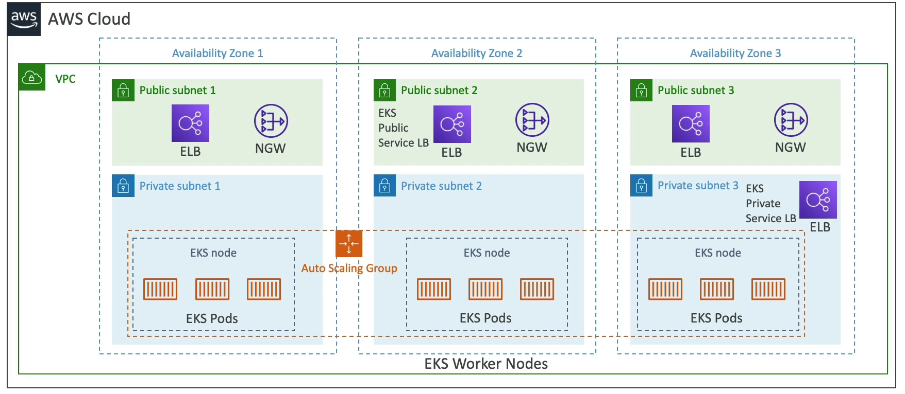
- Node Types
    - ***Managed***:
        - AWS creates and manages nodes for you
        - Nodes apart of ASG managed by EKS
        - Supports On-Demand or Spot
    - ***Self-Managed***:
        - Nodes created by you, and you register them to the EKS
        - Can manage these still with ASG
        - Use prebuilt AMI
- Data Volumes
    - Need to specify ***Storage Class*** manifest in EKS cluster
    - Leverages a ***Container Storage Interface (CSI)*** compliant driver
    - Support for:
        - EBS Block Storage
        - EFS File System Storage (works with Fargate too)
        - FSx Lustre
        - FSx for NetApp

#### AWS App Runner
- Fullymanaged service that makes it easy to deploy web apps and APIs
- No infra experience needed
- Start with source code / container image
- Auto builds, deploys, and scales 
- Auto scaling, highly available, load balancer, encryption
- VPC Access Support
- Connect to DB, Cache, Message queue, etc...
- 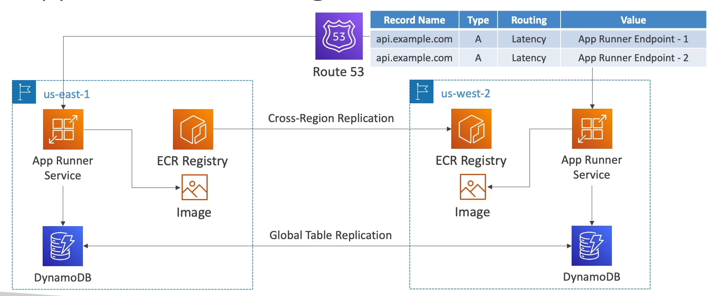

#### On-Prem Integration

##### Amazon ECS Anywhere
- Run containers on customer managed infrastructure
- Use the ECS control plane to manage containers on premise
    - Need ECS Container Agent and SSM agents on our computerss
    - Both agents register with AWS services, and then we can spin up containers on-prem
- Good use case for compliance, regions not on AWS, etc...

##### EKS Anywhere
- Create and operate K8s cluster created outside of AWS
- Use the Amazon EKS Distro 
- You use this without connecting to AWS anywhere
    - Use EKS Anywhere installer
    - We ***could***, but don't have to, connect to AWS using EKS Connector, and then it would allow you to use AWS Console to manage EKS cluster

### Lambda
It's just running a serverless function - it integrates with almost everything

- Useful, and almost hello world, example:
    - New image dropped in S3
    - Lambda gets triggered by S3 Notifications, and creates a thumbnail
    - Push:
        - Thumbnail to S3
        - Metadata to DyanmoDB
            - Creation date, size, S3 URL, etc..
- Can run:
    - Python, Node.js, Java, C#, Ruby
    - Custom Runtimes, sponsored by community, help support Rust, Golang, and other languages
    - Containers:
        - Typically, these should be ran on ECS / Fargate...somehow it can run on Lambda tho
- CodeDeploy
    - Helps us automate traffic shift to lambdas
    - ***Linear***: grows traffic X% to new service every Y minutes until 100%
    - ***Canary***: Try X% for Y minutes, and then go to 100%
    - ***AllAtOnce***: Run after some metrics / health checks completed
- CloudWatch:
    - Execution logs stored in CWLogs
    - Metrics displayed in CWMetrics
    - Lambda needs right execution IAM policy to authorize writes to CWLogs
- XRay: 
    - Add tracing into lambda SDK 
    - Lambda needs correct IAMs to write to XRay

#### Limitations
- RAM (10GB)
- CPU (2vCPU)
- 15 min timeout
- `/tmp` storage - 10 GB
- 50 MB Deployment Package zipped, 250MB unzipped
- 1k concurrent executions
    - Can reserve capacity / limit downscaling if needed
        - We'd want to limit lambda invocations for each service so that lambda from ALB can't affect lambda running off S3
    - Going over gives throttle
- 10GB container image size
- 6MB invocation payload sync
- 256KB invocation async

#### Lambda in VPC
- Default:
    - Lambdas, by default, are deployed into AWS's VPC by default (serverless)
    - Can't access private RDS's in our instance
- In Private Subnet:
    - Can deploy a lambda to a specific VPC with a specified security group
    - With the right SG, we can access private resources because we're in the private subnet
    - What if we want to access the internet from here?
        - Need NAT GW, IGW, or VPCEndpoint:
            - NAT GW: 
                - Deploy NAT GW in public subnet
                - NAT GW redirects to IGW in public subnet
                - IGW interfaces with internet facing API's
            - DyanmoDB:
                - DynamoDB is a public facing endpoint
                - We could go same route as above with NAT GW + IGW
                - We could also put a VPCEndpoint in our private subnet and have it interface with DyanmoDBs
- In Public Subnet:
    - Still won't have internet access, need to do above still
- IP Addresses:
    - Default: Gets a random IP from AWS Cloud's IP, so internet will see traffic from random public IP
    - Private Subnet:
        - NGW (public subnet) to IGW to internet
        - NGW will need to have a fixed ElasticIP to it
            - At this point there's a fixed IP the internet sees
- Sync vs Async
    - Sync:
        - CLI, SDK, API GW
        - All invocations returned right away, and waited upon
        - Results returned right away
        - Error handling happens on client side
    - ASync:
        - S3, SNS, EventBridge
        - Invocations happened, and then not waited upong
        - Lambda attempts to retry on errors
            - Meaning lambda service itself will retry
        - Need to ensure processing is idempotent
            - Use a dead letter queue
    - Example:
        - SNS and SQS:
            - If we upload files to S3, and that in turn sends notifications to SNS, should we immediately have a lambda after SNS or should we use SQS as an intermediate?
            - SNS to lambda will run immediately, so if 1k files uploaded then we'll have 1k lambdas ran in parallel
                - Potential throttling and concurrency issues
                - Need a DLQueue to store errored results
            - SNS to SQS will fill up SQS with messages
                - Lambda can consume these in batches at its own rate
                - Potentially filling up SQS during bursts
                - Potential delays
                - Messages can stay in SQS if lambda fails

## Load Balancers
- 4 kinds of managed load balancers:
    - Classic Load Balancer (CLB)
        - Only V1 legacy load balancer type
    - Application Load Balancer (ALB)
        - HTTP, HTTPS, and WebSockets
        - L7
    - Network Load Balancer (NLB)
        - TCP, TLS (secure TCP), and UDP
        - L4
    - Gateway Load Balancer (GLB)
        - Operates at L3 Network IP Protocol layer
- Load Balancers are deployed in a specific region, and can be configured to span multiple AZ's so that if one AZ goes down the LB does not also go down
    - i.e. they are highly available
### CLB
- Health Checks can be HTTP (L7) or TCP (L4)
- Supports only 1 SSL Certificate
    - SSL can have many Subject Alternative Names (SAN), but SSL cert must be changed when new SAN is added / removed
    - Better to use ALB with Server Name Indication (SNI) to host multiple websites using 1 SSL Cert
    - We'd need multiple CLB's if we have multiple SSL Certs
- TCP => TCP passes all traffic to EC2 instance

### ALB
- Layer7 HTTP(S) only
    - ***YOU can't assign Static IP to ALB!!***
    - Need to place NLB in front w/ static IP and route to ALB
- Load Balancing to multiple HTTP apps across machines (target groups)
- Load balancing to multiple apps on the same machine (containers) with dynamic port mapping on target groups
- Support for HTTP/2 and WebSockets
- Routing rules for paths, headers, query strings, etc...
    - Routing based on HTTP headers / paths (L7)
- Target Groups:
    - EC2 instances (managed by ASG) over hTTP
    - ECS Tasks (managed by ECS) over HTTP
        - When new tasks are deployed or scaled up, the ECS service itself updates the target groups and registers new tasks with it
        - Same thing with ASG, you register the target group to the autoscaling configuration, and then auto scaling registers targets with the target group for you
    - Lambda functions - HTTP request is translated to JSON event
    - IP addresses - can work, but they must be private IP's
- ALB can route to multiple target groups

### NLB
- Layer 4 
- Forward TCP and UDP traffic to instances
- Less latency, and millions of requests per second
- NLB has ***one static IP per AZ***, and supports ElasticIP
    - Useful when we need to whitelist IP
    - NLB's are deployed regionally, but have Zonal / AZ level deployments
- Not included in Free Tier
- Target groups:
    - EC2 instances
    - IP addresses
    - ALB!
        - Can use ALB for route requesting based on L7, but we want to keep the static IP of the NLB
- Zonal DNS
    - Resolving Regional NLB DNS names return the IP addresses for all NLB nodes in all AZ's
    - If we query the high level NLB URL, it will return all IP's across all AZ's
        - High level: `my-nlb-123.us-east-1.aws`
        - Zonal DNS: `us-east-1a-123.us-east-1.aws`
            - We can see we're targeting `us-east-1a` here
        - Just need to query the specific Zonal URL
    - If we only was a specific AZ's DNS name, we can resolve to only a single IP address
    - 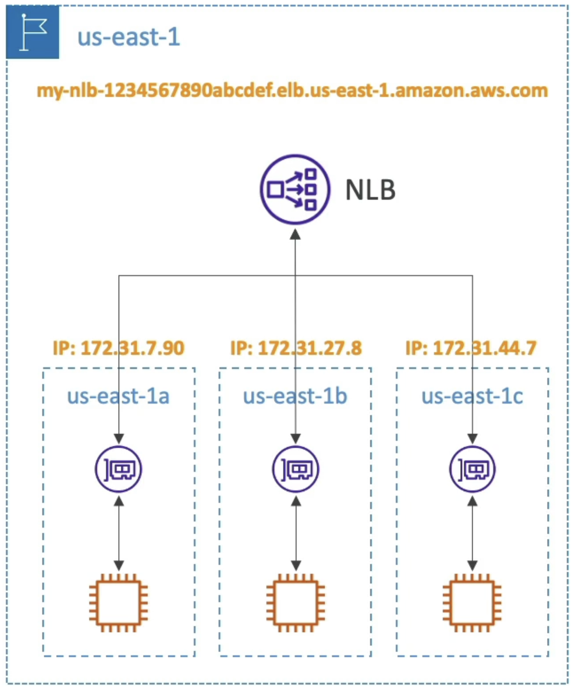

### GLB
- Deploy, scale, and manage a fleet of 3rd party Network Virtual Appliances in AWS
- Firewalls, Intrusion Detection, Payload Manipulation, etc...
- Operates at L3 IP Packet data
- Arch:
    - Users route tables to to GLB
    - GLB routes traffic to 3rd party security apps in target group
    - They sniff packets and send back to GLB
    - GLB forwards to app
- Target Groups
    - EC2
    - IP addresses

### Cross Zone Load Balancing
- Multi Zone load balancing, or sending requests across zones to other EC2s
- With Cross-Zone LB each load balancer instance distributes evenly across all registerd instances in all AZ
- Without Cross-Zone LB, we may have overloaded instances if our zones are uneven
- 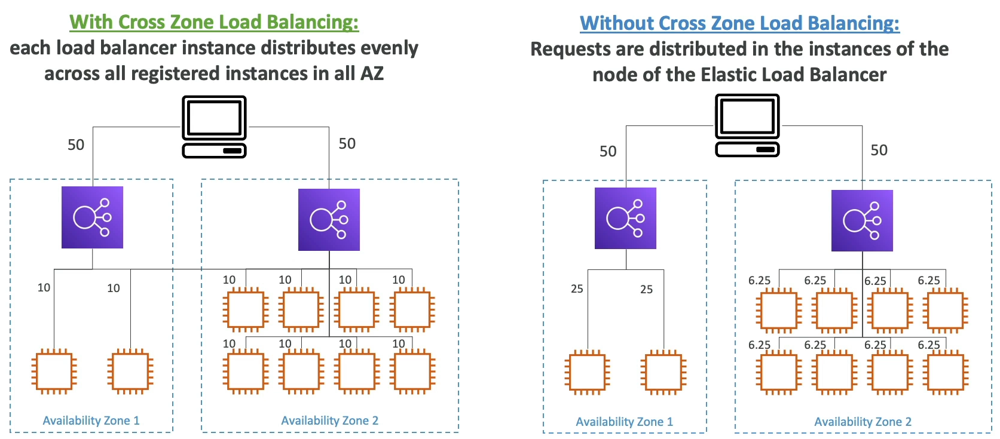

- CLB: Disabled by default
- ALB: Always on, can't disable, and no charge for inter-AZ
- NLB: Disabled by default, and pay for inter-AZ if enabled
- GLB: Disabled by default, and pay for inter-AZ if enabled

#### Sticky Sessions (Affinity)
- Sticky Sessions, or Session Affinity, ensures that a client request is always redirected to the same instance behind a load balancer
- Available on CLB and ALB
    - Cookie is sent from client to LB
        - Expiration time set my LB configs
    - If cookie expires, user might end up routed to new ALB

#### Routing Algorithms
- Least Outstanding Requests
    - Next instance to receive request has the lowest number of pending / unfinished requests
    - Available on CLB and ALB
- Round Robin
    - Loops over each one for uniform distribution
- Flow Hash
    - Put all below info through hash to choose a target EC2 / instance
        - Basically how Sticky Sessions are computed (how we choose the instance for the session)
    - Selects a target based on:
        - Protocol
        - Source / Dest IP
        - Source / Dest Port
        - TCP sequence number
    - Each TCP / UDP connection routed to a single target for the life of the connection
    - Works with NLB

## API GW
An API GW acts as a proxy / general route planner for HTTP endpoints and AWS Services

Most typical architectures will end up sending HTTP requests to Lambda or ECS

- Features:
    - API Versioning
    - Authentication / Authorization
    - Traffic Mgmt
        - API Keys
        - Rate Limiting
        - Caching
        - Throttling
        - Usage plans
        - SSL/TLS Offloading
    - Huge scale
    - Serverless
    - Req/Resp Transformations
    - OpenAPI Spec
        - Client can generate libraries automatically from the spec

- Errors:
    - 4xx means Client errors
    - 5xx means Server Errors

- Limitations:
    - 29 Second timeout...lambda has 15 min timeout, but response needs to be within 29 seconds
    - 10 MB max payload size (no large files or anything)

- ***Deployment Stages***:
    - API's deployed to Stages
        - dev/stg/prod, v1/v2, etc...
    - Stages can be rolled back as a history of deployments is kept 
    - Lots of groups do stage per environment, and then testing across environments
        - Can allow canary testing Test Endpoint from dev feature for 5% of traffic
- ***Integrations***:
    - HTTP Endpoints at the end of the day
        - Internal HTTP API on prem, App LB, etc...
        - Again, still useful for all of the Features above like rate limiting and caching out of the box without having to do sidecar services for everything
    - Lambda
        - Easy way to expose a REST API backed by AWS Lambda
    - AWS Services
        - Start an AWS Step Function
        - Post a message to SQS
        - Some others, but it allows us to add authentication and deploy publicly

#### Example
API GW in front of S3 for uploading files

- We could directly place API GW in front of S3, but as we know there's a 10MB limit
- A better way to do this would be exposing a lambda from API GW, this lambda calls S3 to generate a pre-signed URL
    - Then API GW returns the response w/ pre-signed URL to client
    - Client can use that to upload to S3

### Endpoint Types
- ***Edge Optimized***
    - Default
    - Requests routed through CloudFront Edge locations...this is because CloudFront has a number of features that shouldn't have been repeated for API GW
        - Improves latency
        - Reuses TCP conncetions
        - Caches content (if needed)
            - Especailly useful for static content
            - Cache TTL is usually 300 seconds, can override cache settings per method / endpoint
                - GET might be 1 minute
                - POST might be 0 seconds
                - Client can bypass cache with correct IAM resources
        - DDoS protection
        - WAF integration
        - IP Whitelisting / Blacklisting
        - API GW is regional, but CloudFront is global, so can route requests to regional API GW
        - Custom Domain Names
        - Advanced Routing
    - API GW still lives in only 1 region
- ***Regional***
    - For clients within the same region
    - Could manually combine with CloudFront, gives more control over caching strategies and distribution, but not required
- ***Private***
    - Can only be accessed from VPC using an Interface VPC Endpoint (ENI)
    - Use a resource policy to define access

#### Security
- API GW can 
    - Load SSL certificates
        - Do SSL offloading
    - Use Route53 to define a CNAME with SSL
    - Use Resource Policies
        - Similar to S3 bucket policy
        - Control who can access the API (authorization)
        - Users from other accounts, IP's from specific CIDR, or mention specific VPC ARN
    - IAM Execution Roles for API GW at API level
        - Invoke lambda functions and other AWS services
    - Cross Origin Resource Sharing (CORS) 
        - Browser based security
        - Control which domains can call your API via JS
- Authentication
    - IAM based access is good for access inside of own infra
    - Use Cognito User Pools
        - Client auth to Cognito
        - Client passes token to API GW
        - API GW knows out of the box how to verify to token
        - 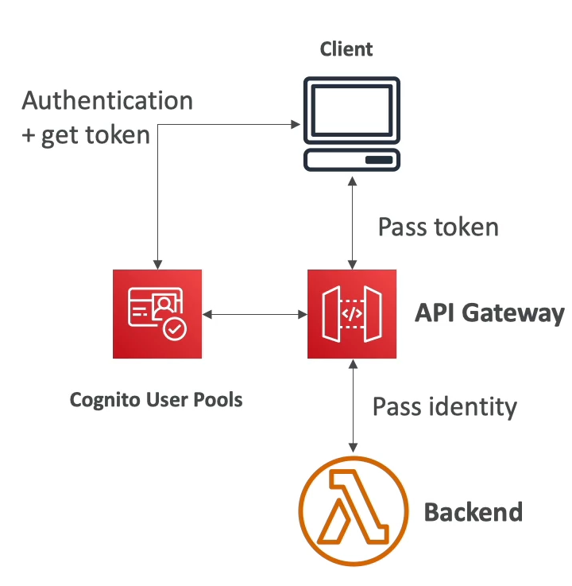
    - Lambda based auth allows us to do OAuth, SAML, or 3rd party

#### Logging and Monitoring
- CloudWatch Logs
    - Enable CWLogs at Stage level
    - Log full request / response data
    - API GW Access Logs
    - Can send directly to Kinesis Data Firehose
- CloudWatch Metrics
    - Metrics are by stage
    - `IntegrationLatency`, `Latency`, `CacheHitCount`, `CacheMissCount`
- XRay
    - Enable tracing to get extra info
    - XRay on API GW + Lambda gives full OTEL over req/resp

### Usage Plans & Keys
- Making an API avaialble as an offering, i.e. for $$, to customers, the typical advice is to use a usage plan
- ***Usage Plans*** allow us to define:
    - Who can access one or more deployed API stages and methods (authentication and authorization)
    - How much and how fast they can access them (rate limit)
    - API Keys which identify API clients and meter access (both of the above, again)
        - API Keys are alphanumeric strings we can distribute to customers
        - Throttling limits applied to API Key level
            - `429 Too Many Requests`
        - Quota limits for overall number of requests across all customers
    - Throttling and quota limits that are enforced on an individual client (rate limiting)

### WebSockets
- Two Way interactive communication between a browser and a server
- Server can push information ot the client
- Allows us to do stateful application use cases
    - Chat apps, collab platforms like Confluence, games, and trading platforms
- Works with AWS Services (Lambda, DynamoDB) or generic HTTP endpoints
- 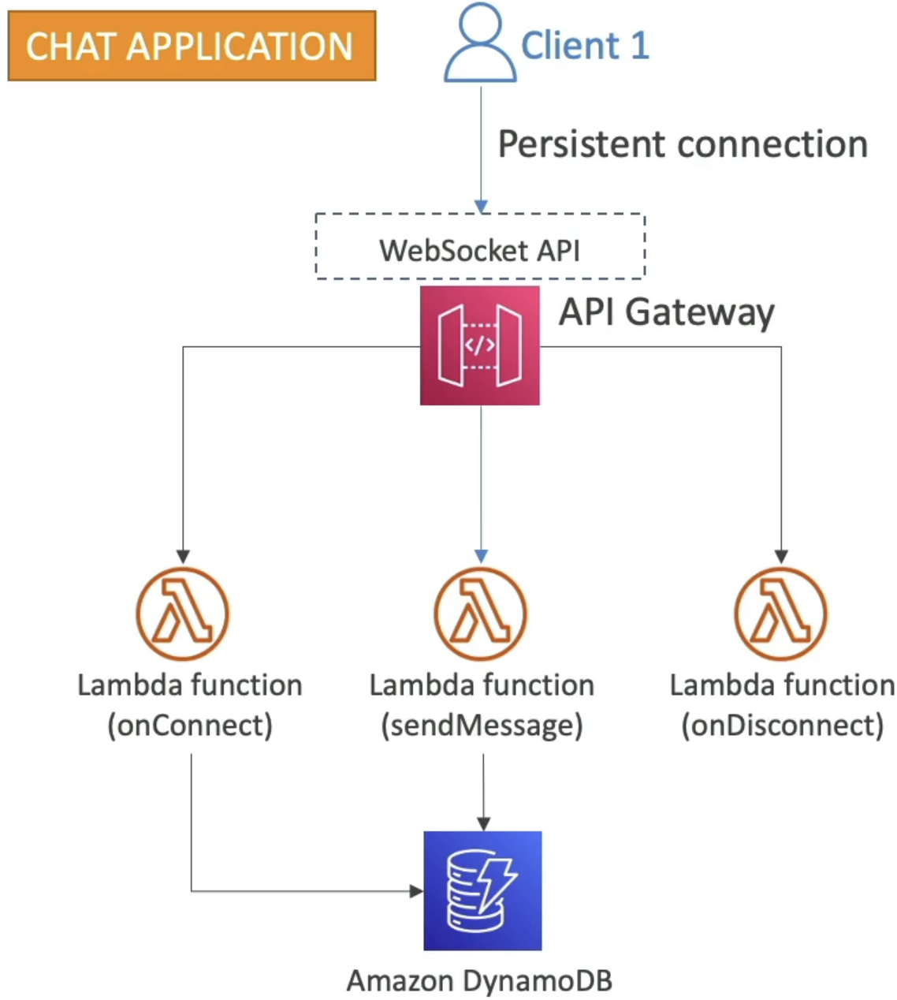
- How do we channel replies back to client? I.e server to client
    - There are callback URL's that are parameterized by `connectionId`
    - Need to use the special `@connections` sub-URL component, and then parameterize
    - 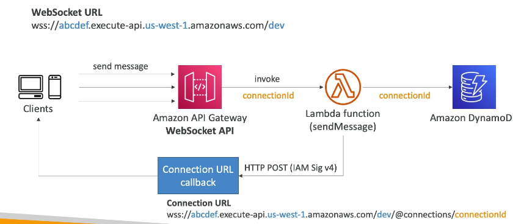

### Private APIs
- ***All APIs in API GW are Public and accessible over Internet unless specified***
- Ways to harden API GW
    - Private API Gateway:
        - Private APIs can only be access from your VPC via a VPC Interface Endpoint
            - Each VPC Interface Endpoint can be used to access multiple private API's
    - API GW Resource Policy
        - We can specify, on any API GW instance, resource policies that force certain criteria such as:
            - VPC's via `aws:SourceVPC` or `aws:SourceVPCE`
            - VPC Endpoints
            - AWS Accts
            - etc...
            - This allows us to ensure even "Public" API GW's act as private ones

### AppSync
- Managed service that uses ***GraphQL***
- Use by mobile apps, web apps, real time dashboards, etc
- Makes it easy for apps to get exactly the data they need
- Includes combining data from ***one or more sources***
    - NoSQL, Relational DB, HTTP API, etc
    - Integrates with Dynamo, Lambda, ES, and others
- ***Retrieve data in real time with WebSOcket or MQTT on WebSocket***
- Mobile apps:
    - Can use local data and data synchronization with cloud
- All relies on GraphQL schemas

#### AppSync and Cognito
- Can perform authorization on Cognito users based on the groups they belong to
- In GraphQL schema you can specify the security for Cognito groups
    - Allows us to tackle the age old problem in GraphQL of aggregating requests over multiple API's and having fine grained permissions on each source API
- We can write resolvers such as the ones below, which means it uses auth against Cognito groups of Bloggers and Readers to choose which ones can call certain GraphQL queries
```
type Query {
    posts: [Post!]!
    @aws_auth(cognito_groups: ["Bloggers", "Readers"])
}
type Mutation {
    addPost(id: ID!, title: String!): Post!
    @aws_auth(cognito_groups: ["Bloggers"])
}
```
- 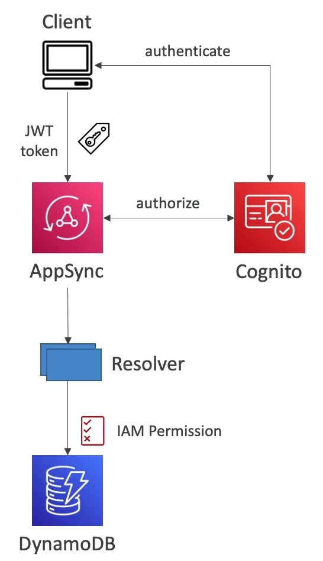

## Route53
Route53 is a managed DNS service that integrates well with Load Balancers, Container Services, and Databases

### Record Types
- A: Maps a hostname to IPV4
- AAAA: Maps a hostname to IPV6
- CNAME: Maps a hostname to another hostname
    - The target is a domain name which must have an A or AAAA record
    - Can't create a CNAME for the top node of a DNS Namespace
        - i.e. can't create for `example.com`, but could for `www.example.com`
- NS: Name Servers for the Hosted Zone
    - Control how traffic is routed for a domain

#### A Record
Extremely simply - client asks for IP of `example.com` and gets back IP `123.45.67` which routes to an IP address

#### CName vs Alias
- AWS Resources (LB, CloudFront, etc) expose an AWS Hostname
    - `lb-1234.is-east-2.elb.amazonaws.com` which can route to `myapp.mydomain.com`
- CNAME:
    - Points a hostname to any other hostname such as `app.mydomain.com => app.region.mydomain.com`
    - Can only be done for ***Non-Root domain***
- Alias
    - Points a hostname to an AWS Resource such as `app.mydomain.com => lb-1234.us-east-2.elb.amazonaws.com`
    - Really anything of the form `*.amazonaws.com`
    - Can work for ***ROOT AND NON-ROOT DOMAIN***
    - Targets:
        - ELB, CLoudFront, API GW, S3 websites, Route53 Record, VPC Interface Endpoint, Global Accelerator, etc..
        - You cannot set an alias record for an EC2 DNS name

### Routing and TTL
- Record TTL:
    - TTL sets how long a record stays in a clients cache before expiration
    - Mandatory for every record besides Alias Record
    - The higher the TTL, the less the traffic load on Route53, but possibly inconsistent
- Routing Policies
    - Routing allows healthchecks as well from Route53 to the Record IP
    - Simple:
        - Allows us to use one single resource, or multiple
        - If multiple then a random one is chosen by the client to be used
    - Weighted:
        - Control % of requests that go to a specific resource
    - Latency:
        - Route to resource that has least latency for users
        - Between users and AWS regions
    - Failover
        - Allows primary and secondary failover
    - Geolocation
        - Routing based on user location
        - Not latency, you can specify mappings by country of origin
    - GeoProximity
        - Need Route53 traffic flow
        - Able to shift traffic to different resources based on the defined bias
        - Bias allows us to change the size of the geographic region
        - Expanding would be 1-99 more bias
        - Detracting would be -1 - -99 less bias
        - Example:
            - If we had a single us-east, and us-west, and bias was 0 for both, the line would be in the middle in Kansas City
            - If we increase bias of us-east, then line shifts to the left and more traffic goes there so line is closer to Denver
    - IP based routing
        - Let me friggin guess, another policy on closest to IP
        - Let me guess, might get caught up by VPN or something else
        - Routing based on client IP address
        - Route53 define list of CIDR for your client
        - Pick a choice for each possible IP address
            - Can route russian traffic somewhere else
            - Or by Internet Provider
    - Multi Value
        - Use when we route to multiple resources
        - Route53 to return multiple values / resources
        - Not a substitute for ELB
- Traffic Flow
    - Visual tool for seeing routing logic of different zones
    - Enables versioning and repliction across regions

### Hosted Zones
- Container for records that define how to route traffic to a domain or subdomain
- ***Public Hosted Zone***: Contains records that specify how to route traffic on the internet (public domain names)
    - `application1.mypublicdomain.com`
    - Public hosted zones are public!
    - DNSSEC is always recommended to protect against MITM and to harden DNS
        - Only useful for public hosted zones
    - Route53 Health Checks
        - Only for public resources
        - 3 Types:
            - Health checks that monitor an endpoint (app, server, aws resource)
            - Health check that monitor other health checks - ***Calculated Health Checks***
                - Combine result of multiple health checks
                - AND OR or NOT
                - Useful to check across services
            - Monitor cloudwatch alarms (full control and extendibility)
    - Monitoring an endpoint
        - 15 global health checkers will check endpoint
        - Passes only when the endpoint responds with 2XX or 3XX codes
        - Can be setup to pass / fail based on text in first 5,120 bytes of response
            - Incase endpoint has some odd response? idrk
- ***Private Hosted Zones***: Contains records of how to route traffic ***inside of one of more VPC's***
    - Private zones are only accessible inside of VPC
    - Route to private IP of EC2 and other things
    - For internal private DNS you must enable VPC settings `enableDnsHostnames` and `enableDnsSupport`
    - Health checks in Private Zones:
        - Private checkers are outside of VPC, so we can't have them check our private resources
        - Can create CloudWatch metric and associate a CloudWatch alarm with it
        - Then create a Health Check (public) on that Alarm 
        - ***Very imoprtsnt for test!!!!***
- Simple arch below shows how we can use lambdas from cloudwatch to trigger read replica failovers during health check failures inside of private VPC's


### Hybrid DNS
Hybrid DNS allows us to resolve DNS queries between our VPC (Route53 Resolver) and other on-prem, public, or other cloud networks (other DNS Resolvers)

- Networks can be:
    - Peered VPC
    - On-Prem network 
- Resolver Endpoints:
    - Inbound Endpoint:
        - DNS Resolvers on your network can forward DNS queries to Route53 Resolver
        - Allows your DNS Resolver to resolve domain names for AWS Resources and Records in Route53 Private Hosted Zones
    - Outbound Endpoint:
        - Conditionally forward DNS queries to your DNS Resolvers
            - ***Conditional Forwarding Rules***: Forward DNS queries for a specified domain and all subdomains to a target IP
            - ***System Rules***: Selectively override the behavior defined in forwarding rules
            - ***Auto Defined System Rules***: Defines how DNS queries for selected domains are resolved
                - Do this for AWS internal domain names, private zones, etc
            - As always, if multiple match it chooses most specific
            - Can be shared across accounts using AWS Ram
                - Centrally manage in 1 acct
                - Send DNS queries from multiple VPC to target IP defined in rules
        - Use Resolver Rules to forward DNS queries to your DNS Resolvers 
    - Associate these Resolver Endpoints with one or more VPCs in the same AWS Region
        - Create in 2 AZ's for HA
        - 10k queries / sec
        - Remove need for running your own resolver
    - Below diagram shows ***inbound***, and we can do the same thing, but reversed, for ***outbound***
    - 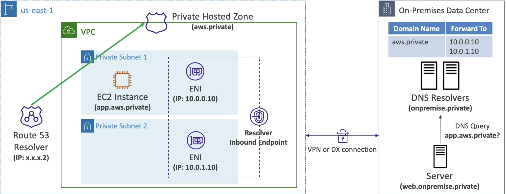

## AWS Global Accelerator
- Allows you to leverage AWS internal network to route to your application
    - Don't have to go over internet and ISP for everything
- 2 ***AnyCast IP*** are created for application
    - These IP's send traffic directly to Edge locations (CDN?)
    - The Edge locations send traffic directly to application
- Targets can be Elastic IP, EC2, ALB, NLB, and all public or private
    - Suports Client IP address preservation, except EIP endpoints
- Health checks similar to Route53
- Security
    - Only 2 IP's need to be whitelisted on app
    - DDoS protection
- Cloudfront vs Global Accelerator
    - Cloudfront is good for improving performance of cacheable content + content served at the edge
    - GA improved performances for a wider variety of things, such as TCP and UDP overall - specifically good fit for non-HTTP use cases like gaming (UDP) and VOiP
    - GA also helps HTTP use cases that require a static IP address

## Comparisons
Comparing some web and compute layer architectures 

### EC2 with Elastic IP
- This is easy, just stick ElasticIP on an EC2, and if the EC2 fails we can move EIP to another EC2
- Figuring out how it failed would need some sort of Health Check, which we can get from EC2 instance monitoring which is automatically added in EC2
    - After some number of fails a CloudWatch alarm gets triggered, and we can have a lambda move the EIP
- This architecture does not scale - it's one EIP to one EC2

### Stateless Web App
- This allows us to horizontally scale
- It's a typical architecture, but not perfect
- Put up multiple EC2 instances, each hosting some web app 
- Use an A Record with 1 Hour TTL for each of the instances with Route53
    - Client queries Route53 and gets an instance IP returned
    - If an instance is terminated, some users will fail and need to query R53 again (fails within 1hr)
        - Client needs to deal with hostname failures
    - Adding an instance may not receive full traffic right away because of TTL

### ALB + ASG + EC2
- Route53 Query is an Alias record to ALB
- ALB setup on 3 AZ's for HA
- ALB routes to instances sitting in an ASG
- Effects:
    - Scales well
    - New instances used automatically
    - Clients never routed to stale
    - ALB is elastic, but can't handle gigantic scale
        - Some clients could lose connection during massive scale events
    - Can use CloudWatch, and can use Cross-Zone scaling for even distribution
    - Slow scale...few minutes for startup script, ECR pull, boot, etc...
- 

### ALB + ASG + ECS on EC2
- Exact same as one above, except there are ECS Tasks running on the EC2 instances versus standalone EC2 instances
- App runs on Docker
- ECS allows dynamic port mappings
    - Helps us maximize CPU usage
- Tough to orchestrate ECS service auto-scaling + ASG autoscaling
    - i.e., tough to orchestrate scaling of container / app layer, and infra layer
    - Need at least 2 autoscaling rules to scale the EC2 instances (infra) along with scaling the ECS service (app) running the tasks
- To go back to this, there are nuances on why app layer (ECS Service) and infra layer must scale together, not only scaling infra
    - ALB routes HTTP request to ECS Tasks via Target Groups
    - ASG manages EC2 instances that ECS runs on
    - ECS Service manages the number of task replicas of application
        - ***ECS Service doesn't automatically increase the number of running tasks just because more EC2 instances become available in ASG***
        - If more instances join ECS Cluster we add more capacity, but ECS will not schedule new tasks unless ECS Services are scaled as well
            - 10 EC2's, 20 tasks --> 12 EC2's, still at 20 tasks and 2 EC2's might be apart of the ECS Cluster via ECS Agent, but there are still only 20 tasks
        - ASG monitors instance (EC2) level metric, not container and task load metrics
            - There's a chance our tasks are overwhelmed while our EC2 isn't, this would be the case if we underutilize EC2 for our tasks
        - So TLDR; Even if we add more EC2's, ECS won't use them unless we up the number of tasks via ECS Service
    - To do the dual auto-scaling
        - ASG scaling policy based on EC2 CPU Utilization
        - ECS Service scaling policy based on ALB request count per target, or task CPU Usage
            - We must scale ECS Task (app layer) to take advantage of newly added EC2 instances (infra layer)

### ALB + ECS on Fargate
- You basically remove all the crap above about scaling app and infra layer, and you only worry about scaling app layer based on metrics
- No ASG, No EC2, blah
- Route53 Alias Record pointing to ALB
- ALB routes to Fargate service
    - Still have limitations of ALB sudden bursts
- Fargate handles scaling of infra layer, and we only worry about scaling app layer

### ALB + Lambda
- Easy way to scale
- Get the functionality of HTTP(S) on ALB
- Limitations + Benefits of lambda
    - 10k concurrent executions
    - Hugely scalable (Serverless)
    - Private or public

### API GW + Lambda
- Client directly calls API GW 
    - API GW handles WAF, DDoS, CDN, and Security integrations
    - API GW is 10k req / second, Lambda is 1k concurernt lambda calls
    - API GW also handled auth, rate limit, caching, etc...

#### API GW + AWS Service As a Proxy
- Can essentially use API GW as auth and proxy to our other services
    - Get all the goodness of auth, caching, rate limiting, SSL / TLS Termination, etc... out of the box
- Can have API GW directly integrate with other services
    - SQS, SNS, Step Fn etc
    - API GW has 10 MB limit, so might not be great for S3

### API GW + HTTP Backend
- HTTP Server on backend connected to API GW
- API GW sits in front to handle all of the "tough" things like auth, rate control, API Keys, caching, and SSL / TLS offloading


## AWS Outposts
- Used for Hybrid (On prem + cloud) infrastructures
- AWS Outposts are AWS Server Racks that have AWS Services on them, but they're installed on-prem
- You become responsible for physical security of servers
- Services:
    - ECS
    - EBS
    - EKS
    - ECS
    - RDS
    - EMR
    - S3
        - Use S3 APIs to sotre and retrieve data locally on Outposts
        - S3 Storage Class named S3 Outposts
        - Default encryption using SSE-S3
        - How to access this from AWS VPC on Cloud:
            - Standup S3 access point, and then EC2 on VPC can access S3 via access point
            - Use AWS DataSync to sync S3 content from Outpost to Cloud

## AWS WaveLength
- WaveLength Zones are infr deployments embedded within telecommunication providers datcenters at edge of 5G networks
- Brings AWS Services to edge of 5G
- Users on 5G that accesses EC2 that's on WaveLength have ultra low latencies
    - Traffic never leaves Comm Service Provider (CSP) network
- High bandwidth and secure connection to parent AWS region if needed
- Use cases:
    - Smart Cities
    - ML Assisted Diagnostics
    - Connected Vehicles
    - Interactive Live Video Streams
    - AR/VR
    - Real Time Gaming
    - etc

## AWS Local Zones
- Allows you to compute AWS Compute, Sotrage, and other AWS Services closer to end-users to run latency-sensitive apps
- Extension of AWS Region
- Not all AWS Regions have them
- AWS Region: N Virginia (us-east-1)
    - AWS Local Zones:
        - Boston
        - Chicago
        - Dallas
        - etc...
- So certain regions now have:
    - AZ
    - LZ
        - Can associate subnets with LZ's, and restrict subnet CIDR to a certain LZ
    - WaveLength Zone