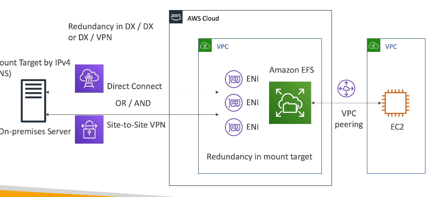
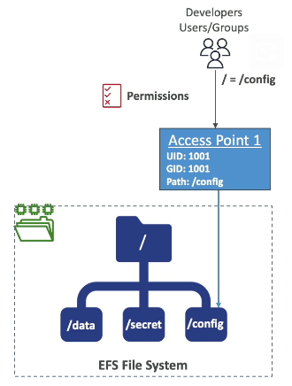
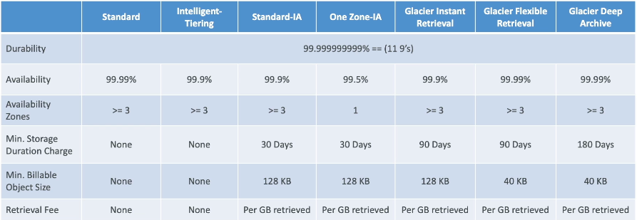

## Storage

## EBS Volumes
- EBS Volumes are network drives 
    - They ***are not physically coupled to instances***
- Attach to one instance at a time
    - Can have multiple EBS Volumes attached to 1 EC2 instance
- Linked to a specific AZ
    - To transfer you snapshot and transfer
        - Transfer across AZ, region, etc
    - Incremental
        - Only backup changed blocks behind the scnees
    - EBS backups use IO so you shoudln't run them while application is handling a lot of traffic
    - Snapshots stored in S3
    - Not necessary to detach to do snapshot, but recommended
    - Can make AMI from Snapshot
    - *Fast Snapshot Restore* is a feature that pre-warms your EBS volumes for you so that once the instance is up and EBS volume attached all of the blocks are ready to go and no cold start problem
- Can only scale them up
- Volume Types
    - `g`: General Purpose SSD for wide variety of workloads
    - `i` Highest Performance SSD for mission-critical low latency or high-throughput workloads
    - `st 1` Low cost HDD for frequent access and high throughput
    - `sc 1` Lowest cost HDD for less frequently accessed workloads
    - Types characterized by Size, Throughput, and IOPS
- Encryption
    - EBS volumes aren't encrypted by default
    - Acct level setting to encrypt automatically new EBS volumes and snapshots
- EBS Multi-Attach
    - This allows us to attach same EBS volume to multiple EC2 isntances ***in the same AZ***
    - We mentioned above this wasn't possible, so this service is only for very specific use cases
        - Achieve higher app availability in clustered linux application
        - Apps that manage concurrent write ops
        - Must use FS that's cluster-aware
    - Each instance has full read and write permissions to the volume

### Amazon Data Lifecycle Manager
- Automate creation, retention, and deletion of EBS snapshot and EBS backed AMI's
- Schedules backups, copies, snapshots, and deletions
- Use resource tags to identify resources
- Can't manage snapshot / AMI outside of DLM

- AWS DLM vs AWS Backup
    - DLM for creation, retention, and deletion of EBS snapshots
    - AWS Backup for management and monitoring of backups across AWS services from a single place
        - Includes EBS volumes

### Local EC2 Instance Store
- EC2 instance store is the physical disk attached to physical server where EC2 is
- Very high IOPS
- Disk up to 7.5TB, if you strip or parallelize many you can get up to 60 TB
- Block storage like EBS
- Data is lost if hardware fails 

- Instance Store vs EBS
    - IS physically attached to machine
        - Data doesn't survive reboot
    - EBS is network drive
        - Data survives reboot

## EFS
- Elastic File System
- Managed Network File System (NFS) that can be mounted on many EC2
- Multiple EC2, multi AZ, and can be across on prem and on cloud
- Highly available, scalable, and expensive file system - you pay per GB used
- Use cases:
    - Web serving, content management, data sharing, WordPress
- Need linux based AMI that's POSIX compliant
- NFS v4.1 protocol
- Encryption at rest via KLMS
- Can only attach to one VPC and one ENI (mount target) per AZ
- Scales automaticall
- Performance and Storage Classes
    - EFS Scale
        - 1k's of concurrent NFS clients
        - 10 GB/s throughput
        - Grow to petabyte scale NFS automatically
    - Performance Mode
        - General: latency sensitive
        - Max I/O: higher latency, throughput, and highly parallel
    - Throughput Mode
        - Bursting: 1TB = 50 MB/s + bursts up to 100MB/s
        - Provisioned: Set throughput regardless of storage size
        - Elastic: Auto scales throughput up or down based on workloads
            - Good for unpredictable workloads
- Storage Classes
    - Standard: Frequently accessed files
        - Multi AZ, good for prod
        - Can use one single AZ for dev purposes
    - Infrequent: Cost to retrieve files, but much lower to store
        - One Zone IA is best to use
    - Archive: Rarely accessed data, and 50% cheaper
    - Implement lifecycle policies to move files between storage tiers

### On Prem and VPC
- Can use VPC peering for VPC-2-VPC connection between EC2 and EFS
    - EC2 instance can use DNS or IP of EFS 
- Can use Direct Connect and/or Site-To-Site VPN for On-Prem server to connect to EFS
    - Need to attach EFS to one or many ENI, and then On-Prem needs to connect to IPv4 address of ENI, they cannot use DNS address

- Security:
    - Can use IAM + POSIX user and groups to control access to directories on file system
        - 
    - File System Properties:
        - Resource-based policy to control access to EFS file systems
            - Same thing as S3, but can control read/write
        - By default it grants full access to all clients
- Replication
    - Cross region replication
    - New and/or existing EFS file systems
    - SAme exact FS in another region
    - ***Doesn't affect throughput*** as this is done in backend away from EFS
    - Use case:
        - Meet compliance needs of DR / business continuity

## S3
- Object storage, serverless, unlimited storage
- Good for static content like image and video
- Access object by key
- ***NOT A FILESYSTEM***
- Anti Patterns:
    - Lots of small files
    - POSIX file system (use EFS instead since it has file locks)
    - Search features, queries, and rapidly changing data
    - Websites with dynamic content
- 
    - Can use S3 lifecycle policies to move between these storage classes
- Replication
    - Cross Region Replication (CRR)
    - Same Region Replication (SRR)
    - Can combine both of these with other lifecycle rules
        - Helps to reduce latency and disaster recovery
    - S3 Replication Time Control (S3 RTC)
        - Replicates most objects that you upload to S3 in seconds with 99.99% of objects with SLA < 15 minutes
        - Helps for ensuring SLA on compliance
- Event Notifications
    - S3 can send event notifications to multiple targets
    - Event types
        - Object Created, Removed, Restored, Replicated, etc...
    - Targets
        - SQS, SNS, Lambda, or EventBridge
        - With EventBridge a common architecture is to send every single S3 event there, and then EventBridge is able ot interact with 18 other AWS services that can all "do things"
            - EventBridge can do advanced filtering with JSON rules
            - Multiple destinations for one rule
            - Proper PubSub of messages based on Events in S3
    - Use cases:
        - Thumbnail uploads onto S3 we want to return
- Baseline performance
    - Automatically scales to high requests, with latency between `100ms - 200ms` 
    - Can achieve these metrics per second per prefix
        - `3,500 PUT/COPY/POST/DELETE`
        - `5,500 GET/HEAD`
        - Prefix = everything after bucket name: `<bucket_name>/prefix.../../../`
        - Spreading reads across prefixes can get you to `22,000 rps`
- Higher performance
    - Multi part upload
        - Recommended for files > 100MB
        - Can help parallelize uploads
        - Chunk out file, upload all, then reconstruct back together on S3
        - S3 lifecycle policy to abort multi-part upload of it doesn't complete
    - S3 Transfer Acceleration
        - Transfer file to AWS edge location which then forwards to S3 bucket in target region
        - Compatible with multi-part upload
        - Public location from client to edge location, then AWS backbone from edge to S3
    - S3 byte range fetches (Downloads)
        - Separate file into chunks of bytes
        - Parallelize GET requests by requesting specific byte range
        - If one part fails we just re-request that one part
        - Also useful for only requesting headers of files, instead of GET whole file

### S3 Storage Class Analytics
- AKA Storage Class Analysis
- Helps decide when to transition objects to the right storage class
- Recommendations for Standard and Standard IA 
    - Doesn't work for One-Zone IA or Glacier
- Report updated daily
- Visualize in AWS Quicksight

### S3 Storage Lens
- Understand, Analyze, and Optimize storage across entire AWS org
- Find anomalies, cost efficiencies, and data protection best practices
- Aggregate data for Org, accounts, regions, buckets, or prefixes
- Summary Metrics:
    - General insights about S3 storage
    - StorageBytes, ObjectCount, etc.
    - Use cases: Identify the fast growing, unused, and "normal" buckets and prefixes
- Cost Optimization Metrics:
    - Provide insights to manage and optimize storage costs
    - NonCurrentVersionStoragebytes, IncompleteMultipartUploadStorageBytes
    - etc...
- Data Protection
    - VersioningEnabledBucketCOunt
    - etc - lots of metrics around if we are protecting data
- Access Management Metrics
- Event Metrics
- Performance Metrics
- Activity Metrics
- Detailed Status Code Metrics
    - 20OKStatusCount
- Free vs Paid
    - Free 
        - Automatically available for all cusomters
        - 28 usage metrics
        - Data available for 14 days
    - Paid
        - Additional + Advanced metrics
        - CloudWatch Publishing 
        - Prefix Aggregation
        - Data available for 15 months

### S3 Solution Architecture For Exposing Static Objects
- Stand up EC2 with static content
- Use CloudFront in front of EC2 with EBS on it
    - Caches static content globally
- CloudFront in front of ALB 
    - ALB in front of ASG of EC2 which are all connected to EFS
    - EFS is on network, so it scales
- CloudFront in front of S3
    - Works great for static objects that aren't updated often

#### Indexing Objects
- We can't natively index objects in S3, to do search we'd need to check all files / prefixes
- On new writes to S3 we can use an Event Notification to trigger a lambda function
- Lambda would write object metadata and update indexes on DynamoDB
    - Search by date, total storage used by customers, find all objects w/ certain attribute, etc...

#### Dynamic vs Static
- To serve both dynamic and static content
- DNS query on Route53
    - Dynamic content sent to API GW + dynamic backend
        - Very little cyachying here
    - Static content goes through CDN CloudFront layer
        - Pulls from S3
        - Lots of cyachying here
    - Dynamic layer could upload data to S3 backing static layer
        - Can use Event Notifications and Lambdas to talk between the 2 layers as required

## FSx
- Launch 3rd party file systems on AWS
- Fully managed systems
- Similar to RDS hosting database, but we host File Systems
- Types:
    - Lustre
        - Large scale distributed file system
        - LinuxCluster = Lustre
        - ML and HPC
            - Video processing, financial modeling, etc
        - SSD for low latency IOPS intensive lots of small file workloads
        - HDD for throughput intensive large sequential file operations
        - Integrates with S3, can use S3 as a FS into FSx
        - Can write output back to S3
        - Accessible from on-prem infra with VPN or DirectConnect
        - 2 types:
            - Scratch
                - Temp storage, data not replicated, etc...
                - Much higher burst and IOPS
                - Short term processing of data and cost optimization
                - Multiple compute across AZ's connect to ENI that sits on FSx 
                    - Can replicate to S3 if needed
            - Persistent
                - Long term storage
                - Data replicated within same AZ
                - Replace failed files within minutes
                - Use for long term processing and sensitive data
                - Same architecture as above, but there are multiple disks backing up the FSx resource
    - NetApp ONTAP
        - Compatible with NFS, SMB, iSCSI protocol
        - Move workloads running ONTAP or NAS to AWS
        - Works with many Linux and Windows instances
        - Scales storage automatically
        - Replication, snapshots, compression, de-duplication, etc
        - Point In Time instantaneous cloning
    - Windows File Server
        - Fully managed Windows shared drive
        - SMB protocol and Windows NTFS
        - Microsoft AD integration with ACL, user, and quotas
        - Can be mounted on Linux EC2 instances? Lol
        - Supports Microsoft Distributed File System Namespace to group files across multiple file systems
            - on-prem and cloud, or just across multiple cloud file systems
        - SSD or HDD based
        - Data backed up daily
        - Can be configured to Multi-AZ HA
        - Accessible from on-prem infra with VPN or DirectConnect
    - OpenZFS
        - Only compatible with NFS protocol
        - Move internal workloads running on ZFS to AWS
        - Works with many Linux and Windows instances
        - Snapshots, compression, etc
        - Point In Time instantaneous cloning
        - Up to 1M IOPS with < 0.5ms latency

### FSx Soln Arch
- Single AZ to Multi AZ
    - Use DataSync to replicate from FSx Single AZ to FSx Multi AZ
    - Shut down Single AZ, manual backup to Multi, restore Multi AZ
- Decrease FSx volume size
    - Can only increase
    - If you take a backup, you can only restore to same size
    - Therefore, we must use DataSync
        - Standup smaller FSx 
        - Use DataSync for some portion of first FSx to smaller second FSx
- Some stupid lazy loading thing for FSx that shouldn't be on the test
    - Any data processing job on Lustre with S3 as input can be started without Lustre doing a full download of dataset
    - Data is lazy loaded, only the data that's actually processed is loaded
        - This means you can decrease cost and latency!
        - Just dive in to this super abstract and unnecessary feature, and ensure you are getting the most out of your AWS Service!

## DataSync
- Synchronize data!
- Move large amounts of data to and from places
- On-Prem, other clouds, etc...
    - Needs an agent on-prem or on the other cloud to do this
    - One agent can use 10 GB/s, but we can setup a bandwidth limit too
- AWS Service to Service
    - No agent needed
- Can sync to:
    - S3
    - EFS
    - FSx
- Replication task can be scheduled hourly, daily, weekly
- File permissions and metadata are preserved
    - Compliant with NFS POSIX
    - This is the only service that can keep metadata during replication
- Multiple on-prem or other cloud servers can sync to one DataSync service
    - We can also go the other way and sync services back to on-prem or other cloud
    - Need DataSync agent in each network that needs to get synced
- AWS SnowCone
    - This happens when we don't have network capacity for DataSync
    - SnowCone device comes with agent pre-installed
    - SnowCone pulls data locally, shuts down, and gets shipped to AWS to be uploaded onto cloud
- AWS Service to Service
    - S3
    - FSx
    - EFS
    - Can just sync to and from each
    - Metadata is kept
    - Metadata is kept
    - Metadata is kept
    - Not continuous, it is a scheduled job
- How can we do AWS DataSync through private channels and not public?
    - Need DirectConnect, PrivateLink, and Interface VPC Endpoint
    - 

## Data Exchange
- Find, subscribe to, and use third-party data in cloud
- Once subscriped to you can use Data Exchange API to load directly into S3 or RedShift
- We can also license our own data through RedShift onto Exchange

## Transfer Family
- Send data in and out of S3 or EFS via only the FTP protocol
- Protocols
    - File Transfer Protocol (FTP)
    - File Transfer Protocol over SSL (FTPS)
    - Secure File Transfer Protocol (SFTP)
- Pay per provisioned endpoint
- Managed infra
- Integrate with existing auth system
- Used for sharing files and public dataset