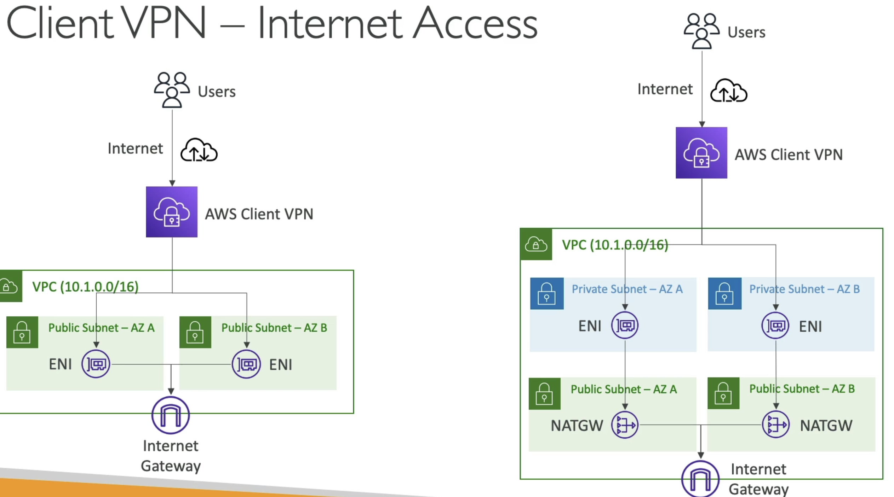

## VPC
Virtual Private Clouds are about how we can deploy VM's, storage, and other resources into:
- "virtual" meaning not physical but logically separated
- "private" meaning we don't share things in this logically separated unit
- "cloud" which is just us using someone elses VM's

So a VPC is a way for us to logically separate a group of VM's, typically by IP addresses

TLDR for all of this - Use a Transit Gateway as it's the best hub-and-spoke setup, if it doesn't work good luck

### Basics
- ***CIDR*** is a block of IP addresses denoted by `X.X.X.X/size` where `X's` denote addresses
    - They have 32 bits in total, or 4 slices of 1 byte
    - `192.168.0.0/24` means the first 24 bits of the address are used to designate the network "slice" and the remaining 8 bites are used by any host inside of it
    - Whatever amount of remaining bits are leftover denotes the size
        - $2^8 = 256$ means we have 256 IP addresses to use in this network
- ***Private IP*** are IP's only avaialble inside of a private network
    - These are *the only* IP's able to be used as private IP's, and any other IP is public
        - Technically most people's IP in their homes if they want to have 2 computers talk on local network will be `192.168.X.X` because they're private
        - If you wanted to have 2 computers talk over 2 different local networks they'd need to be relayed / have their own public IP's
    - `10.0.0.0 - 10.255.255.255` which represents `10.0.0.0/8` is used for big corporate networks
    - `172.16.0.0 - 172.31.255.255`
    - `192.168.0.0 - 192.168.255.255` are used for personal local networks
- Defintion of ***VPC***
    - Must have a defined list of CIDR blocks that cannot be changed afterwards
    - Each CIDR within a VPC has minimum `/28` and max `/16`
    - ***VPC is private*** so only private IP CIDR ranges are allowed
- ***Subnets*** are logical separations of your VPC based on CIDR blocks
    - Subnets are sub-networks (subsets of networks)
    - Instances in subnets are defined by CIDR block of subnet
    - First 4, and last 1, IP in subnet are reserved by AWS for networking purposes
- ***Route Tables***
    - Used to control where network traffic is directed to
    - Can be associated with specific subnets
    - The most specific routing rule is always followed
- ***Internet Gateway (IGW)*** allow our VPC to connect to the internet
    - HA, scales, yada yada
    - Acts as a NAT for instances that have a public IPv4 or IPv6 IP address
    - *Any instance that have traffic routed to the IGW (via route tables) will have internet access, any instances that do not will not!*
- ***Public Subnets*** have a route table that sends `0.0.0.0/0` traffic to IGW
    - This is the "most broad rule", so if nothing "more specific" is defined in the route table then all instances are public and internet enabled
    - If route table has more specific rules, then some of the VM's may not be internet enabled
- ***NAT Instance***
    - EC2 instance you deploy in a public subnet
    - Edit route in privtate subnet to route `0.0.0.0/0` to nAT instance
    - Not resilient to failure, it's a single EC2
    - Must disable Source/Destination check (EC2) setting
    - NAT instance should get elastic IP so public internet knows who it's talking to / allow whitelist
- ***NAT Gateway***
    - Managed solution with scalable throughput
    - Bandwidth scales automatically
    - Must dpeploy multiple NAT for multiple AZ for HA
    - *Has an elastic IP, external services see IP of NAT GW if a private instance utilizes it*
- Internet access
    - Instances ***must have IPv4*** IP to talk to internet
    - Or in a ***Private (non-public) Subnet*** instances can access internet with a NAT instance or NAT Gateway setup in a Public Subnet
        - Must edit routes so that `0.0.0.0/0` routes traffic to NAT
- ***Network ACL (NACL)***
    - Stateless firewall defined at *subnet level*, applies to all instances within
    - Support for allow and deny rules
    - Stateless
        - Return traffic must be explicitly allowed by rules
        - Helpful to quickly and cheaply block specific IP addresses
- ***Security Groups***
    - Applied at *instance level*
    - Stateful
        - Return traffic automatically allowed regardless of rules
    - Can reference other security groups in the same region
- VPC Flow Logs
    - Log internet traffic going through VPC
    - 3 levels
        - VPC level
        - Subnet level
        - ENI level
    - Very helpful to capture "denied internet traffic" to figure out why networking isn't working
    - Can be sent to CloudWatch Logs and S3
- Bastion hosts
    - SSH into private EC2instance through a public EC2
    - You manage these yourselves
    - Avoid these, just use SSM
- IPv6
    - All are public
    - 4.3 billion
    - Apparently, there's "so many" that they can't be scanned online, so they appear as pseudo-random
    - VPC supports IPv6
        - Public subnet
            - Create instance w/ IPv6 support
            - Route table entry `::/0` (IPv6 all) to IGW
        - Private subnet
            - Instances cannot be reached by IPv6, but they can reach IPv6 instances / addresses
            - Create an egress only IGW in VPC
            - Add route entry for private subnet from `::/0` (IPv6 all) to Egress only IGW

### VPC Peering
- Connect 2 VPC's privately using AWS backbone network
- Make them behave as if they were the same network
- Must not have overlapping CIDR
- ***Not transitive***
    - $A \leftrightarrow B \ \& \ B \leftrightarrow C$ $\neq A \leftrightarrow C$
    - Must create peer between $A \leftrightarrow C$
- Must update route tables ***in each VPC subnet*** to ensure instances can communicate
- VPC Peering can work inter-region and cross-account
- Can reference security group of a peered VPC (cross-account)
- Longest prefix match
    - VPC uses longest prefix match to select most specific route
    - If we have 2 VPC's with similar CIDR that we peer to frmo a central VPC, we have to use specific route table rules to ensure we send traffic to specific instances
        - In the below example we want to send some traffic to a specific instance in VPC B, and the rest to VPC C
    - 
- Invalid configurations
    - Overlapping CIDR (even just one!)
    - No transitive VPC peering
    - No edge to edge routing (same as transitive VPC peering)
        - Specifc to VPN, Direct Connect, IGW, NAT GW, VPC Endpoints (S3 and Dynamo)
        - These services also don't allow transitive routing based on peering
        - This means if we have private VPCs, let's say 5, and then one central VPC with a NAT Gateway and an IGW
            - If the NGW is peered to the IGW, and our private subnets are peered each to the NGW, that doesn't mean we can access the IGW from the instances
            - This is definition of "edge to edge routing" and it's not allowed, we'd need to connect each instance to IGW itself

### Transit Gateway
- Everything above becomes complicated, there are directed relationships and edge-to-edge considerations
- ***Transit Gateways are Transitive***
- Transit Gateways help to solve this! 
    - *They allow for transitive peering between thousands of VPCs, on-premise networks, and 3rd party networks*
        - Most of the extra connections are done via AWS Direct Connect and VPN Connection resources
    - Transit Gateways allow for hub-and-spoke (star) connection model
- Regional resource
    - Can peer Transit Gateways themselves across regions
- Share cross account via Resource Access Manager (RAM)
- Route tables allow us to limit which VPC's can talk to each other
- Works with Direct Connect, VPN Connections
- Supports ***IP Multicast*** (which is not supported by any other AWS Service)
- Allows instances in any VPC to access following resources in other VPC's that are attached to TGW:
    - NAT GW
    - NLB
    - PrivateLink
    - EFS
    - More
- Using a Transit Gateway allows us to alleviate the problem in [VPC Peering](#vpc-peering) where we couldn't have a central NAT GW!
    - Below we can see our Egress-VPC has all of the required NAT GW and IGW setup with correct routing tables
        - Shows how Egress-VPC routes any traffic from `10.0.0.0/16` back to TGW-Internet to route to App-VPC's
        - And then how App-VPC's route traffic to TGW-Internet, and any route not back to `10.0.0.0/16` gets routed out to IGW out to the internet
            - ***Q***: TGW-Internet is actually being routed to ENI's, which then route to NAT GW, and this is because:
                - That's just the way things work
                - For TGW to attach to VPC's it needs some sort of entry/exit point, and that is the sole purpose of ENI's
                - The NAT GW itself is implemented as an ENI in a public subnet
                - Therefore, traffic from TGW-Internet is routed to ENI of NAT GW which then performs NAT before forwarding traffic to IGW 
            - ***Q***: Also NAT GW need to come before IGW because:
                - Private instances cannot route directly to an IGW - they have to go through NAT GW which translates private IP to public
                - *IGW only allows outbound traffic from public IP's*...the NAT GW provides that public IP
                - If we bypass NAT GW the private instances wouldn't have valid public IP's for internet access
    - 
- Can use AWS RAM to share a TGW for VPC attachments across accounts or Organizations
    - Allows the Share, Accept, Use flow to happen a lot faster
- Use different routing tables to prevent VPC's from communicating that you don't want
- Allows us to do Direct Connect to corporate data centers from multiple regions
    - 
- Intra and Inter region peering
    - Allows for data mesh architecture where we can have a Hub TGW per region that connects multiple resources and accounts in that region, and then for every region we have we connect the Hub TGW's to create a mesh of TGW's across all regions

### VPC Endpoints
- Allows us to connect to AWS Services using a private network instead of public www network
- Scale horizontally and are redundant
- No more need for NAT GW --> IGW --> Back to whitelisted service to access our other public services
- ***VPC Endpoint GW used for S3 and DynamoDB*** to access these resources using AWS backbone without going over internet
    - Must update route table entries
        - Destination needs to have target of `vpce-ID`
            - S3 destinations have a specific IP that will show up when we try to enter it in route table...can come from name, but you'll see it
                - This is public hostname, use this not public IP
                - Allows full private access from EC2 to S3
                - ***DNS Resolution must be enabled***
                - GW endpoint can't be extended outside of VPC via peering
            - Same for Dynamo
    - Gateway defined at VPC level
    - 
- ***VPC Endpoint Interface used for all other services*** to access without going over internet
    - Endpoint Interfaces are ENI's so it must live in a subnet
        - This ENI has some private hostname
        - We leverage security groups for security
        - To reach this we need Private DNS
            - Public hostname of service will resolve to private endpoint interface hostname
            - ***DNS Hostnames and DNS Support must be enabled***
            - Interfaces shareable across Direct Connect or Site-To-Site VPN
    - In case of issues using these we can check DNS Settings resolution or route tables to figure out why routing isn't working

#### VPC Endpoint Policies
- JSON documents, similar to IAM policies, that allow us to configure authorization
- Applied at VPC Endpoint level
- These documents do not override or replace IAM user policies, or service policies
- Someone could circumvent this and go directly to the resource, but these policies allow us to filter actions on final resources through VPC Endpoint
    - We'd have to update final resource policy (S3, Dynamo, etc) to disallow any actions not from VPCE
    - Conditions like `aws:sourceVpce: ID` can disallow anything not from that VPCE
        - This only works for VPCEndpoints and private traffic
        - S3 policies can only restrict access from public IP's

### PrivateLink
- AKA / FKA *AWS VPC Endpoint Services*
- Most secure way to expose a service to 1000's of VPC's (across multiple or one account)
- Doesn't require VPC peering, IGW, NAT GW, route tables, etc
- Requires a NLB in service VPC and ENI in Customer VPC
- AWS Private Link then establishes a private link b/t ENI and NLB
    - Client talks to ENI, ENI forwards to NLB, NLB talks to service applications
    - This ensures thousands of VPC's (thousands of ENI's) can talk to 1 single NLB in service VPC
        - NLB and ENI's can be made multi-AZ as well to be fault tolerant
    - 

### Site to Site VPN (AWS Managed VPN)
- Corporate Data Center and VPC that we want to connect over public internet
    - They could connect over private IP with infra above, but let's focus on public
- Setup software or harddware VPN appliance on-prem
    - On prem VPN should be accessible using a public IP
- AWS Side we setup a Virtual Private Gateway VGW and attach to VPC
    - Setup Customer gateway to point the on prem VPN appliance
- Two VPN conncetions (tunnels) are created for redundancy
- At this point the VGW can talk to the Customer Gateway

---

#### Route Propogation
- How can instances communicate to VGW?
    - Route table!
    - Need to set this up so that if an instance tries to reach Corporate Data Center, it gets routed via VGW, and vice versa
    - Static routing is easy - you just write all of the IP's in via CIDR
        - Any changes must be manually updated
    - Dynamic routing is tougher
        - Border Gateway Protocol (BGP) allows us to share routes (route table) automatically (eBGP for internet)
        - We don't update route table, it's done for us automatically
        - Just need to specify Autonomous System Number (ASN) for CGW and VGW
            - ASN's are defined and show on each of the 2 gateways, so they're easy to find
        - Then we just specify we want dynamic routing and things are updated automatically
- Site To Site VPN and Internet Access
    - At this point we now have a public subnet with NAT GW and IGW in AWS VPC
    - Can we provide internet access to corporate data center via IGW?
        - No!
    - What if we use a NAT Instance instead?
        - For some f'ing reason yes!
        - "Because we manage the software on NAT instance we can"
    - 
- Another valid solution is to flip things around and have an on-premise NAT in corporate data center, and have private instances in VPC get to internet there
    - ***TLDR; If you own NAT software on EC2 instance or on-premise, you can do this***

#### VPN CloudHub
- Allows us to connect up to 10 customer gateways for each VGW
- Essentially allows AWS to be a central hub for up to 10 customers on premise networks via VPN 
    - These customers would all be able to talk to each other as well
- Low cost hub-and-spoke model
- Provides secure communication between sites and uses IPSec for secure communication

---
- If there are multiple VPC's on AWS, and one single on-premise corporate network with a Customer Gateway, AWS recommends making one VPN connection from each VPC to CGW
- Another option here is to use Direct Connect Gateway, but that comes later
- Another option is a Shared Services VPC
    - Site-To-Site VPN and then replicate services, or deploy a fleet of proxies on VPC, so that any number of VPC's in AWS account can just peer to the Shared Services VPC
    - Transit Gateway hub-and-spoke model so that we don't have to establish all of these VPN's to our corporate data center

### AWS Client VPN
- Connect from personal computer using OpenVPN to private network on AWS and on-prem
- Can connect to EC2's using private IP
- Allows us to setup multiple peering architectures:
    - AWS S2S VPN or VPC Peering from AWS to Corporate data center
    - Setup ENI in private subnet on AWS
    - Enable Client VPN to connect to Client VPN ENI
    - This would allow personal computers to access corporate data center and AWS VPC in a private connection
- Internet Access
    - Since IGW require public IP addresses we could also setup an ENI in a public subnet
    - Connect to ENI via AWS Client VPN from personal computer
    - At that point we'd be able to reach the internet via ENI and resources in VPC
    - If we have Private Subnets as well, then we'd need NAT GW in Public subnets and ENI in private subnets
        - ENI provides entry/exit point in private subnets (as we described in [TGW](#transit-gateway)) which is routed to NAT GW
    - 

---
- What if we had a Transit GW?
    - Thena ll of this is possible, and we can setup 
        - Central hub TGW with ENI
        - ENI in private subnets somewhere
            - Connect AWS Client VPN to ENI
        - Reach any VPC from ENI + TGW

### AWS Direct Connect
- Provides a dedicated private connection from remote network to VPC
- Completely bypasses ISP
- ***Virtual Interfaces (VIF)***:
    - Public VIF allows us to connect to public AWS endpoints (S3, EC2 services, anything AWS)
    - Private VIF conncets to resources in private VPC (EC2, ALB, S3, etc)
        - VPC Interface Endpoint can be access through private VIF
    - Transit VIF connect to resources in a VPC using a TGW
- Setup as AWS Direct Connect locations with customer cage + AWS Direct connect cage
    - Virtual GW on AWS conncets to AWS DC Cage and through to customer router or firewall on corporate data center
    - 
- Connection Types:
    - Dedicated connections
        - 1 GB/s, 10 GB/s, 100 GB / s capactity with physical ethernet port dedicated to customer
        - Takes ~ a month to setup between client and AWS
    - Hosted connections 
        - Capacity added or removed on demand
        - 1, 2, 5, 10 GB/s avaialble
        - Mostly 50 MB/s, 500 MB / s, up to 10 GB / s
- Encryption
    - Data in transit is not encrypted, but it's private
    - Direct connect + VPN provides IP Sec encrypted private connection
    - VPN over direct connect uses public VIF
- Link Aggregation Groups (LAG)
    - Get increassed speed and failover by summing up existing DX connections into a logical one
    - Aggregate up to 4 cnxns in active-active mode

#### Direct Connect Gateway
- If you want to setup a Direct Connect to one or more VPC in many different regions
- Can use a Direct Connect Gateway to remove redundant connections and centralize hub-and-spoke
- We can also connect Direct Connect gateway as another spoke on TGW
- 

### VPC Flow Logs
- VPC level, subnet level, or ENI level flow logs
- Help for troubleshooting
- S3, CW Logs, Kinesis Data Firehose
- Specific format of source, dest, bytes, etc...
- Query using Athena on S3 or CW Logs Insights

### AWS Network Firewall
- Protecting networks
    - Network Access Control Lists
    - Security Groups
    - WAF (malicious requests)
    - AWS Shield
    - AWS Firewall Manager (mgmt across accounts)
- How can we protect VPC in a sophisticated way?
    - AWS Network Firewall
    - Protect enitire VPC from OSI Layer 3 - 7
    - Can inspect from any direction:
        - VPC to VPC
        - Outbound to internet
        - Inbound from internet
        - To / From Direct Connect and S2S VPN
- Internally the AWS Network Firewall uses AWS Gateway Load Balancer 
- Can be managed across accounts
- Supports 1,000's ofrules
    - IP & Port
    - Protocol
    - Regex pattern matching
    - etc
- Common architectures
    - Inspection VPC + Egress VPC
        - Allows for us to track all requests, give internet access, and allow for on-prem and VPC 
        - TGW sitting in center
        - Everything goes to Inspection VPC via TGW, and back to TGW, and then any internet traffic routed to Egress VPC
            - Routing is done entirely in TGW, and ensures all traffic sink into Inspect VPC and then back out to TGW
        - 