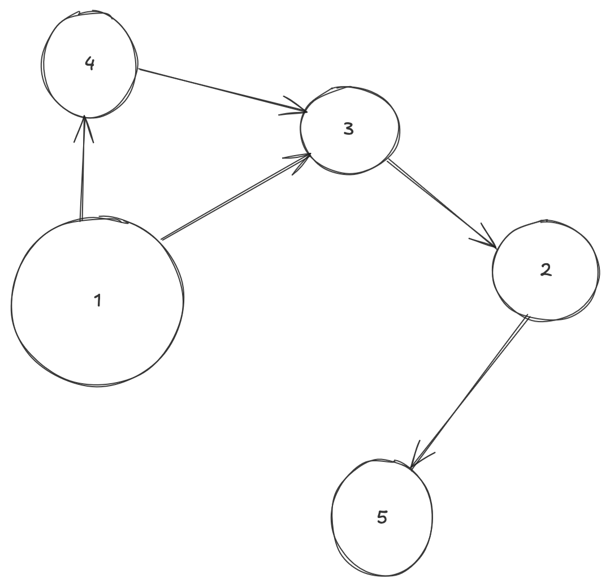
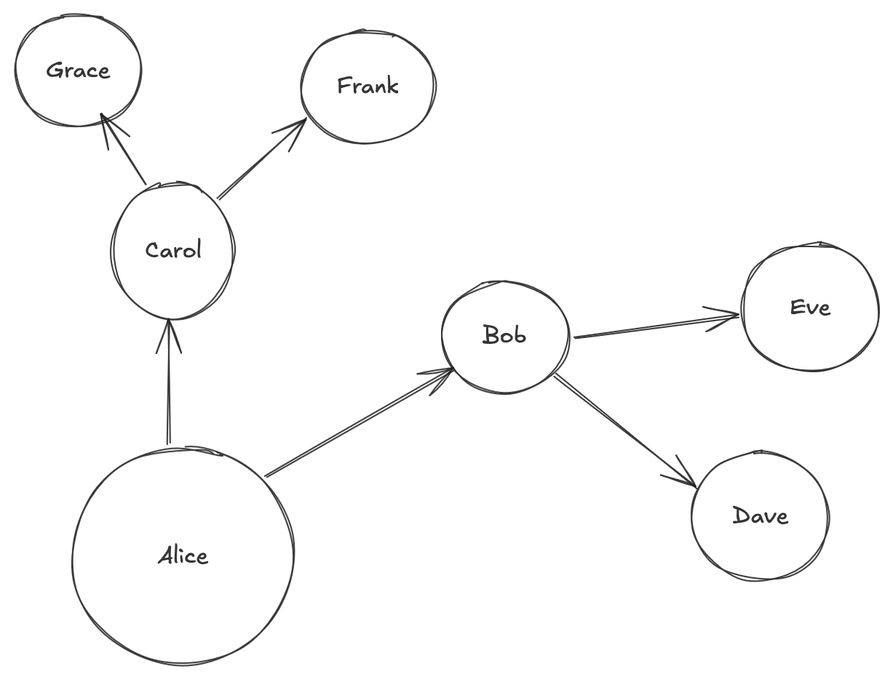
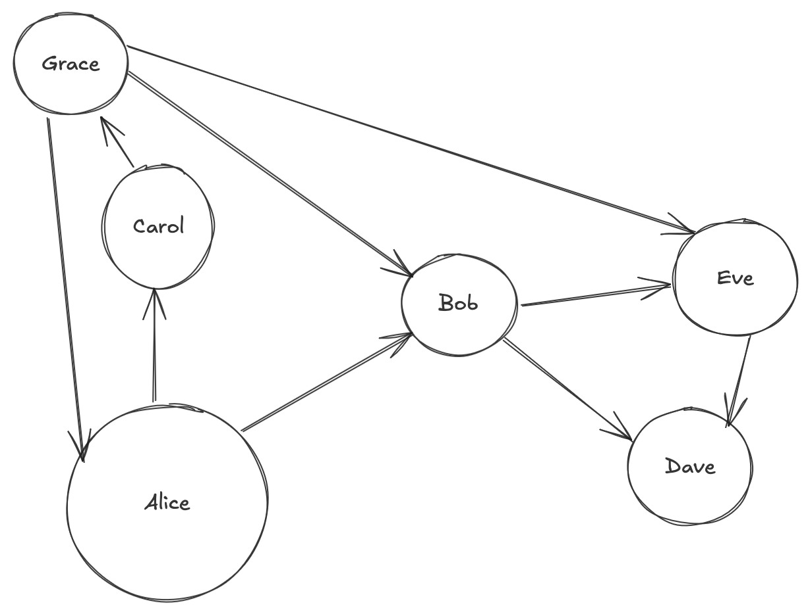
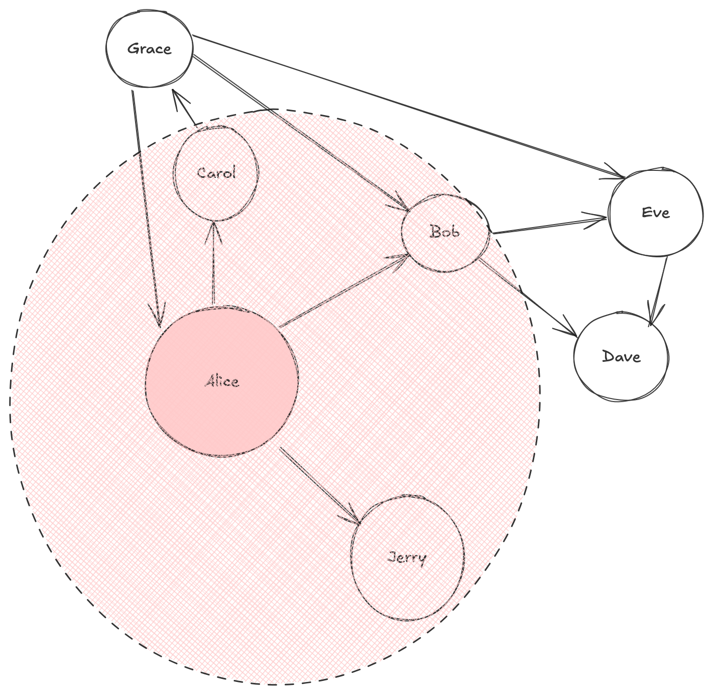
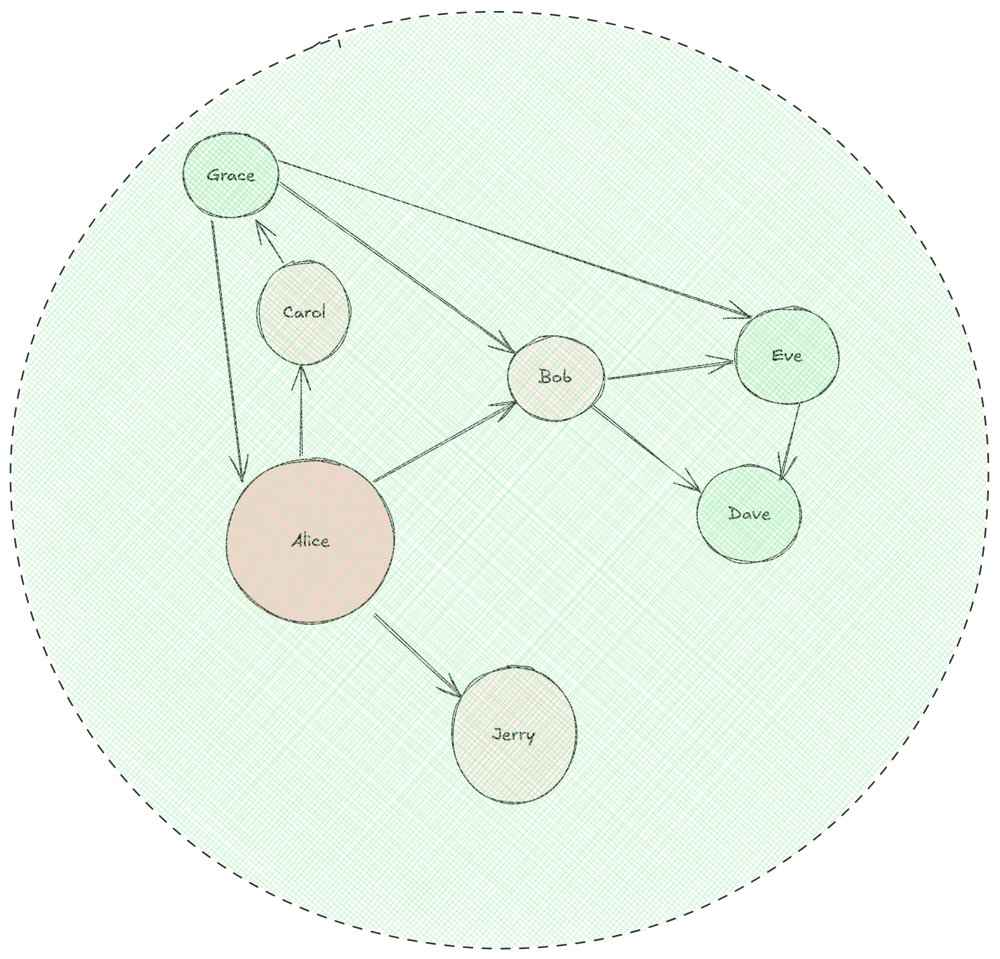

## Pregel
Pregel, and Pregel based SDK's like [Spark Graph-X](https://spark.apache.org/docs/latest/graphx-programming-guide.html), are used for traversing graphs using super-steps and message passing

### Why It's Needed
The main reason I've used this in the past is that our Data Warehouse wrote things to [Parquet or Delta](/docs/architecture_components/databases%20&%20storage/Disk%20Based/PARQUET.md) format on Disk, and so our entire data model that was graph based had no actual way of traversing

[Spark](/docs/other_concepts/SPARK.md) doesn't have recursion built in, and so a lot of groups ended up trying to write each "step" to disk and read it in to mimic recursion

```
input --> transform --> output1
write output1 to disk
output1 --> transform --> output2
...
```

And that means they were constrained to how many "outward hops" they could search if we view this from a [Breadth First Search](/docs/dsa/8.%20trees%20&%20graphs/index.md#graph-traversal)

Looking at the below DAG Example, if we start at Node 1, we can reach Node 5 in:
- 3 hops: $1 \rarr 3 \rarr 2 \rarr 5$
- 4 hops: $4 \rarr 1 \rarr 3 \rarr 2 \rarr 5$




This works fine if you have a hierarchy:

| Boss   | Employee |
|--------|----------|
| Alice  | Bob      |
| Alice  | Carol    |
| Bob    | Dave     |
| Bob    | Eve      |
| Carol  | Frank    |
| Carol  | Grace    |

Because at that point you can just find the max number of hops (in this case 2) and traverse that many times - it's not efficient, but it'll cover the entire graph




It will fail if there are loops! Similar to social networks, corporate ownership structures, and many other phenomena



Even if we set n to something large, it'll continue to loop around and around

To solve a number of these issues we look to Pregel

### How I See It
Really the most intuitive way to view the super-steps and message passing is in the lens of Breadth First Search

The pseudocode for BFS is:
```
q = queue([start_node])

while q:
    curr_step_size = len(q)
    for _ in curr_step_size:
        curr_node = q.pop()
        for neighbor in graph[curr_node]:
            q.push(neighbor)
            do_some_edge_logic
        
        do_some_curr_node_logic
    
    do_some_step_logic
```

Let's start with Alice in below example:

Below shows all of the `neighbor` we'd see in the first step, and this would equate to one "pulse" out from Alice


In the next step out we'd encompass all remaining nodes


However, we wouldn't have encompassed all remaining edges - the edge from `Grace --> Alice` was 3 hops away

Oh well, this shows how each "step" or "hop" moves outwards from the central node you're looking at

## Pregel Implementation
Pregel Vocabulary:
- ***Vertex***: This is a Node / item in the Graph
    - Most Vertexes will have Attributes or metadata that describe it
- ***Edge***: This is a link between 2 Vertexes, sometimes it has it's own information such as weight
- ***Message***: In each Super-Step, we would send out Messages along the Edges to our Neighbor Vertexes
    - In the pseudo-code, it'd be `do_some_edge_logic`
- ***Vertex Program***: AKA `vProg`, is the actual transformation logic ran when we discuss `do_some_edge_logic` - it is defined as a function
- ***Super-Step***: [We explained this above](#how-i-see-it), and it's basically a "pulse" out from any Vertex - it's one more level out in a Breadth First Search paradigm
    - The ***Super-Step Loop*** is one iteration of the loop, and it will run until no messages are sent
        - There's a chance that our Graph is a LinkedList, and it will just run $O(V)$ loops

---
Therefore, Pregel's implementation can intuitively be viewed as running Breadth First Search across all nodes in a distributed compute environment! 

Let's say we have a Spark cluster with 5 nodes:
- 1 driver and 4 workers
- The 4 workers have 4 cores each
- So we have 16 cores total to process data with
- At the beginning each node would get it's `initialMsg` and would sit on a core, and then we'd simply start running BFS for each node 
    - Any node can receive many inputs, and they'd need to merge all of these in-edges, run some logic, and then send a message outwards

---

- ***Initial Message***: Start off each Vertex with some initial message / starting point
    - Most of the time the initial message is some attribute like "Name", "Role", or "Salary"
- ***Send Message***: As we move out from any single Vertex to any other Vertex in a "hop", we send a message to it with some information
    - This can be based on infromation we've gotten in previous hops, or solely based on that Vertex's own information
    - In the example above:
        - Bob receives messages from Grace and Alice
        - Bob sends messages to Eve and Dave
- ***Merge Message***: Any Vertex can receive multiple incoming messages, and when that happens some logic needs to be ran on all of them
    - `map: x -> x+1` would add 1 to every element:
        - `[1, 2, 3] --> [2, 3, 4]`
    - `flatMap: x -> sum()` would aggregate everything:
        - `[1, 2, 3] --> 6`
    - Tons of other functional programming functions are also available - `MAX`, `MIN`, `AVG`, `MODE`
        - We can merge this as any sort of data type, be it Int, Array, Struct, etc...
---

Psuedo-code:
```
for vertex in vs:
    vertex.msg = initialMsg

while some_msg_sent:
    for v_with_msg in vs_with_msgs:
        msgs = []
        for msg in incoming_msgs:
            msgs.append(msg)
        
        curr_msg = mergeMsg(msgs)
        sendMsg(curr_msg)
    
    n_iterations += 1

return(result)
```

Throughout the examples below, you'll see new definitions for `mergeMsg`, `sendMsg`, and `initialMsg` for each different algorithm

So at this point we see how Vertexes are held, how we pass messages (traverse), how logic can be ran, and how this all avoids recursion + writing to disk in-between!

### Common Examples
Common examples include Max Propogation, Single Source Shortest Path, Page Rank, and Transitive Closure

#### Max Propogation
Max propogation is just that we want our max value "carried" around to all weights - so if there's a 100 in a sea of 1's, after the program terminates all of the Vertices will know the global maximum is 100

```scala
val graph = Graph(vertices, edges)

val initialMsg = 0

def vprog(id: VertexId, attr: Int, msg: Int): Int = math.max(attr, msg)

def sendMsg(triplet: EdgeTriplet[Int, Int]): Iterator[(VertexId, Int)] = {
  // if our current source node has a higher value than destination, send message to destination
  if (triplet.srcAttr > triplet.dstAttr)
    Iterator((triplet.dstId, triplet.srcAttr))
  else
    Iterator.empty
}

// if we receive multiple incoming messages, just take max one and then check if we should forward
def mergeMsg(a: Int, b: Int): Int = math.max(a, b)

val result = Pregel(graph, initialMsg)(vprog, sendMsg, mergeMsg)
```

#### Single Source Shortest Path (Djikstra)
In normal day-to-day folks use [Djikstras Algorithm](/docs/dsa/8.%20trees%20&%20graphs/index.md#djikstra) for finding the shortest path between a single Vertex and all other Vertices, here we show how to do it in Pregel over a large graph 

The Single Source Shortest Path is when we need to find the shortest path from a source Vertex $v$ to all other Vertices in the graph

```
import org.apache.spark.graphx.{Graph, VertexId}
import org.apache.spark.graphx.util.GraphGenerators

// A graph with edge attributes containing distances
val graph: Graph[Long, Double] =
  GraphGenerators.logNormalGraph(sc, numVertices = 100).mapEdges(e => e.attr.toDouble)
val sourceId: VertexId = 42 // The ultimate source
// Initialize the graph such that all vertices except the root have distance infinity.
val initialGraph = graph.mapVertices((id, _) =>
    if (id == sourceId) 0.0 else Double.PositiveInfinity)
val sssp = initialGraph.pregel(Double.PositiveInfinity)(
  (id, dist, newDist) => math.min(dist, newDist), // Vertex Program
  triplet => {  // Send Message
    if (triplet.srcAttr + triplet.attr < triplet.dstAttr) {
      Iterator((triplet.dstId, triplet.srcAttr + triplet.attr))
    } else {
      Iterator.empty
    }
  },
  (a, b) => math.min(a, b) // Merge Message
)
println(sssp.vertices.collect().mkString("\n"))
```

### Page Rank
Page Rank is basically the Hello World of graph processing and traversal - it was used in Google in the beginning to rank Vertexes, where the more important the Vertex the higher the Rank

It used webpage links + relative importance to decide other webpage importance - if you have 100 very important websites pointing to you, you're probably important

Formula:
$PR(v) = (1 - d) + d \cdot \sum_{u \in N - (v)} {PR(u) \over deg(u)}$
- ***Parameters***:
    - $d$ is the dampening coefficient which helps us to weight incoming links
    - $u \in N - (v)$ are all of the links coming in that aren't from the Vertex itself
    - $\sum_{u \in N - (v)}$ is the aggregation of all of the links coming in
        - $PR(u)$ is rank of an incoming link
        - $deg(u)$ is the in-degree, meaning we give lower scores to webpages who spray out links everywhere
            - If there are 800 links on a page, it's probably not a good reference page
            - If there's 2 links, and it's a highly ranked page, the $PR(u)$ won't be reduced by much (1/2)

```
val links: RDD[Edge[Int]] = sc.parallelize(Seq(
  Edge(1L, 2L, 1), Edge(1L, 3L, 1),
  Edge(2L, 3L, 1),
  Edge(3L, 1L, 1)
))

val graph = Graph.fromEdges(links, 1.0).mapVertices((_, _) => 1.0)

val numIter = 10
val damp = 0.85

val outDegrees = graph.outDegrees
val graphWithDegrees = graph.outerJoinVertices(outDegrees) {
  (vid, rank, degOpt) => degOpt.getOrElse(0)
}

val prGraph = graphWithDegrees.mapTriplets(triplet =>
  1.0 / triplet.srcAttr
)

val initialMessage = 0.0

def vprog(id: VertexId, attr: Double, msgSum: Double): Double = {
  (1 - damp) + damp * msgSum
}

def sendMsg(triplet: EdgeTriplet[Double, Double]): Iterator[(VertexId, Double)] = {
  Iterator((triplet.dstId, triplet.srcAttr * triplet.attr))
}

def mergeMsg(a: Double, b: Double): Double = a + b

val result = Pregel(prGraph.mapVertices((_, _) => 1.0), initialMessage, numIter)(
  vprog, sendMsg, mergeMsg
)

result.vertices.collect.foreach { case (id, rank) =>
  println(s"Vertex $id has rank: $rank")
}
```

### Connected Components
This is a very important algorithm that will find you the clusters of Vertexes in a graph - if every Vertex is connceted, the number of components is 1

Usually you'll find a number of "islands" and each island is a connected component

In connected components we must "drag along" the minimum ID as it's the best identifier, the max would work as well - we need something that we can reference as the min

It's equivalent to the [Max Propogation](#max-propogation) algorithm, with a slightly different `sendMsg`

```
import org.apache.spark.graphx._

// Sample undirected graph
val edges: RDD[Edge[Int]] = sc.parallelize(Seq(
  Edge(1L, 2L, 1), Edge(2L, 3L, 1),
  Edge(4L, 5L, 1), Edge(5L, 6L, 1)
))

val graph = Graph.fromEdges(edges, defaultValue = Long.MaxValue)
  .mapVertices((id, _) => id) // Initialize each vertex with its own ID

// Vertex Program: keep the smallest ID seen
def vprog(id: VertexId, attr: VertexId, msg: VertexId): VertexId =
  math.min(attr, msg)

// Send the current value to all neighbors
def sendMsg(triplet: EdgeTriplet[VertexId, Int]): Iterator[(VertexId, VertexId)] = {
  // srcAttr is current componentId of srcVertex, dstId is neighbor
  //    in this example we will send src componentId to dstId, and send dst componentId to srcId
  // If this were directed, we could remove one of these
  Iterator((triplet.dstId, triplet.srcAttr), (triplet.srcId, triplet.dstAttr))
}

// Merge messages: pick the smallest
def mergeMsg(a: VertexId, b: VertexId): VertexId =
  math.min(a, b)

// Run Pregel until convergence
val cc = Pregel(graph, initialMsg = Long.MaxValue)(
  vprog, sendMsg, mergeMsg
)

cc.vertices.collect.foreach { case (id, comp) =>
  println(s"Vertex $id belongs to component $comp")
}
```

### Transitive Closure
Lastly is transitive closure - this relates to a reachability set of a node

For every Vertex $u$, find all other Vertices $v \in V$ such that there's a path from $u \rarr v$

We represent the state of each vertex as ***a set of reachable ID's***

This can absolutely blow up memory, and is most useful when bounded to $k$ steps

```
val edges: RDD[Edge[Unit]] = sc.parallelize(Seq(
  Edge(1L, 2L, ()), Edge(2L, 3L, ()),
  Edge(3L, 4L, ()), Edge(1L, 5L, ())
))

val graph = Graph.fromEdges(edges, defaultValue = Set.empty[VertexId])
  .mapVertices((id, _) => Set(id)) // each vertex starts with itself

def vprog(id: VertexId, attr: Set[VertexId], msg: Set[VertexId]): Set[VertexId] =
  attr ++ msg

def sendMsg(triplet: EdgeTriplet[Set[VertexId], Unit]): Iterator[(VertexId, Set[VertexId])] = {
  // if dstAttr is not a proper subset of our seen vertices, send our set to destination
  //    I believe if our set is (1, 2, 3) and dst is (1, 2, 4) we will still send our entire set
  if (!triplet.dstAttr.subsetOf(triplet.srcAttr)) {
    Iterator((triplet.dstId, triplet.srcAttr))
  } else Iterator.empty
}

// add any other vertices to our attribute, ensure it's a set
def mergeMsg(a: Set[VertexId], b: Set[VertexId]): Set[VertexId] =
  a ++ b

val closure = Pregel(graph, initialMsg = Set.empty[VertexId], activeDirection = EdgeDirection.Out)(
  vprog, sendMsg, mergeMsg
)

closure.vertices.collect.foreach { case (id, reachable) =>
  println(s"Vertex $id can reach: ${reachable.toList.sorted.mkString(", ")}")
}
```