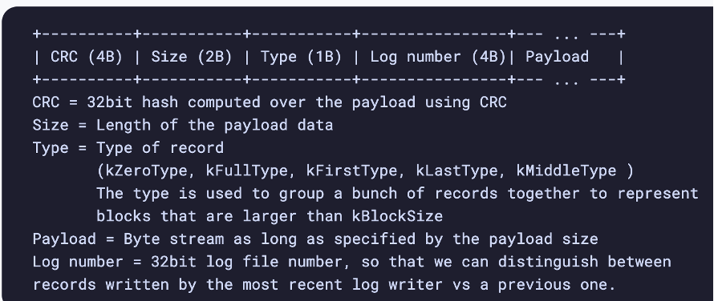

# Table of Contents
- [LSM Tree](#lsm-tree)
- [Components](##components)
    - [Implementation](#implementation)
    - [Optimizations](#optimizations)

## LSM Tree

## Components
- 3 components - MemTable, SSTable, WAL
- ***MemTable***
    - Sorted Map - i.e. map sorted by key
        - Actually unsure if it's a map or a list...some places say list, which would make more sense on Binary Search to find + need to write in certain areas
    - Any new record is immediately written to in-memory MemTable
    - Max capacity, usually is 2MB, but can be anything (within reason)
        - When capacity is reached, records are flushed to disk
    - 3 routines:
        - Add a record to list
        - Sorting records
        - Find record using Binary Search
- ***WAL (Write Ahead Log)***
    - RAM objects are now persistent or durable - WAL helps us maintain that promise
    - Append only, immutable log file, that every record operation on MemTable is appended into
        - Set, Update, or Delete is appended to log
    - If node goes down, WAL can be used to re-create MemTable
    - Once MemTable is full and written to disk, corresponding WAL is deleted
- ***SSTable***
    - When a MemTable is flushed to disk, we take that Sorted Run and store it on disk as an SSTable
        - i.e. when we want to write MemTable to disk, we store it as an SSTable
    - SSTables are organized into levels with max capacities of powers
        - 10MB, 100MB, etc...
        - Whenever any level reaches capacity, it's Compacted into next level
        - This means older records will persist on disk in older SSTables until updated
- ***Compaction***
    - Our garbage collection and data management process of our database
    - Compaction takes SSTable from filled level and merges it with SSTables in next level with overlapping key ranges
        - When files are merged we:
            - Re-sort keys
            - Outdated records are removed
            - New SSTable is created
- ***API's***
    - *GET* - This should search MemTable, and then earliest to oldest levels (lowest to highest) to find the latest record
    - *SET* - Should set it into MemTable, which updates WAL, which eventually makes into SSTable levels once capacity is reached
    - *DELETE* - Inserts a Tombstone into the MemTable
        - GET that receives a Tombstone means no record / was deleted
        - When Tombstone goes down to lower SSTables it would take precedence over regular values
    - *SCAN* - Collects all records between low_key and high_key
        - GET(low_key) and iterate until iterator > high_key
        - Most likely have to scan multiple SSTables at different levels

### Implementation
- MemTable
    - Can be any sort of container that supports sorting keys, and scanning retrieval
        - Insert and search can both be $O(log n)$ with a simple Vector
        - RocksDB uses a Skip List which is a Linked List with multiple other links that you can use to skip
        - Skip Lists still have, on average, $O(log n)$ search without O(n) insert which can happen with a Vector if it's full
        - Can't use a Hash Map because scans would be O(n)
    - Since we write to MemTable in $O(log n)$ in RAM, and then write this to disk as SSTable later on, writes are fast
    - Still durable because of WAL
    - We remove need for random disk writes which is how B-Tree would handle it
- WAL
    - On disk backup for MemTable
    - Just an append only log of transactions
    - Uses Sequential I/O and not Random I/O
        - Sequential I/O is faster, but uses up a lot of disk space because each time a record is updated older versions are kept
        - Space Amplification is the amount of disk space per actual database - so if a 1GB Dataset uses 2GB of disk space, it's space amplification is 2
    - Buffered I/O
        - Disks can't keep up with request needs
        - Portions of disk are brought into memory, changes happen in memory, and occasionally the memory is written back to disk via OS 
        - We write data to a buffer that's eventually flushed to disk
        - "Thousands of times faster as synchronous disk writes via Unbuffered I/O"
- SSTable
    - When a MemTable is flushed to disk, we take that Sorted Run and store it on disk as an SSTable
    - i.e. when we want to write MemTable to disk, we store it as an SSTable
    - SSTables are organized into levels with max capacities of powers
        - 10MB, 100MB, etc...
        - Whenever any level reaches capacity, it's Compacted into next level
        - This means older records will persist on disk in older SSTables until updated
    - Compaction
        - Our garbage collection and data management process of our database
        - Compaction takes SSTable from filled level and merges it with SSTables in next level with overlapping key ranges
            - When files are merged we:
                - Re-sort keys
                - Outdated records are removed
                - New SSTable is created
- All buffered writes are lost if OS crashes
    - Unbuffered I/O writes data directly to physical disk
    - RocksDB has a straight append only log
    - Each operation stored in a block of 32KB
    - Records larger than 32KB stored in multiple blocks
    - Start of block is a checksum to verify integrity
    - 

### Optimizations
- Bloom Filters
- Indexing (index of index)
- B+Tree 
