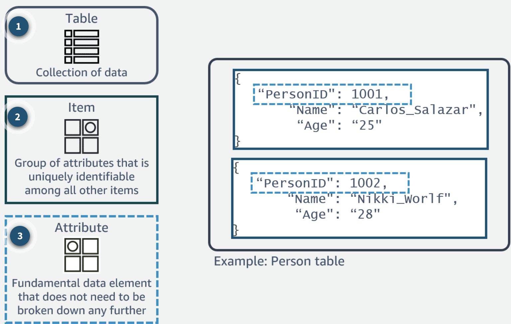

# Table of Contents
TODO

# DyanmoDB
Dynamo DB is a serverless NoSQL Database for AWS, and is their defacto NoSQL solution

We use partition keys / primary keys to help it scale out and shard data, similar to what we showed in our [Distributed KV Store](/docs/technical%20writing/architecture_components/typical_reusable_resources/typical_distributed_kv_store/index.md) 

Each value in this key-value database it simply an ***Item***, where the Item is usually a JSON object, and each Item can have many Attributes

Dyanmo is mentioned to be able to handle OLTP transaction workloads, which means it can handle a lot of small transactions, and is not meant for OLAP workloads, which are usually large batch jobs

[The whitepaper](/arxiv_papers/Dyanmo%20markedup.pdf) is a bit dated, but it is still relevant, and the concepts are still used in DynamoDB

## Infrastructure
Dynamo is serverless! So no OS patching, DB upgrades, rolling upgrades, scaling, sharding, or anything

Data is stored in SSD's, and across AZ's, so it's durable, replicated, and available

## Data Models / Concepts

- ***Tables***: Tables are collections of data, or items (similar to Tables)
- ***Items***: Items are a logical grouping of Attributes **that are uniquely identifiable** (similar to Rows)
- ***Attributes***: Attribues are valued Elements (similar to Elements)