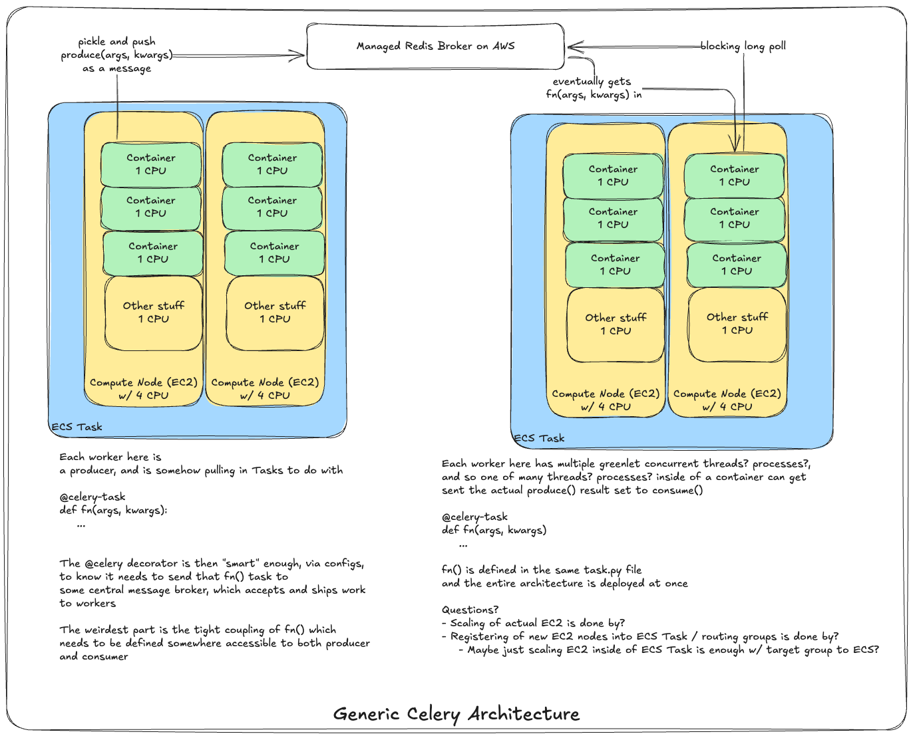

# Table of Contents
TODO:

# Queues
Queue's are generally used to ensure some sort of buffer between producers and consumers. They can be thought of as a place to keep messages between the two groups so that there's not overload or connectivity issues between the two sets

They also, generally, provide durability, single point connectivity, scaling, and other useful traits like priorities, acknowledgements, and retries

Queue's are useful when you have producers and consumers that have different workloads, where you might want to scale the consumers to comply with new messages coming in from producers - the most typical example I see is an API fielding requests and sending messages to workers to run complicated ML pipelines and models

Example:
- Message comes in with JSON field holding a document, or an S3 URL that holds a large text based document
- API fields the request, checks priority, and sends to a queue
- To ensure timely response, consumer pool may scale to 2-3x the size of the producer pool since each request is light on producer and very heavy on consumer
    - Consumer may need to run multiple NLP pipelines such as Entity Extraction, Sentiment Analysis, and/or Categorization

# Queues In The Wild
Some examples below of queue's typically used "in the wild"

## SQS

## Redis

## RabbitMQ

## Postgres

## Celery
Celery is somewhere between a queue, a message broker, and a serializable function passer - ***Celery, IMO, is not actually a queue, but it's often described as one***

At it's core, Celery is probably best described as an Distributed Producer-Consumer Architecture SDK or something in that vein

Celery helps developers to write tightly coupled `producer.py` and `consumer.py` scripts, along with `celery.config` files, which allow producers to push to a backend message queue, typically Redis or RabbitMQ, which then gets pulled by consumers

Celery sits at the application plane, and it's "scaling" is done on Celery Workers which are tightly coupled to the compute / infra plane

***Celery cannot ask your infra plane to stand up more computes***, it can simply scale up more processes on each of those computes

