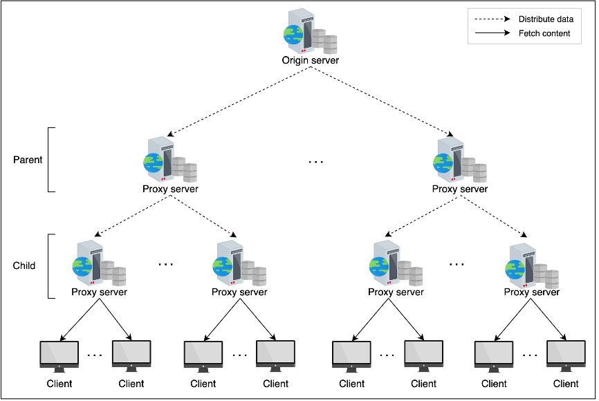
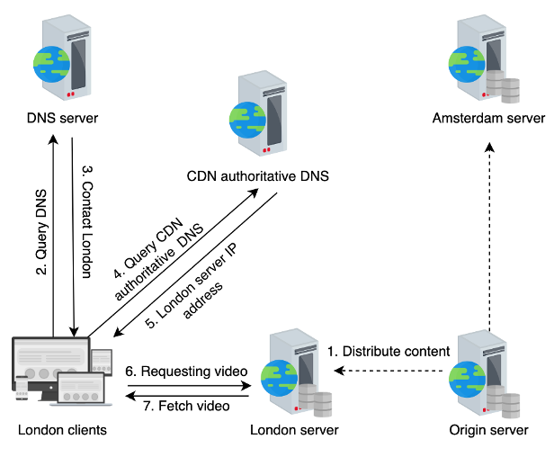
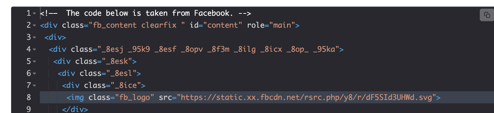

# CDN
- ***Proxy Server*** - Is a server that sits between a client and an origin server
    - Could be a load balancer
    - Could simply be a traffic migration server
    - Could also be a cache / static content server
- A ***Content Delivery Network (CDN)*** is a group of geographically distributed proxy servers
    - We place these at the network edge, as close as possible to end users, to ensure that content is delivered as fast as possible to clients
    - CDN's mostly get split into serving static vs dynamic data
        - TLDR; We replicate data / logic to these edge servers async, and they are used to serve content faster to users
- What will it store?
    - Can store a lot of static content
    - Can store dynamic JS, along with static data
    - Netflix could store movies (very static) on CDN, but Youtube couldn't store all of it's videos
        - Have to decide popularity + size + costs
- CDN is built up from Load Balancers + DNS
    - DNS can help us map from a website, netflix.com/movie1, to a specific IP address that is a CDN 
    - Load Balancers help us to distribute the reads to a CDN cluster to one of many of the CDN servers in that cluster
        - Remember that data replication allows us to linearly scale read throughput

## Components
- ***Request Routing System*** are used to direct client requests to the nearest CDN 
- ***Proxy Servers*** are used to serve the actual content from RAM to clients
- ***Distribution System*** is responsible for distributing content to the actual Proxy Servers in different CDN facilities
- ***Origin Servers*** are where the actual content originates that is eventually served by CDN
- ***Management System*** is responsible for updating statistics about cache hits, cache misses, etc..
- ***Push CDN*** is where Origin Servers push content directly to PoP Proxy Servers 
    - Useful for static content delivery
    - If the content is rapidly changing, then it may be hard to keep it up to date
- ***Pull CDN*** is where the Proxy Servers pull data from Origin Servers when they don't have it to serve to clients
    - Like a cache at this point
    - Will delete files after a certain time / deletion policy
    - More useful for serving dynamic content that's constantly changing
- Dynamic / rapid changing content is better served by Pull CDN where the changed data can be re-found and served, and Push CDN is better for static content like company logo's and old news articles
- Dynamic Content Caching Optimizations
    - Dynamic content can be generated at proxy servers by running static scripts with updated data
    - For example, if there is weather information we include in an app we can run the weather scripts on the Proxy Servers and generate that data locally vs on Origin Servers
    - Edge Side Includes (ESI) helps us when a majority of the HTML code we are serving hasn't changed, except for a small part, we can only calculate that new small part
    - Dynamic Adaptive Streaming over HTTP (DASH) allows us to fetch different portions of video at different resolutions to serve video
    - Distributing data to the huge number of Proxy Servers from the Origin Server can place a large burden on the Origin Server
        - We use a Tree Structure for Data Distribution where each of the edge Proxy Servers are apart of hierarchies across a tree, and they can all send the new data to each other
        -  
    - DNS Redirect is when a DNS server returns another URI instead of an IP - we can use this to specify Proxy Servers when a client requests it
        - Depending on Network Distance + Load on Proxy Servers the DNS redirect will choose a specific Proxy to send client to
        -  

### Routing Methods
- Anycast is a methodology where all edge servers in multiple locations share the same IP address
- Multiplexing involves sending a client a list of candidate Proxy Servers
- HTTP Redirection is when an Origin Server responds with an HTTP protocol to URI of content
    -  

### Content Consistency
- Always a risk that data on CDN Proxy Servers will be inconsistent with Origin Servers
- Pull CDN's will do periodic polling - this is unnecessary bandwidth on Origin Servers
- Time To Live (TTL) is a better option than periodic polling, because we can set the TTL of very static content to be longer
- Leases also work well because they are a promise to the Proxies that if the data should change anytime before the Lease is up, the Origin will notify Proxies

#### Cache Invalidation
- What It Is:
    - The process of removing or updating stale content from CDN caches to ensure users receive the most up-to-date data
- Strategies:
    - Manual Invalidation: Explicitly removing specific content from the cache (e.g., via API calls)
    - Time-Based Expiry (TTL): Automatically expiring content after a set time
    - Event-Driven Invalidation: Triggering invalidation when content changes on the origin server
- Why It Matters:
    - Ensures consistency between the origin server and CDN caches, especially for dynamic or frequently updated content

### Security
- TLS/SSL Termination:
    - CDNs often handle SSL/TLS termination to offload encryption/decryption from origin servers
- DDoS Protection:
    - CDNs provide built-in protection against Distributed Denial of Service (DDoS) attacks by - absorbing traffic at edge servers
- Web Application Firewall (WAF):
    - Many CDNs include WAFs to block malicious traffic, such as SQL injection or cross-site - scripting (XSS) attacks
- Token-Based Authentication:
    - CDNs can use signed URLs or tokens to restrict access to authorized users
- Geo-Blocking:
    - Restricting access to content based on geographic location

### Performance Optimizations
- Compression:
    - CDNs often compress content (e.g., Gzip, Brotli) to reduce bandwidth usage and improve delivery speed
- Edge Computing:
    - Running lightweight computations (e.g., personalization, A/B testing) at the edge to reduce latency
- Prefetching:
    - Proactively fetching and caching related content that a user is likely to request next
- Connection Reuse:
    - Using persistent connections (e.g., HTTP/2) to reduce latency for multiple requests

#### Monitoring and Observability
- Metrics Tracked:
    - Cache hit/miss ratio
    - Latency and response times
    - Bandwidth usage
    - Error rates (e.g., 404s, 500s)
- Why It Matters:
    - Helps optimize cache performance and troubleshoot issues
    - Provides insights into user behavior and traffic patterns

## CDN Use Cases
- Static Content Delivery:
    - Images, CSS, JavaScript, videos, and other static assets
- Dynamic Content Acceleration:
    - Optimizing delivery of dynamic content by caching parts of the response or using edge computing
- Video Streaming:
    - Adaptive bitrate streaming (e.g., HLS, DASH) to deliver video content efficiently
- API Acceleration:
    - Reducing latency for API calls by caching responses at the edge
- E-Commerce:
    - Delivering product images, reviews, and personalized recommendations quickly

### CDN Integrations
- Load Balancers:
    - CDNs often work with load balancers to distribute traffic across multiple origin servers
- DNS:
    - CDNs rely heavily on DNS for request routing and directing users to the nearest edge server
- Cloud Storage:
    - CDNs often integrate with cloud storage services (e.g., AWS S3, Google Cloud Storage) to fetch and cache content