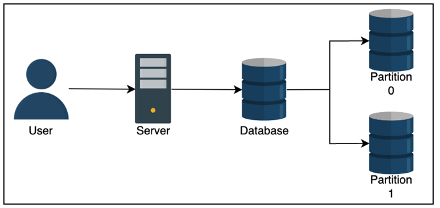
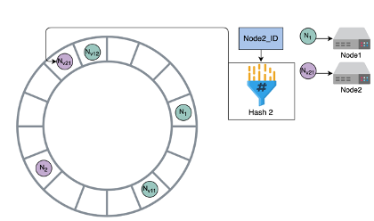
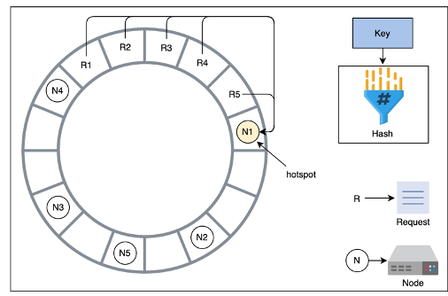

# Partitioning

- Why do we do it? Because it can help us reduce read latency
    - If we take a database and split it directly in half based on userId
    - A write to the database takes the same time
    - A read to the database also takes about the same time
        - But there are double the resources (since the other half of userId’s don’t affect the reads of these userIds) to serve that read
- Relational databases have attractive properties like ACID transactions, indexes, and other things, but sometimes a single node just cannot handle the read velocity and the throughput suffers
    - We can then do database partitioning AKA sharding to use multiple nodes, where each node hosts a section of the relational data 

- Need to ensure we don’t have hotspots which are shards with an abnormally used partition of data
    - Like having one shard of NY based customers, and another for Idaho
- Types
    - Things to note:
        - Range queries – some types are unable to perform range queries due to hashing
        - Time Complexities – Some operations may take more time on a distributed database vs normal one due to architecture

## Sharding
### Vertical (Column) Sharding
- We split the data up vertically so that different columns are in different databases and can be joined through keys
- Like denormalizing, and keeping an identifier in each shard
### Horizontal (Row) Sharding
- Where we split data up horizontally by rows
- Strategies
### Sharding Strategies
#### Key range 
- Where we split data up into ranges by primaryKey, and each shard takes a specific range
    - Each partition is assigned a contiguous range of keys
    - Primary key’s are unique across shards
    - Range queries 
        - On primaryKey are easy
        - On non-primary key’s require full scan of all shards
    - Therefore, we should think about OLAP processing
#### Hash Key
- Hash Key is where we split data up by passing a set of attributes into a hash function, and each shard gets a contiguous range of the hash output
    - Hash(key) % n_clusters = partitionId
    - Like a HashTable
    - We cannot perform range queries on this data
        - Throughout all of this, both types are prone to Hot Keys / Hot Spots where there’s a larger set of data on a specific partition
- Range based if there is more data in a range
- Hash based if there’s more data for the data points mapped to a partition

#### Consistent Hashing
- ***Consistent Hashing*** assigns each server or item in a distributed hash table a place on an abstract circle, called a ring, irrespective of the number of servers on the circle
    - Allows servers and objects to scale without compromising overall performance
    - When an area of the ring becomes overused / Hot Spot we have to rebalance the partitions on the ring
- Rebalancing Partitions
    - We cannot use hash function here
- The value of n, i.e. the number of partitions, needs to be able to scale horizontally quickly
- If we have a hash value of 12345 at the start, and 5 servers, then we scale up to 6, all of this data needs to be reassigned to a new partition then
    - High network I/O, and more downtime
        - ***Fixed Partitions*** - We can just define a set number of partitions instead
- Call this n, instead of the number of servers
- Make n larger than number of servers
- Whenever a new partition joins the cluster, it can take a few partitions from other servers which is better than all of the data being moved
- The largest disadvantage here is some partitions can be much larger or smaller than others
        - ***Dynamic Partitions*** – When the size of a partition reaches some threshold, it’s split equally into 2 partitions, which are then sent to different nodes on the cluster
- There’s a lot of overhead and network I/O involved in this
- Keeping track of everything as data is constantly moves will strain our ability to handle reads / writes
        - ***Proportional Partitions*** – Is when we set the number of partitions to be proportional to the number of nodes, and each node has a fixed number of partitions
- In this case the number of nodes remains fairly constant, and the partitions re-size themselves
##### Consistent Hashing Example
- Consistent Hashing, again
    - We have a circular buffer / ring from 0 to n-1 where n is the number of available hash values
    - For each of the nodes in our cluster, from 0 to m, where m is the number of available nodes in our cluster
    - We calculate a hash for each nodeID and map it onto our ring
- In this way, multiple nodes can be assigned to a slot in a ring
        - Whenever a new node is added into the ring, the immediate next node is affected, and it has to share it’s data with the new node since it was split
        - Then, whenever a request comes in, we move in a clockwise direction to find the node that should handle the request
- If node1 handles request1, and then splits to node1 and node2, and request1 then maps to node2, then node2 will handle it in the future
- This is why only node1 and node2 need to share data with each other, and over time node1’s load will be reduced
        - As nodes join or leave, only a minimal amount of data needs to be shuffled, and a minimum amount of nodes are affected
        - There can still be hotspots in this setup, and there are multiple methods, described above, for handling repartitioning of data when hotspots arise

- In the figure, all 5 requests are handles by N1
        - Hotspot help
- Something we didn’t mention before is using virtual servers
- We can use multiple hash functions on each node, and then distribute out the nodes to different parts of the ring
    - Essentially allows us to reuse nodes around the ring so that requests will be handled in a more uniform manner
    - Gives us “more slots filled up” by different virtual servers
    - Nodes with larger hardware capacity can take on more virtual slots

## Partitioning and Secondary Indexes
- If all of this data is partitioned and sharded, how do we create secondary indexes to speed up our reads?
- Secondary Indexes are used in relational databases to decrease lookup time to O(1) or O(log n), by sorting and organizing a lookup table for the indexed column
- ***Hash Index*** means we will double the storage needed, but we essentially hash the value of each entry in the column and store this, so that our lookup is O(1) since we just hash the lookup value and find it’s corresponding row number which is just a fixed size memory offset we can jump to
    - Cannot do range based queries
- ***B-Tree Index*** creates a Binary Search Tree based index on the data, so that a point search is O(log n), and range based searches are also O(log n) since we find the start, and iterate over our data points until we find the end
    - There's more info in the [Disk Based Databases and Storage Document - Specifically the BTree one](../../../architecture_components/databases%20&%20storage/Disk%20Based/BTREE.md)
    - Challenges in KV Stores
        - *Primary Key Lookups:*
            - KV stores are optimized for primary key lookups, which are typically $O(1)$ when using hash-based partitioning.
            B-Trees are not necessary for primary key lookups because hashing is faster for exact matches.
        - *Range Queries:*
            - If range queries are required (e.g., "find all keys between key1 and key10"), hash-based partitioning cannot support this efficiently.
            B-Trees are better suited for range queries because they maintain sorted order.
        - *Distributed Nature:*
            - In distributed KV stores, data is often partitioned across multiple nodes using consistent hashing or other sharding strategies
        - Maintaining a global B-Tree index across partitions is complex and can introduce significant overhead
    - When to Use B-Tree Indexes in KV Stores
        - *Local Secondary Indexes:*
            - Each partition in a distributed KV store can maintain its own local B-Tree index for secondary attributes
            - Example:
                - A KV store partitioned by userId could use a B-Tree index on timestamp to efficiently query all records for a user within a specific time range
        - *Global Secondary Indexes:*
            - A global B-Tree index can be created for secondary attributes across all partitions
            - This requires maintaining a lookup table that maps secondary attributes to partitions
            - Example:
                - A KV store could use a global B-Tree index on orderDate to query orders across all users within a specific date range
        - *Range-Based Partitioning:*
            - If the KV store uses range-based partitioning instead of hashing, B-Trees can be used to index the primary key within each partition
            - This allows efficient range queries within a partition
    - Advantages of B-Tree Indexes in KV Stores
        - *Efficient Range Queries:*
            - B-Trees are ideal for range queries, which are not supported by hash-based partitioning
                - Why? Because data is already sorted, and we basically need to traverse around the initial key $k$ times to find the other keys
                - Point Lookups: $O(\log n)$
                - Range Queries: $O(\log n + k)$, where $k$ is the number of matching keys.
        - *Point Lookups:*
            - While not as fast as hash-based lookups, B-Trees still provide efficient point lookups $O(\log n)$
    - Disadvantages of B-Tree Indexes in KV Stores
        - Storage Overhead:
            - B-Tree indexes require additional storage to maintain the tree structure
            - This can double or triple storage requirements, especially for global secondary indexes
        - Write Overhead:
            - Every write operation must update the B-Tree index, which can slow down write performance
    - Complexity in Distributed Systems:
        - Maintaining consistency and synchronization of B-Tree indexes across partitions in a distributed KV store is challenging
- ***Local Secondary Index***
    - Each partition receives it’s own local index
    - Once we reach that partition, maybe by finding out which partition the request’s data will reside in, we can then use the index
- ***Global Secondary Index***
    - We can also create a global index for secondary attributes
    - It’s like creating a lookup table of partitions for each secondary term
    - Will double or triple storage, and each write has to update this lookup table as well

## Request Routing
- When a read comes in, how do we know which partition to go to
- We must find the actual IP address of the node hosting the data
- This is also known as service discovery
    - Client requests any node, if it doesn’t contain data then have node send request to node with data
    - Have a routing service that determines which node to connect to 
    - Clients use partition key, and they have access to partitioning function, so they can directly determine which node to use
- How do we update our clients when our nodes change / rebalance?
    - Zookeeper like management services are typically used in this case
- It will keep track of all mapping in the network, and so all nodes must connect and constantly talk to the Zookeeper nodes
- Whenever there’s a partition change, rebalancing, or change in nodes, the changes are related to Zookeeper which can update the routing tier
