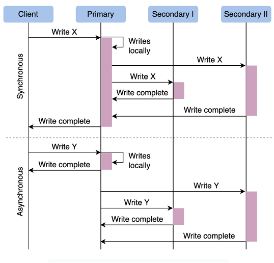
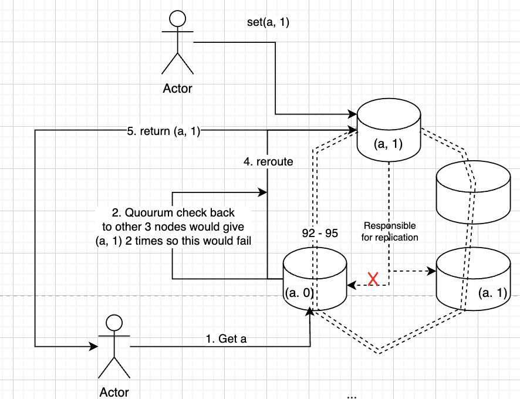

# Replication
Replication is around copying a database on one physical machine to another 

This can be done in so many ways, and each of them has pros and cons

## Sync vs Async
- Synchronous Replication
    - Leader waits for acknowledgement from one or many follower nodes before considering transaction completed and reporting success to client
    - Benefits:
        - All data is consistent
    - Drawbacks:
        - If a follower doesn’t acknowledge, then the leader wouldn’t be able to report success to client for a long time, or it would report a failure
- Asynchronous Replication
    - Leader will send changes to followers, and without acknowledgement from replicas will report success to the client
    - Benefits:
        - There’s never any lag for leader to work with client
    - Drawbacks:
        - Data may be inconsistent



### Replication Models

#### Snapshots
| Pros       | Cons           |
|------------|----------------|
| Stable     | Slow           |
One of the easiest ways is to just take the flat files that a database uses on disk, and copy those over to another node

We can also "snapshot" that disk at some point in time and copy that over to another physical node

#### Single Leader / Primary Secondary
        - Data replicated across multiple nodes
        - Single node is designated as primary, and it will process all writes to cluster
- Leader is always a single point of failure
        - Also sends all writes to other nodes in cluster
        - If we have many reads, and we increase # of replicas, then primary write to replicas can become a bottleneck during writes
- Primary Secondary is good for read-intensive applications
    - It is the idea where primary writes to the primary secondary, and in turn this secondary ensures all followers get the updates information
    - Allows primary to communicate back to client faster
    - Ensures follower scalability
    - This is inappropriate if our application is write heavy, as there will be a chain of acknowledgements
        - Methods

#### Statement-Based
- Used in MySQL
- Primary node executes a statement, and appends that statement to a log file, which is then distributed to replicas to run themselves
    - Non-deterministic functions, such as NOW(), will cause inconsistent values between leader and followers

#### Write Ahead Log (WAL)
- Used in Postgres + Oracle
- When a transaction occurs it’s recorded in Transaction Log File, and this is written to disk
- Instead of storing statements in log, we store transactions, which can ensure consistency with non-deterministic functions
#### Logical (row-based)
- Used in almost every relational DB
- Changes made to individual rows are recorded and then replicated to follower nodes
    - Captures changes in logical format, deltas, and sends those deltas to secondary nodes
    - Multi-Leader Replication
        - If the leader fails, then we lose data
        - We could have multiple leaders
- Each leader node processes writes and sends them to all other primary and secondary nodes
        - Conflicts can arise if multiple leaders process different requests on same data
- Like if 2 different writes alter a row differently
- Both will be successful in each leader node
- Remediation:
    - Conflict avoidance by ensuring any write to a specific row is handled by same leader node
    - Last write wins using timestamps of write
    - Custom logic depending on business use case
        - Topologies:
            - Circular
            - Star
            - All-to-all

| Pros       | Cons           |
|------------|----------------|
| Stable     |                |
| Cheap      |                |
| Available  | Not consistent |
In the Data Engineering world we use WAL's (Write Ahead Logs) and CDC (Change Data Capture) a lot 

WAL's are basically an append only log (on disk) of things done on a database
```
insert (a, 1) at 0:0:0
insert (b, 2) at 0:0:1
insert (a, 2) at 0:1:1
delete (a, 2) at 0:3:1
...
```

WALs solve multiple problems themselves!
    - Fault tolerance since they are written on disk, and after a crash we can replay these logs
    - Replication by having other replicas read this WAL to see what they need to do
    - Logging! We sometimes want to know when transactions / writes happened

Each replica has a replication slot, which is basically just the metadata of the last offset it's read
    - So maybe one replica is currently at the 3rd command `insert (a, 2)`
    - And the other replica is up to date and has done `delete (a, 2)`
    - ***We can see here that the two replica's aren't consistent! A request to either would result in 2 different results***


This type of replication is typically used in the Data Engineering world between replicas to serve requests, to push from an application database to an analytical data warehouse, or to push events from an app database onto an event broker

## Peer-to-Peer / Leaderless
- There are no primary / leader databases
- Each node can handle read and writes, and will eventually become consistent across nodes
- Ideally, each node in the cluster comes to a Consensus on values, meaning they all agree on the same value for any key at any given time
    - Ensuring consistent reads
- Quorum is how we handle the write inconsistencies across nodes
- N nodes, W for write success, R for read
- We’ll get the updated value from reading any node as long as w + r > n since at least one of the nodes must have an updated write from which we can read
    - This also means w > n – r which is saying as long as we require having w nodes with the updated consistent value, and there are more write success threshold than total nodes less reads, then we can ensure we get the updated value
- Altogether it’s a schema to ensure that if we read a value, we know it must be updated, because we set such a high threshold it’d be impossible to have quorum otherwise


### Consensus 
| Pros       | Cons           |
|------------|----------------|
|          | Hard to implement|
| Consistent  | Performance / availability hit |
| Fast (rpc vs disk)  |  |
Consensus systems are similar to WAL, but we send the log entries over the network (each insert / update / delete is an RPC call) to all of the replicas, and then they reply when they've successsfully gotten it

[RAFT is a consensus implementation](https://github.com/lsprangers/raft-course/blob/main/README.md)

After enough nodes (usually > 1/2) reply they've gotten it (a consensus) we consider the value replicated
    - This reply from a consensus might take a long time, and that would mean a performance and availability reduction 
        - We can still serve other reads and writes from other clients, but that specific update would not be reflected for a while and that would be annoying as a client


### Quorum
There are some systems which use a quorum - a quorum is a majority! Quorum means a majority of nodes must agree on a value to ensure consistency

| Pros       | Cons           |
|------------|----------------|
|          | Hard to implement|
| Leaderless  |  |
| Fast (rpc vs disk)  |  |

What does this help us with? Consistency, Replication, and Scaling:
- **Replication**: By storing the data on multiple nodes.
- **Consistency**: By ensuring the replicated data is the same across nodes.
- **Scaling**: By allowing multiple nodes to handle reads and writes.

Essentially, what quorum does is for any new write to a node, that node updates, at minimum, a certain number of other nodes depending on the write factor (`w`). 

During a new read, whatever node accepts the read needs to check with some number of those nodes, and if they all agree on the value, the node will respond to the client.

We would say there's a quorum if more than a certain factor, usually `# nodes / 2`, agree on a value:
- `w` is the write factor.
- `n` is the number of nodes.
- `r` is the read factor.
- As long as `w + r > n`, we are guaranteed to have a consistent majority with replicated data.

#### Example
Let's say there are 4 nodes:
- `n = 4`
- Write factor `w = 3`
- Read factor `r = 2`
- We need to pick `w` and `r` such that there's at least one node in common between them, i.e., `w + r > n`.
- `3 + 2 > 4`
- On each write, we know we must update at least 3 nodes in total, and when any node is requested to serve a client, it needs to check with at least 2 other nodes.


#### Leader vs Leaderless
- RAFT and Paxos consensus algorithms have leaders, where one single node accepts all reads and writes and RPC's out to followers
- Other implementations like CochroachDB allow any node to accept reads and writes and then they use the gossip protocol to send out messages 
    - This is much harder to implement, but allows for much higher scaling since it's not a single node bottleneck
    - When a new read request comes in we need to send read to all nodes, and if majority agree on a value then we can consider it the known current value

#### Availability vs Consistency
- Some setups allow for the consensus replicas to serve reads, and there are ways to do this to ensure serializabiltiy and consistency
- CockroachDB is one of the groups who implemented this

