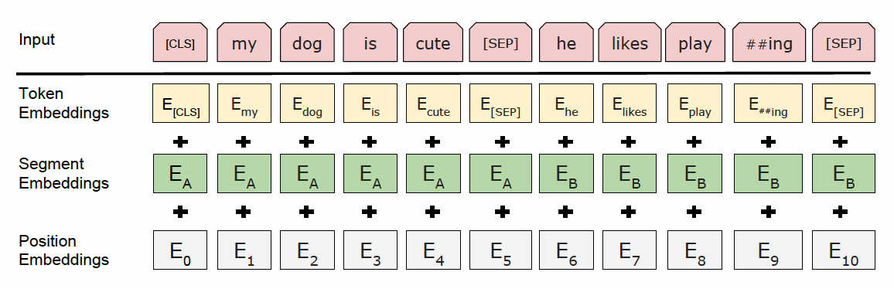

# Table of Contents
- [BERT](#bert)
- [Training](#training)
    - [Base Models](#base-models)
    - [Base Model Architecture](#base-model-architecture)
    - [Masked Language Modeling Architecture](#masked-language-modeling-architecture)
        - [MLM Example](#mlm-example)
    - [Next Sentence Prediction Architecture](#next-sentence-prediction-architecture)
    - [Extending Base Models](#extending-base-models)
    - [Fine Tuning Architecture](#fine-tuning-architecture)
    - [Fine Tuning Examples](#fine-tuning-examples)

# BERT
BERT (Bidirectional Encoder Representations from Transformers) goes a step beyond [Word2Vec](./EMBEDDINGS.md#word2vec) as it is an all around ***language representation model*** that can provide contextual word and sentence embeddings for specific supervised tasks

BERT is technically an ***Encoder Only Model*** even though it has a decoder stack, the Attention is All You Need Paper references Encoder-Decoder, which BART is, but BERT is Encoder only

***Use Case***: Original Encoder-Decoder Transformers were great for *machine translation*, but that isn't the use case for BERT! Encoder only helps us with transfer learning for a variety of contextual embedding use cases

Therefore, if we look into [Attention](./ATTENTION.md#attention) markdown, BERT would only use the [Self Attention](./ATTENTION.md#self-attention) encoding over multiple stacked encoders, ultimately resulting in an attended to set of hidden states outputs

BERT doesn't generate text, but it produces token embeddings that are great for Classification, Sentence Similarity, Sentiment Analysis, and NER / Token Level Tasks

***Contextual Word and Sentence Embeddings*** is a loaded phrase, but it basically means it can help encode any structure of text, for any vocabulary, and it does this through word tokenization and [Attention](./ATTENTION.md#attention) respectively

***Transfer Learning*** is the idea that the semi-supervised training of of a BERT model is just for creating weights and parameters, and that the ideal output of this phase is just the BERT model with said weights and parameters. Once this is done the model itself can have extra layers tacked onto it / updated and be used in a wide range of downstream tasks like sentence classification, word embeddings, report summary, etc...

BERT training has a similar setup to Word2Vec where we use a certain context size to help us model a specific word, but the embeddings can't necessarily be saved because the output layer (embedding) depdends on the hidden layers...therefore we need to pass a word through with context to get an embedding

***Bidirectionality*** is the big buzz word throughout this paper, and the paper mentioned OpenAI's GPT models multiple times discussing how they only have unidirectional architecture in the [Attention](./ATTENTION.md#attention) layers which ultimately restricts it's abilities in some downstream tasks like sentence classification and question answering

BERT itself is...useless? Meaning the model out of the box doesn't have an exact perfect use case (outside of word / sentence embeddings) and for most successful NLP projects it needs to have a final layer trained (this is false too, a lot of good sentence embedding can be done OOTB)

Most companies don't actually use BERT out of the box, most companies will fine-tune on top of it and then distill it to lower memory and inference footprint
| Use Case | Head on Top of BERT |
| --------- | --------- |
| Sentiment Analysis | `[CLS]` Token &rarr; Dense &rarr; SoftMax | 
| Named Entity Recognition (NER) | Per Token &rarr; Dense &rarr; CRF or SoftMax |
| Question Answering | Two linear layers &rarr; Start / End Token Logits |
| Sentence Similarity | Mean / CLS pooling &rarr; Dense &rarr; Cosine / Classifier |
| Retrieval | Dual encoders (query / doc) &rarr; VectorDB |
| Re-Ranking | Cross-encoder (CLS output) &rarr; Score |

## Training
- BERT is designed to pre-train deep (large context) bi-directional (forwards and backwards) representations from unlabeled text by jointly conditioning on left and right context in each layer
    - This basically means that throughout the layers of BERT we use the context words to left and right of current word to update our weights
    - Difference from [Word2Vec](#word2vec) is that ***BERT keeps word positioning and context***
- Once this is complete, BERT can be ***fine-tuned*** with just one single output layer to be used as a State of The Art (SOTA) model for multiple different NLP tasks

### Base Models
- A base model in this sense means a model that isn't necessarily trained for a specific task, but is trained to create useful parameters and weights that can be used later on
- Training a base BERT model is resource intensive, and involves:
    - ***Masked Language Modeling (MLM):*** Mask a random selection of words in the context sentence, and try to predict those (output) given the context
        - This task will fuse the left and right context windows around the word, and use both, with positional encodings, to predict the masked word
    - ***Next Sentence Prediction (NSP):*** Given positive next sentence examples, and negatively sampled incorrect next sentences, predict (output) next sentence predictions
- ***Training Objective:*** To use bi-directional language models to learn general language representations

#### Base Model Architecture
- Parameters:
    - $L$ layers / encoder blocks
    - $H$ is the size of the hidden states
    - $A$ attention heads per layer
    - $E$ represents the input embedding
    - $C \in \real^H$ represents the final hidden vector (of size $H$) of our `[CLS]` token (i.e. our "final" hidden layer for our sentence)
    - $T_i \in \real^H$ as the final hidden state for a specific input token $w_i$
    - $P_i$ is our positional encoding which represents the learned positional embedding for our token in it's specific sentence of any size
    - $S_i$ is our segment encoding which represents the learned positional embedding for our token in either segment sentence A or B
        - In our inference time examples for embeddings most people just fill it with `0's` or `1's` depending on which sentence it's apart of

- Based on bi-directional Transformer encoder architecture released in Viswani 2017, which uses [Attention](./ATTENTION.md#attention) mechanisms like self-attention to allow contextual information to flow into encoder states
  - I used to believe BERT also uses Bahdanau attention, but that's in encoder-decoder architectures, where decoder computes attention over encoder outputs to select relevant context for each generated token
  - ***BERT IS NOT A DECODER*** - there's no secondary sentence like output / target to attend over! We simply just attend to our input WordPiece embeddings
  - Other transformers like TP, BART, and some GPT models do have cross-attention which is similar to Bahdanau
- BERT uses bi-directional self-attenion, while other models like GPT use constrained left-to-right self-attention
    - Left-to-right attention means for any token / word $w_i$ it can only attent to (get attention /context from) words to the left i.e. $w_{0, i-1}$
- The input token sequence can be either a single sentence or a pair of sentences, which allows for MLM and NSP tasks mentioned above
- ***WordPiece Embeddings are used with a 30k vocab size to represent the input sequence words as numeric embeddings***
    - This is an initial part of how BERT and Word2Vec are similar
    - WordPiece is similar to Word2Vec except it will chunk out words to lower the overall space, so that words are represented like `['em', '##bed', '##ding', '##s']`
        - In this way we can reuse the embedding for the word "embeddings", which will save space over time
        - `em` in this scenario is the same as the one in "go get em" because it's at the start, but `###bed` is not equivalent to `bed` in the sentence `I went to bed`
        - Tokenizer will continuously try to split words it doesn't know, and as a worst case fallback decompose into letters
- There are special tokens throughout which help us to have dynamic input representations and language modeling tasks
    - `[CLS]` represents a ***special classification token*** to represent start of sentences, our final end sentences, and tokens we wish to predict
        - The final hidden state for this token represents our aggregate sequence representation for the entire sentence for classification tasks
            - It should have all of hte info of the sentence, and would be the feature input to our classification layer
    - `[SEP]` marks the separation of two sentences
        - We utilize this with a *learned embedding vector* to update embeddings whether they're in sentence A or B
            - This is just another piece of [Attention](./ATTENTION.md#attention), except here the attended to portion is sentence placement, which would affect our tokens vector by updating it with sentence A or B context
- Our input representation is created by summing the token, segment, and positional embeddings - $SUM(T_i, S_i, P_i)$
    - Basically it's a representation of our token's actual word embedding, it's sentence, and it's position in the sentence
    - TODO: `[CLS]` token is just at the front - I thought this wold be at the end? Why would we use the final hidden layer of the first token?
    - Even though `[CLS]` is at the front of a sentence, it's still a useful token to use for the final hidden layer as it will contain all of the information for the rest of the sentence - since BERT is bidirectional using the start or ending word should be equivalent
- 

#### Masked Language Modeling Architecture
- ***Training Objective:*** to predict the masked word via `MAX(softmax_score)`!
- Also known as ***Cloze*** task in historic literature
- The reason bi-directional MLM is so powerful is because it allows our models to go beyond "concatenating left-to-right and right-to-left" and to actually use this inforamtion to update information
- For MLM tasks we basically need to set things up so that any word can't "see itself" and is able to use the contextual positions of all other words
- After running the sentence through for each masked word, the final hidden state is sent through an output softmax layer to predict the masked word
- 15% of words are masked in each sentence at random
- ***Catch***: The `[MASK]` token doesn't appear during downstream feature-based or fine-tuning tasks...
    - Training data generator, when coming across $w_i$ to be masked, will:
        - Replace $w_i$ with `[MASK]` 80% of the time
        - Replace $w_i$ with a random token 10% of the time
        - Do nothing the last 10% of the time
    - Finally, we can use $T_i$ to predict our actual output token, and that will be compared with $w_i$ using cross entropy loss

##### MLM Example
- Original sentence: "The quick brown fox jumps over the lazy dog"
- Randomly select our masked $w_i$ to be "jumps"
- 80% of the time:
  - Input: `"The quick brown fox [MASK] over the lazy dog"`
  - Expected Output $T_i$: `'jumps'`
  - Purpose: So model can learn to predict the masked word given context
  - Loss: Cross Entropy
    - We get the output distribution of the final hidden layer and compare it to the word we `[MASK]`-ed
- 10% of the time:
  - Input: `"The quick brown fox apple over the lazy dog"`
  - Expected Output $T_i$: `'jumps'`
  - Purpose: So model doesn't rely on `[MASK]` token, but tbh I don't understand the reasoning here.
    - Where does the sentence predict `jumps` would be applied to? The end?
- 10% of the time:
  - Input: `"The quick brown fox jumps over the lazy dog"`
  - Expected Output $T_i$: `'jumps'`
  - Purpose: Model learns to predict the word even when it's visible
- $\text{Loss} = -\sum_{i \in M} \log P_{\text{model}}(w_i \mid \text{context})$

#### Next Sentence Prediction Architecture
- ***Training Objective:*** to predict, in a binary fashion, the next sentence from a possible next sentence that's presented to us
    - Basically we are going to give a random, possible true, next sentence B for any sentence A and predict 0 or 1 if we think it's the next sentence
- Why do we do this? Tasks like question answering and natural language inference all depend on modeling the *relationship between 2 sentences*
- Our final hidden layer for our `[CLS]` token, $C$, will be used as a feature into a final binary logistic regression output layer

### Extending Base Models
- A "complete" model in this context is a model with a classifier that's fully trained to be used in production on a specific task
    - It most likely used a core / base model and then ran ***transfer learning*** on top of it to create a full model
    - This paradigm allows us to create magnitudes more full models that are all based on BERT base models
- The transfer learning fine tuning strategies listed below are typically *supervised* and completed on labeled data for a specific task
- There are generally 2 strategies for applying a pre-trained BERT base model to downstream tasks
    - ***Feature Based***
        - This method uses the pre-trained representations as features alongside other features
            - It might be using some user generated text as the core features alongside other user features like demographics and history
        - It boils down to creating and optimizing a new final classification layer
            - The base models weights can also be updated during training of final layer, but they don't necessarily have to be
                - This would be fine-tuning + feature based usage
            - This final classification layer is the entire basis of our downstream task, and uses the pre-trained BERT model for modeling the text representation before we finally use it
        - We could train this at base model training time, but this would involve lots of compute spend each time, or we can ***update the base models weights while training the classification layer*** 
    - ***Fine Tuning***
        - Fine Tuning models, such as ***Open AI's GPT (Generative Pre-Trained Transformer)*** models, introduce minimal task specific parameters and is trained on the downstream task by *fine-tuning all of the pre-trained models parameters*
    - The training objectives of both of these types is equivalent during pre-training, but the actual extension during transfer learning is where they diverge

#### Fine Tuning Architecture
- The architecture of our fine-tuning (or feature-based) tasks largely rely on creating a new output layer on top of our existing pre-trained models
- We can model single sentence, or sentence pairs, in our fine-tuning step, because BERT's self-attention mechanism allows for context to come through at each step
    - Encoding a concatendated text pair with self-attention will effectively include bi-directional cross-attention between 2 sentences
    - This basically means that if we concatenate two sentences together we can allow the context from sentence B to flow into sentence A because we just treat this as one single sentence, and the semgent (sentence) embedding helps us to distinguish and attend to our sentence pairings.
- For each task we simply input the input-output pairing, and use specific loss functions to ***tweak the parameters end-to-end***
- Token representations are sent into the final output layer for token level tasks
- `[CLS]` representation, $C$, is sent to the final output layer for sentence level tasks like classification or sentiment analysis

- Using a Cloud TPU or GPU we can reproduce the Fine Tuning results in an hour or a few hours respectively

#### Fine Tuning Examples
- General Language Understanding Evaluation (GLUE)
    - *Data:*
    - *Field:* Natural Language Understanding
    - *Input:* $C$, the `[CLS]` final hidden layer
    - *Parameters:* 
        - Pre-trained parameters in $H$
        - New label parameters $W \in \real^{K \times H}$ where $K$ is the number of labels
            - This effectively represents our $K$ labels in size $H$ hidden dimensions
            - These are the final output parameters for us to tune
    - *Output:* $log(softmax(CW^T))$ which represents the `log(softmax)` of our final hidden layer multiplied by our new label parameter layer
    - Ultimately this allows us to label sentences into $K$ distinct labels, where *our new classification layer is the only thing we added!*
    - On some smaller datasets things were unstable, so they would train multiple different models with random input and then randomly check-point models and choose the best one over time
        - New models after restarts would pick the best "last saved model"

- Stanford Question Answering Dataset (SQuAD)
    - *Data:* 100k crowd sourced questions and answer pairs
    - *Field:* Question Answering
    - *Input:*
        - Input the question and passage as a single, concatenated, sentence with `[SEP]` tokens
        - Question gets A segment embedding, passage gets B segement embedding
        - We need to find $[i, j]$ from our passage that answers the question
    - *Parameters:* 
        - Pre-trained parameters in $H$
        - Start and End embeddings to help us figure out when to begin and end our answer
            - Start embedding $Y \in \real^H$
            - End embedding $Z \in \real^H$
            - Probability of a word $w_i$ being the start of an answer span is $T_i \dot Y$ meaning we find the closest Token to our start embedding, and since our start embedding is learned throughout the process we basically just hope our ***start embedding, after being attended to for a specific question, represents the best starting word***
                - We also wrap the dot product in a softmax, and only calculate this over the words inside of the passage, not our entire vocab
            - Same thing for end
    - *Output:* Objective is to find $i, j : j >= i$ meaning we just want to find the right indexes in the passage that answer the question
