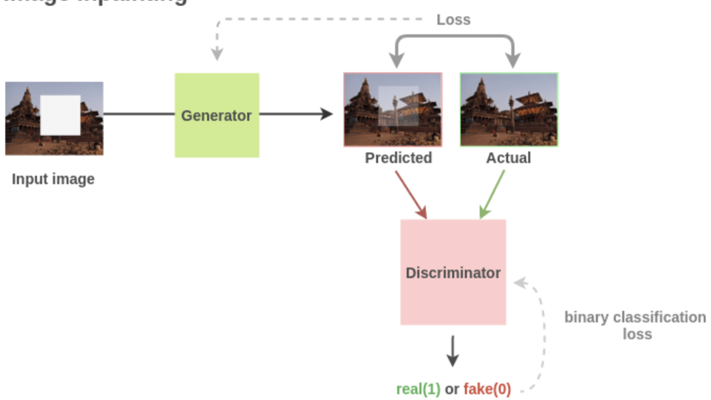
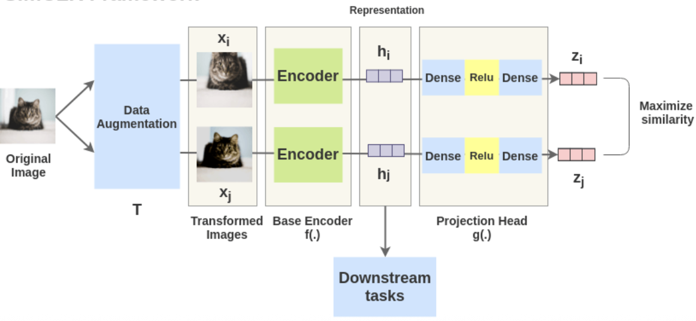

# Self Supervised Learning
Yann Lecun!
“If intelligence is a cake, the bulk of the cake is self-supervised learning, the icing on the cake is supervised learning, and the cherry on the cake is reinforcement learning (RL).”

Self Supervised Learning was a large part of the NLP movement in the beginning with [Word Embeddings](./EMBEDDINGS.md) and [Attention](./ATTENTION.md#attention) - it gave rise to Word2Vec, Glove, ELMO, BERT and many other models that learned underlying representations of words by self supervising learning of existing text

Supervised learning itself requires a humongous amount of labeled data, and in most cases we just cannot create that level of human labeled data for text and image classification / embeddings, and even if we could it would be outdated after a week or so 

Self Supervised Learning tries to generate an almost unlimited amount of labeled data by using existing data, without the need of having actual Human In The Loop labeling

This is done, usually, by creatively exploiting some characteristic of the data - such as sentence structure revealing word context, rotating images and guessing rotation, or something else that helps us model the input without explicit labeling. Once this is done we can take this self supervised model, apply it to a much smaller amount of labeled data, and get really great results for classification, segmentation, and other things

# Self Supervised Architectures
I marked this reference elswhere, but pulled a fair number of these from [AmitNess Blog](https://amitness.com)

## Reconstruction
How can we create models that can re-create photos?

### Image Coloring
If we have a set of 1 million images, how can we create latent representations of photo colors and images?

We can pair up (original phot, greyscale) pairs, after that we can train a model to "color in" the photos and use [L2 Loss](./LOSS_FUNCTIONS.md#l2-loss) between predicted "colored in" photo and the original photo 

The blog I pulled this from mentioned an encoder-decoder architecture to encode greyscale, and decoder to generate the "colored in" image

### Image Superresolution
Similar idea to above Coloring, except we prepare training pairs of (small, upscaled) images by downsampling existing images

### Image Inpaiting
This is one of the best self supervised methods for learning latent representations in pictures

In this architecture we randomly remove some section of the picture, and the goal is to re-insert the missing section

In this  we see they pull out random sections of the photo, and then we'll end up trying to use a [GAN Architecture](./GAN.md) to regenerate the missing portion

This [has been shown](https://arxiv.org/abs/1604.07379) as a useful transfer learning mechanism to use as starting weights versus random weights for segmentation tasks

## Other Examples
There are many other ways self supervised learning can be leveraged:
- BERT language modeling to learn words and context
- Frame ordering of videos
- Picture classification / clustering (this one I don't get how we'd get the labels?)

## Contrastive Learning
The example used in blog(s) is typically pattern matching - when there is one image on the left side, and 4 possible images to choose from on the right side, and we have to choose the "closest" image from the right to pair with the left

We have to pick from a set of objects to *contrast* to another object

***Contrastive Learning*** attempts to teach machines to distinguish between similar, and dissimilar, things

# SlimCLR
SlimCLR is based on [Contrastive Learning](#contrastive-learning)

SlimCLR beat out most self supervised methods, and even ended up beating out supervised (labeled) ImageNET architectures

Given we want to use [Contrastive Learning](#contrastive-learning), how can we use this type of learning alongside self supervised learning, to formulate an architecture where we can use self supervision without labeling?

***Problem Formulation:***
    - ***Need:*** 
        - A way to automatically generate similar and dissimilar pairs 
        - A way to represent / embed each image
        - A way to quantify if 2 images / representations are similar

## SlimCLR Framework
The idea is to take an image $x_i$, transform it in some way to get $x_j$, and then encode each image with the same encoder $h_i = E(x_i)$ and $h_j = E(x_j)$

These encoded represenations are then passed through non-linear fully connected layer(s) to get $z_i$ and $z_j$

***The task*** is to maximize the similarity between $Similarity(x_i, x_j)$ - once this is done we can reuse the output of the encoders, $h_i$ in downstream tasks. This effectively allows us to create useful encoder(s) for representing characteristics of images

### Data Augmentation and Problem Formulation