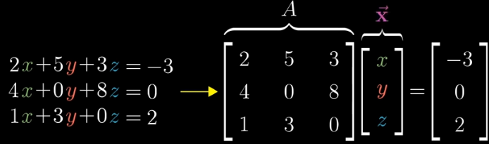

# Linear Systems
Linear Algebra helps us to manipulate matrices, and one of the most important topics / use cases of this are systems of linear equations

So in here we can see that $A$ is a transformation, and $x$ is a vector we want to find, such that when we transform $x$ we get to our desired output $v$ 

So knowing this, if we have our output $v$ and a Transformation $A$, we could hypothetically find the Inverse $A^{-1}$, which should give us our desired vector $x$

- ***This means we can analytically solve for this***, however this solution is unique *if and only if $det(A) = 0$*, because if $det(A) = 0$ there are multiple solutions that can "squeeze" things down by a dimension. Another thought is "there's no inverse to map 1D to a unique 2D plane", we can't just "create" another dimension 
    - This solution is only unique because it means "if you first apply $A$, and then apply $A^{-1}$, you end up where you started"
    - There still may be a solution though...a solution is unique iff it's $det != 0$, but $det(A) = 0$ does not imply there is no solution

# Rank
- When the output of a transformation is a line, we say the Rank is 1
- If all output vectors land in 2D plane, the Rank is 2
- Therefore, ***Rank can be thought of as the number of dimensions in the output of the Transformation***
- $2 \times 2$ matrix with $Rank = 2$ means nothing has collapsed, but $3 \times 3$ matrix with the same Rank means something / some group of vectors or points has collapsed