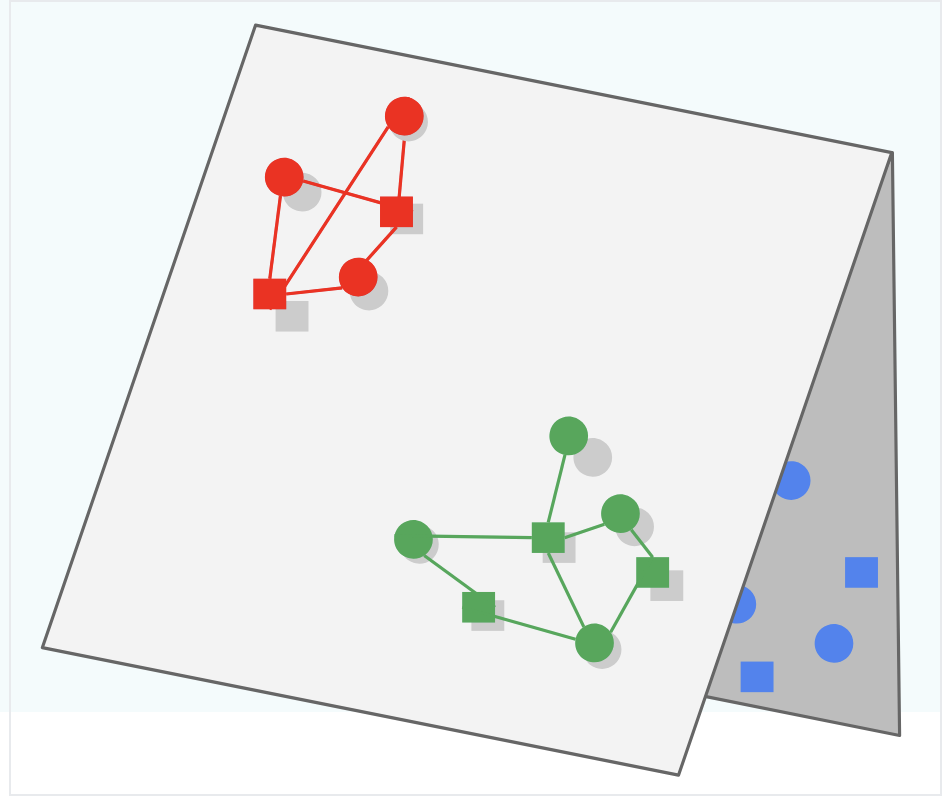

## Folding
If you only focus on the "positive" examples during training, and you don't introduce negatives for the model to "learn" / iterate over, then our model could be prone to Folding

Folding is what occurs when embeddings of different items end up close to each other in the metric space, even though they may be unrelated. When this occurs the embedding representations "look close" to each other, but in reality they should be separated. 

In the picture below the Green and Blue subspaces should be learned to be separated (i.e. create triangle 3d structure) instead of keeping them both on the 2d plane and overlapping, which would lead to Green being served for Blue queries and vice versa

## Negative Sampling
To combat [Folding](#folding) you know you must use negative samples, but instead of using every single negative example you should pick a sample of negatives! In this way you can randomly choose "bad" examples and feed them through as 0's.

## Stochastic Gradient Descent (SGD)
Stochastic Gradient Descent updates the model parameters using a single training example at each iteration. This introduces noise into the optimization process, which can help escape local minima.

## Mini Batch
Mini Batch Gradient Descent updates the model parameters using a small batch of training examples at each iteration. This balances the efficiency of batch gradient descent with the noise reduction of stochastic gradient descent.

## Mini Batch Stochastic Gradient Descent
Mini Batch Stochastic Gradient Descent combines the concepts of mini batch and stochastic gradient descent. It updates the model parameters using a small, randomly selected batch of training examples at each iteration.

## Weighted Alternating Least Squares
Weighted Alternating Least Squares is an optimization algorithm used in matrix factorization techniques, particularly for recommendation systems. It alternates between fixing the user matrix and optimizing the item matrix, and vice versa, while incorporating weights for observed and unobserved interactions.