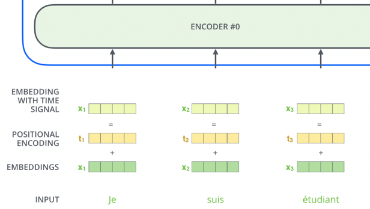

## Attention
Attention is what separates static embeddings from dynamic embeddings - they allow word embeddings to be updated, aka attended to, by the contextual words surrounding them

Attention stemmed from NLP Seq2Seq Tasks like next word prediction, and translation where using the surrounding context of the word was one of the major breakthroughs in achieving better Seq2Seq results

We need to remember that the embedding for "bank" *is always the same Embedding in the Metric Space* in these scenario's, but by attending to it with Attention, we can change it's position! It's as simple as that, so at the end of attending to the vector, the vector for bank in river bank may point in a completely different direction than the vector for bank in bank vault - just because of how the other words add or detract from it geometrically in its Metric Space. Bank + having river in sentence moves vector in matrix space closer to a sand dune, where Bank + teller in sentence moves it closer to a financial worker

How is this done? Attention mechanisms in our DNN models. There are multiple forms of Attention including Self Attention, Encoder-Decoder Attention, and Bahdanau Attention - each of them help to attend to a current query word / position based on it's surroundings. A single head of this Attention mechanism would only update certain "relationships", or attended to geometric shifts, but mutliple different Attention mechanisms might be able to learn a dynamic range of relationships

All of these Attention mechanisms are tunable matrices of weights - they are learned and updated through the model training process, and it's why we need to "bring along the model" during inference...otherwise we can't use the Attention!

### RNN Attention
Things first started off with RNN Attention via [Neural Machine Translation by Jointly Learning to Align and Translate (2014)](https://arxiv.org/abs/1409.0473)

This paper discusses how most architectures of the time have a 2 pronged setup:
- An encoder to take the source sentence into a fixed length vector
   - In most scenario's there's an encoder-per-language
- A decoder to take that fixed length vector, and output a translated sentence
   - There's also typically a decoder-per-language as well
- Therefore, for every language there's an encoder-decoder pair which is jointly trained to maximize the probability of correct translation
---

- Why is this bad?
   - Requires every translation problem to be "squished" into the same fixed-length vector
   - Examples cited of how the performance of this encoder-decoder architecture deteriorates rapidly as the length of input sentence increases
---
- Proposal in this paper:
   - "We introduce an extension of the encoder-decoder model which learns to align and translate jointly"
      - This means it sets up (aligns) and decodes (translates) on the fly over the entire sentence, and not just all at once
   - "Each time the proposed model generates a word in a translation, it (soft-)searches for a set of positions in a source sentence where the most relevant information is concentrated
      - This means it uses some sort of comparison (later seen as attention) to figure out what words are most relevant in the translation
   - The model then predicts a target word based on the context vectors associated with these source positions and all previously generated target words
      - The model predicst the next word based on attention of this word and input sentence + previously generated words
      - This was a breakthrough in attention, but apparently was proposed here earlier!
- Altogether, this architecture looks to break away from encoding the entire input into one single vector by encoding the input into a sequence of vectors which it uses adaptively while decoding

- The bottom portion is an encoder which receives source sentence as input
- The top part is a decoder, which outputs the translated sentence

#### Encoder RNN Attention
- ***Input***: A sequence of vectors $\bold{x} = (x_1, ..., x_n)$
   - ***Hidden States / Recurrence Function***: $h_t = f(x_t, h_{t-1})$
      - $f$ is some non-linear function
      - This will take the current input word, and the output of the last recurrence
      - It is formalized that $h_t \in \mathbb{R^n}$ is the hidden state at time $t$
- ***Context Vector***: $c = q(\{h_1, ..., h_{T_x}\})$ 
   - Where $\hbar = \{h_1, ..., h_{T_x}\}$ `h-bar` is the set of recurrence functions
   - $q$ is some non-linear function
   - Basically, the context vector is a function over the set of hiddden states
      - Hidden states $h_2 = f(x_2, h_1)$, and $h_3 = f(x_3, h_2) == f(x_3, f(x_2, h_1))$
      - The set of these is fed into a non-linear function $q(\hbar)$

#### Decoder RNN Attention
Decoder is often trained to predict the next word $\hat{y_t}$ given the context vector $c$ and all the previously predicted words $\{\hat{y_1}, ..., \hat{y_{t-1}} \}$

Our translation can be defined as $\bold{y} = (y_1, ... y_{T_n})$ which is just the sequence of words output so far!

It does this by defining a probability distribution over the translation output word $\bold{y}$ by decomposing the joint probability. 

$p(\bold{y}) = \prod_{t=1}^{T} p(y_t \mid \{y_1, \ldots, y_{t-1}\}, c)$

*Since our $\bold{y}$ is just our entire word sequence, the probability we're solving for is "the probability that this is the sequence of words given our context vector"*

So we're just choosing the next most likely word so that the probability of seeing all these words in a sequence is highest

The sequence "Hi, what's your", if we looked over all potential next words, would most likely have the highest predicted outcome of "Hi, what's your name"

Each of these conditional probabilities is typically modeled with a non-linear function $g$ such that 

We also define a specific hidden state formula: $s_t = f(s_{i-1}, y_{i-1}, c_i)$ where the hidden state is based on last hidden state, last output word, and context at that state

$g(y_{t-1}, s_t, c) = p(y_t \mid \{y_1, \ldots, y_{t-1}\}$

#### Learning To Align And Translate
The rest of the architecture proposes using a bi-directional RNN as an encoder, and then a decoder that emulates searching the source sentence during translation

Since sentences aren't isomoprhic (one-to-one and onto), there may be 2 words squished into 1, 1 word expanded to 2, or 2 non-adjacent words that are used in outputting 1 

***Realistically, and Seq2Seq task that isn't isomorphic would benefit from this structure***

Below we can see the parameters for:
- $y_{t-1}$ is the last output word
- $s_{t-1}$ is the hidden state at that time
- The $h_i$ components which are functions of ***previous words and hidden states in the encoder***
   - That this encoder is forwards and backwards
- Not explicitly shown is the $c = q(\{h_1, ..., h_{T_x}\})$ context vector, where $c_i$ is $c$ up to some point
   - These $h_i$ in here are called ***annotations*** to which an encoder maps the input sentence
   - Each $h_i$ contains information about the entire sentence ***with a strong focus on i-th word***
   - $c_i$ is then a weighted sum of these annotations
   - $c_i = \sum_{j=1}^{T_x} \alpha_{ij}h_j$
      - Where $\alpha_{ij}$ is the weight of $h_i$ to each annotation $h_j$ and is a similarity metric between the two computed as:
      - $\alpha_{ij} = \frac{\exp(e_{ij})}{\sum_{k=1}^{T_x} \exp(e_{ik})}$
      - And $e_{ij} = a(s_{i-1}, h_j)$ is an alignment model which scores how well the inputs around $j$ and $i$ match
   - All of this will be the basis of [Self-Attention](#self-attention) in the future, and for this you can just read this as the context vector $c_i$ is based on the similarity of an input annotation with the rest of the annotations
- In the paper they even mention *"this implements a mechanism of attention in the decoder"*
- In the encoder, the only major trick is doing bi-directional hidden states and then concatenating them
   - This productes the annotations themselves
   - $h_j = [\overrightarrow{h_j}, \overleftarrow{h_j}]$
   - These annotations are then fed through the energy, alpha weight, and context vectors before being used in the decoder

## Transformer Attention
The above RNN discussion is useful, as it shows how we can utilize the building blocks of forward and backwards passes, and even achieve attention mechnisms using basic building blocks

The rest of the discussion is around Attention blocks in Transformer Architectures, primarily using a similar encoder-decoder structure "on steroids"

### Encoding Blocks
The main layer we focus on in our Encoding blocks is Self Attention, but alongside this there are other linear layers that help to stabilize our context creation

#### Self Attention
Self Attention allows words in a single sentence / document to attend to each other to update word embeddings in itself. It's most commonly used when we want a sentence's word embeddings to be updated by other words in the same sentence, but there's nothing stopping us from using it over an entire document.

It was born out of the example of desiring a different embedding outcome of the word bank in:
- The river bank was dirty
- I went to the bank to deposit money

Via Self Attention, the word "bank" in the two sentences above would be different, because the other words in the sentence "attended to" it

Self Attention is a mechanism that uses context words (**Keys**) to update the embedding of a current word (**Query**). It allows embeddings to dynamically adjust based on their surrounding context.

#### Example
Consider the phrase "fluffy blue creature." The embedding for "creature" is updated by attending to "fluffy" and "blue," which contribute the most to its contextual meaning.

#### Key, Query, and Value Matrices

- **Query (Q)**:
   - Represents the word being attended to
   - Used to calculate attention scores with all Keys
- **Key (K)**:
   - Represents the context words being compared to the Query
   - Used to compute the relevance of each context word to the Query
- **Value (V)**:
   - Another representation of the context words, but separate and different from Keys
      - Although the same input context words are multiplied by 2 different K, V matrices, which results in 2 different Key and Value vectors for same context word
   - It basically is a representation of each "word" so at the end, a scored `SUM()` of all words is over values!
   - Weighted by the attention scores to produce the final output

These matrices are learned during training and updated via backpropagation

#### How Self Attention Works
TLDR;
- The Query vector $Q_i$ represents the current word
- The Key vector is an embedding representing every other word $K_j \forall  \left\{j \neq i\right\} $
    - We multiply the Query by every Key to find out how "similar", or "attended to" each Query should be by each Key $Q_i \cdot K_j$
- Then we softmax it to find the percentage each Key should have on the Query
- Finally we multiply that softmaxed representation by the Value vector, which is the input embedding multipled by Value matrix, and ultimately allow each Key context word to attend to our Query by some percentage
- At the end, we sum together all of the resulting value vectors, and ***this resulting SUM of weighted value vectors is our attended to output embedding***

- In the below example:
   - The dark blue vector from the left is the Query
   - The light blue vector on top are the Keys
   - We multiple them together + softmax
   - Multiply the result of that by each Value vector on the bottom

In depth mathematical explanation below

1. **Input Transformation**:
   - Each input embedding $ x_i $ is transformed into three vectors: **Query (Q)**, **Key (K)**, and **Value (V)**
   - These are computed by multiplying the input embedding with learned weight matrices:
     $
     q_i = x_i \cdot W_Q, \quad k_i = x_i \cdot W_K, \quad v_i = x_i \cdot W_V
     $

2. **Self-Attention Calculation**:
   - **Step 1**: Compute attention scores by taking the dot product of the Query vector $ q_i $ with all Key vectors $ k_j $:
     $
     \text{Score}_{ij} = q_i \cdot k_j
     $
   - **Step 2**: Scale the scores to prevent large values:
     $
     \text{Scaled Score}_{ij} = \frac{\text{Score}_{ij}}{\sqrt{d_k}}
     $
    - Where $ d_k $ is the dimensionality of the Key vectors
    - As the size of the input embedding grows, so does the average size of the dot product that produces the weights 
        - Remember dot product is a scalar value
        - Grows by a factor of $\sqrt{d_k}$ where k = num dimensions
        - Therefore, we can counteract this by normalizing is via $\sqrt{d_k}$ as the denominator 
   - **Step 3**: Apply softmax to convert scores into probabilities:
     $
     \text{Attention Weight}_{ij} = \text{softmax}(\text{Scaled Score}_{ij})
     $
   - **Step 4**: Compute the weighted sum of Value vectors:
     $
     Z_i = \sum_j \text{Attention Weight}_{ij} \cdot V_j
     $

3. **Output**:
   - The output $ Z_i $ is a context-aware representation of the word $ i $, influenced by its relationship with other words in the sequence.

### Multi-Head Attention
- Instead of using a single set of $ Q, K, V $, Multi-Head Attention uses multiple sets to capture different types of relationships between words (e.g., syntactic vs. semantic).
- Each head computes its own attention output.
   - Outputs from all heads are concatenated and passed through a final weight matrix $ W_O $:
     $
     Z = \text{Concat}(O^{(head_1)}, O^{(head_2)}, \dots) \cdot W_O
     $

#### Positional Encoding

- Since Self Attention does not inherently consider word order, **Positional Encoding** is added to input embeddings to encode word positions
- Positional encodings are vectors added to each input embedding, allowing the model to distinguish between words based on their positions in the sequence
- **Why is ***sinusoidal*** relevant and useful?**
   - Allows Transformer to learn relative positions via linear functions (e.g., $\text PE_{pos+k}$​ can be derived from $\text PE_{pos}$)
   - We all know neural nets like linear functions! So it's helpful in ensuring a relationship that's understandable 

#### Residual Connections and Normalization

- Each encoder layer includes a **residual connection** and **normalization layers** to stabilize training and improve gradient flow
- This happens after both Self Attention Layer and Feed Forward Layer in the "Add and Normalize" bubble
- Add the residual (the original input for that sublayer) to the output of the sublayer
   - In the case of Self Attention layer, we add the output of Self Attention to the original input word (non-attended to word)
- Apply LayerNorm to the result
   - This just means normalize all actual numeric values over the words embedding
- **If the diagram shows a block over the whole sentence, it just means the operation is applied to all words, but always independently for each word
- **Why is any of this useful**:
   - Helps with gradient vanishing and exploding, and also ensures input stability

#### Summary of Self Attention Encoding

1. **Input Embedings**:
   - We take our input words, process them, and retrieve static embeddings
   - This only happens in the first encoding layer

2. **Positional Encoding**:
   - Add positional information to embeddings to account for word order

3. **Self Attention**:
   3.1 **Input Transformation**:
      - Positionally encoded embeddings are transformed into $ Q, K, V $ using learned weight matrices.

   3.2 **Self Attention Calculation**:
      - Compute attention scores using dot products of $ Q $ and $ K $, scale them, and apply softmax.

   3.3 **Weighted Sum**:
      - Use the attention weights to compute a weighted sum of $ V $, and add that onto the input word, producing the output.

   3.4 **Residual + Normalization**:
      - [LayerNorm](/docs/training_and_learning/LAYER_NORM.md#layer-normalization) add together input and self-attended to matrices

   3.5 **Feed Forward Layer**:
      - Each position’s output from the self-attention layer is passed through a fully connected feed-forward neural network (the same network is applied independently to each position)
      - Essentially just gives model another chance to find and model more transformations / features, while also potentially allowing different dimensionalities to be stacked together
         - If we have 10 words in our input, we want to ensure the final output is the same dimensionality as the input
         - I don't know if this is exactly necessary

4 **Multi-Head Attention**:
   - Use multiple sets of $ Q, K, V $ to capture diverse relationships, then concatenate the results.

___ 
This diagram below shows one single encoding block using Self Attention

#### Masked Self Attention
- In Masked Self Attention, it's the same process as Self Attention except we mask a certain number of words so that the $ Q \cdot K $ results in 0 effectively removing it from attention scoring
    - In BERT training we mask a number of words inside of the sentence
    - In GPT2 training we mask all future words (right hand of sentence from any word)
   

#### Context Size and Scaling Challenges

- The size of the $ Q \cdot K $ matrix grows quadratically with the context size ($ n^2 $), making it computationally expensive for long sequences.
- To address this, masking is used to prevent future words from influencing current words during training (e.g., in autoregressive tasks).
- Context size
    - Size of Q * K matrix at the end is the square of the context size, since we need to use all of the Q * K vectors, and…it’s a matrix! So it’s n*n = n^2 so it’s very hard to scale
    - It does help that we mask ½ the examples because we don’t want future words to alter our current word and have it cheat
        - Since for an entire sentence during training for each word we try to predict the next, so if there are 5 words there’s 1, 2, 3, 4, 5 training examples and not just 1
        - Don’t want 4 and 5 to interfere with training 1, 2, 3
 
### Encoder-Decoder Attention

Encoder-Decoder Attention is a mechanism used in **Seq2Seq tasks** (e.g., translation, summarization) to transform an input sequence into an output sequence. It combines **Self Attention** within the encoder and decoder blocks each, and then **cross-attention** between the encoder and decoder

#### How Encoder-Decoder Attention Works

1. **Encoder**:
   - The Encoder Portion is completely described by what we wrote above in [Summary of Self Attention Encoding](#summary-of-self-attention-encoding)
   - TLDR;
      - The encoder processes the input sequence and generates a sequence of **hidden states** that represent the context of the input
      - Each encoder block consists of:
         - **Input Embedding**:
            - *The first encoding layer* typically uses positional encoding + static embeddings from Word2Vec or GLoVE
         - **Self Attention Layer**:
            - Allows each token in the input sequence to attend to other tokens in the sequence
            - This captures relationships between tokens in the input
            - **Feed Forward Layer**:
               - Applies a fully connected feed-forward network to each token independently
               - Typically two linear transformations with a ReLU/GeLU in between: `FFN(x) = max(0, xW₁ + b₁)W₂ + b₂`
         - **Residual Connection + LayerNorm**
            - Add input / output of layer, and then normalize across vector
      - The output of each encoder block is passed to the next encoder block as input, and the final encoder block produces the **contextual embeddings** for the entire input sequence
         - These are further transformed into K, V contextual output embeddings
      - This confused me at first, but basically the output of an encoder block is same dimensionality as word embedding input, so it can flow through
      - This is usually known as `d_model`
- This allows us to stack encoder blocks arbitrarily
- **Architecture**:
   - Composed of multiple identical blocks (e.g., 6 blocks by default, but this is a hyperparameter)
   - Each block contains:
     - **Self Attention Layer**: Captures relationships within the input sequence
     - **Feed Forward Layer**: Processes each token independently
    - 

2. **Decoder**:

   - The decoder generates the output sequence one token at a time, using both the encoder's output and its own previous outputs
   - **Input**:
      - The ***contextual embeddings*** output from the final Encoding Layer
         - These K, V contextual output embeddings are passed to each Decoder block
      - The previous Decoder block(s) output (previously generated word)
   - Each decoder block consists of:
     - **Masked Self Attention Layer**:
       - Allows each token in the output sequence to attend to previously generated tokens in the sequence (auto-regressive behavior)
       - Future tokens are masked to prevent the model from "cheating" by looking ahead
       - So self-attention only happens from words on the left, not all Keys
       - ***Query***: Special Start Token
       - **Key** and **Values**: All already generated words to the Left
     - **Encoder-Decoder Attention Layer**:
       - Attends to the encoder's output (contextual embeddings) to incorporate information from the input sequence
       - **Query**: Comes from the decoder's self-attention output
       - **Key** and **Values**: Come from the encoder's output
     - **Feed Forward Layer**:
       - Applies a fully connected feed-forward network to each token independently
- **Architecture**:
    - Composed of multiple identical blocks (e.g., 6 blocks by default).
    - Each block contains:
        - **Self Attention Layer**: Captures relationships within the output sequence
        - **Encoder-Decoder Attention Layer**: Incorporates information from the encoder's output
        - **Feed Forward Layer**: Processes each token independently
- **Example**:
   - Third word in the decoder output, meaning the first two have already been generated
   - ***Decoder Self Attention***
      - **Input**: The embeddings for the first, second, and third generated tokens so far
         - For the third position, it uses a special start-of-sequence token or the previously generated tokens as input
         - It does not have the embedding for the third word yet—because it hasn’t generated it!
      - **Masking**: The self-attention is masked so the third position can only "see" the first, second, and third tokens (not future tokens)
      - **Q, K, V**:
         - For the third position, the query is the embedding of the third word
         - The keys and values are the embeddings of the first, second, and third tokens
      - **What happens**: The third token attends to itself and all previous tokens (but not future ones), using their embeddings as keys and values
   - ***Encoder Decoder Cross Attention***
      - **Input**: The output of the decoder’s self-attention for the third token (now a context-aware vector), and the encoder’s output for all input tokens
      - **Q, K, V**:
         - The query is the third word's vector (after self-attention and residual/LayerNorm)
         - The keys and values are the encoder’s output vectors for each input token (these are fixed for the whole output sequence)
      - **What happens**: The third token’s representation attends to all positions in the input sequence, using the encoder’s outputs as keys and values  
3. **Final Decoder Output**:
   - The final decoder layer produces a vector of floats for each token, which is passed through:
     - A **linear layer** to expand the vector to the vocabulary size
     - A **softmax layer** to produce a probability distribution over the vocabulary for the next token

#### Visual Representation

1. **Encoder Block**:
   - Self Attention → Feed Forward → Output to next encoder block.

2. **Decoder Block**:
   - Self Attention → Encoder-Decoder Attention → Feed Forward → Output to next decoder block.

3. **Final Decoder Output**:
   - The final decoder output is passed through a linear layer and softmax to produce the next token.

#### Summary of Encoder-Decoder Attention

1. **Encoder**:
   - Processes the input sequence and generates contextual embeddings using self-attention.

2. **Decoder**:
   - Generates the output sequence token by token using:
     - Self Attention: Captures relationships within the output sequence.
     - Encoder-Decoder Attention: Incorporates information from the input sequence.
     - Auto-Regressive Decoder: Tokens are predicted auto-regressively, meaning words can only condition on leftward context while generating

3. **Final Output**:
   - The decoder's output is passed through a linear layer and softmax to produce the next token.

4. **Training**:
   - The model is trained using [cross-entropy loss](/docs/training_and_learning/LOSS_FUNCTIONS.md#cross-entropy) and [KL divergence](/docs/training_and_learning/LOSS_FUNCTIONS.md#kl-divergence), with each token in the output sequence contributing to the loss.

