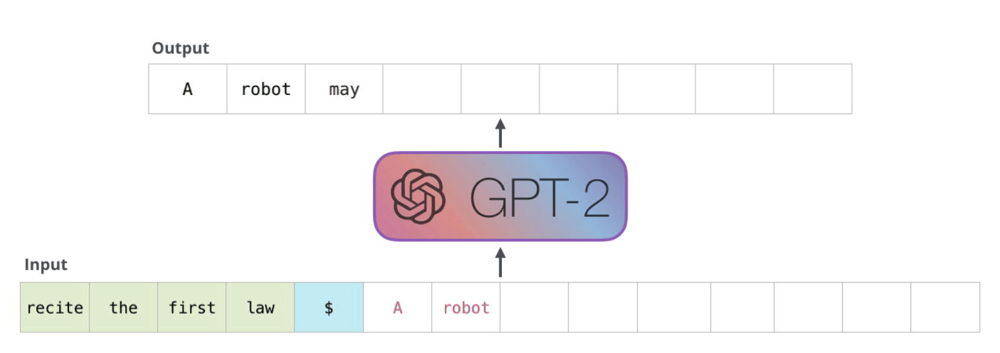

## GPT-2
GPT-2 was one of the first, and most notable GPT models!

GPT models are ***Decoder Only***, meaning they immediately start to output text in an auto-regressive fashion after receiving input

In [Embeddings](/docs/transformer_and_llm/EMBEDDINGS.md) BERT was discussed to show how we can "attend to" embeddings, and the Self Attention encoder portion was a way to contextualize ***an entire sentence, before and after a word***, but GPT isn't "allowed" to do that

***Use Case***: Original Encoder-Decoder Transformers like BART were great for *machine translation*, but that isn't the use case for GPT! GPT is used for things like next word prediction, auto-complete, etc...

The first good comparison I can think of is to a really good auto-complete where you could have 3-4 words in a message already typed out, and those words would be the queries and keys in [Self Attention](/docs/transformer_and_llm/ATTENTION.md#self-attention) to help us generate the next words in our SoftMax output layer

### History
[Generative Pre-Training](https://gwern.net/doc/www/s3-us-west-2.amazonaws.com/d73fdc5ffa8627bce44dcda2fc012da638ffb158.pdf) as a paper came out in 2018, and basically did away with the encoder in [BERT](/docs/transformer_and_llm/BERT.md)

GPT-2 was trained on a 40GB dataset known as WebText by OpenAI

The smallest GPT-2 variant took up ~500MB of storage, and the largest one was ~6.5GB, showing the difference in overall parameter sizes

The number of decoder blocks + context size is one of the distinguishing factors in GPT models as well

One of the most notable aspects of GPT models is their emergent properties. Emergent properties refer to the abilities and skills that a model develops due to its next-word prediction pretraining. Even though these models were only taught to predict the next word, the pretrained models are capable of text summarization, translation, question answering, classification, and more.

### Pseudo Architecture

- ***Input***:
    - The [section on BERTs input sequence](/docs/transformer_and_llm/BERT.md#input-sequence) basically describes what the input would be here as well
        - We embed our initial words, similar to BERT it uses WordPiece Embeddings
        - Positional encoding is also used
- ***Decoder Only***:
    - Uses [Masked Self Attention](/docs/transformer_and_llm/ATTENTION.md#masked-self-attention) which allows for constrained left-to-right self attention
        - Allows us to use newly generated words throughout our next prediction
    - ***Auto Regressive***:
        - The way these models actually work is that after each token is produced, that token is added to the sequence of inputs. And that new sequence becomes the input to the model in its next step.
        - This means that we don't encode everything from before and after, we can use the prompt as input and then each generated word is also included in the future generation
        -     
- ***Output***:
    - Compare our output embedding, which has been attended to, with our vocabulary list to create probability distribution over all words
    - Use the `top_k` parameter and select words from the resulting sample set for our output generated word

### Architecture

#### Input
Since we still need a numeric representation of our text we need to embed the input

Most of these models will use WordPiece embeddings to expand their dictionary beyond singular words

Tokenize our sentence input into Word Pieces
    - Will have some words get split into tokens like `embeddings -> [em, ###bed, ###ding, ###s]`
    - Allows us to still embed words we may not have seen before

We also include [Positional Encoding](./ATTENTION.md#positional-encoding)

**The very first word generated will get the special start token `<s>` along with the prompt

#### Transformer Decoder Only Block
Unlike the Decoder Block in Encoder-Decoder, the Decoder blocks in Decoder-Only models only have 2 layers:
    - Masked Self Attention
    - Feed Forward NN

#### Logits Output
After an embedding has gone through Masked Self Attention, and the Decoder(s) have output an attended to representation of the next word to generate, we must compare that to the known vocabulary we have

In this step we multiple our embedded output vector by our vocabulary, and then get a numeric probability for each potential output word

##### Output Parameters
- ***Top-K***: Choosing a set of words to sample from for our final output
    - If `k=1` then we just choose the output word with the highest probability
    - Typically `k` is set to something larger, such as `k=40`, and then we use the probability of thta word as the sampling distribution
        - i.e. if there's 1 word with 60% chance and 39 other words with 1% chance, we'll still most likely choose the 60% word, but there's always potential randomness with the other 39!

#### Completed!
At this point we've completed 1 word! And the model will continue to output words unless it's context window is filled (GPT-2 had 1,024) or it generates an `<EOS>` End of Sentence Token