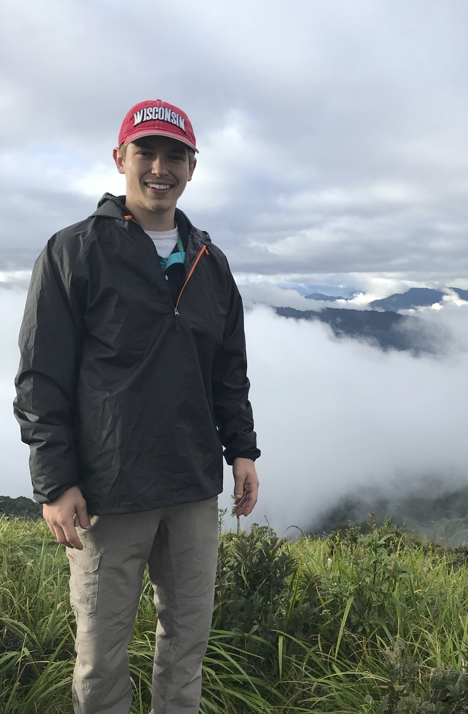

---
title: Intro
layout: template
filename: index.md
--- 

# Who am I

  

    I'm Luke Sprangers and I've worked in ML Engineering and Analytics since I've graduated
  

  

    
  

## My Projects
Here are some of the projects I've worked on:

- [Project 1](https://example.com/project1)
- [Project 2](https://example.com/project2)
- [Project 3](https://example.com/project3)

## Contact Me
Feel free to reach out to me on [LinkedIn](https://www.linkedin.com/in/lukesprangers) or [Twitter](https://twitter.com/lukesprangers).

