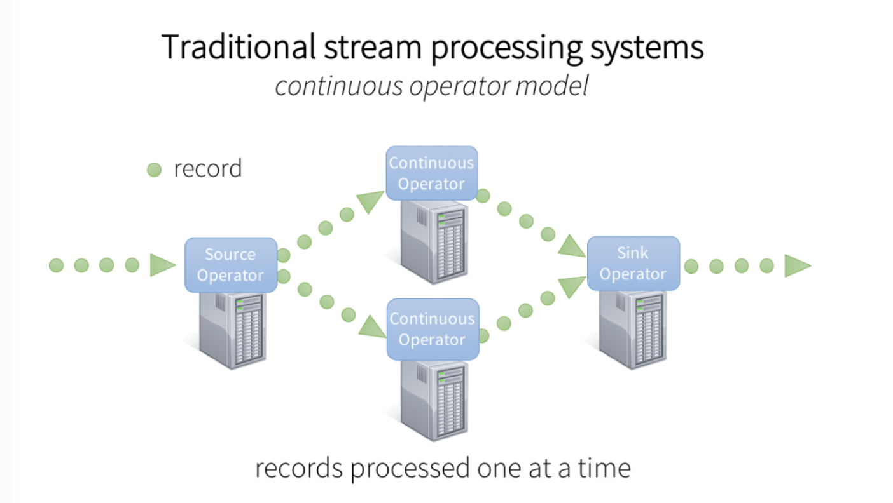

# Streaming
Streaming is basically a `while true:` over data in micro-batches

It allows us to process data as it arrives, rather than waiting for the entire dataset to be available

Typical Streaming architectures will have:
- ***Sources***: Where data is originating from, e.g. Kafka, Kinesis, etc.
- ***Sinks***: Where data is going to, e.g. Databases, Data Lakes, etc.
- ***Stream Processing Engine***: The core component that processes the incoming data streams. Examples include Apache Spark Streaming, Apache Flink, and Apache Storm
- ***Stream Processing Framework***: The programming model used to define the processing logic. Examples include Spark Structured Streaming, Flink DataStream API, and Storm Topology
- ***Orchestration***: Manages the execution and scaling of the stream processing jobs. Examples include Apache Airflow, Apache NiFi, and Kubernetes
- ***Monitoring and Logging***: Tools to monitor the health and performance of the streaming pipeline. Examples include Prometheus, Grafana, and ELK Stack (Elasticsearch, Logstash, Kibana)
- ***Checkpointing and State Management***: Mechanisms to save the state of the stream processing job to recover from failures. Examples include Apache Flink's state backend, Spark Streaming's checkpointing, and Kafka Streams' state stores

## Generic Architecture

- In the past generic streaming architectures were based on micro-batches and continuous operators
    - We would collect data for a few seconds, then process it, and repeat

## Key Concepts
- **Micro-batches**: Instead of processing data as it arrives, we collect it into small batches and process those batches
    - This approach allows us to leverage batch processing techniques and optimizations
    - It also simplifies fault tolerance, as we can reprocess a failed batch rather than dealing with individual records
    - Micro-batches are typically small, ranging from a few seconds to a minute
    - This approach is used by frameworks like Apache Spark Streaming and Apache Flink
- **Event Time vs. Processing Time**:
    - **Event Time**: The time at which the event occurred, as recorded in the data itself. This is important for time-based windowing and aggregations
    - **Processing Time**: The time at which the event is processed by the stream processing engine. This can lead to out-of-order processing if events arrive late
    - Most stream processing frameworks support both event time and processing time semantics, allowing you to choose based on your use case
    - Event time is crucial for applications that require accurate time-based processing, such as windowed aggregations or time-based joins
    - Processing time is often used for simpler use cases where the exact timing of events is less critical
    - Choosing between event time and processing time depends on the requirements of your application and the characteristics of your data
    - For example, if you're processing log data that arrives in order, processing time may be sufficient. However, if you're dealing with time-series data or events that can arrive out of order, event time is necessary to ensure accurate processing
    - Most stream processing frameworks support both event time and processing time semantics, allowing you to choose based on your use case
- **Windowing**: A way to group events into finite sets for processing. This is essential for aggregations and time-based calculations
    - **Tumbling Windows**: Fixed-size, non-overlapping windows (e.g., every 5 minutes)
    - **Sliding Windows**: Overlapping windows that can slide by a specified interval (e.g., every 2 minutes)
    - **Session Windows**: Group events based on periods of activity, with gaps of inactivity defining the boundaries
    - Windowing is crucial for time-based aggregations and calculations, such as calculating averages, sums, or counts over specific time intervals
    - Windowing allows us to perform time-based aggregations and calculations, such as calculating averages, sums, or counts over specific time intervals
    - It enables us to process data in manageable chunks, making it easier to handle large volumes of streaming data
- **Stateful vs. Stateless Processing**:
    - **Stateless Processing**: Each event is processed independently, without maintaining any state between events. Examples include simple transformations or filtering
    - **Stateful Processing**: Requires maintaining state between events, such as aggregating values or maintaining counters. This is more complex but allows for more sophisticated processing
    - Stateful processing is essential for applications that require context or history, such as calculating running totals, maintaining session information, or performing joins with historical data
    - Stateless processing is simpler and more efficient for tasks that don't require any context or history
- **Fault Tolerance**: Mechanisms to handle failures and ensure that no data is lost during processing
    - Most stream processing frameworks provide built-in fault tolerance through mechanisms like checkpointing and exactly-once semantics
    - Checkpointing saves the state of the stream processing job at regular intervals, allowing for recovery in case of failures
    - Exactly-once semantics ensure that each event is processed exactly once, even in the face of failures or retries
    - Fault tolerance is critical for ensuring data integrity and reliability in streaming applications
- **Exactly-Once Semantics**: Ensures that each event is processed exactly once, even in the face of failures or retries
    - This is crucial for applications where data integrity is paramount, such as financial transactions or order processing
    - Achieving exactly-once semantics can be complex and may involve a combination of idempotent processing, distributed transactions, and careful state management
    - Most stream processing frameworks provide built-in support for exactly-once semantics, but it may come with performance trade-offs
- **Idempotent Processing**: Ensures that processing the same event multiple times has the same effect as processing it once
    - This is important for achieving exactly-once semantics and can be implemented through techniques like deduplication or using unique identifiers for events
    - Idempotent processing allows for retries and recovery without introducing duplicate records or inconsistent state
    - It simplifies fault tolerance and makes the system more robust to failures
- **Backpressure**: A mechanism to handle situations where the stream processing engine cannot keep up with the incoming data rate
    - Backpressure allows the system to signal upstream sources to slow down or pause data production until the processing engine catches up
    - This prevents overwhelming the system and ensures that data is processed efficiently without dropping events
    - Most stream processing frameworks provide built-in support for backpressure, but it may require careful tuning of buffer sizes and processing rates
- **Scalability**: The ability to handle increasing data volumes and processing loads
    - Most stream processing frameworks are designed to be horizontally scalable, allowing you to add more resources (e.g., more nodes or instances) to handle larger workloads
    - Scalability is essential for handling spikes in data volume or processing requirements, ensuring that the system can grow with your needs
    - It may involve partitioning data streams, distributing processing tasks, and optimizing resource allocation

