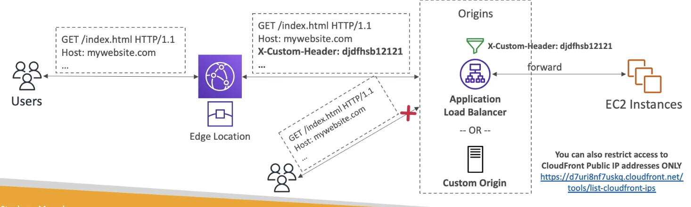
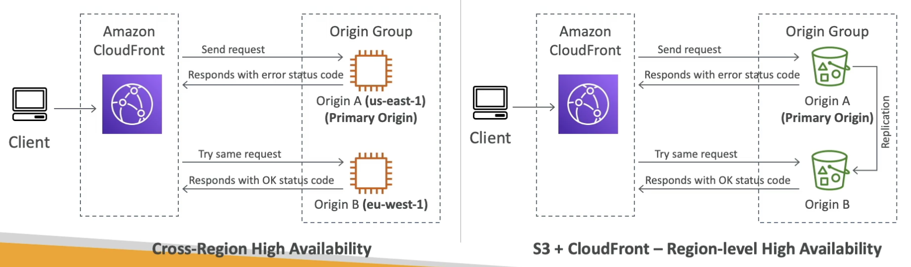
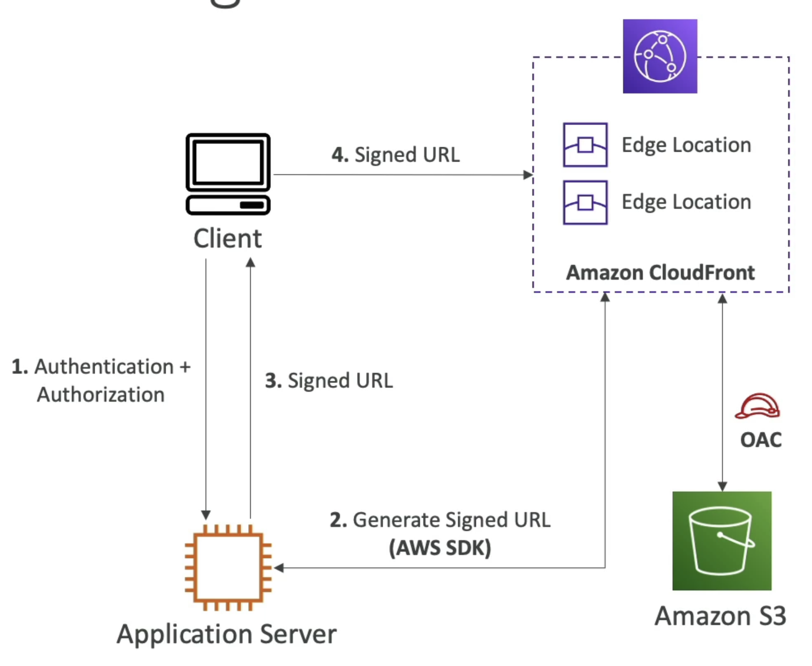
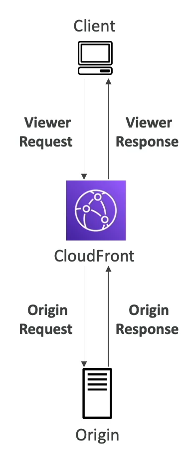
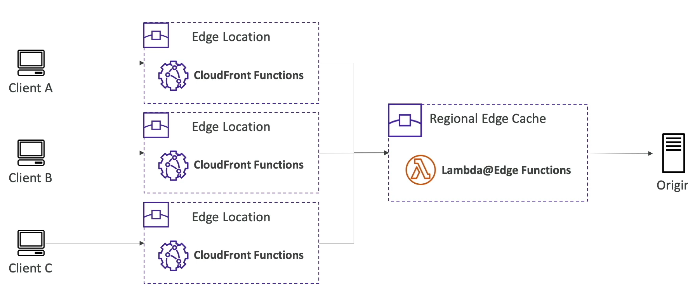
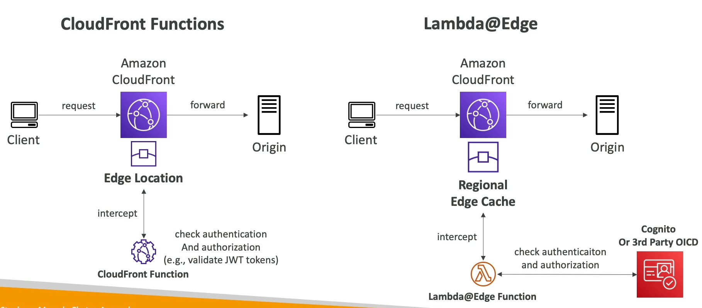
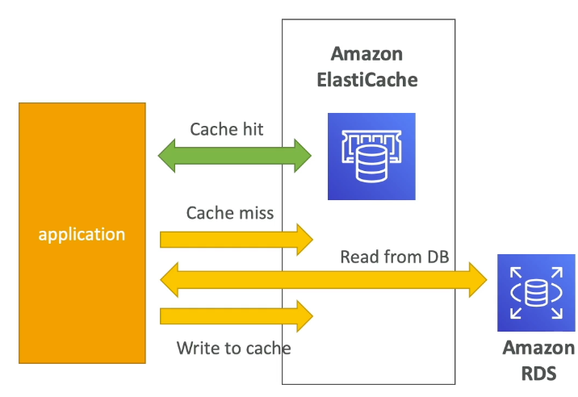

# Caching

# CloudFront
- CloudFront is a CDN
- This helps to improve read performance seen by clients
    - Content is cached at the "edge" meaning in servers close to ISPs and Clients
- 225 Point of Presense (PoP) locations globally
    - User in China requests an S3 bucket in Australia
    - CloudFront would see this, get the S3 data and bring back to client
    - Would then cache on PoP server closest to Client in China
- Helps to protect against network and app layer attacks (L4 / L7)
- Can expose external HTTPS and can talk to internal HTTP(S) backends
- Supports WebSocket

## Origins
- S3
    - Distributing files
    - Uploading files to S3
        - Can upload to CloudFront on client side, and then CloudFront to S3 is not seen by client
    - Security with CloudFront Origin Access Control
        - Ensures that content of S3 bucket is cached at edge in various locations and the number of requests to S3 is significantly lower
    - CloudFront vs S3 Cross Region Replication
        - CloudFront is global edge network that will cache static content with a TTL
            - Useful for static content that must be available everywhere
        - S3 CRR must be setup for each new region, and is updated in real time, i.e. pushed to, by origin bucket
            - S3 CRR is also read only and can't accept origin writes
            - Good for dynamic changing content that should be available in low latency in multiple regions
- MediaStore Container & MediaPackage Endpoint
    - To deliver Video on Demand (VoD) or live streaming
- VPC Origin
    - For apps hosted in VPC private subnets
    - ALB / NLB / EC2 instances
        - Allows us to deliver content from apps hosted in ***VPC private subnets***
        - CF can deliver traffic to ALB, NLB, EC2 in private subnets because it does not need to go over public internet
            - Would need a VPC Origin, similar to a VPC Endpoint, connected on our VPC to CF to our Private Subnet
- Custom Origin (HTTP)
    - API GW
    - S3 bucket configured as a webserver / website
    - Any HTTP backend you want
        - ***Must be public***
        - Handles the rest of the use cases in the world!
        - Public ALB to private EC2 would work
            - Many groups will use CloudFront Custom HTTP header as extra authentication to ALB
                - Create a secret header on CF servers, and use that as header, and then public ALB will only forward requests to backend with that header
                - Update CF + ALB headers with Lambda 
                - 
- Origin Groups
    - To increase HA and failover
    - Has secondary origin, which ***can be cross-region***, which takes over if first one fails
    - 

## Security
- Geo Restriction:
    - Can restrict who can access origin and distributions
        - Allow and Block lsit
    - Can help with copyright laws as well
    - Comes in as a header as well if we want to track
- Signed URLs
    - Allows us to block every single public access request on CloudFront
    - Forces a client to use a pre-signed URL to access CloudFront, and an app server would generate the pre-signed URL if authenticated to
        - CF Signed URLs allow us to access a path no amtter the origin
        - Different from S3 pre-signed URLs since you act as the signer when using S3 PSURL
    - 

## Pricing and Performance
- Pricing is done by where the CF Origin server sits
- If we have all regions, it's the best performance, but costs the most
    - Price Class 100 is least expensive regions covered, and so is the least expensive
    - Price Class 200 is most regions but excludes the most expensive ones
    - Price Class All means all regions, best performance

## Custom Errors
- Return a custom page when origin gives us a 4xx or 5xx error
- Use static `.html` pages from S3, which CF caches, and then would return that page to client

# Lambda@Edge 
- You can also run functions / code at the edge
- Edge Function:
    - Code you write and attach to CF Distributions
    - Runs close to your users to minimize latency
    - Doesn't have any cache, only to change reqs / resp
    - 2 Types:
        - CloudFront functions
            - JS only
            - Interact with viewer request and response directly from client only
                - Viewer Request: After CF receives a request from a viewer
                - Viewer Response: Before CF forwards the response to the viewer
            - Lightweight functions with high-scale altency sensitive CDN customizations
                - Sub MS, Millions of req / sec
                - Only get 1ms execution time
            - Process based isolation
            - Code managed entirely within CF
            - Cannot access body of HTTP requests, but can see headers
        - Lambda@Edge
            - Lambda functions in JS or Python
            - Scales to 1k req/second, much larger memory
                - 5s execution time
            - Run at nearest regional edge cache
            - VM based isolation
            - Author functions in AWS Region (`us-east-1`) and CF replicates to all of its own locations
            - Used to change Viewer and Origin req / resp
                - Viewer Request: After CF receives a request from a viewer
                - Viewer Response: Before CF forwards the response to the viewer
                - Origin Request: Before CF forwards the request to origin
                - Origin Response: After CF receives response frmo origin
                - 
        - Arch:
            - CF Functions deployed at Edge locations, and Lambda deployed at Regional Edge Cache
            - 
- Use cases:
    - Manipulate HTTP req / resp
    - Implement request filtering before reaching app server
    - Auth:
        - Doing Auth on CF means there's just validating JWT token locally somehow
        - Lambda Auth means we can use 3rd party tools like Incognito or Okta IdP
        - 
    - Content Filtering:
        - We can also use Lambda to do content filtering based on headers. If Chrome browser on laptop trying to GET image we can return larger image than if an iPhone is trying to
        - Comes from `User-Agent` header
        - Deals with a GET to S3 so only Lambda, no CF
    - Global Serverless App:
        - Use S3 for static website files
        - Client requests CF for dynamic API
        - Goes to CF, maybe gets cached response
        - If no cached response go to Lambda@Edge and call DynamoDB
        - Serverless, scalable, yada yada (friggin expensive)
    - HTTP resp at edge
    - A/B Testing
    - Bot mitigation
    - Route to different origin:
        - CF routing to files may take a long time if it's far away
            - i.e. CF edge in australia and bucket in USA
        - Most groups will do S3 Cross Region Replication (S3 CRR) to different locations closer to CF edge locations
        - Lambda@Edge geolocation to modify origin request and send to specific S3 bucket
        - **I don't get how this is any different from Geolocation based caching, but idk, this is bascially using Lambda@Edge to compute closest S3 bucket, and then CF will cache that content

- When to use:
    - CF
        - Cache key normalization: Transform attrbiutes to create an optimal cache key
        - Header manipulation: Insert/modify/delete HTTP headers in req or resp
        - URL Rewrites or redirects
        - Reqiest authentication and authorization: Create and validate JWT tokens to allow/deny for example
    - Lambda
        - Longer execution time
        - Can rely on 3rd party services or SDKs
        - Filesystem access or access to body of HTTP requests

# ElastiCache
- RDS manages relational databases
- ElastiCache manages Redis or Memcached
- Caching helps make apps faster, and take load off of app db
- Typical TTL and other things that need to be setup and configured
- AWS takes care of OS patching, optimizations, configuration, failover, recovery, backups, and HA
    - As always, AWS is basically a rolling DevOps person
- ElastiCache means heabvy app code changes to use ElastiCache

## Architecture
- DB Cache
- 
- User Session store
    - Can use as a session store to GET and POST sessions for different users across horizontally scaled apps
- Redis
    - Multi AZ with failover
    - Read replicas to scale reads and have HA
        - HA, DUrable, backup, Multi AZ?, etc
    - Persistant durable data
    - Read only file feature (AOF) 
    - Backup and restore features
- Memcached
    - Multi node for partitioning and data sharding
    - Non persistent
    - Backup and restore
    - Multi Threaded Arch

# Extreme Rates
- CDN layer:
    - CF can easily get 100k Req / Sec
- Load Balancers:
    - ALB scales very high, idk rates
- API Layer:
    - API GW soft limit fo 10k RPS
- Compute layer:
    - ASG and ECS is slower b/c of bootstrapping
    - Fargate is faster b/c no bootstrapping
    - Lambda 1k concurrent executions, each execution could handle 1-a few reqs if you batch
- DB layer:
    - RDS, Aurora, and ElasticSearch are provisioned 
    - DynamoDB auto scaled on demand - 1Million req / sec
- Cache layer:
    - Redis < 200 nodes (replica + sharding)
        - Persistent disk
    - Memcached 20 nodes (sharding)
        - In RAM
    - DAX 10 nodes (replica + primary)
- Disk layer:
    - EBS 16k IOPS on `gp2` and 64k IOPS on `io1`
        - Lots of caches on top of `io1`
    - Instance store is Ms of IOPS
    - EFS can be general or Max IO, but it's over network and shared by multiple instances
- Message layer:
    - SQS and SNS are basically unlimited
    - SQS FIFO 3k RPS
    - Kineses is 1 MB/s in, 2MB/s out
- Blob layer:
    - S3 3.5k PUT, 5.5k GET per prefix per second
        - KMS limits if encrypted

# Questions
- Q: You have deployed the same SSL certificate onto your CloudFront and ALB. You would like to ensure you get a high ratio of cache hit but also don't want to break SSL. What do you recommend? 
    - Explanation: Forward the host header because it allows you to maintain the integrity of SSL conncetions while caching content effectively, Preserving the host header ensures that requests are routed correctly. 
    - Break SSL here refers to breaking integrity of secure cnxn b/t client and backend ALB if we incorrectly handle headers
        - The `Host` header is needed to be passed through CloudFront so that the ALB can use this information
        - `Host` header tells backend ALB what domain the client originally requested, if SSL cert tied to `www.example.com` then the ALB needs to verify request for that website, if CF doesn't forward header we can't use that
        - Why does this hurt caching? If our `cache-key` that CF uses to calculate whether to return cached content or not includes the `Host` header, then CF may not get a cache hit if 2 people request the same content
            - Basically if I request from `www.example.com` and get the content, and someone else did as well to get the exact same content, ideally CF handles this, but since we need SSL and to forward `Host` incase of a miss, CF would calculate these 2 requests as different
- Q: You would like to ensure your ALB is only accessible through a CloudFront distribution so that you can protect the content accessible to your users. What do you recommend?
    - Make ALB Private, and create CF VPC Origins to attach to ALB and create CF signed URLs
    - Private ALB can't be reached by CF, so need VPC Origins 
    - VPC Origins vs VPC Endpoints
        - VPC Origin refers to a resource like ALB, NLB, or EC2 that's inside private subnet - they can be used as origin for CF distribution, and allows CF to fetch resources that aren't publicly accessible 
        - CF sets up a PrivateLink in backend via Origin Access Control to securely connect