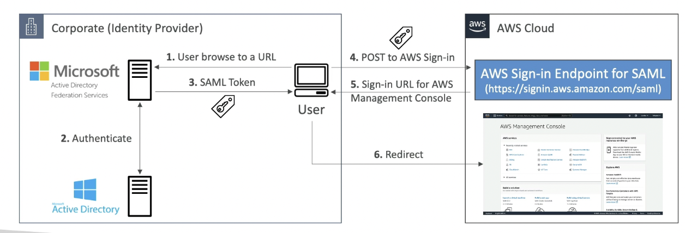
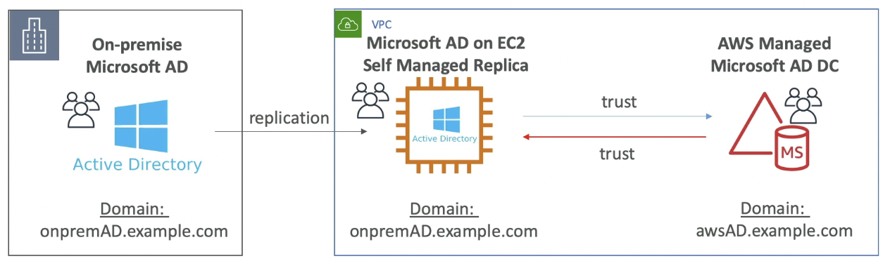
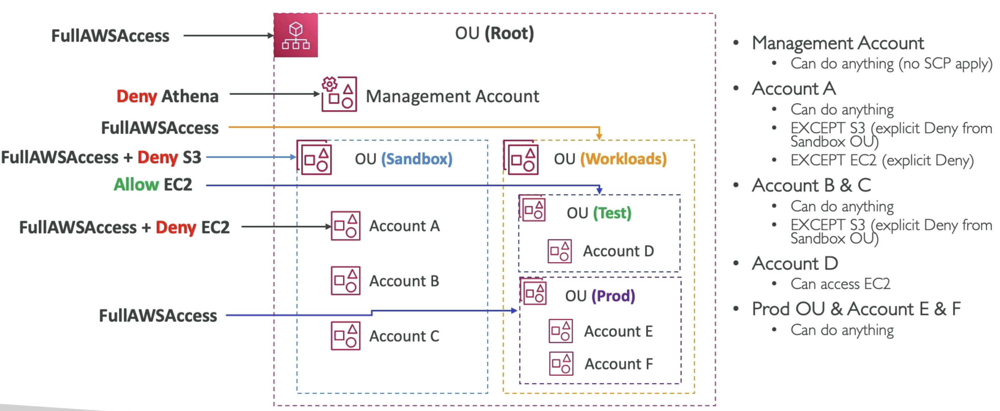
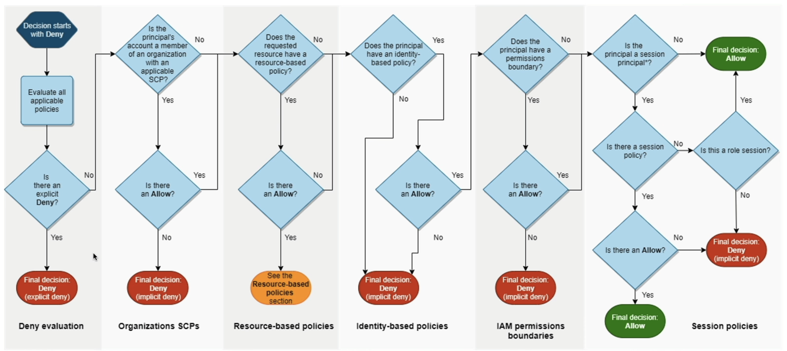
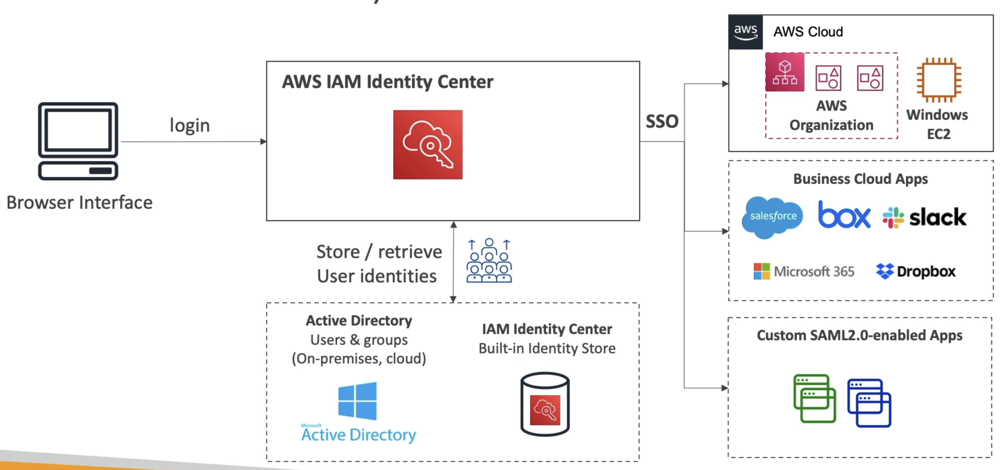

# IAM

**Identity and Access Management (IAM)** allows us to define users and roles over resources via **Effects**, **Actions**, and **Resources**.

---

## Key Concepts

### Identities
- Identities in AWS IAM are Users, Groups of Users, or Roles, and we can attach Policies to Identities or Resources
- IAM Principals are Users or Roles

### User
- A **User** represents an individual person or service that interacts with AWS resources
- Users can have:
    - **Keys** (Access Key ID and Secret Access Key)
    - **Secrets**
    - **Logins** (for the AWS Management Console)
- Permissions are attached to Users via **IAM Policies**

### User Group
- A **User Group** is just an aggregation of Users
- Similar to other policies, denies on User groups would take precedence over Allows to a specific User
- Otherwise User Groups follow the same standards, and a User having their own policies, multiple Group policies, and Org SCP policies would have different outcomes based on the precedence levels

### Role
- A **Role** is a temporary identity that can be assumed by Users, Services, or Applications
- Key characteristics:
    - Credentials are temporary when a Role is assumed
    - When a User assumes a Role, the User gives up their own permissions and adopts the permissions of the Role
    - Resource Based Policy
        - Using these, a User doesn't have to give up their permissions, and they can directly access specific resources    
- Use Cases:
    - Cross-account access, like EC2 spin up from Control Planes of 3rd party providers
    - Service-to-service communication (e.g., an EC2 instance accessing an S3 bucket)

### Resources
- **Resources** are AWS entities that can be identified by ARNs (Amazon Resource Names)
- Examples:
    - S3 buckets
    - EC2 instances
    - DynamoDB tables

### Actions
- **Actions** correspond to API operations that can be performed on resources
- Examples:
    - `s3:ListBucket`
    - `ec2:StartInstances`

### Principals
- Principal Element:
    - The Principal element in the trust policy specifies who can assume the role
    - Examples of principals:
        - IAM Users or Roles: arn:aws:iam::123456789012:user/ExampleUser
        - AWS Services: ec2.amazonaws.com (for EC2 instances)
        - AWS Accounts: arn:aws:iam::123456789012:root (to allow all users in an account)

### Effects
- **Effects** define whether an action is allowed or denied on a resource
- Key rules:
- Explicit Deny takes precedence over Allow
    - `deny s3:*` and `allow s3:ListBucket`, still means `deny s3:*` since it takes precedence
- Allow and notAllow have the same "level."
- Example:
    - If you explicitly deny `s3:*` but allow `s3:ListBucket`, the deny takes precedence, and the action is still denied
- To deny all `s3:*` except for `s3:ListBucket`, you can:
    - List every single Deny except for `ListBucket`
    - Use carefully scoped Allow statements to achieve the same result

### Variables
- IAM supports variables like `aws:Username` to dynamically scope permissions
- Example:
    - You can scope each User to resources with their own username without defining individual IAM policies for each User

---

## Policies
Policies define Permissions, and we attach Policies to Identities (Users or Roles)

- Identity-based policies
    – Attach managed and inline policies to IAM identities (users, groups to which users belong, or roles). Identity-based policies grant permissions to an identity.
    - Identity-based policies are JSON permissions policy documents that control what actions an identity (users, groups of users, and roles) can perform, on which resources, and under what conditions. Identity-based policies can be further categorized:

- Resource-based policies
    – Attach inline policies to resources. The most common examples of resource-based policies are Amazon S3 bucket policies and IAM role trust policies. Resource-based policies grant permissions to the principal that is specified in the policy. Principals can be in the same account as the resource or in other accounts
    - Here is where you can allow specific Identities to perform specific Actions on this specific Resource

- Permissions boundaries
    - Use a managed policy as the permissions boundary for an IAM entity (user or role). That policy defines the maximum permissions that the identity-based policies can grant to an entity, but does not grant permissions. Permissions boundaries do not define the maximum permissions that a resource-based policy can grant to an entity.

- AWS Organizations SCPs
    – Use an AWS Organizations service control policy (SCP) to define the maximum permissions for IAM users and IAM roles within accounts in your organization or organizational unit (OU). SCPs limit permissions that identity-based policies or resource-based policies grant to IAM users or IAM roles within the account. SCPs do not grant permissions.

- AWS Organizations RCPs
    – Use an AWS Organizations resource control policy (RCP) to define the maximum permissions for resources within accounts in your organization or organizational unit (OU). RCPs limit permissions that identity-based and resource-based policies can grant to resources in accounts within your organization. RCPs do not grant permissions.

- Access control lists (ACLs) 
    – Use ACLs to control which principals in other accounts can access the resource to which the ACL is attached. ACLs are similar to resource-based policies, although they are the only policy type that does not use the JSON policy document structure. ACLs are cross-account permissions policies that grant permissions to the specified principal. ACLs cannot grant permissions to entities within the same account.

- Session policies
    - Pass advanced session policies when you use the AWS CLI or AWS API to assume a role or a federated user. Session policies limit the permissions that the role or user's identity-based policies grant to the session. Session policies limit permissions for a created session, but do not grant permissions. For more information, see Session Policies.
    - These allow things like `AssumeRoleWithSAML` so that someone can Assume a Role via cookies / authentication for a short lived time
    - This is tied into [***AWS Federated Users***](#federated-users) which are users who access Resources using credentials from an External Identity Provider (IdP) rather than creating AWS user identities

## Permission Boundaries

- **Permission Boundaries** allow you to set a standard set of permissions that can be applied to a Role or User
- Key rules:
  - Permission Boundaries are **not additive**
  - The effective permissions are the **intersection** of the IAM Policy and the Permission Boundary
- Example:
  - If a Permission Boundary allows `s3:*, kafka:*` and the IAM Policy allows `EC2:*`, the User or Role will only have `s3:*, kafka:*` permissions, not the union of all three

## STS
Security Token Service allows us to retrieve and impersonate IAM roles in other accounts that specify we can act on their behalf

Impersonation / Assuming means we can have `role1:account1` and specify, via STS, that `user2:account2` can assume it's identity, meanning user 2 can act inside of account1 with the same persmissions as role1 - similar to `user2:role1:account1` 

### SSO, Federated Users, and Microsoft AD
***Federated Users / Identity Federation*** provides access to externally authenticated users to your AWS account via this STS exchange

Typically happens with corporations that have their own identity system like Active Directory, or if a Web/Mobile App wants to access resources on AWS but you don't want to create a user for the app user, just authenticate

So where can we assume roles from?
- Straight up `sts:AssumeRole` can be done, and is the most straightforward where we list out users who can do it
- SAML / OIDC
    - `AssumeRoleWithSAML` and `AssumeRoleWithWebIdentity` allow us to use other IdP's to authenticate users before they are allowed to assume roles
        - Amazon Cognito is the AWS IdP that provides OIDC compatibility
    - `GetSessionToken` works to get the actual session token provided to us from there
    - Each of these users would be a Federated User, where they authenticate elsewhere and don't have explicit AWS Users
        - `GetFederationToken` obtains temporary credentials for a federated user, and typically a corporate app has a proxy in network that assigns these OIDC credentials out, and we can allow userrs to authenticate this way
- Security Access Markup Language (SAML) 2.0 is an open standard used by many providers
    - This is a ***historic method***, and isn't used much anymore
    - IdP's would have to be SAML 2.0 compliant for us to use them for authentication, and many are
    - Allows us to not create IAM users for each of the users in our SAML 2.0 provider
    - `sts:AssumeRoleWithSAML`
- Web Identity Federation uses OIDC web providers like Google, Facebook, etc. to authenticate clients to AWS
    - `sts:AssumeRoleWithWebIdentity` will get temporary security credentials to access AWS
    - Cognito on AWS is a preferred service to use in the middle instead of STS
        - In this flow the Web Identity Token (JWT) provided from the web provider gets sent to Cognito, Cognito sends back a Cognito Token, and that token is exchanged with STS to obtain temporary credentials
        - Cognito helps to support:
            - Anonymous users
            - MFA
            - Data Synchronization
    - With WIFedertation we are able to use IAM Policy variables so that the client can only access resources assigned to them
        - In this scenario you use a variable `www.amazon.com:user_id`, and you'd set that on S3 buckets or other resources to restrict user access
- Azure Active Directory (AAD) and Azure Directory (AD) and Azure Directory Federation Service (ADFS) all allow us to use Azure Directories to provide SSO and SAML across our organization
    - It has a domain controller that hosts all of the user / password / permissions objects
    - Allows us to login to a computer using a specific user/pass from anywhere? I think?
    - AWS Components:
        - ***AWS Managed Microsoft AD*** is simply a Microsoft AD in the cloud
            - Supports MFA
            - Trust with local on-prem AD if needed
                - Direct (DX) or VPN Connection
                - Forest Trust Relationships:
                    - AWS trusts On Prem
                    - On prem trusts AWS
                    - Two way trust
                - ***Replication is not supported, a user on-prem is not automatically replicated to AWS***
            - Deploy Microsoft AD in VPC
                - Setup EC2 Windows AD instances
                - Can use these AD instances to integrate with RDS SQL, AWS Workspaces, and to provide SSO capabilities (BYO IdP)
                - Can scale up AD instances with availability and replication
            - Only way to replicate On-Premise Microsoft AD to cloud is to self manage Microsoft AD on an EC2 server, replicate the users over, and then have a Two Way Forest Trust with AWS Managed Microsoft AD
        - ***AD Connector*** is a proxy to amke a link from Cloud AD to on-prem AD
            - Still manage users on-prem, but use AD Connector as a proxy
            - AD Connector is literally just a gateway connector / proxy...all services that need AD API calls go through it and end up on-premise
            - Doesn't support MFA, RDS, SQL, SSO, etc...
        - ***Simple AD***
            - AD Compatible API in AWS
            - Can't be joined with on-prem AD
            - Doesn't support MFA, RDS, SQL, SSO, etc...

ADFS SAML

AD Replication

#### AWS Organization
- Root Organization (OU) has an overall Management Account
    - An OU is a logical grouping of AWS accounts within an AWS Organization
- Member Accounts (Sub-Accounts)
    - OU's act as a tree / hierarchy
    - We could have HR / Finance as 2 OU's, and each one has dev/stg/prod
    - Or we could have dev/stg/prod and each one has 2 sub OU's
- If a Management Account creates a Member Account, then it will automatically have an established IAM role inside of that Member Account
    - This is called `OrganizationAccountAccessRole`, and the Management Account can Assume this Role and get full admin permissions on the Member Account
    - This role ***could be*** assumed by an IAM user if they're authorizedm but they shouldn't be
- Multiple strategies for resources inside of Accounts and how to organize it
- Features
    - ***Consolidated Billing*** We can consolidate billing features into the Management Account
        - Single Payment Method will get pricing benefits because you're aggregating usage across accounts
        - Treat all accounts as the same singular account
        - All accounts in Org can receive the hourly cost benefit of Reserved Instances that are purchased by another account
            - This sort of savings plan can be turned on and off for different Member Accounts by the Management Account
    - ***All Features (Default)***:
        - Consolidated Billing
        - Invited Accounts / Member Accounts must approve enabling all features of Management Account
        - Ability to apply SCP to prevent Member accounts from leaving the Org
    - ***Movement***: We are able to move Member accounts across different Management Accounts by removing and inviting

#### SCPs
- Define AllowList or BlockList IAM actions
- Applied to OU or Account level, but doesn't apply to the Management Account
    - If a Management Account applies an SCP, it affects all OU's and Accounts underneath it though
- Applied to all Users and Roles in account, including Root
- SCP doesn't affect service linked roles
- Explicit Denies ***always take precedence*** over Any Allows
- Really very powerful, we can do things like enforce Tags, enforce regions, etc..

- In the example above what will happen if we `Deny Athena` in the Management Account SCP?
    - Management Account specifically is not affected by SCP's, so it will be ignored
    - No Account will be able to access Athena
    - No Sandbox Account can access S3
    - Account A cannot access Athena, S3, or EC2
    - An Accounts permissions are all of it's Denies (taking precedence) with some Allows

#### AWS IAM Center (AWS SSO)
- AWS IAM Center (FKA AWS SSO) allows us to have one single sign on for all:
    - AWS Accounts and Orgs
    - Business Apps
    - SAML Apps
- We can do this with IdP's:
    - Built in IAM Identity Center IdP
    - 3rd party: AD, OneLogin, Okta, etc...
- Flow:
    - Login via Browser / SDK
    - Route to AWS IAM ID Center
        - Retrieve User Identities from IdP (AD / Okta / IAM ID Center Built In)
        - Check against Permission Sets (what apps / things they can access)
            - Permission Sets are a collection of one or more IAM policies asigned to users and groups which help define AWS access
            - Permission Sets allow us to do Attribute-Based Access Control (ABAC) for the most fine grained permissions based on users attributes
            - All of this helps us to provide SSO access to many SAML 2.0 business apllications after we've defined the URLs, Certificates, and other Metadata to AWS IAM ID Center
    - Send JWT and approval back
    - Route authenticated user, via SSO, to:
        - AWS Cloud
        - Business Cloud Apps (Slack, Teams, etc...)
        - SAML 2.0 Enabled Apps

##### External ID
External ID's allow us to mitigate the [Confused Deputy problem](https://docs.aws.amazon.com/IAM/latest/UserGuide/confused-deputy.html)
- `role1:account1` allows `user2:account2` to assume it's role, and to perform some actions over resources
    - `account2` is usually a 3rd party provider like a consulting company
- `account3`, which is acting nefariously,  tells `account2` it also has a role for it to assume
    - `account3` tells `account2` to use `role1:account1`, and then if `account3` specifies some actions to run, `account2` will accidentally call those options on `account1` and not `account3`
    - In this way `account3` could perform actions in `account1` without ever being explicitly allowed
- The ***External ID*** allows us to uniquely assign an ID to `account2`, and the company that owns `account2` should assign *A unique External ID for all of it's customers*
- STS Session Tags in STS force each of the STS Assume Role calls to have specific tags brought along with it, which is another layer similar to External ID's, but more for internal users

## IAM Access Analyzer
Allows us to check what resources are allowed externally, so we can establish a "ring of trust" and if anything has access to our resources outside of that, it's a ***Finding***

## AWS Control Tower
AWS Control Tower helps to automate and establish multiple accounts under a management OU following best practices and supplying interactive dashboards

Guardrails in AWS control tower provide ongoing Governance solutions
- Preventative methods via SCP's
- Detective methods via AWS Config
- Types:
    - Mandatory
    - Strongly Recommended
    - Elective

### AWS Resource Access Manager
- AWS Resource Access Manager (RAM) allows us to share AWS reosources that you own with other AWS accounts
- Share within any account in your Organization to avoid resource duplication
- ***Allows us to share VPC's over Accounts***
    - No more VPC peering and crap
    - Pretty much all of our Cloud Teams Platforming can be removed, but they did it for physical separation so I don't take all IP's frmo coworker
    - There's probably ways to apply an SCP for that, but that's too many IAM rules
- Prefix List: Predefined list of CIDR's you can share with Secutity Groups, other accounts, etc...
    - Allow us to centrally manage prefixes
- Route53 Outbound Resolver: Allows us to share our forwarding rules of our DNS services, so we can share this with other accounts so that if we update a DNS list in one account it moves to all other accounts

# Example - Azure AD Integration with AWS
Say there's an Azure AD hosted in Azure Cloud, and we wanted to reuse the user pool in AWS for multiple reasons, how can we go about this?

If your company uses **Azure Active Directory (Azure AD)** in Azure Cloud and you want to reuse it in AWS, you can do following to integrate Azure AD with AWS for **identity federation**, **single sign-on (SSO)**, and **access management**.

---

## 1. Use Azure AD for Identity Federation with AWS IAM

***IAM Identity Center (AWS SSO)*** or ***AWS IAM*** basically allows us to create Federatd Users for AWS. This is what allows us to login to corporate SSO and then access AWS as a `LOBUser/myname`

Once you login you automatically assume a role, and that role can be governed by IAM and SCP policies

- **What It Does**:
  - Azure AD acts as an **identity provider (IdP)** for AWS, allowing users to authenticate with Azure AD and assume roles in AWS.
- **How It Works**:
  - Configure **AWS IAM Identity Center (formerly AWS SSO)** or AWS IAM to trust Azure AD as an external IdP.
  - Users log in to Azure AD, and Azure AD issues a SAML assertion or OpenID Connect (OIDC) token to AWS.
  - AWS uses the token to grant access to specific AWS resources based on IAM roles.
- **Steps**:
  1. Set up a **SAML 2.0 application** in Azure AD for AWS.
  2. Configure AWS IAM Identity Center or IAM to trust Azure AD as a SAML IdP.
  3. Map Azure AD groups to AWS IAM roles for role-based access control.
- **Use Case**:
  - Centralized identity management for users across Azure and AWS.
  - Single sign-on (SSO) for AWS Management Console and CLI.

---

## 2. Use Azure AD with AWS IAM Identity Center (AWS SSO)

This is similar to the above use case, except it allows us to go into multiple accounts 

Would need to use permission sets and group to account mappings

- **What It Does**:
  - AWS IAM Identity Center integrates with Azure AD to provide SSO for AWS accounts and applications.
- **How It Works**:
  - Azure AD is configured as an external IdP for AWS IAM Identity Center.
  - Users authenticate with Azure AD and are granted access to AWS accounts and roles via AWS IAM Identity Center.
- **Steps**:
  1. Enable AWS IAM Identity Center in your AWS account.
  2. Configure Azure AD as an external IdP in AWS IAM Identity Center.
  3. Map Azure AD groups to AWS IAM Identity Center permission sets.
- **Use Case**:
  - Simplified SSO for multiple AWS accounts.
  - Centralized user and group management in Azure AD.

---

## 3. Use Azure AD with AWS Cognito for Application Authentication

This AWS Cognito setup would allow us to host applications in AWS, and have them call Azure AD for IdP authentication

Essentially the tight coupling of AWS Services with AWS Cognito handled the app level code, and then Cognito will call Azure AD for authentication, and handle all of the back and forth

Once complete Cognito will issue a token back to the client 

- **What It Does**:
  - Azure AD acts as an IdP for **Amazon Cognito**, allowing users to authenticate with Azure AD for your applications hosted in AWS.
- **How It Works**:
  - Configure Azure AD as an OIDC or SAML IdP in Amazon Cognito.
  - Users authenticate with Azure AD, and Cognito issues tokens (ID, access, refresh) for use in your application.
- **Steps**:
  1. Create a user pool in Amazon Cognito.
  2. Configure Azure AD as an external IdP in the Cognito user pool.
  3. Update your application to use Cognito for authentication.
- **Use Case**:
  - Applications hosted in AWS that need to authenticate users from Azure AD.
  - Centralized authentication for multi-cloud applications.

---

## 4. Use Azure AD with AWS Directory Service
We mention these specifics above, but this would allow us to extend our directory service into AWS

There are many factors here around replication, syncing, and hosting that come into play

Once completed users in our Azure AD (not replicated onto our AWS managed / hosted Azure AD) can authenticate to AWS resources

This is the situation where you setup forest trust or other trust mechanisms between AWS Azure AD and Azure AD on Azure Cloud

- **What It Does**:
  - Integrate Azure AD with **AWS Managed Microsoft AD** or **Simple AD** to extend your directory services to AWS.
- **How It Works**:
  - Set up a **trust relationship** between Azure AD and AWS Managed Microsoft AD.
  - Users in Azure AD can authenticate to AWS resources that rely on Active Directory (e.g., Windows-based EC2 instances, RDS SQL Server).
- **Steps**:
  1. Deploy AWS Managed Microsoft AD in your AWS environment.
  2. Establish a **forest trust** between Azure AD DS (Azure AD Domain Services) and AWS Managed Microsoft AD.
  3. Configure AWS resources to use AWS Managed Microsoft AD for authentication.
- **Use Case**:
  - Hybrid cloud environments where Active Directory is required for authentication.
  - Seamless integration of Windows-based workloads across Azure and AWS.

---

## 5. Use Azure AD for API Gateway Authentication
This is just using Azure AD as the OIDC provider for API GW

- **What It Does**:
  - Azure AD acts as an OIDC IdP for **Amazon API Gateway**, enabling secure access to APIs hosted in AWS.
- **How It Works**:
  - Configure Azure AD as an OIDC IdP in API Gateway.
  - Users authenticate with Azure AD, and API Gateway validates the OIDC token before granting access.
- **Steps**:
  1. Register your API in Azure AD as an application.
  2. Configure API Gateway to use Azure AD as an OIDC IdP.
  3. Update your API clients to authenticate with Azure AD.
- **Use Case**:
  - Secure API access for users authenticated via Azure AD.

---

## 6. Use Azure AD for Cross-Cloud SSO
- **What It Does**:
  - Azure AD provides a unified SSO experience for applications and resources across Azure and AWS.
- **How It Works**:
  - Configure Azure AD as the central IdP for both Azure and AWS.
  - Users authenticate once with Azure AD and gain access to resources in both clouds.
- **Steps**:
  1. Set up Azure AD as an IdP for AWS (via SAML or OIDC).
  2. Configure Azure AD Conditional Access policies for cross-cloud access.
- **Use Case**:
  - Unified identity management for multi-cloud environments.

---

## Comparison of Options

| **Option**                          | **Use Case**                                                                 | **Integration Type**       |
|-------------------------------------|-----------------------------------------------------------------------------|----------------------------|
| Identity Federation with IAM        | Centralized identity management and SSO for AWS resources.                  | SAML or OIDC               |
| AWS IAM Identity Center (AWS SSO)   | Simplified SSO for multiple AWS accounts.                                   | SAML                       |
| Cognito for Application Auth        | Authenticate Azure AD users for AWS-hosted applications.                    | OIDC or SAML               |
| AWS Directory Service               | Extend Azure AD to AWS for Windows-based workloads.                         | Active Directory Trust     |
| API Gateway Authentication          | Secure API access for Azure AD users.                                       | OIDC                       |
| Cross-Cloud SSO                     | Unified SSO experience across Azure and AWS.                                | SAML or OIDC               |

---

## Best Option for Your Use Case
- **For SSO Across AWS Accounts**: Use **AWS IAM Identity Center** with Azure AD as the IdP.
- **For Application Authentication**: Use **Amazon Cognito** with Azure AD as the IdP.
- **For Windows Workloads**: Use **AWS Managed Microsoft AD** with a trust relationship to Azure AD.
- **For APIs**: Use **API Gateway** with Azure AD as an OIDC IdP.

