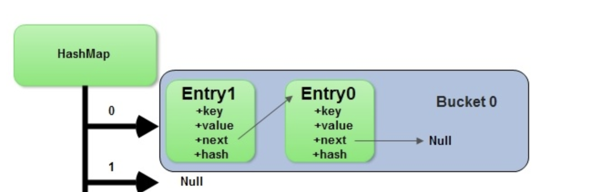

# Table of Contents
- [Hashing](#hashing)

# Hashing
A ***Hash Function $H(x)$*** of something is a function that turns an object from a search space $S$ into an integer within a fixed range $[0, X]$.

## Demonstration / Thoughts
- Hashing most often comes in a ***map*** object, which allows you to interact with keys and values
- Hashing will take an input and deterministically convert it to an integer that's less than a specified size
    - Inputs are ***keys***, and they must be immutable (that's why we can't hash a list in Python)
    - How can all of this be $O(1)$?
        - We will essentially store everything underneath in a contiguous array, where the data type of an entry in the array is the same data type as a key
            - To find the random access point (key location), we just use whatever the hash outputs
            - So if we have an array, $a$, of size $n$, and we have $n$ keys, and a has functions $H(x)$ that perfectly assigns 1:1 a key to a bucket without collisions, then we can insert a `(key1, value1)` pair `a[H(key1)] = value1`
            - To check if a key exists you just check `a[H(key1)] != null`
        - Arrays store homogeneous keys
        - These keys have values which are actually pointers to memory location of "real" value
            - Most values are homogeneous, but in Python, for example, they could be different sizes
        - Since keys are homogeneous, and our hash represents a unique integer, we could just do $keysize \times hash = offset$
            - Meaning if our hash returns 4, and our data size is 8 bytes, then our offset would be $8 \times 4 = 32$ and that 32 would be the memory offset
        - $startingLocation + (keyDataTypeSize \times hashIndex)$ allows us to directly find the offset location of the data in constant time, regardless of how large the array is
    - ***This is basically saying, since array's random access time is $O(1)$ our hashing lookup is $O(1)$***
        - Since our hash is basically just acting as the random access point to our array
- The space complexity becomes an issue, because if our hash space is 0-255 then we need to allocate $256 \times keyDataTypeSize$ total memory to our map object

| Operation        | Average Complexity | Worst Case Complexity
|------------------|--------------------|----------------------|
| Put              | $O(1)$             | $O(n)$               |
| Get              | $O(1)$             | $O(n)$               |
| Delete           | $O(1)$             | $O(n)$               |
| Traverse (Search for Value)| $O(n)$   | $O(n)$               |

- ***Buckets***
    - The above is mostly true, but it's mostly illustrative, because most of the time a Hash Function $H(x)$ will not correspond 1:1 with array size $n$, and most of the time we wouldn't want our underlying data structure to be of size $n$...it's usually a lot of wasted space
    - Therefore, most implementations will have an input Domain $D\in\ [0, n]$ (i.e. our keys can be 0-n), but our corresponding map data structure will be undermined by an array of size $m: m <= n$
        - Most of the time $m < n$
        - This means at least 2 of our keys will be in the same bucket, let's say a and d map to the bucket 2
            - When this happens, if we looked up `map.get(a)` or `map.get(d)`, it would go to the bucket 2, and have to traverse it using `bucket[2][0] == 'd'`, and if not then `bucket[2][1] == 'd'`...
            - It's typically implemented as a linked list, where we traverse `if curr == key: return else curr = curr.next`
                - This means, in the absolute worst case when we have 1 single bucket, then our Put, Get, Delete's all degrade to $O(n)$

