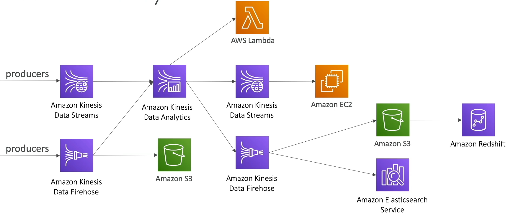
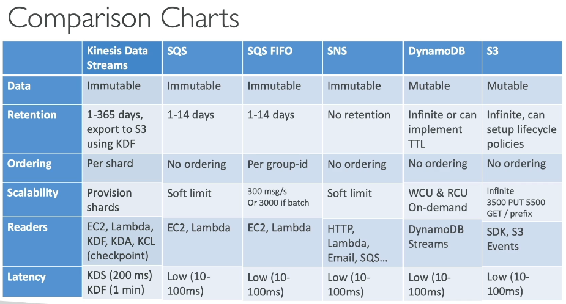
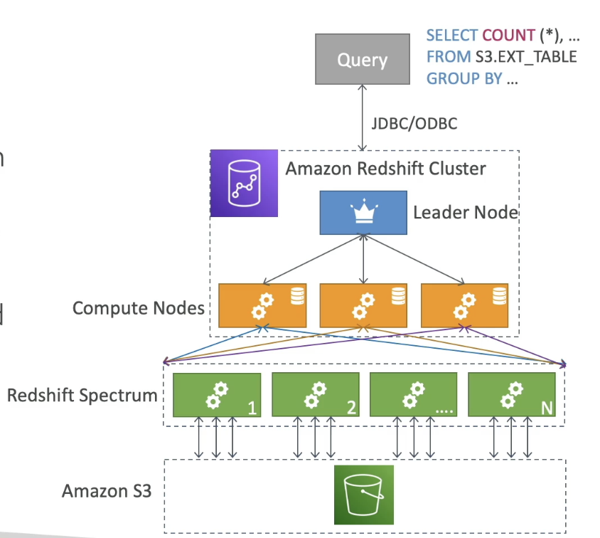
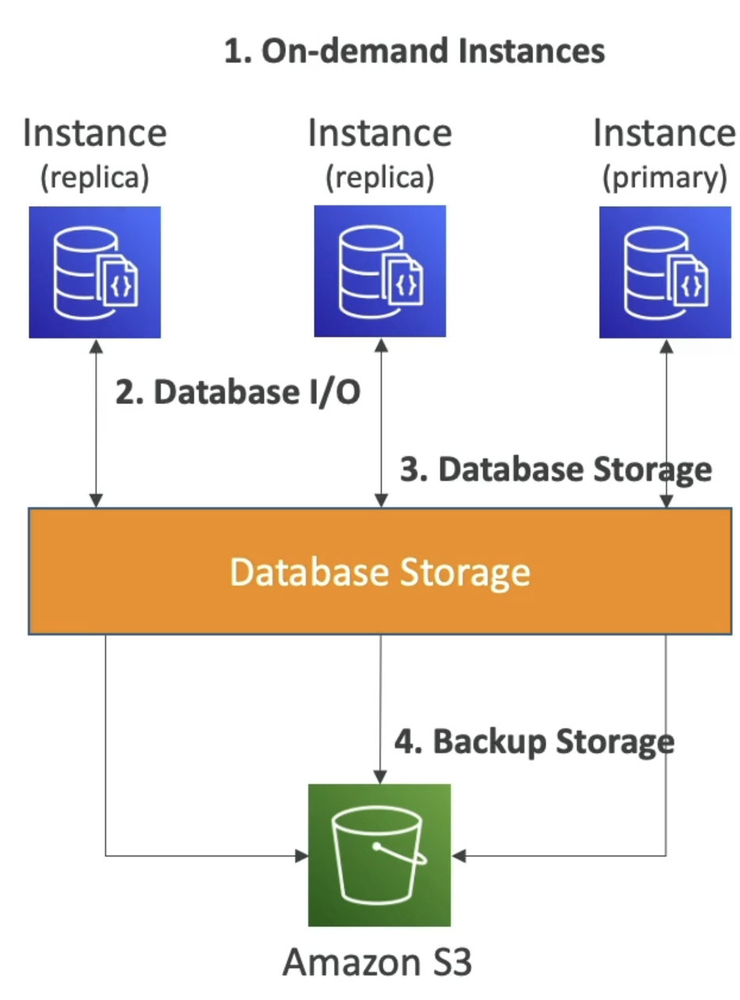

# Data Engineering

# Kinesis
- Kinesis is a bunch of streaming services broken out into multiple different AWS services
- Open source streaming services are horizontals, AWS for some reason breaks them out into verticals / horizontals depending
- Kinesis Data Streams:
    - ***IS NOT*** a processing engine, you do not write Flink style code on it
    - ***IS*** similar to Kafka where data is streamed in and durably held for consumers to pull on topics based on offsets
- Kinesis Data Analytics is closer to Flink, and is proper stream processing
    - “I want to run complex logic on my streaming data”
- Kinesis Data Firehose is a Delivery / ETL pipeline for *basic transformations and sinks*
    - “Pipe this data into S3/Redshift with minor tweaks”
- Managed Service for Apache Flink
    - Most similar to Kinesis Data Analytics, and I think was rebranded into it, and is where you write tumbling window operations over data
- Managed Service for Apache Kafka (MSK) is most similar to Kinesis Data Streams as managed brokers for streaming messages over topics

# Kinesis Data Streams
- Most similar to Kafka, and acts as a storage / broker for messages and data that are being streamed
- Collect and store streaming data in real time
- Send any real-time data into data streams
    - ***Producers***: Send data into Kinesis data streams
        - Applications
        - Kinesis Agents on servers
        - Kinesis Agents on logs
        - etc
    - ***Consumers***: Consumers read data from Kinesis Data Streams and process it in real time
        - Applications
        - Lambda
        - Data Firehose
        - Managed Apache Flink
- Features:
    - Retention up to 365 days
    - Ability to reprocess data by consumers
    - Data can't be deleted (until it expires)
    - Data up to 1MB
        - Use case is best for "small" real time data
    - Data ordering guaranteed for data within the same `partition_id`
    - At rest KMS encryption, in-flight HTTPS encryption
    - Kinesis Producer Library (KPL) SDK to write optimized producer applications
    - Kinesis Client Library (KCL) SDK to write optimized consumer applications
- Capacity Modes:
    - Provisioned Mode:
        - Choose number of shards
            - ***Shard*** is basically the number of partitions / how "big" your stream is
            - More shards === more throughput
        - Each shard input is 1 MB/second or 1k records/second throughput capacity
        - Each shard output is 2MB/second output
        - Scale manually to increase of decrease number of shards for higher or lower throughput
            - Requires us to monitor throughput
        - Pay per shard per hour
    - On-demand mode
        - No need to provision or manage capacity
        - Default capacity provisioned is 4 MB/second or 4k records/second
            - i.e. 4 shards default
        - Scales automatically based on observed throughput peak during last 30 days
        - Pay per stream per hour & data in/out per GB
            - So same payment as provisioned, but you also pay for GB in/out and you get fully managed autoscaling 
- Shard vs Partition
    - They serve the same core purpose, but aren't exactly 1:1
    - They both:
        - Provide parallelism
        - Preserve message ordering
        - Distribute writes based on `partition_key`
        - Control read/write throughput
    - Differences:
        - Consumer Scaling
            - Shards have 1 consumer per shard at a time
                - Means fan-out isn't really an option here?
            - Kafka partitions have multiple consumers in a group, each consume from difeferent partitions
    - The largest difference is consumers and fan-out pattern
        - Kinesis Data Streams just expects 1 consumer in a shard, where Kafka allows multiple and uses offsets
            - You can have ***enhanced fan-out*** on Kinesis Data Streams for parallel reads from multiple consumers, but it's not default
        - In Kafka multiple consumer groups can independently consume the same topic
            - Database CDC
            - Logs
            - Data Warehouse reader
            - Can all read from the same Kafka topic on different offsets and use the produced data independently
        - Within a Kafka Consumer Group, each Partition is consumed by one Consumer Instance at any given time
        - In Kinesis Data Streams one consumer can read from a Shard, so a Shard is most similar to a Parititon, but we don't group shards
            - Eh
        - If multiple consumers try to read frmo same Kinesis Data Streams shard, they compete and both are apart of same throughput calculation
            - Meaning they basically act as one consumer

# Kinesis Data Firehose
- Basically a connector and mover 
- Stores data in target destinations
- Kinesis Data Firehose can get data by pulling, or by being sent data, from:
    - Kinesis Data Streams (Firehose pulls from DStreams)
    - Appliactions (Pushes to Firehose)
    - Clients (Pushes to Firehose)
    - SDK (Pushes to Firehose)
    - Kinesis Agent (Pushes to Firehose)
    - CloudWatch
    - IoT
- Most common is Firehose reading from Kinesis Data Streams
- Records are up to 1 MB at a time
- Data Transformations
    - All transformations need to be done by Lambda functions, Firehose doesn't natively support Transformations, just EL (Extract and Load)
- Writes
    - Buffers a number of Records and then writes out to another Destination in batch
        - Therefore Firehose is a near real-time service
    - Destinations:
        - AWS Destinations:
            - S3
            - Redshift
                - Goes to S3 and then `COPY INTO` Redshift
            - OpenSearch
            - Kinesis Data Analytics for further transformations
        - 3rd party partners:
            - Splunk
            - Datadog
            - New Relic
            - MongoDB
            - Others
        - Custom:
            - HTTP Endpoint with an API that accepts written buffered batched
- Logging:
    - Can write all or failed data into S3 from Firehose
    - Can write all source records to S3 before going through Lambda transformations or any destinations
        - You never lose data with Firehose, you can get all source / failures / transformation errors into S3 logged bucket
- Fully managed service
- Near Real Time (buffer based on time and size, but optionally can be disabled)
    - Buffer Sizing
    - Accumulates records into a buffer, but it's not flushed all the time
    - Flushed based on time and size rules
        - 32MB, or 2 minutes, for example
        - Once it reaches, buffer is flushed
        - Firehose can increase buffer size to increase throughput
        - High Throughput == Buffer Size hit, Low Throughput == Buffer Time hit
- Load data to Redshift, S3, or OpenSearch
- Automatic scaling
- Supports many data formats
    - Data conversions from JSON to Parquet / ORC (only for S3)
    - Data transformations via Lambda
        - CSV => JSON
        - New columns
        - Transforms
        - Window functions
        - Several blueprints available in Lambda
        - etc...
    - Supports compression when target is S3 (GZIP, ZIP, SNAPPY)
        - Only GZIP is able to be further loaded into Redshift
- Pay for amount of data going through Firehose
- ***SPARK STREAMING / KCL DO NOT READ FROM FIREHOSE, THEY READ FROM DATA STREAMS***
    - Streams you write custom code for producer and consumer
        - Real time (~200 ms latency for classic and ~70ms latency for enhanced fan-out)
        - Must manage scaling yourself
        - Data storage 1-365 days, replay capability, ?multiple consumers?
    - Firehose managed, send to S3, Splunk, Redshift, and OpenSearch
        - Near real time
        - Automated scaling
        - No data storage on the service itself
        - Serverless transforms with Lambda

# Amazon Managed Service for Apache Flink
- FKA Kinesis Data Analytics for Apache Flink
- Flink (Java, Scala, SQL) is a framework for processing data streams
- Input:
    - Kinesis Data Streams or MSK (Apache Kafka)
    - CANNOT READ FROM FIREHOSE!!!
- Transformations:
    - AWS provisions computes, parallel computation clusters, and automatic scaling
    - You need to provide the compiled Flink Application as a JAR to run
        - Long running emphemeral job
    - Basically a managed Flink cluster
    - AWS implements automatic Flink Application backups
        - Implemented as checkpoints and snapshots
    - Use any Flink programming features to transform the data

# Streaming Architectures
- Producers are going to write to Kinesis Data Streams
    - KPL
    - Agent
    - etc..
- Real time transformations
    - Kinesis Data Analytics
    - Destinations of KDA
        - Lambda
        - Firehose (near real time to migrate to sinks)
            - S3
            - Redshift 
                - Again, goes into S3 and then `COPY INTO`
            - ElasticSearch or OpenSearch for querying and doing search over this data in real time
        - Back into Kinesis Data Streams for further real time processing
            - Can be consumed by EC2, ECS, or lambda, or whatever else
- OR Producers can write directly into Firehose for buffered batching
    - Firehose can then move it into Redshift or S3
    - Back into Kinesis Data Analytics for more advanced transformations
- 

- Example:
    - 3000 messages of 1KB per second
    - Option 1:
        - Kinesis Data Streams into AWS Lambda
        - Dicsussion Points:
            - Need at least 3 shards based on 1K messages / second throughput of KDS
            - If each message is 1KB, then we'd be limited to ~1,000 messages per shard so it works out the same
            - If we manage the scaling ourselves we can save some money
            - If we do fully managed we pay for the GB / second
            - `3 shards --> 3 * $0.015 / hr = $32.40 / month`
            - Must use KDF for output to S3 for long term storage
                - Some costs here, but also negligible
    - Option 2:
        - `INSERT INTO` DynamoDB Table
        - Use DyanmoDB Streams (CDC) into AWS Lambda
        - Dicsussion Points:
            - We would be paying for the data in and out of Dynamo
            - DynamoDB Streams would fill up and take over some transaction log? I think? If Lambda can't pull it
            - Dynamo is long term retention as a database, but it doesn't store historic data or slowly changing dimensions
            - Throughput would have 3,000 Write Compute Units (WCU) = 3MB / second
                - Comes out to ~$1,450/month
                - Long term storage, but streaming it out is extremely expensive

## Streaming Resource Comparison Chart

# Amazon MSK
- Amazon Managed Streaming for Kafka
- Kafka is an alternative to Kinesis
- MSK is a fully managed cluster(s) and scaling
    - Creates and manages broker nodes & zookeeper nodes for you
    - Deploys MSK cluster in VPC across multiple AZ's (up to 3 for HA)
    - Automatic recovery from common Kafka failures
    - Data is stores on EBS volumes for ***as long as you want***
- MSK Serverless
    - No provisioned servers or capacity
    - Automatically provisions and scales for you
- MSK Consumers
    - Kinesis Data Analytics / Amazon Managed Service for Apache Flink
    - AWS Glue (Powered by Spark Streaming)
    - Lambda
    - Write your own on EC2 or ECS Cluster or EKS cluster
- [What is Kafka?](../../architecture_components/messaging/Kafka%20Broker/KAFKA.md)
    - Kafka has Producers as well, and these Producers write to a Topic
    - A Topic is 
        - Split up into multiple Partitions
        - Replicated across Broker Nodes
        - Stored on Disk
    - Consumers pull from Topic Partitions
    - Consumers read and transform, and write back into Kafka, or to other downstream destinations

## Kafka vs Data Streams
- Size:
    - Kafka 1MB limit
    - KDS 1MB default, but can grow
- Parallelism:
    - Kafka has Topics with Partitions
        - Multiple consumers on a Topic by default
    - KDS has Shards
        - One consumer per Shard default
        - Can have fan-out for multiple Consumers
- Scaling Parallelism:
    - Kafka can only add Partitions to a Topic
    - KDS does Shard splitting and merging
- Security:
    - MSK PLAINTEXT or TLS in-flight encryption
    - KDS in-flight encryption
    - At rest encryption for both

# AWS Batch
- Run batch jobs as Docker images
- Two deployment options:
    - Fargate is completely serverless
    - Dyanmic provisioning of instances (EC2 + Spot) in VPC
- Regardless of deployment options, AWS managed cluster for you:
    - Optimal quantity and type based on volume and requirements
    - You pay for underlying resources used, but nothing else
    - No need to manage cluster, it's fully serverless
- Can schedule with EventBridge, and orchestrate with Step Functions
- Invocation:
    - Whenever Batch job is started up it pulls a Docker image from ECR

## AWS Batch Example Architecture
- AWS Batch cluster
- Runs Amazon ECS Cluster
    - ECS has EC2, Spot, and Fargate as potential deployments
- User uploads to S3
- Event notification calls Lambda
- Lambda starts batch job to create thumbnail
- OR S3 goes to EventBridge, and EventBridge invokes Batch
- After invocation pulls Docker image, and then runs it

## Batch vs Lambda
- Lambda:
    - Time limit
    - Limited runtimes / languages
    - Limited, temporary disk space
    - Serverless
- Batch
    - No time limit
    - Any runtime that's able to be in Docker image
    - EBS backed disk space, or the EC2 instance if it runs on one

## Compute Environments
- Unmanaged:
    - You control and manage instance configuration, provisioning, and scaling
    - Pay for instances on your own
- Managed:
    - AWS Batch manages the capacity and instance types within the environment
    - You can choose On-Demand or Spot instances
        - `m5.large`, `c5.xlarge`, or `r5.2xlarge`
        - You set min and max vCPU
    - Can set max price for Spot
    - Launched within own VPC
        - If you launch in your own privat subnet you need to make sure there's access to ECS Service 
        - Can do this via NAT GW or VPC Endpoint for ECS
    - SDK add jobs to AWS Batch Job queue, and then AWS Batch distributes jobs on the cluser itself
    - Automatically scales computes to react to more or less jobs
    - Multi-Node Mode:
        - Large scale good for GPC
        - Leverage multiple EC2 / ECS at same time
        - Good for tightly coupled workloads
        - Represents a single job, and uses multiple nodes for 1 job
        - Doesn't work with spot instances
        - Works better for EC2 launched as "cluster" group
            - Enhanced networking + throughput

# Amazon EMR
- Elastic Map Reduce
- Managed Hadoop clusters for big data jobs
    - Can be made of hundreds to thousdands of EC2 instances
- Use EMR for hadoop on-prem migration to cloud
- Also supports Spark, HBase, Presto, Flink, etc...
- Autoscaling with CloudWatch
- Use cases:
    - Big data processing
    - ML
    - Web indexing
    - etc..

## Integrations
- Launched within single VPC single AZ
    - Better networking and lower cost
- Each EC2 will have an EBS volume that runs HDFS
    - Temporary and short term, not long lived / multi-AZ
- Long term retention of data needs ***EMRFS***
    - Uses S3 as backbone for EBS volumes
- Apache Hive on EMR can directly talk to DynamoDB table

## Node Types & Purchasing
- EMR made of EC2's
- Different type of nodes though
    - Leader and Workers
    - Leader Node: Manages cluster, coordinate jobs, health checks, etc
    - Core Node: RUn tasks and store data, long running
    - Task Node: Just to run tasks, optional, usually spot-instances
- Purchasing options:
    - On-demand: reliable and predictable, won't be terminated
    - Reserved: min 1 year, huge cost savings 
    - Spot instances: cheaper but can be terminated
- Can have long running or transient (temporary) clusters
- Instance configuration:
    - Uniform:
        - Select a single instance type and purchasing option for each node
        - Master is `m5.large` of Reserved node, Core nodes are On-Demand `i3.medium`, and task nodes are spot `i3.large`
        - Has autoscaling
    - Instance fleet:
        - Select target capacity, mix instance type, and purchasing options
        - Lets you set a generic target, and EMR will pick and choose among possible capacity in the fleet
        - Does not have autoscaling, you set max

# AWS Glue
- Essentially managed ETL
- ***Extract***: Connects to S3 or RDS
    - Sources:
        - S3
        - RDS
        - Redshift
        - DynamoDB
        - Any database with JDBC URL / compatibility
- ***Transform***: Write ?map reduce? based transforms on the data
- ***Load***: Into a destination, such as Redshift DWH
- Glue Data Catalog:
    - Catalog of datasets
    - Crawler that goes into all data sources, and write metadata back into AWS Metadata Catalog on Glue
    - Other services depend on this catalog
        - Athena for data discovery
        - Redshift for tables and lineage
        - EMR

# Amazon Redshift
- Based on Postgres SQL
- ***NOT AN OLTP, IT IS OLAP!!!***
    - Use DynamoDB for OLTP
- Used for analytics and data warehousing
- Columnar data storage, not row based
    - Best choice for `agg(col1)`
- Uses ***Massively Parallel Query Execution (MPP)*** Engine
- Two deployment modes:
    - Provisioned
        - On demand servers you deploy beforehand
    - Serverless
- SQL Query interface
- Integration Tools:
    - BI: Quicksight, Tableau
- Data Loading
    - `COPY INTO` from S3
    - Data Firehose to load in near real time
    - DMS Service for CDC or generic batch migration into Redshift
- Can have Multi-AZ for some specific cluster types
- Nodes
    - Up to 100+ nodes, up to 16TB space per node
    - Leader node
        - Manage and collect from nodes to display results to user
    - Compute node
        - Complete queries and send results back to leader
- Security is typical VPC, IAM, and security groups
    - Has KMS for at rest
- Enhanced VPC routing for `COPY INTO` and `UNLOAD` commands that go over VPC backbone, and not internet
- Redshift is provisioned, so only worth it for sustained usage of cluster
    - If sporadic, Athena is a better solution

## Snapshots and Disaster Recovery
- Snapshots
    - PIT backups of a cluster, stored in S3
    - Incremental (only what's changed will be saved)
    - Can restore a snapshot into a new cluster
    - Automated:
        - Every 8 hours, or every 5 GB of data changed
        - Set retention or a different schedule
            - Retention could be short lived
    - Manual:
        - Snapshot retained until you delete it
- Disaster Recovery
    - Can have Redshift automatically copy snapshots across regions (manual or automatic)
- Cross Region snapshot copy for a KMS encrypted Redshift
    - Snapshot is encrypted at rest in S3
    - Need to do a `snapshot copy grant` from source region to failover region, and copy key over from Region A to Region B
    - Then we can copy snapshot physically over into new region, and use the copied over encryption key in Region B to access the data

## Redshift Spectrum
- Query data that's already in S3 without loading it
- Must have a Redshift cluster available to start the query
- Query is then submitted to thousands of Redshift Spectrum Nodes
    - These spectrum nodes are separate from our compute nodes
    - They are managed and used by the compute nodes though
    - Spectrum nodes load and interact with S3 data
- Data is then collected and sent back to Leader node
- 

## Redshift Workload Management (WLM)
- Emables you to flexibly manage query priorities within workloads
- Prevents short lived queries from being blocked by long-running query
- Define multiple query queue's (superuser, user defined, app db queue)
- Routes queries to appropriate queue's at runtime
- *Automatic* and *Manual* WLM where either Redshift or Cluster admin can define WLM queue's

## Concurrency Scaling
- Enables you to provide consistently fast performance with virtually unlimited concurrent users
- Requires additional cluster capacity (Concurrency Scaling Cluster) to process an increase in requests
- Can decide which queries are sent to Concurrency Scaling Cluster via the WLM queue's
    - These queries are charged per second, so they get expensive quickly

# DocumentDB
- Aurora is "AWS Implementation" of PostgresSQL
- DocumentDB is same "AWS Implementation" for MongoDB
- Fully managaed, HA, cross-AZ
- Storage layer grows incrementally in 10GB increments
- Automatically scales to workloads wiht millions of requests per second
- Pay as you go, no upfront costs
- :
    - On-Demand primary and replica instances
        - You pay per second with min of 10 minutes
    - Database storage on block
        - Pay for Database I/O
        - Database storage costs per GB / month
    - Backup storage per GB / month

# Amazon Timestream
- AWS Implementation of a time-series database
- Fully managed, scalable based on capacity
    - Trillions of events per day
    - Much faster and cheaper compared to app relational DB
    - Full SQL capability
- Serverless!
- Storage tiering so recent data kept in memory and historic data kept in cost-optimized storage
- Built in time-series analytical functions to help you identify patterns in data in real time
- Encrption at rest and in transit
- Use case:
    - IOT
    - Time series analytics
    - Event streaming
- Sources:
    - IoT
    - Kinesis Data Streams + Lambda
    - Prometheus + telegraf
    - Kinesis Data Streams / MSK + Data Analytics for Apache Flink
- Desintations:
    - Quicksight
    - Sagemaker
    - Grafana
    - Any JDBC connection

# Athena
- Serverless query service to query S3 buckets
    - Supports CSV, JSON, ORC, Avro, and Parquet
- Use standard SQL language
- Athena built on Presto
- Pay $5 / TB of data scanned
- Commonly used with Quicksight for reporting / dashboards
- Use cases
    - ***AD HOC QUERIES*** - use Redshift for continuous usage
    - Reporting
    - CloudTrail trails
    - VPC Logs
    - AD HOC!!!!

## Performance Improvement
- Use columnar data for cost savings
    - This is because you only scan the columns you need, not all of the data
    - Parquet and ORC
    - Huge performance improvements
    - Use GLUE to convert data to Parquet or ORC
- Compress data for smaller retrievals
    - Gzip, snappy, etc
- Partition datasets in S3 for querying on virtual columns
    - Can also partition based on column values like in Spark
    - `s3://athena-example/flight/parquet/year=1991/month=1/day=1`
    - This reduces data read to `1/365 * 12` scanned data
- Use larger files to minimize overhead
    - Still need to open and read headers
- Basically the 5 S's of Spark!!

## Federated Query
- Allows you to run SQL queries across data stored in relational, non-relational, on-prem, and custom data sources
- Uses data source connectors that run on AWS lambda to run federated queries
    - Can run on ElastiCache, DocumentDB, Dynamo, On-Prem SQL Server, etc...
    - Can then join and collect data back to UI
    - Can store the results into S3 for later analysis

# Amazon Quicksight
- Serverless machine learning powered BI intelligence service to create interactive dashboards
- Allows you to connect to multiple data sources
    - Integrates with RDS, Aurora, Athena, Redshift, S3, etc..
    - Basically anything above it can integrate with
    - Also integrates with 3rd party SaaS and 3rd party DB's that have JDBC connectors
- ***Embed into websites with per-session pricing***
- SPICE Engine
    - In memory computation engine that only works if you import data into Quicksight
    - Bringing any of these AWS or 3rd party services into SPICE engine will speed up analytical queries and result sets being displayed
- Enterprise edition to setup Column Level Security (CLS) to remove displaying columns to users based on auth
- Define Users and Groups (Enterprise version only)
    - Users and groups are separated frmo IAM, exist only in Quicksight
- Dashboard:
    - Read only snapshot of an analysis you can share
    - Preserves configuration of an analysis (filters, params, controls, sort, etc)
- Analysis is a long running query 

# Questions:
- Q: You are looking for the most cost-efficient way to process CSV files in Amazon S3 using AWS Batch. The jobs can easily be retried, and the job inflows are very unpredictable. How should you set it up? 
    - At first I thought you could do S3 Events into Batch queue w/ a managed Batch spot instance fleet, but S3 Events can only go to SQS, SNS, or Lambda...Therefore
    - A: S3 Events invoke AWS Lambda which places file metadata onto Batch queue, and Batch environment uses spot instance fleet
- Q: You would like to perform a Hive SQL job onto your DynamoDB table. What do you recommend?
    - At first I thought Athena would suffice as "SQL", but was marked as wrong because "Athena can't run Hive"
    - A: Use EMR
        - EMR is managed Spark, Hadoop, and Hive...so...
- Q: A company is using Amazon Kinesis Data Streams to ingest clickstream data and then do some analytical processes on it. There is a campaign in the next few days and the traffic is expected to grow 100x in less than 5 minutes. What Kinesis Data Stream capacity mode do you recommend and allows you to minimize costs?
    - Provisioned mode isn't correct. It's best for predictable consistent workloads, but fails to scale for rapid unexpected traffic spikes
    - A: On-Demand